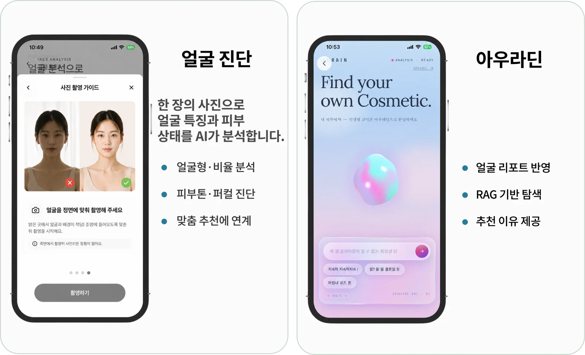
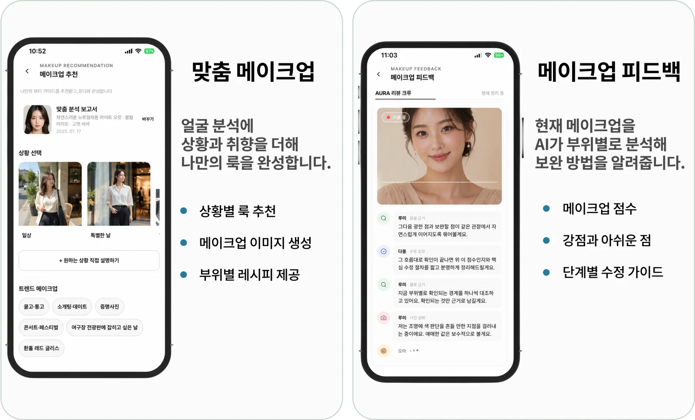
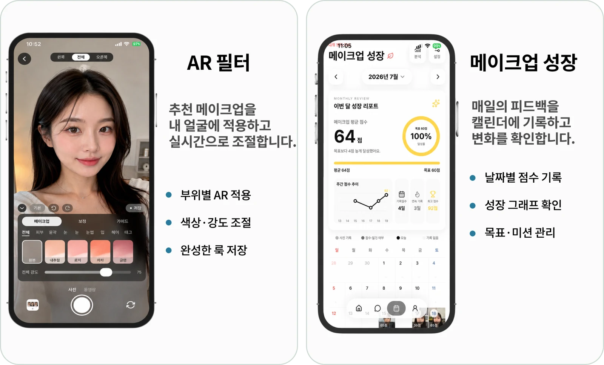
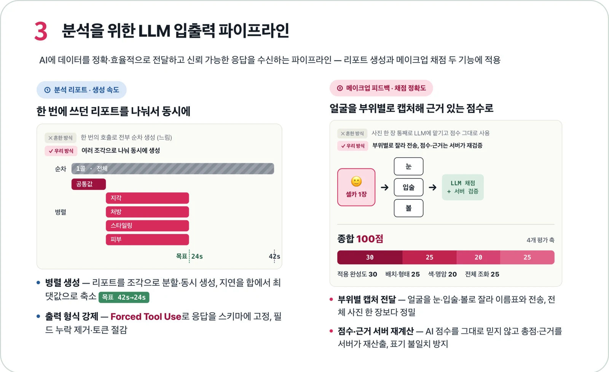
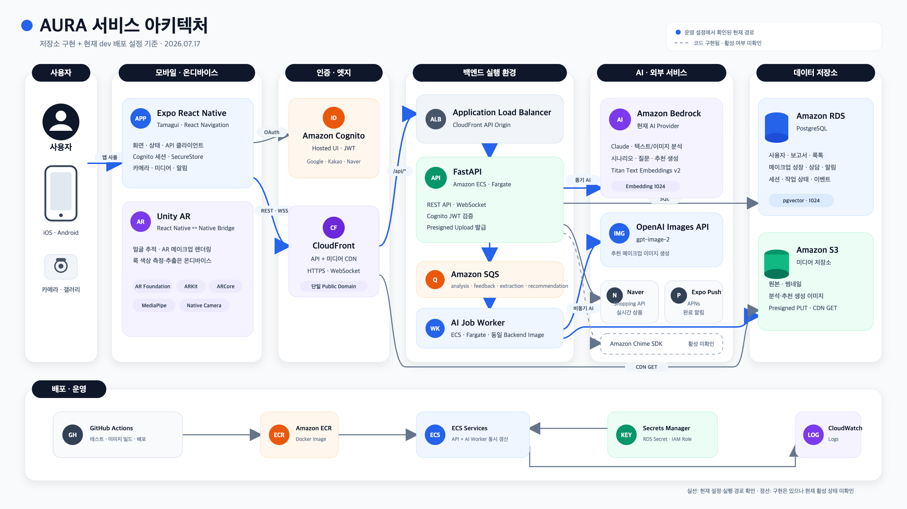

<p align="center">
  
</p>

<h1 align="center">AURA</h1>

<p align="center">
  <strong>얼굴 분석부터 맞춤 메이크업, AR 체험과 실제 메이크업 피드백까지 연결하는 AI 메이크업 스타일리스트</strong>
</p>

<p align="center">
  <a href="https://apps.apple.com/kr/app/aura-%ED%97%A4%EC%96%B4-%EB%A9%94%EC%9D%B4%ED%81%AC%EC%97%85-%EB%B7%B0%ED%8B%B0-%ED%8C%A8%EC%85%98-%EB%AC%B8%EB%8B%B5/id6786329464">App Store</a>
  ·
  <a href="https://youtu.be/pdQxal4mWu8">발표 영상</a>
</p>

---

## 프로젝트

AURA는 얼굴 사진과 지원 기기의 3D 얼굴 데이터를 해석해, 사용자가 자신에게 맞는 메이크업을 찾고 적용하고 개선하는 과정을 하나의 앱에 연결합니다.

| 항목 | 내용 |
| --- | --- |
| 개발 기간 | 2026.06–2026.07, 5주 |
| 팀 구성 | 5인 팀 프로젝트 |
| 출시 | iOS App Store |
| 핵심 사용자 | 얼굴 특징과 어울리는 색·형태·제품을 스스로 판단하기 어려운 사용자 |

| App Store 출시 | AI 리포트 | 상품 카탈로그 |
| :---: | :---: | :---: |
| **개발 4주 차¹** | **42.6초 → 23.5초²** | **618개 → 1,835개** |
| 출시 완료 | 서버 처리 시간 45% 단축 | 신규 1,217개·ID/key 충돌 0건 |

<sub>¹ 개발 시작 후 4주 차에 App Store 출시. ² 2026-07-20 동일 사진·실제 Bedrock 경로 측정 기준이며 현재의 보장 SLA는 아닙니다.</sub>

## 제품 흐름

> **측정 → 분석·추천 → AR 실험 → 실제 메이크업 피드백 → 성장 기록**

1. 얼굴형, 비율, 피부톤과 퍼스널 컬러를 분석합니다.
2. 상황과 취향에 맞는 룩과 부위별 메이크업 방법을 추천하고, AURADIN으로 제품을 탐색합니다.
3. 추천 룩을 AR로 비교하고 색상과 강도를 조절해 저장합니다.
4. 실제 메이크업을 AI 피드백으로 점검하고 날짜별 변화를 기록합니다.







## 팀의 핵심 엔지니어링

아래는 팀이 구현하고 검증한 대표 기술 사례입니다.

### 1. 긴 AI 요청을 독립 작업으로 분해

- **문제:** 얼굴 분석 보고서를 한 번의 Bedrock 요청으로 순차 생성해 동일 사진 처리에 42.6초가 걸렸고, 먼저 완성된 결과도 전체 요청이 끝날 때까지 보여 줄 수 없었습니다.
- **해결:** 공통 분석 뒤의 독립 생성 작업을 병렬 실행하고, 먼저 완성된 앵커와 결과부터 저장·표시하도록 구성했습니다.
- **결과:** 동일 사진·실제 Bedrock 경로 측정에서 서버 처리 시간을 23.5초로 줄이고 빈 화면 대기를 줄였습니다.



<sub>얼굴 원본을 포함하지 않은 설계·검증 자료입니다. 보드의 42→24초는 목표치이며, 위 42.6→23.5초는 동일 조건 실측치입니다.</sub>

### 2. 고정된 얼굴 부위 안에서 3D 특징점 선택

- **문제:** 넓은 2D 화면 구간에서 후보점을 다시 찾으면 촬영 자세에 따라 같은 지표가 다른 얼굴 부위를 선택했습니다.
- **해결:** ARKit의 고정 메시 토폴로지에서 부위별 정점 영역을 먼저 정하고, 그 안에서만 돌출점과 외곽점을 찾은 뒤 얼굴 크기로 정규화했습니다.
- **검증:** 2026.07 기록에서 3명의 포즈·반복 촬영으로 얻은 ARKit 메시 17개 모두 토폴로지가 일치했고 11개 상대 지표가 유한한 값으로 산출됐습니다. 이는 값 산출 검증이며 정확도·반복성 평가는 아닙니다.

### 3. 판매 문구를 상품 데이터로 정제

- **문제:** 쇼핑 상품명에 판촉 문구, 수량과 증정품이 섞이고 판매처마다 표기가 달라 속성 오류와 중복이 생겼습니다.
- **해결:** 정규표현식과 브랜드 별칭 사전으로 상품명을 정제하고 브랜드·카테고리·정제 상품명으로 동일 상품을 식별했습니다.
- **결과:** [부적합 패턴 197건](./data/auradin/review/base_supplement_sweep_20260718.jsonl)을 정제하고 신규 상품 1,217개를 충돌 없이 병합해 카탈로그를 618개에서 1,835개로 확장했습니다.

## 아키텍처와 기술



<sub>2026-07-17 배포 구성 스냅샷입니다.</sub>

| 영역 | 기술 |
| --- | --- |
| Mobile | Expo 56, React Native 0.85, TypeScript 6, Tamagui, React Navigation |
| AR·Vision | Unity 6000.3.18f1, Unity as a Library, ARKit, MediaPipe Face Landmarker |
| Backend·AI | Python 3.11, FastAPI, SQS·ECS AI Worker, Amazon Bedrock, OpenAI Images |
| Data·Cloud | PostgreSQL 16, pgvector, S3, Cognito, CloudFront, ECS Fargate, Chime SDK |

React Native가 제품 화면과 API 흐름을, Unity와 ARKit이 실시간 얼굴 추적과 렌더링을 담당합니다. AURADIN 검색은 버전 고정 임베딩 파일 인덱스와 lexical fallback을 사용하며, 서비스 데이터는 PostgreSQL에 저장합니다.

## 저장소 구조

```text
apps/mobile/        Expo React Native 앱과 iOS 네이티브 브리지
apps/unity/         Unity AR 프로젝트
services/backend/   FastAPI API, AI 파이프라인과 Worker
contracts/          교차 계층 계약 자료
data/auradin/       상품 카탈로그와 검수 산출물
scripts/            Mobile·Face3D·AURADIN 자동화와 검증
docs/               아키텍처, DB, 기능 계약과 운영 문서
```

## 로컬 실행

Node.js 20, Python 3.11과 Docker가 필요합니다. 전체 AI·AR 실행에는 팀이 관리하는 Cognito·AWS·OpenAI 설정과 UnityFramework가 필요하며, AR 런타임은 물리 iPhone에서 확인합니다.

### Backend

```bash
cd services/backend
python3.11 -m venv .venv
source .venv/bin/activate
python -m pip install -r requirements.txt
cp -n .env.example .env
docker compose up -d postgres
# .env에 DATABASE_URL과 필요한 provider 설정
python -m app.db.init_db
python -m app.db.seed_db
python -m uvicorn app.main:app --reload --host 0.0.0.0 --port 8000
```

### Mobile

```bash
# 터미널 1: Metro
npm --prefix apps/mobile ci
cp -n apps/mobile/.env.example apps/mobile/.env
npm --prefix apps/mobile run start

# 터미널 2: 저장소 루트
npm run mobile:ios:device
```

세부 설정과 검증 명령은 [Backend README](./services/backend/README.md), [Mobile CI](./.github/workflows/mobile-ci.yml), [Backend CI](./.github/workflows/backend-ci.yml)를 참고하세요.

### 검증

```bash
npm --prefix apps/mobile run typecheck
npm --prefix apps/mobile run test:qa-checklist
cd services/backend
python -m pytest -q
```

## 고지

- 분석 결과는 스타일링을 돕는 참고 정보이며 의료 진단이 아닙니다.
- 식별 가능한 사용자·팀원 실험 사진은 README에서 제외했습니다. 기능 화면의 인물 목업은 [자산 고지](./apps/mobile/src/assets/images/ASSET_LICENSES.md)를 따릅니다.
- 비밀 값과 앱에서 수집한 사용자 업로드·운영 데이터는 커밋하지 않습니다.
- 이 저장소는 비공개 팀 프로젝트이며 별도의 오픈소스 라이선스를 제공하지 않습니다. 외부 고지는 [Mobile](./apps/mobile/THIRD_PARTY_NOTICES.md), [Backend](./services/backend/THIRD_PARTY_NOTICES.md), [Assets](./apps/mobile/src/assets/images/ASSET_LICENSES.md)를 따릅니다.
