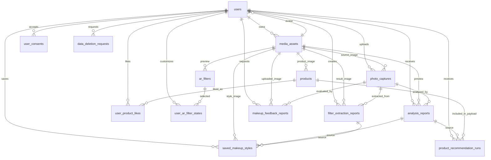

# PostgreSQL DB 설계 문서

## 1. 목적

최신 `dev` 브랜치(`origin/dev @ fa4965d`)의 모바일 화면과 TypeScript 타입을 기준으로 현재 화면 전체를 백엔드 API에 연결하고 배포까지 가져갈 수 있는 PostgreSQL 관계형 DB 설계를 정리한다.

이번 설계는 현재 앱에 존재하는 화면 기능을 빠짐없이 API로 전환하는 배포 v1 기준이다. 다만 추천 카드, AI 분석 상세, AR 설정, 필터 레시피, 피드백 상세처럼 화면 구조가 자주 바뀌는 데이터는 세부 테이블을 과하게 늘리지 않고 `jsonb` payload로 보관한다. 즉 기능을 빼는 설계가 아니라, 현재 화면 전체를 연결하되 ERD가 불필요하게 커지지 않도록 경계를 정한 설계다.

## 2. 최신 dev 기준 반영 사항

최신 dev에서 확인한 주요 화면/타입 변경은 다음과 같다.

- 네비게이션이 `RootNavigator`, `MainTabNavigator`, `routeTypes.ts` 중심으로 정리됐다.
- 앱 플로우 상태가 `NavigationFlowState`로 분리되어 피드백 결과, 선택한 필터 사진, 저장된 메이크업 스타일을 화면 간 전달한다.
- 이미지 분석 리포트에 `faceShape` 필드가 추가됐다.
- 제품 추천 데이터에 `userNickname` 필드가 추가됐다.
- 필터 추출 플로우가 `FilterUpload -> FilterLoading -> FilterResult -> FilterTryOn -> FilterSave -> FilterSaved -> FilterRecipeDetail -> RecipeSaved`까지 이어진다.
- 피드백 플로우가 `FeedbackEntry -> FeedbackCapture -> FeedbackLoading -> FeedbackResult -> FeedbackGuide -> FeedbackTip`까지 이어진다.
- 홈 화면 `HomeData`가 히어로, 공지, 주간 트렌드, 필터 스토어, 추천 룩 섹션으로 구성되어 서버 CMS성 데이터가 필요하다.

## 3. 설계 원칙

- 이미지 원본은 PostgreSQL에 저장하지 않고 S3/CDN에 저장한다.
- PostgreSQL에는 이미지 메타데이터와 화면/API에 필요한 정형 데이터를 저장한다.
- 현재 화면에서 바로 검색/정렬/필터링되는 값은 컬럼으로 분리한다.
- 추천 카드, 피드백 포인트, 필터 레시피처럼 구조가 자주 바뀔 수 있는 데이터는 `jsonb` payload에 저장한다.
- 배포 v1에서는 현재 화면 전체를 커버하되 테이블 수를 과하게 늘리지 않기 위해 `tags text[]`, `palette text[]`를 허용한다.
- 실제 운영에서 고도화가 필요한 시점에 태그/팔레트/추천 아이템을 별도 테이블로 정규화한다.

## 4. 화면 기능과 테이블 매핑

| 화면/기능 | 현재 코드 기준 | 주요 테이블 |
|---|---|---|
| HomeTab | `features/home/types.ts`의 `HomeData` | `home_hero_banners`, `home_notices`, `home_trend_items`, `home_filter_store_items`, `home_recommended_looks` |
| Login | `features/auth` | `users` |
| MyPage/ProfileEdit | `shared/types/myPage.ts` | `users`, `media_assets` |
| FaceCapture | `features/face-capture` | `photo_captures`, `media_assets` |
| ImageAnalysisReportsList | `shared/types/imageAnalysis.ts` | `analysis_reports` |
| ImageAnalysisReportDetail | `ImageAnalysisReport`, `recommendedMakeups`, `avoidedMakeups` | `analysis_reports` |
| MakeupStyleList | `MakeupLook` | `saved_makeup_styles` |
| ProductRecommendation | `ProductRecommendationData` | `product_recommendation_runs`, `products` |
| LikedProductList | `Product`, `isLiked` | `products`, `user_product_likes` |
| ARMakeupFilter/Location/Style | `ARMakeupGuideData`, `FilterLocationState`, `FilterStyleState` | `ar_filters`, `user_ar_filter_states` |
| FilterExtraction 플로우 | `FilterExtractionData` | `filter_extraction_reports`, `saved_makeup_styles` |
| Feedback 플로우 | `MakeupFeedbackResult` | `makeup_feedback_reports` |
| 개인정보/삭제/감사 | 운영 필수 영역 | `user_consents`, `data_deletion_requests`, `audit_logs` |

## 5. 핵심 ERD



## 6. Enum 설계

```sql
create type auth_provider as enum ('google', 'kakao', 'naver', 'apple');
create type gender_type as enum ('female', 'male', 'other', 'unknown');
create type media_source_type as enum ('camera', 'gallery', 'seed', 'generated');
create type capture_type as enum ('face_analysis', 'makeup_feedback', 'filter_extraction', 'ar_try_on');
create type job_status as enum ('pending', 'processing', 'completed', 'failed', 'cancelled');
create type makeup_style_type as enum ('look', 'filter', 'recipe');
create type product_category as enum ('lip', 'cheek', 'shadow', 'liner', 'base');
create type filter_category as enum ('recommended', 'trend', 'personal_color', 'popular');
create type face_part as enum ('all', 'base', 'eye', 'lip', 'contour');
create type consent_type as enum ('privacy_policy', 'camera_analysis', 'ai_processing', 'third_party_ai', 'marketing');
```

## 7. 테이블 설계

### 7.1 `users`

사용자 로그인과 마이페이지 프로필을 담당한다. 배포 v1에서는 별도 `user_profiles` 테이블로 쪼개지 않고 한 테이블에 둔다.

| 컬럼 | 타입 | 설명 |
|---|---|---|
| `id` | uuid PK | 사용자 ID |
| `auth_provider` | auth_provider | 소셜 로그인 제공자 |
| `oauth_sub` | text | provider 사용자 식별자 |
| `email` | citext | 이메일 |
| `name` | text | 이름 |
| `nickname` | text | 닉네임 |
| `phone` | text | 전화번호 |
| `birth_date` | date | 생년월일 |
| `gender` | gender_type | 성별 |
| `interest` | text | 관심사 |
| `personal_color` | text | 퍼스널 컬러 |
| `skin_type` | text | 피부 타입 |
| `skin_tone` | text | 피부 톤 |
| `tags` | text[] | 프로필 태그 |
| `avatar_media_id` | uuid FK | 프로필 이미지 |
| `created_at` | timestamptz | 생성일 |
| `updated_at` | timestamptz | 수정일 |
| `deleted_at` | timestamptz | 탈퇴/삭제일 |

### 7.2 `media_assets`

S3/CDN에 저장된 이미지 메타데이터를 관리한다. 앱의 seed 이미지도 이 테이블에 등록할 수 있다.

| 컬럼 | 타입 | 설명 |
|---|---|---|
| `id` | uuid PK | 미디어 ID |
| `owner_user_id` | uuid FK | 소유 사용자 |
| `media_kind` | text | avatar, capture, analysis, product, look 등 |
| `source` | media_source_type | camera/gallery/seed/generated |
| `bucket` | text | S3 bucket |
| `object_key` | text | S3 object key |
| `cdn_url` | text | CDN URL |
| `content_type` | text | MIME type |
| `byte_size` | bigint | 파일 크기 |
| `width` | integer | 이미지 너비 |
| `height` | integer | 이미지 높이 |
| `checksum_sha256` | text | 중복/무결성 확인 |
| `original_filename` | text | 원본 파일명 |
| `is_original` | boolean | 원본 여부 |
| `status` | text | active/deleted 등 |
| `created_at` | timestamptz | 생성일 |
| `deleted_at` | timestamptz | 삭제일 |

### 7.3 `photo_captures`

얼굴 분석, 피드백, 필터 추출, AR 시도에 사용된 촬영/업로드 기록이다.

| 컬럼 | 타입 | 설명 |
|---|---|---|
| `id` | uuid PK | 촬영 기록 ID |
| `user_id` | uuid FK | 사용자 |
| `media_id` | uuid FK | 원본 이미지 |
| `capture_type` | capture_type | face_analysis/makeup_feedback/filter_extraction/ar_try_on |
| `source` | media_source_type | camera/gallery |
| `status` | job_status | 처리 상태 |
| `captured_at` | timestamptz | 촬영/업로드 시각 |
| `device_payload` | jsonb | 기기/카메라 메타데이터 |
| `created_at` | timestamptz | 생성일 |

### 7.4 `analysis_reports`

분석 결과 목록과 상세 화면의 중심 테이블이다. 최신 dev에서 추가된 `faceShape`를 `face_shape` 컬럼으로 반영한다.

추천/비추천 메이크업 카드, `facePointGuide`는 화면 구조가 자주 바뀔 수 있으므로 `detail_payload`에 함께 저장한다.

| 컬럼 | 타입 | 설명 |
|---|---|---|
| `id` | uuid PK | 분석 리포트 ID |
| `user_id` | uuid FK | 사용자 |
| `photo_capture_id` | uuid FK | 분석 원본 촬영 |
| `source_media_id` | uuid FK | 원본/대표 이미지 |
| `preview_media_id` | uuid FK | 목록/상세 대표 이미지 |
| `status` | job_status | 분석 상태 |
| `ai_provider` | text | AI 제공자 |
| `ai_model` | text | AI 모델명 |
| `request_id` | text | AI 요청 ID |
| `error_message` | text | 실패 사유 |
| `analyzed_at` | timestamptz | 분석 완료 시각 |
| `title` | text | 목록 제목 |
| `report_title` | text | 상세 제목 |
| `environment_label` | text | 촬영 환경 |
| `personal_color` | text | 퍼스널 컬러 |
| `face_shape` | text | 얼굴형 |
| `skin_type` | text | 피부 타입 |
| `tone_summary` | text | 톤 요약 |
| `recommended_mood` | text | 추천 무드 |
| `summary` | text | 요약 |
| `short_summary` | text | 카드용 요약 |
| `skin_analysis_summary` | text | 피부 분석 상세 |
| `base_makeup_guide` | text | 베이스 메이크업 가이드 |
| `tags` | text[] | 분석 태그 |
| `detail_payload` | jsonb | facePointGuide, recommendedMakeups, avoidedMakeups, raw AI result |
| `created_at` | timestamptz | 생성일 |
| `updated_at` | timestamptz | 수정일 |

### 7.5 `saved_makeup_styles`

마이페이지의 저장한 메이크업 룩, 필터 저장 결과, 레시피 저장 결과를 한 테이블에서 관리한다.

| 컬럼 | 타입 | 설명 |
|---|---|---|
| `id` | uuid PK | 저장 스타일 ID |
| `user_id` | uuid FK | 사용자 |
| `style_type` | makeup_style_type | look/filter/recipe |
| `source_analysis_report_id` | uuid FK | 분석 결과 기반일 때 |
| `source_filter_extraction_id` | uuid FK | 필터 추출 기반일 때 |
| `source_media_id` | uuid FK | 원본 이미지 |
| `thumbnail_media_id` | uuid FK | 썸네일 이미지 |
| `title` | text | 제목 |
| `mood_label` | text | 무드 라벨 |
| `short_description` | text | 짧은 설명 |
| `tags` | text[] | 태그 |
| `visibility` | text | private/public |
| `style_payload` | jsonb | AR 조정값, 레시피 아이템, 상세 설정 |
| `saved_at` | timestamptz | 저장 시각 |
| `archived_at` | timestamptz | 숨김/아카이브 시각 |
| `created_at` | timestamptz | 생성일 |
| `updated_at` | timestamptz | 수정일 |

### 7.6 `products`

추천 제품 화면과 좋아요 제품 목록에 사용한다. 현재 dev 타입의 `palette`, `tags`는 배포 v1에서 배열로 보관한다.

| 컬럼 | 타입 | 설명 |
|---|---|---|
| `id` | uuid PK | 제품 ID |
| `external_key` | text unique | seed/mock ID |
| `brand_name` | text | 브랜드명 |
| `product_name` | text | 제품명 |
| `shade_name` | text | 컬러/호수 |
| `category` | product_category | lip/cheek/shadow/liner/base |
| `price_krw` | integer | 가격 |
| `image_media_id` | uuid FK | 제품 이미지 |
| `tags` | text[] | 제품 태그 |
| `palette` | text[] | 색상 팔레트 |
| `product_payload` | jsonb | 기타 제품 상세 |
| `is_active` | boolean | 노출 여부 |
| `created_at` | timestamptz | 생성일 |
| `updated_at` | timestamptz | 수정일 |

### 7.7 `user_product_likes`

제품 좋아요 상태를 저장한다.

| 컬럼 | 타입 | 설명 |
|---|---|---|
| `user_id` | uuid FK | 사용자 |
| `product_id` | uuid FK | 제품 |
| `liked_at` | timestamptz | 좋아요 시각 |

PK: `(user_id, product_id)`

### 7.8 `product_recommendation_runs`

제품 추천 화면의 추천 실행 기록이다. 최신 dev의 `userNickname`, 추천 룩, 탭, 제품 목록, 세트는 `recommendation_payload`에 저장한다. 제품 카탈로그와 연결 가능한 항목은 `product_ids` 배열에도 보관한다.

| 컬럼 | 타입 | 설명 |
|---|---|---|
| `id` | uuid PK | 추천 실행 ID |
| `user_id` | uuid FK | 사용자 |
| `source_analysis_report_id` | uuid FK | 분석 결과 기반 추천 |
| `user_nickname` | text | 추천 화면 표시 닉네임 스냅샷 |
| `look_title` | text | 추천 룩 제목 |
| `look_description` | text | 추천 룩 설명 |
| `look_media_id` | uuid FK | 추천 룩 이미지 |
| `product_ids` | uuid[] | 추천된 제품 ID 목록 |
| `recommendation_payload` | jsonb | tabs, products, sets, reasons, matchRate |
| `created_at` | timestamptz | 생성일 |

### 7.9 `ar_filters`

AR 메이크업 필터 카탈로그다. 옵션을 여러 테이블로 분리하지 않고 `filter_payload`에 `facePartIds`, `colorOptions`, `typeOptions`, `textureOptions`를 저장한다.

| 컬럼 | 타입 | 설명 |
|---|---|---|
| `id` | uuid PK | 필터 ID |
| `external_key` | text unique | seed/mock ID |
| `category` | filter_category | recommended/trend/personal_color/popular |
| `title` | text | 제목 |
| `subtitle` | text | 설명 |
| `intensity_label` | text | 강도 라벨 |
| `preview_media_id` | uuid FK | 미리보기 이미지 |
| `source_analysis_report_id` | uuid FK | 분석 결과 기반 생성 시 |
| `source_filter_extraction_id` | uuid FK | 필터 추출 기반 생성 시 |
| `filter_payload` | jsonb | 옵션/적용 부위/엔진 설정 |
| `is_public` | boolean | 공개 여부 |
| `created_at` | timestamptz | 생성일 |
| `updated_at` | timestamptz | 수정일 |

### 7.10 `user_ar_filter_states`

AR 위치/스타일 조정 화면에서 사용자가 선택한 상태를 저장한다.

| 컬럼 | 타입 | 설명 |
|---|---|---|
| `id` | uuid PK | 사용자 AR 상태 ID |
| `user_id` | uuid FK | 사용자 |
| `filter_id` | uuid FK | 선택 필터 |
| `selected_face_part` | face_part | 선택 부위 |
| `selected_color_id` | text | 색상 옵션 ID |
| `selected_type_id` | text | 타입 옵션 ID |
| `selected_texture_id` | text | 텍스처 옵션 ID |
| `guide_mode` | text | basic/half |
| `comparison_mode` | text | full/left/right |
| `is_overlay_visible` | boolean | 랜드마크 표시 여부 |
| `landmarks` | jsonb | 좌표 목록 |
| `adjustments` | jsonb | horizontal/vertical/scale/rotation |
| `saved_at` | timestamptz | 저장 시각 |
| `created_at` | timestamptz | 생성일 |
| `updated_at` | timestamptz | 수정일 |

### 7.11 `filter_extraction_reports`

레퍼런스 이미지 기반 필터 추출 결과를 저장한다. 팔레트, 포인트, 로딩 단계, 레시피 후보는 `result_payload`에 저장한다.

| 컬럼 | 타입 | 설명 |
|---|---|---|
| `id` | uuid PK | 필터 추출 ID |
| `user_id` | uuid FK | 사용자 |
| `photo_capture_id` | uuid FK | 입력 사진 |
| `result_media_id` | uuid FK | 결과/대표 이미지 |
| `status` | job_status | 처리 상태 |
| `title` | text | 결과 제목 |
| `subtitle` | text | 결과 설명 |
| `tags` | text[] | 결과 태그 |
| `accuracy` | integer | 정확도 |
| `model_version` | text | 모델 버전 |
| `result_payload` | jsonb | palette, points, loadingSteps, recipeItems |
| `created_at` | timestamptz | 생성일 |
| `completed_at` | timestamptz | 완료일 |

### 7.12 `makeup_feedback_reports`

AI 메이크업 피드백 결과를 저장한다. 콜아웃, 포인트, 강점, 상세 팁은 `feedback_payload`에 저장한다.

| 컬럼 | 타입 | 설명 |
|---|---|---|
| `id` | uuid PK | 피드백 ID |
| `user_id` | uuid FK | 사용자 |
| `photo_capture_id` | uuid FK | 입력 사진 |
| `uploaded_media_id` | uuid FK | 업로드 이미지 |
| `source` | media_source_type | camera/gallery |
| `source_label` | text | 화면 표시 라벨 |
| `score` | integer | 점수 |
| `status` | job_status | 처리 상태 |
| `model_version` | text | 모델 버전 |
| `feedback_payload` | jsonb | summaryBadges, callouts, points, strengths |
| `created_at` | timestamptz | 생성일 |
| `completed_at` | timestamptz | 완료일 |

### 7.13 `home_hero_banners`

홈 화면 상단 히어로/캐러셀의 기준 데이터다. 현재 `HomeData.hero`에 대응한다.

| 컬럼 | 타입 | 설명 |
|---|---|---|
| `id` | uuid PK | 히어로 배너 ID |
| `eyebrow` | text | 상단 보조 문구 |
| `title` | text | 메인 제목 |
| `description` | text | 설명 문구 |
| `image_media_id` | uuid FK | 배경/대표 이미지 |
| `cta_label` | text | 버튼 라벨 |
| `cta_target` | text | 이동 대상 route/deeplink |
| `is_active` | boolean | 노출 여부 |
| `sort_order` | integer | 노출 순서 |
| `starts_at` | timestamptz | 예약 시작 |
| `ends_at` | timestamptz | 예약 종료 |
| `created_at` | timestamptz | 생성일 |
| `updated_at` | timestamptz | 수정일 |

### 7.14 `home_notices`

홈 히어로 아래 공지/알림 문구다. 현재 `HomeData.hero.notices`에 대응한다.

| 컬럼 | 타입 | 설명 |
|---|---|---|
| `id` | uuid PK | 공지 ID |
| `hero_banner_id` | uuid FK | 연결 히어로 |
| `title` | text | 공지 제목 |
| `description` | text | 공지 내용 |
| `is_active` | boolean | 노출 여부 |
| `sort_order` | integer | 노출 순서 |
| `created_at` | timestamptz | 생성일 |

### 7.15 `home_trend_items`

홈 히어로 캐러셀에 노출되는 주간 트렌드 카드다. 현재 `HomeData.hero.trends`에 대응한다.

| 컬럼 | 타입 | 설명 |
|---|---|---|
| `id` | uuid PK | 트렌드 카드 ID |
| `hero_banner_id` | uuid FK | 연결 히어로 |
| `target_style_id` | uuid FK | 연결된 저장/시드 룩 |
| `title` | text | 카드 제목 |
| `tone` | text | 톤/무드 라벨 |
| `image_media_id` | uuid FK | 카드 이미지 |
| `target_payload` | jsonb | route params, campaign id 등 |
| `is_active` | boolean | 노출 여부 |
| `sort_order` | integer | 노출 순서 |
| `created_at` | timestamptz | 생성일 |
| `updated_at` | timestamptz | 수정일 |

### 7.16 `home_filter_store_items`

홈의 필터 스토어 카드다. 현재 `HomeData.filterStore`에 대응한다.

| 컬럼 | 타입 | 설명 |
|---|---|---|
| `id` | uuid PK | 필터 스토어 카드 ID |
| `title` | text | 카드 제목 |
| `description` | text | 설명 |
| `category` | text | Lip/Base/Cheek 등 |
| `image_media_id` | uuid FK | 카드 이미지 |
| `product_id` | uuid FK | 연결 제품 |
| `ar_filter_id` | uuid FK | 연결 AR 필터 |
| `target_payload` | jsonb | 상세 이동/노출 옵션 |
| `is_active` | boolean | 노출 여부 |
| `sort_order` | integer | 노출 순서 |
| `created_at` | timestamptz | 생성일 |
| `updated_at` | timestamptz | 수정일 |

### 7.17 `home_recommended_looks`

홈 하단 추천 룩 카드다. 현재 `HomeData.recommendedLooks`에 대응한다.

| 컬럼 | 타입 | 설명 |
|---|---|---|
| `id` | uuid PK | 추천 룩 카드 ID |
| `saved_makeup_style_id` | uuid FK | 연결 룩 |
| `title` | text | 룩 제목 |
| `description` | text | 설명 |
| `display_date` | date | 화면 표시 날짜 |
| `image_media_id` | uuid FK | 카드 이미지 |
| `target_payload` | jsonb | route params, campaign id 등 |
| `is_active` | boolean | 노출 여부 |
| `sort_order` | integer | 노출 순서 |
| `created_at` | timestamptz | 생성일 |
| `updated_at` | timestamptz | 수정일 |
### 7.18 `user_consents`

카메라/AI 처리/개인정보 동의 기록이다.

| 컬럼 | 타입 | 설명 |
|---|---|---|
| `id` | uuid PK | 동의 ID |
| `user_id` | uuid FK | 사용자 |
| `consent_type` | consent_type | 동의 종류 |
| `version` | text | 약관 버전 |
| `accepted` | boolean | 동의 여부 |
| `accepted_at` | timestamptz | 동의 시각 |
| `revoked_at` | timestamptz | 철회 시각 |
| `metadata` | jsonb | IP/userAgent 등 |

### 7.19 `data_deletion_requests`

사진/분석 결과/피드백/계정 삭제 요청을 추적한다.

| 컬럼 | 타입 | 설명 |
|---|---|---|
| `id` | uuid PK | 삭제 요청 ID |
| `user_id` | uuid FK | 사용자 |
| `target_type` | text | account/photo/report/feedback/filter |
| `target_id` | uuid | 대상 ID |
| `status` | job_status | 처리 상태 |
| `requested_at` | timestamptz | 요청 시각 |
| `completed_at` | timestamptz | 완료 시각 |
| `reason` | text | 사유 |

### 7.20 `audit_logs`

운영/보안 감사 로그다.

| 컬럼 | 타입 | 설명 |
|---|---|---|
| `id` | uuid PK | 로그 ID |
| `actor_user_id` | uuid FK | 수행 사용자 |
| `action` | text | 이벤트명 |
| `entity_type` | text | 대상 테이블/도메인 |
| `entity_id` | uuid | 대상 ID |
| `metadata` | jsonb | 상세 정보 |
| `created_at` | timestamptz | 발생 시각 |

## 8. 주요 인덱스

```sql
create unique index idx_users_provider_sub on users(auth_provider, oauth_sub) where deleted_at is null;
create index idx_media_assets_owner_created on media_assets(owner_user_id, created_at desc);
create index idx_photo_captures_user_type_created on photo_captures(user_id, capture_type, created_at desc);
create index idx_analysis_reports_user_analyzed on analysis_reports(user_id, analyzed_at desc);
create index idx_saved_makeup_styles_user_saved on saved_makeup_styles(user_id, saved_at desc);
create index idx_products_category_active on products(category, is_active);
create index idx_user_product_likes_user_liked on user_product_likes(user_id, liked_at desc);
create index idx_product_recommendation_runs_user_created on product_recommendation_runs(user_id, created_at desc);
create index idx_ar_filters_category_public on ar_filters(category, is_public);
create index idx_filter_extraction_reports_user_created on filter_extraction_reports(user_id, created_at desc);
create index idx_makeup_feedback_reports_user_created on makeup_feedback_reports(user_id, created_at desc);
create index idx_home_hero_banners_active_order on home_hero_banners(is_active, sort_order);
create index idx_home_trend_items_active_order on home_trend_items(is_active, sort_order);
create index idx_home_filter_store_items_active_order on home_filter_store_items(is_active, sort_order);
create index idx_home_recommended_looks_active_order on home_recommended_looks(is_active, sort_order);
```

## 9. dbdiagram.io 사용 기준

- `docs/backend/aws-postgresql-schema.dbml` 파일 내용을 dbdiagram.io에 붙여 넣으면 ERD를 볼 수 있다.
- 이번 DBML은 현재 화면 전체 백엔드 연동/배포 v1을 기준으로 작성했다. 홈 CMS성 데이터까지 포함하므로 팀원 ERD보다 테이블이 조금 더 많을 수 있다.
- `jsonb` payload로 묶은 데이터는 ERD에서 세부 테이블로 보이지 않는다. 대신 화면 구조 변경에 더 유연하다.

## 10. 이후 분리 후보

서비스가 실제 운영 단계로 가면 아래 항목은 별도 테이블로 분리할 수 있다.

- `analysis_reports.detail_payload.recommendedMakeups` -> `analysis_makeup_cards`
- `products.tags`, `products.palette` -> `product_tags`, `product_palettes`
- `product_recommendation_runs.recommendation_payload.products` -> `product_recommendation_items`
- `ar_filters.filter_payload.colorOptions/typeOptions/textureOptions` -> `ar_filter_options`
- `filter_extraction_reports.result_payload.palette/points` -> `filter_extraction_palettes`, `filter_extraction_points`
- `makeup_feedback_reports.feedback_payload.points/callouts/strengths` -> `feedback_points`, `feedback_callouts`, `feedback_strengths`

지금 단계에서는 이들을 미리 분리하지 않는 것이 현재 화면 API 전환 속도와 관리 난이도 면에서 더 적합하다.
