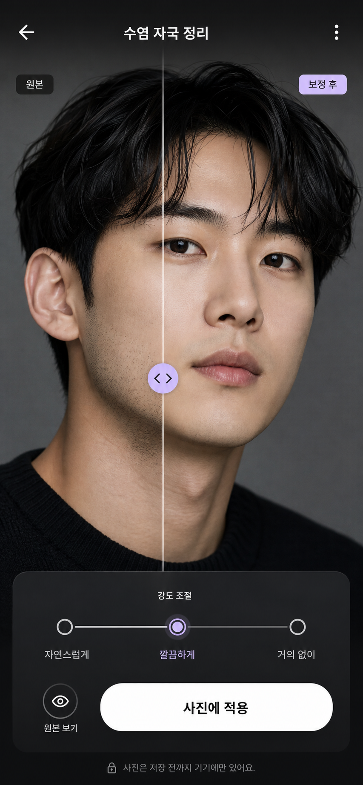

# Claude Design 요청서 — AURA 수염 변화 미리보기

- 작성일: 2026-07-10 KST
- 대상: Claude Design
- 산출물: 모바일 UI 플로우, 고해상도 화면 시안, 인터랙션 명세, 컴포넌트/상태 명세
- 기준 화면: iPhone 모바일 `390 × 844`
- 코드 구현: 이번 요청의 1차 범위가 아님. 먼저 디자인과 개발 인계 명세를 완성한다.

---

## 1. 요청 한 줄 요약

AURA 앱의 `수염 제거` 탭을, 사용 목적에 따라 `수염 분석`과 `사진 보정`으로 분기하고, 촬영 이후에는 오닉스 블랙과 절제된 글래스 질감의 결과 화면에서 수염 감소 강도를 비교·저장할 수 있도록 디자인한다. `수염 분석` 경로에만 상세 보고서를 제공한다.

---

## 2. 기준 우선순위

서로 충돌하는 내용이 있으면 아래 순서대로 따른다.

1. 이 요청서에 기록된 최신 사용자 결정
2. `docs/제모시뮬레이션구현계획.md`의 현재 MVP 범위와 안전 규칙
3. `docs/beard-simulation/DATA_POLICY_KO.md`의 사진 처리 규칙
4. `docs/AURA_BEARD_LASER_REMOVAL_SIMULATION_PLAN_KO.md`의 제품 배경과 초기 아이디어
5. 현재 모바일 앱의 메이크업 추출 화면과 공통 디자인 토큰

초기 기획서의 다음 내용은 현재 디자인에 사용하지 않는다.

- `몇 회차 후`처럼 실제 시술 회차를 연상시키는 단계 표현
- 피부 자극·트러블 등 건강 정보 설문
- 구렛나루 시뮬레이션
- 특정 장비·시술 추천 또는 효과 보장
- 전체 얼굴을 새로 생성한 것처럼 보이는 뷰티 필터 표현

---

## 3. 시각 참고 이미지



파일 경로:

```text
docs/beard-simulation/assets/beard-simulation-onyx-glass-result-reference.png
```

이 이미지는 다음 요소를 참고하는 무드 레퍼런스다.

- 사진이 화면 대부분을 차지하는 몰입형 결과 구성
- 검은 바탕과 반투명 하단 컨트롤 패널
- 세로 구분선 기반 Before/After 비교
- 원본 보기와 저장에 집중된 단순한 행동 구조
- 흰색 타이포그래피와 옅은 라벤더 포인트

이미지의 문구·수치·간격을 그대로 복사하지 않는다. 아래 명세와 실제 AURA 디자인 토큰을 기준으로 재설계한다.

---

## 4. 제품 정의

이 기능은 두 가지 목적을 하나의 엔진으로 지원한다.

### A. 수염 분석

레이저 제모를 고민하거나 현재 수염 분포와 변화 가능성을 알아보고 싶은 사용자를 위한 경로다.

```text
수염 제거 탭
→ 수염 분석 선택
→ 설문
→ 촬영/사진 선택
→ 생성
→ 결과 사진
→ 상세 보고서
```

### B. 사진 보정

레이저 제모와 무관하게 사진 속 수염 자국을 자연스럽게 정리하고 싶은 사용자를 위한 빠른 경로다.

```text
수염 제거 탭
→ 사진 보정 선택
→ 촬영/사진 선택
→ 생성
→ 결과 사진
→ 저장 후 종료
```

두 경로 모두 동일한 촬영 화면과 결과 화면을 사용한다. 설문과 상세 보고서만 조건부로 노출한다.

---

## 5. 화면 및 분기 구조

| 화면 | 수염 분석 경로 | 사진 보정 경로 |
|---|---:|---:|
| 목적 선택 | 노출 | 노출 |
| 설문 | 노출 | 생략 |
| 촬영/앨범 선택 | 노출 | 노출 |
| 생성 로딩 | 노출 | 노출 |
| 결과 사진 | 노출 | 노출 |
| 상세 보고서 보기 | 노출 | 미노출 |
| 사진 저장 | 노출 | 노출 |
| 길게 눌러 원본 보기 | 노출 | 노출 |

뒤로 가기를 했을 때 이미 선택한 목적과 설문 답변은 유지한다. 새 사진으로 다시 시작하거나 결과를 삭제할 때만 플로우 상태를 초기화한다.

---

## 6. 화면별 상세 요청

## 6.1 수염 제거 탭 첫 화면 — 목적 선택

### 사용자 목표

사용자가 자신에게 필요한 것이 `분석`인지 `사진 보정`인지 5초 안에 이해하고 선택하게 한다.

### 추천 워딩

```text
제목: 어떤 방식으로 확인할까요?
설명: 수염을 분석해 변화를 알아보거나, 사진 속 수염 자국만 자연스럽게 정리할 수 있어요.
```

선택지 1:

```text
수염 분석
현재 수염 패턴과 줄어든 모습을 함께 확인해요.
보조 정보: 설문 포함 · 상세 보고서 제공
```

선택지 2:

```text
사진 보정
설문 없이 사진 속 수염 자국만 빠르게 정리해요.
보조 정보: 바로 촬영 · 결과 저장
```

### 레이아웃

- 기존 AURA의 흰 배경과 검은 CTA 톤을 유지한다.
- 상단에는 타이틀과 한 문장 설명만 둔다.
- 선택지는 세로로 배치한 큰 선택 영역 두 개를 사용한다.
- 카드 안에 카드, 불필요한 배지, 기능 나열을 만들지 않는다.
- 각 선택지는 전체 영역이 탭 가능해야 한다.
- `수염 분석`에는 간결한 분석/스캔 아이콘, `사진 보정`에는 이미지/스파클 아이콘을 사용한다.
- 새 아이콘 라이브러리를 추가하지 않고 현재 `lucide-react-native` 범위에서 선택한다.

---

## 6.2 설문 — 수염 분석 경로 전용

한 화면에 질문 6개를 모두 길게 나열하지 않는다. 한 페이지에 한 주제를 담는 3단계 설문으로 구성한다.

### 진행 표시

- 상단에 `1 / 3`, `2 / 3`, `3 / 3`과 얇은 진행 바를 표시한다.
- 이전으로 돌아가도 답변을 유지한다.
- 다음 버튼은 하단 safe area 위에 고정한다.
- 선택 즉시 자동으로 다음 페이지로 넘기지 않는다. 사용자가 답변을 검토한 후 `다음`을 누른다.

### 1단계 — 원하는 변화

```text
제목: 어떤 변화가 가장 궁금한가요?

선택지:
- 푸른 수염 자국을 줄이고 싶어요
- 전체적인 수염 밀도를 줄이고 싶어요
- 수염이 많이 줄어든 모습을 보고 싶어요
```

### 2단계 — 현재 상태와 부위

```text
제목: 지금 사진과 가까운 상태를 알려주세요.

면도 상태:
- 면도 직후
- 까슬한 수염
- 짧게 자란 수염
- 비교적 짙은 수염

신경 쓰이는 부위, 복수 선택:
- 인중
- 턱
- 입 양쪽
- 턱선
```

부위 선택은 가능하면 하관 일러스트 또는 얼굴 실루엣 위의 탭 영역으로 표현하고, 접근성을 위해 동일한 텍스트 선택지도 함께 제공한다.

### 3단계 — 평소 습관

```text
제목: 평소 관리 습관을 알려주세요.

- 면도 빈도
- 메이크업으로 수염 자국을 가리는지
- 제모 상담을 계획하고 있는지
```

마지막 CTA:

```text
사진 촬영하기
```

### 설문 금지사항

- 피부 질환, 민감성, 알레르기, 트러블 같은 건강 정보 질문 금지
- 설문 결과만으로 의료적 진단이나 레이저 종류 추천 금지
- 설문 답변을 점수나 등급으로 평가하지 않기

---

## 6.3 촬영/사진 선택

두 경로가 합류하는 공통 화면이다.

### 추천 워딩

```text
제목: 수염이 잘 보이는 사진을 준비해 주세요
설명: 밝은 곳에서 얼굴을 정면으로 맞추고, 턱 아래까지 보이게 촬영해 주세요.
```

### 필수 요소

- 실시간 정면 얼굴 가이드
- 하관과 턱선이 프레임 안에 들어오는지 안내
- 촬영 버튼
- 앨범에서 선택
- 전면/후면 카메라 전환
- 촬영 품질 상태 문구
- 사진 처리 및 삭제 기준 진입 링크

### 상태 문구 예시

```text
얼굴을 정면으로 맞춰주세요
턱 아래까지 보이게 해주세요
입 주변의 그림자를 줄여주세요
촬영 준비가 되었어요
```

기존 `CameraFaceCaptureScreen`의 카메라 컨트롤과 얼굴 가이드 패턴을 최대한 재사용한다.

---

## 6.4 생성 로딩

촬영한 사진 위에서 하관만 분석한다는 느낌을 전달한다.

### 모션

- 얇은 아이스 블루–라벤더 스캔 라인이 인중부터 턱선까지 왕복한다.
- 실제 레이저가 피부를 쏘는 붉은 광선처럼 표현하지 않는다.
- 얼굴 전체를 다시 생성하는 듯한 파티클 효과를 사용하지 않는다.
- 모션 감소 설정에서는 정적인 진행 링과 단계 체크만 보여준다.

### 단계 문구

```text
수염과 그림자를 구분하고 있어요
단계별 이미지를 만들고 있어요
원본 얼굴이 유지됐는지 확인하고 있어요
```

실제 진행률을 알 수 있을 때만 퍼센트를 표시한다. 알 수 없다면 단계 체크만 사용하고 가짜 진행률을 만들지 않는다.

`ReferenceMakeupExtractionLoadingScreen`의 사진 프리뷰, 진행 링, 단계 리스트 구조를 참고하되 결과 화면과 이어지도록 배경을 점차 어둡게 전환할 수 있다.

---

## 6.5 결과 사진 — 핵심 화면

사용자가 선택한 검은 참고 이미지의 방향을 가장 강하게 반영하는 화면이다.

### 디자인 콘셉트

```text
Onyx Glass Grooming Studio
```

- 깊은 오닉스 블랙 배경
- 사진을 화면 대부분에 배치
- 하단에 하나의 큰 반투명 글래스 컨트롤 패널
- 얇은 라벤더 또는 차가운 블루 포인트
- 흰색 중심의 높은 대비 타이포그래피
- 매트한 블랙과 은은한 유리 반사의 조합
- 과도한 네온, 강한 글로우, 여러 겹의 유리 카드 금지

### 화면 헤더

분석 경로:

```text
수염 변화 미리보기
```

사진 보정 경로:

```text
수염 자국 정리
```

헤더는 이미지 위에 떠 있는 투명 오버레이로 구성한다. 뒤로 가기와 더보기만 제공한다.

### 이미지 비교

- 정면 얼굴 사진을 세로로 크게 표시한다.
- 세로 구분선을 좌우로 드래그해 비교한다.
- 구분선 왼쪽은 `현재`, 오른쪽은 `보정 후`로 표시한다.
- 손잡이는 36~44px 범위의 원형으로 만들고 충분한 터치 영역을 확보한다.
- 강도를 바꿔도 사용자가 놓은 구분선 위치는 유지한다.
- 스크롤보다 슬라이더 드래그가 우선되어야 한다.

### 강도 조절

```text
자연스럽게 | 눈에 띄게 | 많이 줄인 느낌
```

- 3단계 세그먼트 또는 3스톱 슬라이더 중 사진 비교에 더 명확한 방식을 선택한다.
- `몇 회차`, `완전 제모`, `영구 제모` 같은 표현은 사용하지 않는다.
- 선택 단계가 바뀔 때 사진은 짧은 크로스페이드로 전환한다.

### 원본 보기 — 필수 인터랙션

버튼 워딩:

```text
원본 보기
```

보조 안내:

```text
누르고 있는 동안 원본을 보여드려요
```

동작:

```text
press-in  → 전체 이미지를 원본으로 전환
press-out → 선택한 보정 결과로 복귀
```

- 전환 시 사진의 크롭, 확대 비율, 위치가 움직이지 않아야 한다.
- 햅틱은 한 번만 약하게 제공한다.
- VoiceOver, 키보드 또는 길게 누르기 어려운 사용자를 위해 탭 토글 대체 동작을 제공한다.
- 원본 표시 중에는 버튼 상태를 `원본 보는 중`으로 명확히 바꾼다.

### CTA 구조

#### 수염 분석 경로

```text
Primary: 상세 보고서 보기
Secondary: 사진 저장
Utility hold control: 원본 보기
```

#### 사진 보정 경로

```text
Primary: 사진 저장
Utility hold control: 원본 보기
```

사진 보정 경로에는 `상세 보고서 보기` 버튼과 보고서 티저를 노출하지 않는다.

### 사진 저장 — 필수 인터랙션

저장은 현재 사용자가 보고 있는 결과 한 장만 즉시 저장하는 구조로 고정한다.

```text
사용자가 강도 선택
→ 사진 저장 버튼 한 번 탭
→ 현재 선택한 강도의 보정 결과 1장 저장
```

- 별도의 사진 선택 화면을 열지 않는다.
- 여러 결과를 체크하는 다중 선택 UI를 만들지 않는다.
- 원본·Before/After 합성본·다른 강도 결과를 묶어서 저장하지 않는다.
- Before/After 구분선이 보이는 화면 캡처가 아니라, 선택한 강도의 깨끗한 결과 이미지 파일을 저장한다.
- 예: `눈에 띄게`를 보고 있을 때 `사진 저장`을 누르면 `눈에 띄게` 결과 1장만 저장한다.
- 저장 버튼은 한 번 탭하면 바로 동작해야 하며, 추가 확인 다이얼로그를 띄우지 않는다.
- 저장 중 중복 탭은 막고, 성공 후 `‘눈에 띄게’ 결과를 사진에 저장했어요`처럼 저장된 강도를 알려준다.
- 다른 강도도 원하면 해당 강도로 바꾼 뒤 같은 버튼을 다시 누르면 된다.

### 추천 레이아웃 순서

```text
투명 헤더
→ 큰 Before/After 이미지
→ 오닉스 글래스 컨트롤 패널
   - 강도 조절
   - 원본 보기
   - 사진 저장
   - 분석 경로일 때 상세 보고서 보기
→ 짧은 참고 이미지 안내
```

### 저장 피드백

- 저장 중에는 CTA 안에 작은 진행 상태를 표시한다.
- 한 번의 탭으로 현재 선택한 강도의 결과 1장만 저장한다.
- 저장 성공 후 새 전체 화면을 강제로 추가하지 않는다.
- 오닉스 글래스 토스트 또는 짧은 바텀 확인 영역으로 `‘{선택한 강도}’ 결과를 사진에 저장했어요`를 알린다.
- 저장 권한 거부, 저장 실패, 재시도 상태도 디자인한다.

### 항상 노출할 안내

```text
이 이미지는 수염과 수염 자국이 줄었을 때의 참고용 시뮬레이션이에요.
```

의료 면책 전체 문장은 상세 정보에서 확인할 수 있어도, 참고 이미지라는 핵심 고지는 접어 숨기지 않는다.

---

## 6.6 상세 보고서 — 수염 분석 경로 전용

보고서는 하나의 긴 스크롤 화면으로 구성하되, 상단에 다음 4개 섹션 앵커를 제공한다.

```text
수염 분석 | 변화 비교 | 상담 준비 | 관리 팁
```

상단 앵커는 현재 섹션을 표시하고 탭하면 해당 섹션으로 스크롤한다. 네 개의 독립된 보고서 페이지로 쪼개지 않는다.

### 섹션 1. 수염 분석

제목:

```text
현재 사진 기준 수염 분석
```

내용 예시:

```text
턱과 인중을 중심으로 수염 그림자가 모여 있어요.
털의 밀도보다 면도 후 남는 푸른 그림자가 더 눈에 띄는 편이에요.
```

표현 항목:

- 수염 타입 요약
- 밀도
- 푸른 그림자
- 주요 분포 부위
- 촬영 품질
- 원본 보존 확인

숫자와 퍼센트만 앞세우지 않는다. 먼저 사람이 이해할 수 있는 문장으로 설명하고, 수치는 보조 정보로 배치한다. `진단`, `질환`, `정상/비정상`이라는 표현을 사용하지 않는다.

### 섹션 2. 비포 애프터 사진

- 결과 화면과 동일한 세로 비교 슬라이더를 재사용한다.
- 선택한 강도를 기본값으로 유지한다.
- `현재 / 보정 후` 라벨과 원본 보존 문구를 함께 보여준다.
- 같은 사진을 여러 카드로 반복하지 않는다.

### 섹션 3. 상담 멘트

제목:

```text
상담할 때 이렇게 물어보세요
```

내용 예시:

```text
인중과 턱에 남는 푸른 수염 자국이 고민입니다.
제 피부와 수염 상태를 기준으로 어떤 점을 확인해야 하는지 상담받고 싶어요.
```

- 사용자가 그대로 읽거나 복사할 수 있는 2~3개의 질문 형태로 구성한다.
- `복사하기` 보조 행동을 제공할 수 있다.
- 특정 레이저 기기, 시술 횟수, 효능을 앱이 추천하거나 보장하지 않는다.

### 섹션 4. 수염 관리법

제목:

```text
수염을 기록하고 관리하는 방법
```

콘텐츠 범위:

- 같은 조명과 각도에서 변화 사진 남기기
- 정면과 45도 사진을 함께 기록하기
- 과도한 사진 필터 없이 비교하기
- 면도 도구를 청결하게 관리하기
- 자극이나 피부 이상이 있을 때는 앱이 판단하지 않고 전문가와 상담하도록 안내

관리 팁은 일반적인 생활 정보 수준으로 제한한다. 의료 처방처럼 작성하지 않는다.

### 보고서 하단

- `사진 저장`
- `상담 멘트 복사`
- `사진과 결과 삭제`
- 참고용 이미지 및 의료 비예측 안내

삭제는 파괴적 행동으로 분리하고 확인 다이얼로그를 제공한다.

---

## 6.7 실패 및 재촬영 화면

엔진이 원본 얼굴 보존을 확신하지 못하면 억지로 결과를 보여주지 않는다.

### 추천 워딩

```text
이 사진으로는 자연스러운 결과를 만들기 어려워요

얼굴형이 달라 보일 수 있는 결과는 만들지 않아요.
밝은 곳에서 얼굴을 정면으로 맞춰 다시 촬영해 주세요.

CTA: 다시 촬영하기
Secondary: 다른 사진 선택
```

품질 문제를 사용자 잘못처럼 표현하지 않는다. 문제가 되는 항목은 최대 2개만 우선적으로 알려준다.

---

## 7. 시각 시스템 — Onyx Glass

결과와 보고서는 기존 AURA의 정돈된 미니멀리즘을 유지하면서 어두운 오닉스 변형을 사용한다. 전역 테마를 변경하지 않고 `features/beard-simulation` 안의 로컬 토큰으로 설계한다.

### 추천 색상 출발점

| 역할 | 제안값 | 사용 |
|---|---|---|
| Onyx 950 | `#07090B` | 결과 화면 기본 배경 |
| Onyx 900 | `#0D1014` | 보고서 배경 |
| Glass | `rgba(27, 31, 37, 0.72)` | 하단 컨트롤 패널 |
| Glass strong | `rgba(41, 46, 54, 0.82)` | 선택 상태 |
| Glass border | `rgba(255, 255, 255, 0.14)` | 얇은 유리 경계 |
| Glass highlight | `rgba(255, 255, 255, 0.08)` | 상단 반사 하이라이트 |
| Text primary | `#F7F8FA` | 제목·주요 행동 |
| Text secondary | `#A7ADB7` | 설명·보조 문구 |
| Lavender | `#B8A4FF` | 선택, 핸들, 진행 포인트 |
| Ice blue | `#91BFFF` | 스캔 라인 보조색 |
| Danger | 기존 `colors.danger` | 삭제·오류 |

색상은 WCAG 대비를 확인하면서 조정한다. 위 값은 출발점이지 전역 테마 변경 지시가 아니다.

### 타이포그래피

- 기존 `Pretendard` 계열을 사용한다.
- 본문은 14~16px, 주요 제목은 24px 전후를 기본으로 한다.
- 굵기는 Regular/Medium/Bold 세 수준 중심으로 제한한다.
- 영문 장식 폰트를 본문이나 버튼에 사용하지 않는다.

### 형태와 깊이

- 기존 `radius.lg`, `radius.pill`, `spacing`, `shadows`의 비례를 따른다.
- 화면 전체를 하나의 카드 안에 넣지 않는다.
- 핵심 글래스 표면은 결과 화면 하단 패널 한 곳에 집중한다.
- 보고서에서는 각 섹션을 모두 유리 카드로 만들지 않고, 간격·타이포·얇은 divider를 우선한다.
- 강한 그림자 대신 얇은 밝은 경계와 내부 하이라이트로 깊이를 만든다.
- 배경 블러는 성능과 플랫폼 지원을 고려하고, 사용할 수 없을 때도 투명도와 경계만으로 읽혀야 한다.

### 아이콘

- 현재 `lucide-react-native`를 사용한다.
- 저장, 눈, 뒤로가기, 더보기, 복사, 삭제 정도로 제한한다.
- 텍스트 대신 아이콘만 쓰는 버튼에는 접근성 라벨을 제공한다.

---

## 8. 기존 AURA 화면에서 가져올 패턴

다음 파일을 실제로 열어 구조와 간격을 참고한다.

### 메이크업 추출

```text
apps/mobile/src/features/reference-makeup-extraction/screens/ReferenceMakeupExtractionAlbumUploadScreen.tsx
apps/mobile/src/features/reference-makeup-extraction/screens/ReferenceMakeupExtractionLoadingScreen.tsx
apps/mobile/src/features/reference-makeup-extraction/screens/ReferenceMakeupExtractionResultScreen.tsx
apps/mobile/src/features/reference-makeup-extraction/screens/MakeupRecipeDetailScreen.tsx
apps/mobile/src/features/reference-makeup-extraction/screens/MakeupFilterSaveCompleteScreen.tsx
```

참고할 요소:

- `AppScreen` 기반 safe area와 화면 여백
- 사진 프리뷰 + 진행 링 + 단계 리스트
- 큰 이미지 다음에 해석 정보가 이어지는 결과 구조
- 상단 탭/앵커와 긴 상세 스크롤
- 하단 고정 CTA
- 저장 성공 피드백

### 현재 제모 실험 화면

```text
apps/mobile/src/app/experiments/BeardSimulationLabApp.tsx
apps/mobile/src/features/beard-simulation/screens/BeardSimulationInputScreen.tsx
apps/mobile/src/features/beard-simulation/screens/BeardSimulationLoadingScreen.tsx
apps/mobile/src/features/beard-simulation/screens/BeardSimulationResultScreen.tsx
apps/mobile/src/features/beard-simulation/screens/BeardSimulationFailureScreen.tsx
apps/mobile/src/features/beard-simulation/components/BeforeAfterSlider.tsx
apps/mobile/src/features/beard-simulation/components/StageTabs.tsx
apps/mobile/src/features/beard-simulation/components/AnalysisCard.tsx
apps/mobile/src/features/beard-simulation/components/PreservationChecklist.tsx
apps/mobile/src/features/beard-simulation/components/DisclaimerBlock.tsx
```

현재 계약과 실패 UX는 보존하되, 화면 구성과 시각 언어는 이 요청서에 맞게 재정리한다.

### 공통 테마

```text
apps/mobile/src/shared/theme/colors.ts
apps/mobile/src/shared/theme/spacing.ts
apps/mobile/src/shared/theme/radius.ts
apps/mobile/src/shared/theme/typography.ts
apps/mobile/src/shared/theme/shadows.ts
apps/mobile/src/shared/ui/
```

전역 토큰을 직접 바꾸지 말고, 오닉스 색상은 제모 feature 로컬 토큰으로 제안한다.

---

## 9. 핵심 워딩 모음

| 위치 | 확정 또는 권장 워딩 |
|---|---|
| 탭 제목 | 수염 제거 |
| 목적 선택 제목 | 어떤 방식으로 확인할까요? |
| 분석 선택 | 수염 분석 |
| 사진 선택 | 사진 보정 |
| 분석 결과 제목 | 수염 변화 미리보기 |
| 사진 결과 제목 | 수염 자국 정리 |
| 강도 1 | 자연스럽게 |
| 강도 2 | 눈에 띄게 |
| 강도 3 | 많이 줄인 느낌 |
| 비교 라벨 | 현재 / 보정 후 |
| 원본 제스처 | 원본 보기 |
| 원본 보조 설명 | 누르고 있는 동안 원본을 보여드려요 |
| 분석 CTA | 상세 보고서 보기 |
| 저장 CTA | 사진 저장 |
| 보고서 분석 | 현재 사진 기준 수염 분석 |
| 보고서 비교 | 변화 비교 |
| 보고서 상담 | 상담할 때 이렇게 물어보세요 |
| 보고서 팁 | 수염을 기록하고 관리하는 방법 |
| 핵심 고지 | 이 이미지는 수염과 수염 자국이 줄었을 때의 참고용 시뮬레이션이에요. |

`진단`, `완전 제모`, `영구 제모`, `정확한 회차`, `효과 보장`이라는 표현은 사용하지 않는다.

---

## 10. 상태 디자인

다음 상태를 빠뜨리지 않는다.

- 최초 진입
- 설문 답변 전/선택/다음 비활성
- 카메라 권한 요청/거부
- 앨범 권한 요청/거부
- 촬영 품질 준비 전/준비 완료
- 생성 중
- 생성 지연
- 원본 보존 검증 실패
- 일부 강도 단계만 표시 가능한 상태
- 결과 정상
- 원본 누르는 중
- 사진 저장 중/성공/실패
- 상세 보고서 정상
- 상담 멘트 복사 완료
- 사진·결과 삭제 확인

---

## 11. 접근성 및 인터랙션 기준

- 모든 텍스트와 컨트롤은 동적 글자 크기에서 겹치지 않아야 한다.
- 기본 터치 영역은 최소 44×44px로 설계한다.
- 글래스 위 텍스트 대비를 실제 사진 밝기와 무관하게 확보한다.
- 색만으로 선택 상태를 구분하지 않는다.
- Before/After 슬라이더에는 접근성 대체 버튼을 제공한다.
- 길게 누르는 `원본 보기`에는 탭 토글 대체 조작을 제공한다.
- 모션 감소 설정에서는 스캔 왕복과 크로스페이드를 단순화한다.
- 하단 CTA는 safe area와 키보드 상태를 고려한다.

---

## 12. 디자인 금지사항

- 모든 섹션을 카드로 감싸지 않는다.
- 카드 안에 카드를 중첩하지 않는다.
- 글래스 효과를 모든 요소에 반복하지 않는다.
- 네온 사이버펑크, 게임 HUD, 병원 대시보드처럼 만들지 않는다.
- 결과 사진보다 분석 수치나 설명을 먼저 강조하지 않는다.
- 얼굴형, 턱선, 입술이 달라진 듯한 비교 이미지를 사용하지 않는다.
- 피부를 완전히 플라스틱처럼 만드는 과도한 보정 예시를 사용하지 않는다.
- 피부톤에 따른 품질 차별이 느껴지는 샘플 구성을 피한다.
- 앱의 처리 위치가 확정되지 않은 상태에서 `기기에만 저장` 같은 문구를 임의로 넣지 않는다.
- 새로운 UI 또는 아이콘 라이브러리를 전제로 디자인하지 않는다.

---

## 13. Claude Design 산출물 요구사항

다음을 한 세트로 제공한다.

1. 전체 사용자 플로우 맵
2. `390 × 844` 기준 고해상도 핵심 화면
   - 목적 선택
   - 설문 3단계
   - 촬영
   - 생성 로딩
   - 분석 경로 결과
   - 사진 보정 경로 결과
   - 상세 보고서
   - 실패/재촬영
3. 결과 화면의 정상·원본 누르는 중·저장 성공 상태
4. 오닉스 글래스 컬러/표면/타이포 토큰
5. 컴포넌트 목록과 재사용 관계
6. CTA 노출 조건표
7. 인터랙션 명세
   - 세로 Before/After 드래그
   - 강도 변경
   - press-in/press-out 원본 보기
   - 저장 피드백
   - 보고서 앵커 이동
8. 접근성 체크
9. 개발자가 RN/Tamagui로 옮길 수 있는 간격·크기·상태 명세

최종 시안을 제시할 때 각 화면이 `수염 분석 전용`, `사진 보정 전용`, `공통` 중 어디에 속하는지 표시한다.

---

## 14. Claude Design에 그대로 붙여넣는 프롬프트

```text
현재 저장소의 AURA 모바일 앱에 들어갈 "수염 제거" 기능의 전체 모바일 UI를 디자인해줘.

먼저 아래 요청서를 끝까지 읽고, 요청서에 링크된 기획서·기존 메이크업 추출 화면·공통 테마 파일·현재 beard-simulation 화면을 실제로 확인해.

요청서:
docs/beard-simulation/CLAUDE_DESIGN_BEARD_SIMULATION_REQUEST_KO.md

핵심 기획서:
docs/AURA_BEARD_LASER_REMOVAL_SIMULATION_PLAN_KO.md
docs/제모시뮬레이션구현계획.md
docs/beard-simulation/DATA_POLICY_KO.md

시각 참고 이미지:
docs/beard-simulation/assets/beard-simulation-onyx-glass-result-reference.png

이번 디자인의 최신 확정 플로우는 다음과 같아.

1. 수염 제거 탭에 들어가면 "수염 분석"과 "사진 보정" 중 하나를 선택한다.
2. 수염 분석을 선택하면 3단계 설문 후 촬영 화면으로 간다.
3. 사진 보정을 선택하면 설문 없이 바로 촬영 화면으로 간다.
4. 두 경로 모두 촬영 뒤 같은 생성 로딩과 결과 사진 화면을 사용한다.
5. 수염 분석 경로에만 "상세 보고서 보기"를 노출한다.
6. 사진 보정 경로는 결과 저장에서 끝난다.
7. 결과 화면에는 세로 Before/After 비교, 3단계 강도, 사진 저장, 원본 보기 버튼이 필요하다. 사진 저장은 버튼을 한 번 누르면 현재 선택한 강도의 결과 이미지 1장만 즉시 저장해야 한다. 별도 선택 화면, 다중 선택, 원본/결과 묶음 저장은 만들지 않는다.
8. 원본 보기 버튼은 누르고 있는 동안 원본을 보여주고, 손을 떼면 선택한 보정 결과로 돌아온다. 접근성용 탭 토글 대체 조작도 설계한다.
9. 상세 보고서는 "수염 분석 / 비포 애프터 사진 / 상담 멘트 / 수염 관리법" 네 섹션으로 구성한다.

결과 화면은 참고 이미지처럼 사진 중심의 검은 편집기 톤을 사용하되, 더 세련된 "Onyx Glass Grooming Studio"로 발전시켜. 깊은 오닉스 블랙, 하나의 절제된 반투명 하단 패널, 얇은 밝은 경계, 라벤더와 아이스 블루 포인트, Pretendard 타이포를 사용해. 네온 사이버펑크나 병원 대시보드처럼 만들지 말고, 글래스 카드를 여러 겹 중첩하지 마.

목적 선택·설문·촬영은 기존 AURA의 밝고 미니멀한 레이아웃을 유지하고, 로딩에서 결과로 갈수록 오닉스 톤으로 자연스럽게 전환해. 상세 보고서는 결과 화면과 이어지는 다크 오닉스 톤을 쓰되, 모든 섹션을 카드로 만들지 말고 간격·타이포·divider 중심으로 읽히게 해.

기존 메이크업 추출 기능에서는 AppScreen safe area, 사진 프리뷰와 진행 단계, 큰 이미지 다음에 해석이 이어지는 구조, 상단 탭/앵커, 하단 고정 CTA, 저장 피드백 패턴을 참고해. 전역 theme 파일을 바꾸는 디자인을 제안하지 말고, 오닉스 색상은 beard-simulation feature-local token으로 정리해.

의료적으로 오해될 수 있는 "몇 회차 후", "완전 제모", "영구 제모", "효과 보장", "진단" 표현은 사용하지 마. 피부 자극 등 건강정보 설문과 구렛나루 처리도 제외해. 결과가 참고용 시뮬레이션이라는 문구는 항상 보이게 해.

390×844 모바일 프레임을 기준으로 전체 플로우 맵, 핵심 화면의 고해상도 시안, 정상/로딩/실패/원본 누르는 중/저장 성공 상태, 컴포넌트와 인터랙션 명세, 접근성 체크, RN/Tamagui 개발 인계용 치수와 토큰을 제공해. 각 화면이 수염 분석 전용인지, 사진 보정 전용인지, 공통인지 명확히 표시해.

코드를 먼저 구현하지 말고 디자인 산출물과 개발 인계 명세부터 완성해.
```
