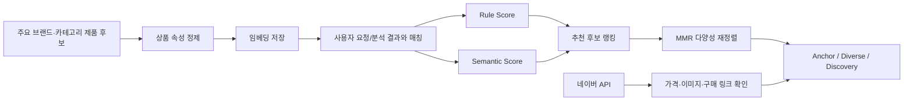
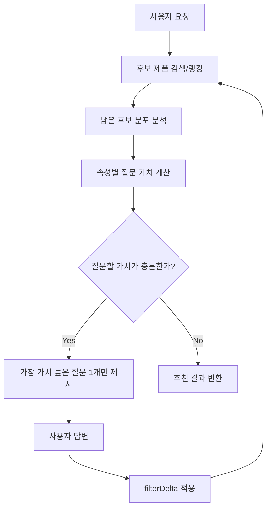
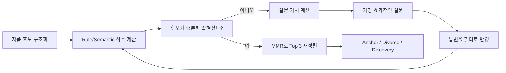

# 아우라딘 기술적 챌린지 설명 메모

대상: 기존 **네이버 API 기반 제품 추천 MVP**를 만든 팀원이, 아우라딘 발표 내용을 빠르게 이해하기 위한 문서

---

## 0. 한 줄 요약

아우라딘은 **네이버 검색 결과를 그대로 추천하는 기능**이 아니라,  
**제품 후보를 구조화하고 → 점수화하고 → 필요한 질문으로 좁히고 → 중복 없는 Top 3 추천으로 재정렬하는 검색 추천 에이전트**다.

이 문서는 그중 **두 가지 기술 챌린지**를 다룬다.

- **챌린지 ① 제품 추천 방식** — 네이버 검색 결과를 추천 가능한 후보로 바꾸고, 점수화·재정렬한다 (§1~4)
- **챌린지 ② 질문 가치 계산** — 꼭 필요할 때만, 후보를 가장 잘 줄이는 질문 하나를 고른다 (§5~9)

기존 MVP는 네이버 API에서 받은 다음 정보를 중심으로 제품을 가져왔다.

```text
- title: 상품명
- link: 구매 링크
- image: 상품 이미지 URL
- productId: 네이버 상품 ID
- lprice: 최저가
- brand: 브랜드
- maker: 제조사/제조원
- mallName: 판매처/스토어명
- category1~4: 네이버 카테고리
```

하지만 네이버 API는 화장품 추천에 필요한 다음 정보를 직접 주지 않는다.

```text
- 색상군
- 제형
- 피부타입
- 마감감
- 발림성
- 퍼스널컬러 적합도
- 리뷰 키워드
- 전성분
- 컬러칩
```

그래서 아우라딘은 네이버 API를 버리는 것이 아니라, **역할을 분리**한다.

```text
제품 후보 / 속성 / 임베딩 = 아우라딘 Catalog
가격 / 이미지 / 구매 링크 = 네이버 API live offer
```

---

## 1. 기술적 챌린지: 제품 추천 방식

### 핵심 문제

화장품 추천은 단순 검색과 다르다.

사용자가 원하는 것은:

```text
“립 제품 아무거나”
```

가 아니라:

```text
“내 얼굴 분석 결과에 어울리고,
색감·질감·가격·구매 가능성까지 맞는 실제 제품”
```

이다.

그런데 네이버 API만으로는 이 정보를 충분히 알기 어렵다.

예를 들어 네이버 API가 주는 상품명은:

```text
롬앤 글래스팅 컬러 글로스 01 피오니 발레
```

정도다.

하지만 추천 엔진이 진짜 알고 싶은 정보는:

```text
카테고리: lip
색상군: pink
톤: cool
질감: gloss
강도: sheer
가격대: 1~2만원
구매 가능 링크: 있음
```

이다.

즉, 핵심 챌린지는 **검색 결과를 추천 가능한 후보로 바꾸는 것**이다.

---

## 2. 제품 추천 방식의 개선 구조

기존 MVP는 네이버 API 결과를 중심으로 상품을 가져오고, `title`, `category`, `brand` 정도의 얕은 텍스트에서 색상·제형·톤을 추론했다.

아우라딘 방향은 한 단계 더 검색엔진스럽다.



### 발표에서 쉽게 말하면

> 기존에는 네이버 API 검색 결과를 보고 제품을 추천했다면,  
> 아우라딘은 주요 제품 후보를 미리 구조화하고 임베딩한 뒤,  
> 네이버 API는 “지금 살 수 있는지”를 확인하는 역할로 사용합니다.

---

## 3. 점수 계산의 핵심

아우라딘의 제품 추천 점수는 크게 두 축 — **조건 매칭(Rule)** 과 **의미 유사도(Semantic)** — 을 중심으로 본다. (여기에 근거 품질·구매 가능성 보정이 더해지는데, 실제 가중치는 §3 끝의 공식에서 정리한다.)

---

### 3.1 Rule Score

**사용자 조건과 상품 속성이 얼마나 맞는지** 보는 점수다.

예:

| 사용자 조건 | 상품 속성 | 점수 의미 |
|---|---|---|
| 립 | 립 제품 | 카테고리 일치 |
| 2만원 이하 | 18,000원 | 가격 조건 일치 |
| 코랄 | 코랄/피치 계열 | 색상군 일치 |
| 촉촉한 느낌 | 글로시/글로우 | 질감 일치 |
| 봄웜 | 웜톤/코랄/피치 | 톤 일치 |

현재 구현에서 Rule Score는 사용자가 명시한 하드 조건(카테고리·가격대·마감감 등) 중 **몇 개를 만족했는지의 비율**로 매긴다. 색감처럼 '있으면 좋은' 소프트 선호는 가중치를 둬서 더하되, 사용자가 **피하고 싶다고 한 값**에 걸리면 오히려 감점한다.

쉽게 말하면:

```text
Rule Score = 조건을 얼마나 잘 지켰는가
```

---

### 3.2 Semantic Score

**사용자 요청/얼굴 분석 결과와 상품 정보가 의미적으로 얼마나 가까운지** 보는 점수다.

예를 들어 사용자가:

```text
청순하고 맑은 데일리 립
```

이라고 했을 때, 상품명에 “청순”이라는 단어가 없어도:

```text
맑은 발색
투명 광택
데일리 틴트
생기 있는 핑크
```

같은 상품은 의미적으로 가까울 수 있다.

이때 사용자 쪽 텍스트와 상품 쪽 텍스트를 각각 임베딩 벡터로 만들고, 코사인 유사도로 가까움을 계산한다.

쉽게 말하면:

```text
Semantic Score = 말뜻과 분위기가 얼마나 가까운가
```

---

### 발표용 공식

너무 복잡한 수식보다 이 정도가 가장 좋다.

```text
최종 추천 점수
= 조건 일치도 (Rule + 소프트 선호)
+ 의미 유사도 (Semantic)
+ 근거 품질 (Evidence)
+ 구매 가능성 (Live offer)
```

또는 더 짧게:

```text
추천 점수 = 조건 점수 + 의미 점수 + 근거 점수 + 구매 가능성
```

> **실제 가중치(발표에서 물어보면):** 조건 매칭(하드 0.40 + 소프트 0.22)이 절반 이상을 차지하고, 근거 품질 0.20, 구매 가능성 0.10, 의미 유사도 0.08 순이다.  
> 즉 **의미 유사도는 조건이 비슷한 후보들 사이를 가르는 미세 조정(tie-breaker)에 가깝고, 확정 조건 매칭이 추천을 주도한다.**  
> 한 줄 정리: “조건을 최우선으로 지키되, 말뜻·분위기로 미세 조정한다.”

---

## 4. 다양성 재정렬: MMR

점수만 높은 제품을 3개 보여주면 이런 문제가 생긴다.

```text
1위 롬앤 코랄 글로스
2위 롬앤 코랄 글로스 다른 호수
3위 롬앤 코랄 글로스 리뉴얼
```

사용자 입장에서는:

```text
“다 비슷한데?”
```

라고 느낄 수 있다.

그래서 MMR을 쓴다.

---

### MMR의 역할

MMR은 **관련성은 높게 유지하면서, 이미 뽑힌 제품과 너무 비슷한 후보는 조금 밀어내는 방식**이다.

```text
MMR 점수 = λ × 관련성 − (1 − λ) × (이미 뽑힌 것과의 최대 유사도)
```

λ는 관련성과 다양성 사이의 다이얼이다. λ가 크면 비슷해도 관련성 위주로, 작으면 더 다양하게 뽑는다 (현재 기본값 0.7, “더 비슷하게 / 더 다양하게” 버튼이 이 값을 조절한다).

여기서 유사도는 상품 **속성(색감·마감·제형)의 겹침(Jaccard)** 으로 보고, 같은 브랜드면 패널티를 조금 더 얹는다.

예:

```text
A = 롬앤 코랄 글로시 틴트  →  속성 {코랄, 글로시, 틴트}
B = 롬앤 코랄 매트 틴트    →  속성 {코랄, 매트, 틴트}
```

겹치는 속성 {코랄, 틴트} = 2개, 합친 속성 {코랄, 글로시, 매트, 틴트} = 4개

```text
Jaccard = 2 / 4 = 0.5
+ 같은 브랜드(롬앤) 패널티 0.34
유사도 ≈ 0.84   (최대 1.0)
```

즉 색·제형이 겹치는 데다 브랜드까지 같아 매우 비슷 → MMR이 2·3위 자리에서 이 후보를 밀어낸다.

---

### Top 3 역할

아우라딘에서 Top 3는 단순히 1등, 2등, 3등이 아니다.

| 역할 | 의미 |
|---|---|
| Anchor | 가장 조건에 잘 맞는 대표 추천 |
| Diverse | 비슷하지만 다른 안전한 대안 |
| Discovery | 사용자가 요청한 범위 안에서 시야를 넓혀주는 새로운 제안 |

발표에서 이 부분은 꼭 살리는 게 좋다.

> 3위는 “점수가 낮은 제품”이 아니라,  
> 사용자가 미처 생각하지 못했지만 어울릴 수 있는 새로운 선택지를 보여주는 역할입니다.

---

## 5. 기술적 챌린지: 질문 가치 계산

제품 후보를 구조화하고 점수화해도, 후보가 아직 많거나 애매할 수 있다.

예:

```text
쿨톤인데 너무 진하지 않은 글로시 립 2만원 이하
```

이 요청에 후보가 80개 남았다면, 바로 추천하기보다 한 가지를 더 물어보는 게 좋을 수 있다.

문제는:

```text
무엇을 물어야 가장 효과적으로 후보를 줄일 수 있는가?
```

이다.

아우라딘은 이 질문을 LLM 감으로 만들지 않는다.  
서버가 후보 분포를 보고 계산한다.

---

## 6. 질문 가치 공식

아우라딘의 질문 엔진은 각 질문 후보에 점수를 매긴다.

```text
question value
= entropy × coverage × confidence × uxPriority × actionability
```

이 공식은 “질문을 많이 하기 위한 공식”이 아니다.

오히려:

```text
질문할 가치가 있을 때만 묻기 위한 공식
```

이다.

---

## 7. 각 용어 설명

### 7.1 Entropy

**후보가 얼마나 잘 갈리는가**를 뜻한다.

좋은 질문:

```text
글로시 10개
매트 10개
```

이 질문은 사용자가 어느 쪽을 골라도 후보가 절반 정도로 줄어든다.

나쁜 질문:

```text
글로시 19개
매트 1개
```

이 질문은 대부분의 경우 후보가 거의 줄어들지 않는다.

중요한 점:

```text
무조건 2개로 나누는 게 좋은 것이 아니다.
균등하게 나누는 것이 좋다.
```

예를 들어:

```text
핑크 7개
코랄 7개
로즈 6개
```

처럼 3개로 균등하게 갈려도 좋은 질문이다.

---

### 7.2 Coverage

**그 속성 정보를 알고 있는 후보가 얼마나 많은가**를 뜻한다.

```text
coverage = 속성값이 있는 후보 수 / 전체 후보 수
```

예:

```text
후보 20개 중 finish 정보가 있는 상품 18개
coverage = 18 / 20 = 0.9
```

Coverage가 낮으면 질문하지 않는 게 좋다.  
대부분 상품이 그 속성값을 모르기 때문이다.

---

### 7.3 Confidence

**그 속성값을 얼마나 믿을 수 있는가**를 뜻한다.

Coverage와 Confidence는 다르다.

| 개념 | 질문 |
|---|---|
| Coverage | 값이 있나? |
| Confidence | 그 값을 믿어도 되나? |

예:

```text
상품명에 “매트”가 명시됨
→ confidence 높음

LLM이 “아마 매트일 듯” 추론
→ confidence 낮음
```

즉, 모든 후보에 값이 있어 coverage가 높아도, 그 값이 전부 추론값이면 confidence는 낮을 수 있다.

---

### 7.4 uxPriority

**사용자가 답하기 쉬운 질문인가**를 뜻한다.

좋은 질문:

```text
촉촉한 광택감이 좋아요, 보송한 마무리가 좋아요?
```

나쁜 질문:

```text
LCh 색공간 기준으로 chroma가 높은 제품을 원하시나요?
```

기술적으로는 의미가 있어도 UX가 좋지 않다.

실제로는 속성마다 **고정 우선순위 가중치**로 반영한다. 마감·제형처럼 답하기 쉽고 결과에 크게 작용하는 속성은 높게, 언더톤·강도처럼 어렵고 애매한 속성은 낮게 둔다.

---

### 7.5 Actionability

**답변이 바로 필터로 반영될 수 있는가**를 뜻한다.

좋은 질문:

```text
글로시가 좋아요, 매트가 좋아요?
```

답변하면 바로:

```text
finish = glossy
```

또는:

```text
finish = matte
```

로 필터에 반영할 수 있다.

나쁜 질문:

```text
오늘 기분이 어떤가요?
```

재미는 있지만 상품 필터로 바꾸기 어렵다.

구현에서는 답이 곧바로 하드필터가 되는 속성이면 1.0, 색감처럼 부드럽게만 반영되는 속성이면 0.62를 준다.

---

## 8. 질문 엔진 흐름



핵심은 질문을 많이 하는 것이 아니다.

```text
질문할 가치가 있을 때만 묻는다.
```

질문은 최대 3개 정도로 제한하고, 후보가 충분히 좁혀졌거나 top 후보가 명확하면 바로 결과를 보여준다.

---

## 9. 두 챌린지의 관계

제품 추천 방식과 질문 가치 계산은 따로 떨어진 기능이 아니다.



즉:

```text
제품 추천 방식 = 후보를 평가하는 엔진
질문 가치 계산 = 후보를 더 잘 좁히는 엔진
```

둘이 합쳐져서 아우라딘의 “아키네이터형 검색”이 된다.

---

## 10. 발표에서 꼭 넣어야 할 내용

### 제품 추천 방식 장표에 꼭 들어갈 것

```text
1. 네이버 API는 상품명/가격/이미지/링크 중심이라 화장품 속성 정보가 부족하다.
2. 아우라딘은 주요 제품 후보를 미리 구조화하고 임베딩한다.
3. 네이버 API는 가격·이미지·구매 링크 확인용 live offer로 사용한다.
4. 추천 점수는 Rule Score와 Semantic Score를 결합한다.
5. MMR로 중복 추천을 줄이고 Top 3 역할을 분리한다.
6. Top 3는 Anchor / Diverse / Discovery다.
```

### 질문 가치 계산 장표에 꼭 들어갈 것

```text
1. 질문은 LLM이 감으로 만들지 않는다.
2. 서버가 남은 후보 분포를 보고 질문 가치를 계산한다.
3. 핵심 공식은 question value = entropy × coverage × confidence × uxPriority × actionability다.
4. Entropy는 후보가 얼마나 균등하게 갈리는지다.
5. Coverage는 그 속성값을 아는 후보 비율이다.
6. Confidence는 그 속성값 추론을 얼마나 믿을 수 있는지다.
7. 질문은 최대 3개까지만 하고, 충분하면 바로 결과를 보여준다.
```

---

## 11. 발표용 핵심 문장

이 문장은 그대로 써도 된다.

> 아우라딘은 네이버 API 검색 결과를 그대로 보여주는 추천 기능이 아닙니다.  
> 주요 제품 후보를 구조화하고, 사용자 조건과 의미 유사도를 기준으로 다시 점수화한 뒤,  
> 필요한 경우에는 후보를 가장 잘 줄이는 질문만 선택적으로 묻는 검색 추천 에이전트입니다.

또 하나:

> 질문도 챗봇처럼 감으로 하는 것이 아니라,  
> 남은 후보가 어떻게 분포되어 있는지 보고  
> entropy, coverage, confidence, uxPriority, actionability로 질문 가치를 계산합니다.

마지막으로:

> 최종 Top 3는 단순 점수순이 아니라  
> 가장 잘 맞는 Anchor, 다른 안전한 대안 Diverse, 새로운 가능성을 보여주는 Discovery로 역할을 나눕니다.
