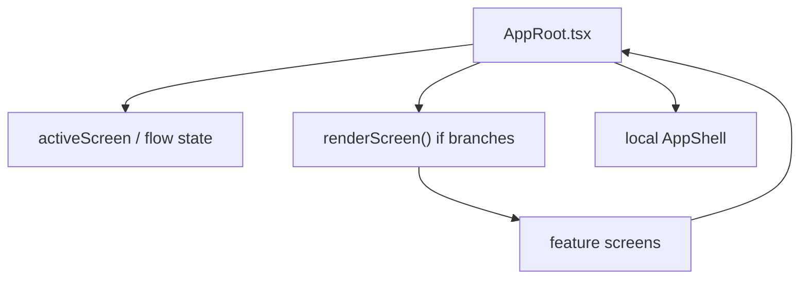
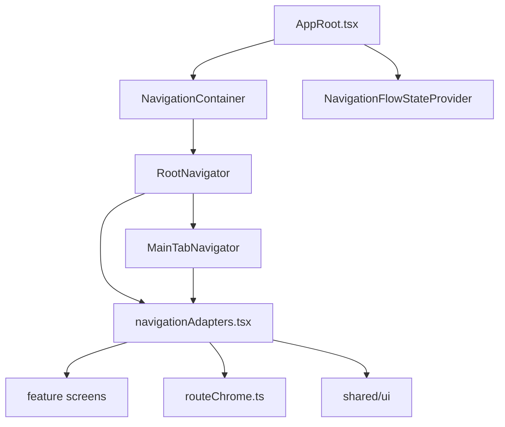

# 현재 브랜치와 dev 브랜치의 모바일 프론트엔드 구조 비교 보고서

작성일: 2026-06-25

## 1. 이 개념들은 프로젝트 전용인가

이 문서에서 설명하는 개념은 대부분 프론트엔드 실무에서 일반적으로 배우는 내용이다. 다만 파일명, route 이름, 화면 이름, mock 데이터 이름은 우리 프로젝트에 맞춘 구현이다.

예를 들어 `routeChrome.ts`라는 이름은 우리 팀이 선택한 이름이다. 하지만 "화면마다 header, footer, fullscreen, status bar 정책을 한곳에서 관리한다"는 생각은 실무에서도 자주 쓰는 구조다.

따라서 이 문서는 두 층으로 읽으면 좋다.

```text
실무 일반 개념
  -> 화면 구조를 설계할 때 어디서나 쓰이는 사고방식

우리 프로젝트 적용
  -> 그 사고방식이 이 저장소에서 어떤 파일과 코드로 구현되었는지
```

| 실무에서 배우는 일반 개념 | 우리 프로젝트에서의 적용 |
| --- | --- |
| 기능 단위 폴더 구조 | `features/analysis`, `features/feedback`, `features/profile` |
| 공통 계층 분리 | `shared/ui`, `shared/theme`, `shared/services`, `shared/types` |
| 라우팅과 화면 전환 | `RootNavigator.tsx`, `MainTabNavigator.tsx` |
| route parameter 타입화 | `routeTypes.ts`의 `RootStackParamList`, `MainTabParamList` |
| 화면 chrome 중앙화 | `routeChrome.ts`, `DetailRouteChrome`, `MainTabChrome` |
| adapter pattern | `navigationAdapters.tsx` |
| 흐름 상태 관리 | `NavigationFlowStateProvider`, `flowState.tsx` |
| 데모 상태와 실제 상태 분리 | `demoFlowState.ts`와 `flowState.tsx` 분리 |
| 딥링크 설계 | `linkingConfig.ts`, `aiarmakeup://...` |
| 디자인 토큰 | `shared/theme/colors.ts`, `typography.ts`, `spacing.ts` |
| 공통 UI 컴포넌트 | `AppHeader`, `AppFooter`, `AppScreen`, `FullscreenOverlay` |
| mock/service/type 분리 | `imageAnalysisService.ts`, `imageAnalysis.mock.ts`, `imageAnalysis.ts` |
| 테스트 가능한 구조 | `routeChrome`, `linkingConfig`, `AppScreen` 관련 테스트 |
| 의존성 방향 관리 | feature가 shared를 사용하고, shared는 feature를 직접 알지 않는 구조 |
| 결합도와 응집도 | `AppRoot.tsx`의 책임 축소와 navigation 계층 분리 |

이 표에서 왼쪽은 다른 React 또는 React Native 프로젝트에서도 반복해서 만나는 개념이고, 오른쪽은 이 프로젝트에서 그 개념이 실제로 나타난 위치다.

## 2. 프론트엔드 구조를 설계할 때 알아야 하는 개념

### 1. Feature-based architecture

기능별로 코드를 묶는 방식이다.

```text
features/
  analysis/
  ar/
  feedback/
  home/
  profile/
  recommendation/
```

비전공자에게는 "부서별 파일 정리"라고 이해하면 쉽다. 분석 기능 파일은 analysis에, 피드백 기능 파일은 feedback에 둔다.

개발자 관점에서는 응집도를 높이는 구조다. 한 기능의 화면, mock, service, type이 가까이 있으면 수정 범위를 추적하기 쉽다.

### 2. Shared layer

여러 기능에서 같이 쓰는 코드는 `shared`에 둔다.

```text
shared/
  mocks/
  services/
  theme/
  types/
  ui/
```

주의할 점은 "아무 데서나 쓰고 싶다"는 이유만으로 shared에 넣으면 안 된다는 것이다. shared는 공용 계약이므로 한번 들어가면 여러 화면에 영향을 준다. 공통성이 충분할 때만 올리는 것이 좋다.

### 3. Screen content와 screen chrome

화면 content는 사용자가 실제로 보는 기능 내용이다.

- 추천 제품 카드
- 분석 결과
- 피드백 문구
- 필터 조정 UI
- 프로필 정보

화면 chrome은 그 내용을 감싸는 공통 프레임이다.

- 상단 header
- 하단 footer
- 뒤로가기/닫기/공유 버튼
- status bar
- safe area padding

현재 브랜치의 중요한 개선은 content와 chrome을 분리한 것이다. feature screen이 모든 header를 직접 들고 있으면 화면마다 조금씩 달라져서 유지보수가 어려워진다.

### 4. Navigation

Navigation은 앱 안의 길 찾기 시스템이다.

사용자가 "홈 → 얼굴 촬영 → 분석 로딩 → 분석 보고서 → AR 필터"로 이동할 때, 이 순서를 기억하고 뒤로가기 동작을 처리하는 계층이다.

현재 브랜치는 React Navigation을 사용한다.

- Stack navigator: 화면을 위에 쌓는 방식이다. 상세 화면, 로딩 화면, 전체화면 흐름에 적합하다.
- Tab navigator: 홈, 커스텀, 마이페이지처럼 최상위 메뉴를 오가는 방식이다.
- Route params: 특정 화면에 필요한 작은 값을 route로 넘긴다. 예: `FeedbackTip`의 `pointId`.

### 5. Route type

`routeTypes.ts`는 route 이름과 parameter의 타입 계약이다.

예를 들어 `FeedbackTip`은 `{pointId: string}`이 필요하다. 타입으로 선언해두면 잘못된 이동 코드를 TypeScript가 잡아줄 수 있다.

이런 구조는 전문가 관점에서 매우 중요하다. 화면 이동은 런타임 오류가 자주 나는 영역인데, route type을 두면 컴파일 시점에 일부 오류를 막을 수 있다.

### 6. Route chrome

`routeChrome.ts`는 화면이 어떤 성격인지 선언하는 파일이다.

```text
Login: fullscreen
HomeTab: mainTab
ImageAnalysisReportDetail: detail
ARMakeupFilter: fullscreen
FilterSaved: fullscreen terminal
```

이 파일이 중요한 이유는 디자인 결정을 코드 계약으로 만들기 때문이다. "이 화면은 footer가 보여야 하나요?" 같은 질문을 매번 감으로 판단하지 않고, route classification으로 정한다.

### 7. Adapter pattern

`navigationAdapters.tsx`는 adapter 역할을 한다.

React Navigation은 `navigation.navigate(...)` 방식으로 이동한다. 기존 feature screen들은 `onBack`, `onComplete`, `onPressProfileEdit` 같은 props를 받도록 만들어져 있다.

Adapter는 이 둘을 연결한다.

```text
React Navigation route
  -> navigationAdapters.tsx
  -> feature screen props
```

이 패턴의 장점은 기존 화면 컴포넌트를 크게 뜯지 않고 navigation 구조를 교체할 수 있다는 것이다.

### 8. Flow state

모든 상태를 route param으로 넘기기는 어렵다.

예를 들어 피드백 결과 전체, 선택한 사진 객체, 저장된 메이크업 스타일 preview는 URL에 넣기 어렵다. 이런 값은 `NavigationFlowStateProvider`에서 관리한다.

현재 브랜치에서는 일반 앱 기본 상태와 데모용 seed도 분리했다.

- `flowState.tsx`: 일반 앱 기본 상태
- `demoFlowState.ts`: 캡처/데모용 초기 상태

이 분리는 중요하다. 데모에서는 결과 화면에 바로 들어가고 싶지만, 실제 앱 시작 시에는 결과가 이미 있는 것처럼 보이면 안 되기 때문이다.

### 9. Deep link

Deep link는 앱 안 특정 화면으로 바로 들어가는 주소다.

예:

```text
aiarmakeup://tabs/home
aiarmakeup://image-analysis-report/demo-report
aiarmakeup://feedback-tip/eyeline-point
```

딥링크가 있으면 QA, 발표 데모, 외부 공유, push 알림 연결이 쉬워진다. 현재 브랜치는 `linkingConfig.ts`와 테스트를 통해 route와 URL path가 서로 어긋나지 않도록 관리한다.

### 10. Design tokens

Design token은 색상, 여백, 글자 크기, 둥근 정도, 그림자, 아이콘 크기 같은 디자인 값을 이름으로 관리하는 방식이다.

나쁜 예:

```tsx
fontSize: 17,
padding: 23,
fontWeight: '600',
```

좋은 예:

```tsx
fontSize: typography.fontSize.md,
padding: spacing.lg,
fontWeight: typography.fontWeight.semibold,
```

토큰을 쓰면 앱 전체가 일관되고, 나중에 디자인 방향을 바꿀 때 한곳에서 조정하기 쉽다.

### 11. Mock, service, type 분리

현재 프로젝트는 실제 백엔드 API보다 프론트엔드 UI/UX 구현이 우선이다. 그래서 mock data를 사용한다.

좋은 구조는 다음과 같다.

```text
screen
  -> service
  -> mock data
  -> type
```

화면이 mock 파일을 직접 깊게 알지 않고 service를 통하면, 나중에 실제 API로 바꿀 때 화면 변경을 줄일 수 있다.

### 12. Testable architecture

테스트하기 좋은 구조는 파일 책임이 분명하다.

예를 들어 `routeChrome.ts`는 순수 설정에 가깝기 때문에 테스트하기 쉽다. `getStatusBarStyleForNavigationState` 같은 함수도 입력과 출력이 분명하다.

반대로 `AppRoot.tsx` 한 파일 안에 모든 화면 이동이 섞이면 테스트가 커지고 깨지기 쉽다.

현재 브랜치는 구조를 분리하면서 테스트 가능한 작은 단위가 늘어났다.

### 13. 상태 위치 결정

프론트엔드에서 중요한 판단 중 하나는 "이 상태를 어디에 둘 것인가"이다.

상태를 둘 수 있는 대표 위치는 다음과 같다.

| 상태 위치 | 적합한 경우 | 우리 프로젝트 예시 |
| --- | --- | --- |
| screen local state | 한 화면 안에서만 쓰는 입력값, 토글, 임시 선택값 | 화면 내부의 선택 UI 상태 |
| route params | URL이나 화면 이동 기록에 남겨도 되는 작은 식별자 | `reportId`, `pointId` |
| flow/context state | 여러 화면을 지나며 유지해야 하지만 URL에 넣기 어려운 값 | `selectedFilterPhoto`, `feedbackResult` |
| service/mock data | API 응답처럼 취급되는 데이터 | `imageAnalysisService`, `myPageService` |
| theme token | 앱 전체에서 공유되는 디자인 값 | `colors`, `spacing`, `typography` |

좋은 구조는 모든 상태를 한곳에 몰아넣지 않는다. 어떤 상태가 어디까지 필요하고, 새로고침이나 딥링크에서 복구되어야 하는지를 보고 위치를 정한다.

### 14. Route params와 flow state의 차이

`route params`는 화면 주소에 붙여도 되는 작고 직렬화 가능한 값에 적합하다.

예를 들어 `ImageAnalysisReportDetail`은 `reportId`만 있으면 어떤 보고서를 열지 알 수 있다. `FeedbackTip`은 `pointId`만 있으면 어떤 수정팁인지 찾을 수 있다. 이런 값은 딥링크와도 잘 맞는다.

반면 `flow state`는 URL에 넣기 어려운 임시 데이터에 적합하다.

- 사용자가 선택한 사진 객체
- 피드백 분석 결과 전체
- 저장된 메이크업 스타일 preview
- 화면 캡처나 데모를 위해 주입하는 seed 상태

이 차이를 구분하지 않으면 route가 너무 무거워지거나, 반대로 새로고침/딥링크에서 필요한 식별자가 사라진다. 현재 브랜치가 `routeTypes.ts`와 `flowState.tsx`를 나누는 이유도 여기에 있다.

### 15. 의존성 방향

의존성 방향은 "어떤 코드가 어떤 코드를 알아도 되는가"에 대한 규칙이다.

우리 프로젝트에서는 대체로 다음 방향이 자연스럽다.

```text
app/navigation
  -> features
  -> shared

features
  -> shared

shared
  -> 특정 feature를 직접 알지 않음
```

예를 들어 `features/profile`이 `shared/ui/AppHeader`를 사용하는 것은 자연스럽다. 하지만 `shared/ui/AppHeader`가 `features/profile/MyPageScreen`을 import하면 공통 컴포넌트가 특정 기능에 묶이게 된다.

전문가 관점에서 이런 역방향 의존성은 재사용성과 테스트 가능성을 떨어뜨린다. 그래서 `shared`는 되도록 범용 타입, 범용 UI, 범용 theme만 알아야 한다.

### 16. 결합도와 응집도

결합도는 한 코드가 다른 코드에 얼마나 강하게 묶여 있는지를 뜻한다. 응집도는 한 파일이나 모듈이 하나의 목적에 얼마나 잘 집중하는지를 뜻한다.

`dev`의 `AppRoot.tsx`는 화면 전환, 흐름 상태, header/footer 판단, 화면 렌더링을 모두 알고 있었다. 그래서 결합도가 높고, 응집도는 낮아지기 쉬웠다.

현재 브랜치는 역할을 나눠 결합도를 낮추고 응집도를 높인다.

- `AppRoot.tsx`: provider와 앱 시작 구조
- `RootNavigator.tsx`: stack route 등록
- `MainTabNavigator.tsx`: tab route와 footer 연결
- `routeChrome.ts`: route별 화면 프레임 정책
- `navigationAdapters.tsx`: navigation과 기존 screen props 연결
- feature screen: 사용자에게 보이는 화면 content

좋은 프론트엔드 구조는 파일 수를 무조건 줄이는 구조가 아니다. 각 파일이 자기 이유를 갖고, 다른 파일을 덜 알아도 되는 구조다.

### 17. Feature 내부 컴포넌트와 shared UI 승격 기준

처음 만든 컴포넌트를 바로 `shared/ui`에 넣는 것이 항상 좋은 것은 아니다.

일반적인 기준은 다음과 같다.

- 한 feature에서만 쓰이면 feature 내부에 둔다.
- 두세 곳 이상에서 반복되고 의미가 안정되면 `shared/ui`로 올린다.
- 디자인 토큰, 접근성, 크기, 상태 규칙까지 공통화할 수 있으면 shared에 적합하다.
- 특정 도메인 데이터를 알아야 하면 shared보다 feature 내부가 더 안전하다.

예를 들어 `AppHeader`, `AppFooter`, `AppScreen`은 앱 전체 frame에 쓰이므로 shared가 적합하다. 반면 분석 보고서 전용 카드가 분석 데이터 구조를 깊게 안다면 `features/analysis/components`에 남기는 편이 낫다.

### 18. Loading, empty, error 상태 설계

실제 API가 붙기 전에는 mock 데이터가 항상 정상으로 보일 수 있다. 하지만 실무 프론트엔드에서는 다음 상태를 처음부터 생각해야 한다.

- loading: 데이터를 불러오는 중
- empty: 데이터가 없음
- error: 불러오기에 실패함
- success: 정상 데이터가 있음

현재 브랜치의 `myPageLoadState.ts`, `imageAnalysisReportDetailLoadState.ts` 같은 파일은 이런 상태를 화면에서 더 명확히 다루기 위한 흐름과 연결된다.

이 개념이 중요한 이유는 API 연동 후에 드러난다. 정상 mock만 보고 화면을 만들면 네트워크 실패, 빈 결과, 권한 문제, 오래 걸리는 분석 상태에서 화면 구조가 갑자기 흔들릴 수 있다.

## 3. 비교 기준

이 문서는 현재 브랜치 `refactor/mobile-linking-demo-flow-state`와 `dev` 브랜치의 모바일 프론트엔드 구조 차이를 설명한다.

- 현재 브랜치: `55c6241 docs: 모바일 화면 캡처와 내비게이션 문서 갱신`
- 비교 대상 dev: `10182ae Merge pull request #55 from devhyun05/feat/asset-flow-refactor`
- 주요 비교 범위: `apps/mobile/src`, `apps/mobile/package.json`, `apps/mobile/package-lock.json`, `docs/mobile`
- 변경 규모: 155개 파일 변경, 9,854줄 추가, 7,116줄 삭제
- 구조 관점 변경 수: 추가 69개, 삭제 32개, 수정 65개
- 테스트 파일 변경 수: `apps/mobile/src` 기준 42개

한 줄로 요약하면, `dev` 브랜치는 `AppRoot.tsx` 한 파일이 화면 전환을 직접 관리하는 프로토타입형 구조였고, 현재 브랜치는 React Navigation, route chrome, shared UI, mock/service/type 계층을 분리한 앱 구조로 바뀌었다.

## 4. 비전공자용 핵심 요약

`dev` 브랜치의 모바일 앱은 큰 접수대 하나가 모든 일을 처리하는 방식에 가까웠다. 사용자가 어느 화면에 있는지, 뒤로 가면 어디로 가야 하는지, 상단 헤더와 하단 메뉴를 보여줄지까지 `AppRoot.tsx`가 직접 판단했다.

현재 브랜치는 역할을 나누었다.

- `AppRoot.tsx`는 앱을 켜는 기본 장치만 담당한다.
- `app/navigation`은 화면 이동 지도를 담당한다.
- `routeChrome.ts`는 화면마다 헤더, 푸터, 전체화면 여부를 정한다.
- `shared/ui`는 여러 화면에서 반복되는 버튼, 헤더, 푸터, 카메라 오버레이 같은 공통 부품을 담당한다.
- 각 `features/*` 폴더는 자기 화면의 실제 내용에 더 집중한다.

즉, 이전에는 "이 화면을 어떻게 보여주고 어디로 이동할지"가 한곳에 길게 섞여 있었고, 지금은 "앱의 길 찾기", "공통 화면 틀", "기능별 화면 내용"이 분리되었다.

## 5. 전체 구조 변화

### dev 브랜치 구조

`dev`에서는 `apps/mobile/src/app-root/AppRoot.tsx`가 앱 전체 화면 흐름을 직접 관리했다.

```text
AppRoot.tsx
  - activeScreen 상태 보관
  - selectedPhoto, feedbackResult, selectedFilterPhoto 등 흐름 상태 보관
  - renderScreen() 안에서 if 문으로 화면 선택
  - 화면별 onPress, onBack, onComplete 이동 직접 연결
  - AppHeader, AppFooter를 직접 감싸는 shell 역할 일부 담당
```

이 방식은 초기 데모나 화면 수가 적은 단계에서는 빠르게 만들 수 있다. 하지만 화면이 늘어나면 한 파일이 너무 많은 책임을 갖게 된다.

### 현재 브랜치 구조

현재 브랜치는 React Navigation 기반 구조로 바뀌었다.

```text
AppRoot.tsx
  - TamaguiProvider
  - SafeAreaProvider
  - font loading
  - StatusBar
  - NavigationFlowStateProvider
  - NavigationContainer
  - RootNavigator

app/navigation/
  - RootNavigator.tsx
  - MainTabNavigator.tsx
  - routeTypes.ts
  - routeChrome.ts
  - navigationAdapters.tsx
  - flowState.tsx
  - linkingConfig.ts
  - detailHeaderChrome.tsx
  - mainTabChrome.ts
  - navigationState.ts
```

현재 구조에서 `AppRoot.tsx`는 앱을 띄우는 최상위 provider 역할만 하고, 실제 화면 전환은 `RootNavigator`와 `MainTabNavigator`가 담당한다.

## 6. 구조 다이어그램

### dev: 한 파일 중심 화면 전환



특징은 단순하다. 그러나 화면이 늘어날수록 `AppRoot`가 계속 커지고, 뒤로가기와 헤더/푸터 규칙이 화면별로 흩어지기 쉽다.

### 현재 브랜치: 내비게이션과 화면 정책 분리



현재 구조는 파일 수가 늘었지만, 각 파일의 책임이 더 분명하다. 팀 작업에서는 이 편이 충돌과 회귀를 줄이기 좋다.

## 7. 핵심 차이 1: AppRoot의 책임 축소

`dev`의 `AppRoot.tsx`는 화면 목록, 이동 로직, 흐름 상태, 헤더/푸터 판단을 직접 들고 있었다.

현재 `AppRoot.tsx`는 다음 정도만 담당한다.

- Pretendard, NixieOne 폰트 로딩
- Tamagui theme provider 연결
- safe area provider 연결
- status bar style 동기화
- `NavigationFlowStateProvider`로 임시 흐름 상태 제공
- `NavigationContainer`와 `RootNavigator` 연결

전문가 관점에서 보면, 이는 "composition root"에 가까운 형태다. 앱 최상단에서 provider를 조립하되, 도메인 화면 전환 판단은 하위 navigation 계층으로 내려간다.

## 8. 핵심 차이 2: app/navigation 계층 추가

`dev`에는 `apps/mobile/src/app/navigation` 계층이 없었다. 현재 브랜치에서는 16개 파일이 추가되어 화면 이동 구조를 전담한다.

주요 파일 역할은 다음과 같다.

| 파일 | 역할 |
| --- | --- |
| `RootNavigator.tsx` | 로그인, 온보딩, 탭, 상세, 전체화면 route를 stack으로 등록한다. |
| `MainTabNavigator.tsx` | 홈, 커스텀, 마이페이지 탭과 하단 footer를 연결한다. |
| `routeTypes.ts` | route 이름과 route parameter 타입을 한곳에 정의한다. |
| `routeChrome.ts` | 화면별 header/footer/fullscreen/status bar 정책을 정한다. |
| `navigationAdapters.tsx` | React Navigation의 navigation 객체를 기존 화면 props로 바꿔준다. |
| `flowState.tsx` | route param으로 넘기기 어려운 임시 흐름 상태를 Context로 관리한다. |
| `linkingConfig.ts` | `aiarmakeup://...` 딥링크 URL을 route로 연결한다. |
| `detailHeaderChrome.tsx` | 상세 화면의 공통 header를 route 단위로 렌더링한다. |
| `mainTabChrome.ts` | 메인 탭 header copy와 footer active 상태를 계산한다. |
| `navigationState.ts` | 현재 활성 route를 찾아 status bar style을 계산한다. |

이 구조의 핵심은 "화면 이동 규칙을 화면 컴포넌트 안에 숨기지 않는 것"이다.

## 9. 핵심 차이 3: React Navigation 의존성 도입

현재 브랜치에서 `apps/mobile/package.json`에 다음 의존성이 추가되었다.

- `@react-navigation/bottom-tabs`
- `@react-navigation/native`
- `@react-navigation/native-stack`
- `react-native-screens`

이 변경은 단순 패키지 추가가 아니라 구조 변경의 기반이다. 이제 앱의 route stack, tab, back behavior, deep link 처리를 직접 만든 상태 머신이 아니라 검증된 내비게이션 라이브러리에 맡긴다.

이에 따라 `apps/mobile/package-lock.json`도 함께 갱신되어 실제 설치되는 dependency tree가 새 내비게이션 구조와 맞게 고정되었다.

## 10. 핵심 차이 4: 화면 chrome 정책 중앙화

여기서 chrome은 브라우저가 아니라, 화면 내용 바깥의 공통 프레임을 뜻한다.

- 상단 header
- 하단 footer
- 뒤로가기 버튼
- 닫기 버튼
- 공유 버튼
- status bar 색상
- 일반 화면인지, 상세 화면인지, 전체화면인지

`dev`에서는 이런 판단이 `AppRoot.tsx`, 각 화면 컴포넌트, 공통 UI 사이에 흩어져 있었다.

현재 브랜치에서는 `routeChrome.ts`가 route별 화면 성격을 선언한다.

```text
entry      로그인/온보딩처럼 앱 진입 전 화면
main       홈/추천/마이페이지 같은 최상위 탭 화면
sub        목록/상세/폼처럼 한 단계 들어간 화면
immersive  카메라/AR처럼 화면 전체 몰입이 필요한 화면
terminal   저장 완료처럼 흐름의 끝 화면
```

이 분류는 디자인과 개발을 연결하는 계약이다. 예를 들어 `immersive` 화면은 일반 header/footer를 숨기고, `sub` 화면은 route-level detail header를 사용한다.

## 11. 핵심 차이 5: feature screen은 화면 내용에 더 집중

현재 브랜치에서는 여러 feature screen에서 일반 `AppHeader`를 직접 렌더링하던 책임이 줄었다. 상세 화면 header는 `DetailRouteChrome`이 한 번만 그린다.

예를 들어 다음 화면들은 route-level detail header 아래에 들어가는 content가 되었다.

- 이미지 분석 로딩
- 이미지 분석 보고서 목록
- 이미지 분석 보고서 상세
- 프로필 수정
- 좋아요 목록
- 메이크업 룩 목록
- 피드백 시작/로딩/결과/가이드/팁
- 필터 업로드/결과/저장/레시피 상세

반대로 카메라, AR, try-on처럼 몰입형 화면은 local overlay control을 유지한다. 이 버튼들은 앱 공통 header가 아니라 촬영/AR 경험의 일부로 보기 때문이다.

## 12. 핵심 차이 6: 분석 도메인 명칭 정리

`dev`에는 분석 관련 이름이 여러 방향으로 섞여 있었다.

- `AnalysisResultsScreen`
- `AnalysisResultDetailScreen`
- `FacialAnalysisResultScreen`
- `analysisResults.mock.ts`
- `facialAnalysisResult.mock.ts`
- `analysisService.ts`
- `facialAnalysisResultService.ts`

현재 브랜치에서는 "이미지 분석 보고서" 중심으로 이름이 정리되었다.

- `ImageAnalysisLoadingScreen`
- `ImageAnalysisReportsListScreen`
- `ImageAnalysisReportDetailScreen`
- `ImageAnalysisReportCard`
- `imageAnalysis.mock.ts`
- `imageAnalysisService.ts`
- `imageAnalysis.ts`

이름 정리는 사소해 보이지만 중요하다. 같은 개념을 여러 이름으로 부르면 새 팀원이 어느 파일을 수정해야 하는지 헷갈린다. 현재 구조는 "이미지 분석"이라는 도메인 언어로 묶여 있어서 학습 비용이 줄어든다.

## 13. 핵심 차이 7: MyPage와 profile 구조 정리

`dev`에서는 `UserPageScreen`, `FavoriteProductsScreen`, `LikedProductListScreen`, `MakeupLookScreen`, `MakeupStyleListScreen` 등이 profile feature 안에 있었다.

현재 브랜치에서는 마이페이지 중심 구조로 정리되었다.

- `MyPageScreen`
- `ProfileEditScreen`
- `myPageService.ts`
- `myPage.mock.ts`
- `myPage.ts`
- `myPageLoadState.ts`
- `myPageScreenData.ts`

또한 제품 추천이나 좋아요 목록처럼 recommendation 성격이 강한 화면은 `features/recommendation` 쪽과 연결된다. profile feature는 사용자의 프로필과 마이페이지 허브에 더 집중하는 방향이다.

## 14. 핵심 차이 8: shared/ui가 디자인 시스템에 가까워짐

현재 브랜치에서 `shared/ui` 변경이 크다. 새로 추가되거나 강화된 공통 컴포넌트는 다음과 같다.

- `AuraLogo`
- `CameraCaptureButton`
- `FullscreenOverlay`
- `LiveCameraLayer`
- `AppHeader` 테스트
- `AppFooter` 테스트
- `AppScreen` 테스트
- `FooterIcons` 테스트
- `HeaderIcons` 테스트
- `LineIcons` 테스트

이 변화는 화면을 예쁘게 만드는 수준을 넘어선다. 여러 화면이 같은 header, footer, safe area, camera overlay, icon rule을 공유하게 되어 전체 앱이 같은 제품처럼 보인다.

`AGENTS.md`와 `docs/mobile/FRONTEND_WORK_GUIDE.md`의 방향과도 맞다.

- 공통 UI는 `apps/mobile/src/shared/ui`
- 색상, spacing, radius, shadow, typography, icon size는 `apps/mobile/src/shared/theme`
- repeated raw number와 ad hoc font 사용을 줄임
- icon은 Lucide 또는 shared icon 방향으로 통일

## 15. 핵심 차이 9: mock, service, type 계층의 재정렬

현재 브랜치는 실제 API 없이도 데모가 가능하도록 mock/service/type 계층을 계속 유지한다. 다만 이름과 책임이 바뀌었다.

삭제 또는 대체된 흐름:

- `analysis.mock.ts`
- `analysisResults.mock.ts`
- `facialAnalysisResult.mock.ts`
- `analysisService.ts`
- `analysisResultService.ts`
- `facialAnalysisResultService.ts`
- `userPageService.ts`
- `userPage.ts`

새로 생긴 흐름:

- `imageAnalysis.mock.ts`
- `imageAnalysisService.ts`
- `imageAnalysis.ts`
- `myPage.mock.ts`
- `myPageService.ts`
- `myPage.ts`

이 구조는 나중에 백엔드 API가 생겼을 때 유리하다. 화면은 service 함수를 호출하고, service 안쪽 구현만 mock에서 실제 API로 바꾸면 되기 때문이다.

## 16. 핵심 차이 10: 테스트가 구조 계약을 보호함

현재 브랜치에는 navigation, chrome, shared UI, feature screen 관련 테스트가 많이 추가되었다.

대표적으로 다음 계약을 테스트한다.

- 모든 route가 linking config에 빠짐없이 들어 있는지
- route chrome에서 detail header title과 action이 맞는지
- footer tab이 올바른 route로 연결되는지
- `NavigationFlowStateProvider` 밖에서 hook을 쓰면 에러가 나는지
- `AppScreen`의 safe area padding 계산이 맞는지
- `FullscreenOverlay`, `CameraCaptureButton`, `LiveCameraLayer` 같은 공통 UI contract가 유지되는지

이런 테스트는 화면 픽셀을 완벽히 검증하는 테스트는 아니다. 대신 구조가 깨지는 실수를 빠르게 잡는다. 예를 들어 새 route를 만들고 `linkingConfig.ts`에 path를 빼먹는 실수를 테스트가 잡아준다.

## 17. 개발자 관점의 장점

현재 브랜치의 구조는 다음 장점이 있다.

- 새 화면 추가 시 route type, navigator, chrome, linking을 명시적으로 등록하게 된다.
- header/footer 정책이 feature screen에 흩어지지 않는다.
- 메인 탭과 상세 화면, 전체화면 런타임의 구분이 명확하다.
- 화면 이름과 mock/service/type 이름이 도메인 언어에 가까워졌다.
- shared UI가 강화되어 반복 UI 구현이 줄어든다.
- 딥링크와 route 누락을 테스트로 잡을 수 있다.
- `AppRoot.tsx`의 책임이 줄어 앱 시작 구조가 읽기 쉬워졌다.

## 18. 개발자 관점의 주의점

구조가 좋아졌지만 복잡도도 새로 생겼다.

### 새 화면 추가 시 수정 지점이 늘어남

새 route를 추가하면 보통 다음 파일을 함께 봐야 한다.

- `routeTypes.ts`
- `RootNavigator.tsx` 또는 `MainTabNavigator.tsx`
- `routeChrome.ts`
- `navigationAdapters.tsx`
- `linkingConfig.ts`
- 관련 테스트

이것은 번거롭지만 의도된 번거로움이다. 화면 이동, 화면 프레임, 딥링크 계약을 명시적으로 맞추기 위한 구조다.

### navigationAdapters.tsx가 커질 수 있음

현재 `navigationAdapters.tsx`는 많은 화면을 연결한다. 당장은 기존 화면과 새 navigation 구조 사이의 bridge로 적절하지만, 화면 수가 더 늘면 feature별 adapter 파일로 나누는 것도 검토할 수 있다.

예:

```text
app/navigation/adapters/
  analysisRoutes.tsx
  feedbackRoutes.tsx
  filterRoutes.tsx
  profileRoutes.tsx
```

단, 지금 당장 나누는 것이 항상 좋은 것은 아니다. 팀이 현재 구조에 익숙해진 뒤 실제로 파일이 더 커질 때 분리하는 편이 안전하다.

### routeChrome과 화면 내부 UI가 충돌하면 안 됨

`sub` 화면은 route-level detail header를 사용한다. 따라서 feature screen 안에서 다시 일반 `AppHeader`를 렌더링하면 header가 중복될 수 있다.

반대로 `immersive` 화면은 route-level header 없이 local overlay control을 유지한다. 카메라/AR 화면의 닫기 버튼은 공통 detail header와 성격이 다르다.

### 데모 상태와 실제 앱 초기 상태를 섞으면 안 됨

`demoFlowState.ts`는 데모와 캡처를 위한 seed다. 실제 앱 기본 상태는 `flowState.tsx`의 clean state를 사용해야 한다.

## 19. 새 화면을 추가할 때의 추천 순서

아래 순서를 따르면 현재 구조와 충돌할 가능성이 낮다.

1. 화면이 어떤 기능인지 정한다.
   - 예: analysis, feedback, profile, recommendation

2. 화면 depth를 정한다.
   - `entry`, `main`, `sub`, `immersive`, `terminal` 중 하나

3. 화면 chrome을 정한다.
   - main tab shell인지, detail header인지, fullscreen인지

4. `routeTypes.ts`에 route 이름과 parameter 타입을 추가한다.

5. `routeChrome.ts`에 category, depth, kind, title, action을 추가한다.

6. `RootNavigator.tsx` 또는 `MainTabNavigator.tsx`에 route를 등록한다.

7. `navigationAdapters.tsx`에서 feature screen props와 navigation 동작을 연결한다.

8. 딥링크가 필요하면 `linkingConfig.ts`에 path를 추가한다.

9. feature screen은 화면 content에 집중하고, 일반 header/footer는 직접 넣지 않는다.

10. mock/service/type이 필요하면 feature 내부 또는 shared 계층에 분리한다.

11. route, chrome, linking, shared UI contract 테스트를 추가한다.

## 20. 비전공자를 위한 변경 해석

이 브랜치의 변화는 화면 디자인 자체를 조금 고친 수준이 아니다. 앱을 오래 개발하기 위한 뼈대를 다시 세운 것에 가깝다.

`dev` 구조에서는 "어떤 화면을 보여줄지"를 큰 파일 하나가 직접 결정했다. 현재 구조에서는 앱 안에 길 안내 시스템이 생겼고, 화면마다 어떤 간판과 버튼을 붙일지도 별도 규칙으로 관리한다.

그래서 당장 파일 수는 늘었다. 하지만 팀원이 각자 화면을 만들 때 같은 규칙을 따르기 쉬워지고, 발표 데모나 QA에서 특정 화면으로 바로 들어가는 것도 쉬워졌다.

## 21. 전문가용 판단

현재 브랜치는 전형적인 React Native 앱 구조로 더 가까워졌다.

- route state를 custom `activeScreen` 상태에서 React Navigation으로 이전했다.
- root stack과 bottom tab을 분리했다.
- `RootStackParamList`, `MainTabParamList`로 route parameter를 타입화했다.
- `routeChromeByRoute`가 `Record<RouteName, RouteChrome>`을 만족하도록 선언되어 route 누락 가능성을 줄였다.
- linking config가 route 목록과 맞는지 테스트한다.
- 일시적인 flow state는 Context로 유지하되, demo seed를 production 기본값과 분리했다.
- 기존 prop-driven screen을 adapter로 감싸 migration 범위를 통제했다.
- shared UI와 design token 사용을 강화했다.

아쉬운 점은 adapter 파일이 커졌다는 것이다. 그러나 migration 단계에서는 한곳에 bridge를 모아 전체 흐름을 파악하기 쉬운 장점도 있다. 안정화 후 feature별 adapter 분리를 검토하면 된다.

## 22. 결론

현재 브랜치는 `dev`에 비해 프론트엔드 구조가 더 명시적이고 확장 가능한 방향으로 바뀌었다.

가장 큰 변화는 `AppRoot.tsx` 중심의 수동 화면 전환에서 React Navigation 중심의 route 구조로 이동한 것이다. 그 결과 화면 이동, header/footer 정책, 딥링크, 임시 흐름 상태, 공통 UI가 각각 자기 자리를 갖게 되었다.

이 구조는 초기 학습 비용이 있다. 하지만 화면 수가 많고 팀원이 동시에 작업하는 모바일 앱에서는 더 안정적이다. 앞으로 새 화면을 만들 때는 "화면을 어디에 둘까?"보다 먼저 "이 화면은 어떤 depth와 chrome을 갖는 route인가?"를 정하는 것이 중요하다.

## 23. 관련 문서와 근거 파일

- `docs/mobile/FRONTEND_WORK_GUIDE.md`
- `docs/mobile/REACT_NAVIGATION_CHROME_PLAN.md`
- `docs/mobile/NAVIGATION_REFACTOR_HISTORY.md`
- `apps/mobile/src/app-root/AppRoot.tsx`
- `apps/mobile/src/app/navigation/RootNavigator.tsx`
- `apps/mobile/src/app/navigation/MainTabNavigator.tsx`
- `apps/mobile/src/app/navigation/routeTypes.ts`
- `apps/mobile/src/app/navigation/routeChrome.ts`
- `apps/mobile/src/app/navigation/navigationAdapters.tsx`
- `apps/mobile/src/app/navigation/flowState.tsx`
- `apps/mobile/src/app/navigation/linkingConfig.ts`
- `apps/mobile/src/shared/ui/AppHeader.tsx`
- `apps/mobile/src/shared/ui/AppFooter.tsx`
- `apps/mobile/src/shared/ui/AppScreen.tsx`
- `apps/mobile/src/shared/ui/FullscreenOverlay.tsx`
