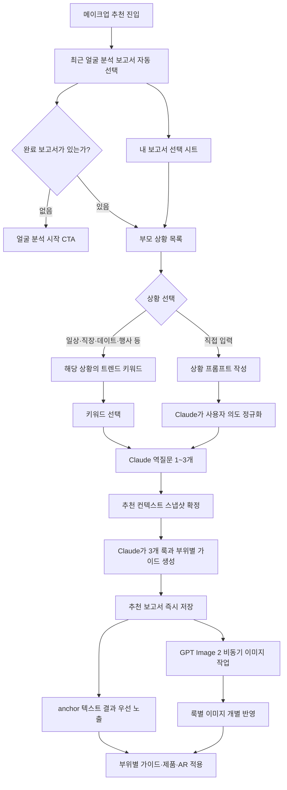

# 메이크업 추천 V2 구현 계획

작성일: 2026-07-16
상태: 구현 완료 · 자동 검증 통과 (실기기 Expo Go/AR 스모크는 실행 환경에서 최종 확인)
범위: 메이크업 추천 진입 UI 개선, 상황-키워드 계층화, 얼굴 분석 보고서 선택, Claude 기반 역질문·추천, GPT Image 2 기반 추천 이미지, 부위별 메이크업 결과

## 1. 목적

메이크업 추천을 단순한 문구 칩 탐색 화면에서 다음의 명확한 개인화 흐름으로 개편한다.

```text
내 얼굴 분석 보고서 선택
→ 상황 선택
→ 해당 상황의 트렌드 키워드 선택
→ 필요한 역질문 1~3개
→ 얼굴 분석 보고서 + 상황 + 키워드 + 답변을 결합한 추천 생성
→ 추천 이미지 + 부위별 메이크업 방법 + 제품 + AR 적용
```

화이트보드의 핵심 관계는 `상황`이 부모이고 `키워드`가 자식이라는 점이다. 첫 화면에서는 보고서 선택과 부모 상황을 먼저 보여주고, 사용자가 상황을 선택한 뒤에만 그 상황에 속한 키워드를 노출한다.

`직접 입력`은 트렌드 키워드의 하나가 아니다. 메이크업 피드백에서 목표를 자유롭게 적는 것처럼 사용자가 원하는 장면을 프롬프트로 작성하는 별도 진입 방식이다.

### 기존 기획과의 관계

- 이 문서는 `2026-07-15-makeup-scenario-chips-curated-copy-design.md`의 평면 상황 칩을 `부모 상황 → 자식 키워드` 구조로 대체한다.
- 기존의 검수된 상황 문구는 폐기하지 않고 키워드 seed와 장애 시 curated fallback으로 재사용한다.
- 근거 없는 상황·트렌드 카드를 Claude가 즉석 생성하지 않는 원칙, 적응형 최대 3개 역질문, 안전 입력 우선, `anchor`·`bold`·`discovery` 3개 룩 계약은 유지한다.
- 2026-07-14 초안의 퍼즐형 탐색과 검수되지 않은 AI 상황 생성은 다시 도입하지 않는다.

## 2. 현재 구현 기준선과 문제점

### 이미 있는 것

- 모바일 진입 route: `MakeupRecommendation`
- 상황 문구/키워드형 칩 UI와 자유 입력
- Claude 기반 역질문 API
- Claude 기반 3개 추천 룩 생성
- 추천 보고서 저장·목록·상세·재시도·재조정 API
- OpenAI 이미지 생성 후 S3 저장
- 얼굴 분석 보고서 목록과 상세 화면
- 레퍼런스 메이크업 추출의 부위별 분석 UI/데이터 타입

### 현재 부족한 것

- 상황과 키워드가 하나의 평면 목록으로 섞여 있어 부모-자식 관계가 없다.
- 추천 진입 시 사용자가 어떤 얼굴 분석 보고서를 사용할지 고를 수 없다.
- route가 `personalColor`를 전달하지만 추천 화면은 선택된 보고서 전체를 입력으로 사용하지 않는다.
- 질문/추천 API에 `analysisReportId`가 전달되지 않는다.
- 추천 보고서에 원본 얼굴 분석 보고서 FK와 당시 분석 스냅샷이 없다.
- 현재 이미지 생성은 텍스트 기반 일반 모델 이미지를 만들며, 선택한 보고서의 얼굴 사진을 편집 입력으로 사용하지 않는다.
- 결과의 `steps`와 `products`는 존재하지만 레퍼런스 추출처럼 부위별 색·질감·위치·기법·이유를 한 구조로 보여주지 않는다.
- `POST /api/makeup-recommendations/generate`에 OpenAI 텍스트 분석 레거시 경로가 남아 있어 “Claude는 분석, OpenAI는 이미지만”이라는 경계가 코드로 강제되지 않는다.
- 이미지 세 장이 순차 완료된 뒤 한 번에 반영되어 첫 결과 노출이 늦고 개별 이미지 재시도가 어렵다.

## 3. 확정할 제품 규칙

1. 얼굴 분석 보고서는 추천의 필수 입력이다.
2. 최근 완료 보고서를 기본 선택하되 사용자는 자신의 완료 보고서 중 하나를 다시 고를 수 있다.
3. 상황은 안정적인 부모 분류이고, 트렌드 키워드는 상황에 종속된 자식이다.
4. MVP에서는 부모 상황 1개와 핵심 키워드 1개를 선택한다.
5. 키워드를 누르면 별도 확인 버튼 없이 역질문 생성으로 이동한다.
6. `직접 입력`은 키워드를 거치지 않고 사용자의 프롬프트를 Claude가 정규화한 뒤 역질문으로 이동한다.
7. 역질문은 이미 보고서·상황·키워드에 있는 정보를 다시 묻지 않으며 보통 1~2개, 최대 3개다.
8. 기존의 `anchor`, `bold`, `discovery` 3개 룩 계약은 유지한다. 결과 화면에서는 한 번에 하나를 hero로 보여주고 상단 variant selector로 전환한다.
9. 각 룩은 이미지와 함께 베이스·브로우·아이·치크·립 부위별 가이드를 가져야 한다. 컨투어는 데이터가 있을 때만 선택적으로 보여준다.
10. Claude가 질문, 컨텍스트 해석, 최종 구조화 추천을 담당한다.
11. OpenAI는 `gpt-image-2` 이미지 생성/편집에만 사용한다.
12. 사용자의 얼굴 사진을 OpenAI 이미지 편집 입력으로 보내려면 명시적 동의가 필요하다. 동의하지 않으면 비식별 일반 레퍼런스 이미지를 만든다.
13. 입력이 충돌하면 `안전·알레르기·피해야 할 조건 > 가장 최근의 사용자 직접 입력 > 역질문 답변 > 상황·키워드 > 얼굴 보고서 기반 추론` 순서로 해석한다.

## 4. 전체 사용자 흐름



## 5. 첫 화면 UX

### 5.1 정보 구조

```text
AI 메이크업 추천

┌──────────────────────────────────┐
│ 이 보고서를 기준으로 추천해요      │
│ [얼굴 썸네일]  7월 16일 얼굴 분석   │
│                얼굴형 · 피부표현 요약│
│                         [바꾸기]   │
└──────────────────────────────────┘

어떤 상황을 위한 메이크업인가요?

[일상 이미지] [출근 이미지] [데이트 이미지] [모임 이미지]
[하객 이미지] [여행 이미지] [촬영 이미지] [페스티벌 이미지]
[ 원하는 상황 직접 설명하기                         ]

데이트에서 원하는 무드를 골라주세요
[스트로베리 밀크] [라벤더 글레이즈] [워터컬러 플러시]
[라커 글로시 립] [로즈베이지 모노톤]

업데이트 2026.07.16 · K-BEAUTY 2026 / GLOBAL SS26 / STEADY / CURATED
```

### 5.2 보고서 카드

- 최근 `completed` 얼굴 분석 보고서를 기본 선택한다.
- 카드에는 썸네일, 분석일, 짧은 얼굴형/피부 표현 요약을 보여준다.
- `바꾸기`를 누르면 `FaceAnalysisReportPickerSheet`를 연다.
- 시트에는 사용자 소유 완료 보고서만 최신순으로 보여준다.
- 보고서를 바꾸면 아직 질문을 시작하지 않은 discovery 상태만 갱신한다.
- 얼굴 분석 보고서가 없으면 상황 카드를 disabled 처리하지 말고, 상황 영역 대신 `얼굴 분석 후 추천받기` 안내와 `얼굴 분석 시작` CTA를 보여준다.
- 얼굴 분석 상세의 `메이크업 추천` CTA로 진입한 경우 route의 `reportId`를 최우선으로 선택한다.

### 5.3 부모 상황

MVP 기본 상황은 다음과 같이 시작한다. 이름은 운영 중 변경할 수 있지만 key는 안정적으로 유지한다.

| UI | key | 의도 |
| --- | --- | --- |
| 일상·데일리 | `daily` | 등교, 장보기, 카페, 편한 약속 |
| 출근·면접 | `work` | 출근, 면접, 발표, 오피스 |
| 데이트 | `date` | 낮 데이트, 저녁 데이트, 기념일 |
| 모임·파티 | `social` | 친구 모임, 생일, 회식, 저녁 약속 |
| 하객·격식 | `formal_event` | 결혼식 하객, 돌잔치, 가족 행사 |
| 여행·야외 | `travel_outdoor` | 여행, 휴양지, 야외 활동 |
| 촬영·콘텐츠 | `camera_content` | 프로필, 증명사진, 셀카, 영상, 라이브 |
| 공연·페스티벌 | `festival_performance` | 콘서트, 페스티벌, 공연 |
| 직접 입력 | `custom` | 사용자가 장면을 직접 설명 |

- 402pt 기준 부모 상황 8개는 이미지가 있는 4열 × 2행 카드로 노출한다.
- 화면 폭이 360pt 미만이거나 `fontScale >= 1.3`이면 2열로 전환한다.
- `직접 입력`은 아홉 번째 이미지 카드가 아니라 그리드 아래 전체 너비 CTA로 분리한다.
- 선택된 카드는 명확한 테두리/배경 차이를 갖고 accessibility `selected` 상태를 제공한다.
- 상황을 선택하면 같은 화면 아래에 자식 키워드 패널이 펼쳐진다.
- 다른 상황을 누르면 이전 자식 키워드는 즉시 교체된다.
- 부모는 큰 이미지 카드, 자식은 작은 텍스트 칩으로 시각적 위계를 고정한다.

#### 5.3.1 상황 카드 이미지 계약

검색한 기사나 Google 이미지 결과를 앱 자산으로 복사하지 않는다. 레퍼런스는 상황 단서와 트렌드 용어를 찾는 데만 사용하고, 앱에는 프로젝트용 원본 생성 이미지를 넣는다. 핵심 사용자를 20~30대로 두고, 정적인 소품 플랫레이가 아니라 인물의 행동과 장소가 한눈에 읽히는 2026 서울 뷰티·패션 에디토리얼 라이프스타일 장면을 사용한다. 인물은 실존 인물·연예인을 닮지 않은 AI 생성 성인 모델이어야 하며 상황 카드가 추천 결과의 특정 얼굴형·피부색을 정답처럼 암시하지 않도록 다양한 스타일과 구도를 사용한다.

공통 생성 brief:

```text
Use case: photorealistic-editorial
Asset type: Korean mobile beauty app situation-card image
Audience: Korean users in their 20s and 30s
Primary request: an original, action-led lifestyle moment that communicates the named occasion at thumbnail size
Style/medium: 2026 Seoul K-beauty and fashion editorial, candid 35mm energy, premium and trend-forward
Composition/framing: square, dynamic three-quarter action, clear silhouette, lower 22% calm/darker for app copy
Lighting/mood: situation-specific daylight, direct flash, blue hour, or stage light with vivid refined color
Constraints: no readable text, no logo, no branded packaging, no watermark, no celebrity,
             no real-person likeness, no copyrighted character, no copied campaign composition,
             no generic stock-photo pose, no static flat lay
```

| 상황 | 파일명 | 생성 장면 | 주조색 | 접근성 설명 |
| --- | --- | --- | --- | --- |
| 일상·데일리 | `daily.webp` | 서울 아파트에서 외출 직전 틴트와 쿠션을 실버 숄더백에 넣는 20대 후반 인물 | 버터 옐로·실버·쿨 그레이 | `일상·데일리 상황 선택. 학교, 카페, 가벼운 약속` |
| 출근·면접 | `work.webp` | 성수 크리에이티브 오피스에서 발표 전 노트북 화면으로 메이크업을 확인하는 30대 초반 직장인 | 코발트·차콜·쿨 블루 | `출근·면접 상황 선택. 오피스, 면접, 발표` |
| 데이트 | `date.webp` | 블루아워 루프톱 레스토랑에 도착하며 베리 립을 마무리하는 20대 후반 인물 | 체리·에스프레소·시티 블루 | `데이트 상황 선택. 낮 데이트부터 저녁 약속까지` |
| 모임·파티 | `social.webp` | 서울 리스닝 바에서 콤팩트와 이어링을 나누며 웃는 20대 후반~30대 초반 친구들 | 플럼·일렉트릭 블루·실버 | `모임·파티 상황 선택. 생일, 회식, 저녁 모임` |
| 하객·격식 | `formal-event.webp` | 디자인 호텔 예식장 복도에서 진주 이어링을 채우며 이동하는 30대 초반 하객 | 더스티 로즈·네이비·샴페인 | `하객·격식 상황 선택. 결혼식 하객과 가족 행사` |
| 여행·야외 | `travel-outdoor.webp` | 해안 셔틀에서 내려 햇빛 속 선케어 스틱을 바르는 20대 후반 여행자 | 스카이 블루·테라코타·화이트 | `여행·야외 상황 선택. 여행과 장시간 야외 활동` |
| 촬영·콘텐츠 | `camera-content.webp` | 서울 소형 스튜디오에서 카메라 플립 화면을 확인하며 하이라이터를 올리는 20대 후반 크리에이터 | 라일락·쿨 블루·크롬 | `촬영·콘텐츠 상황 선택. 프로필, 증명사진, 영상` |
| 공연·페스티벌 | `festival-performance.webp` | 공연장 진입 직전 친구에게 크롬 아이 포인트를 더해주는 20대 후반 친구들 | 인디고·코발트·실버 | `공연·페스티벌 상황 선택. 콘서트, 무대, 축제` |

- Codex 이미지 생성 도구로 8장을 각각 생성하고 사람이 로고·문자·손상·유명 캠페인 유사성을 검수한다.
- 최종 파일은 `apps/mobile/src/assets/images/makeup-recommendation/situations/`에 bundled WebP로 저장한다.
- 원본 생성은 정사각형, 납품은 `768 × 768`, sRGB, WebP quality 80~85, 파일당 150KB 이하를 목표로 한다.
- 카드에서는 `aspectRatio: 1`, `radius.md`, 하단 55~60% `transparent → rgba(17,17,17,0.68)` scrim을 적용한다.
- 라벨은 이미지 안에 생성하지 않고 실제 React Native 텍스트로 올린다. 흰색 semibold 12/16, 최대 2줄이다.
- 이미지는 decorative로 처리하고 전체 `Pressable`에 label, hint, selected 상태를 준다.
- decode 실패 시 `surfaceMuted + 상황 icon + 텍스트` fallback을 보여주며 선택 기능은 유지한다.
- static `require` registry는 `data/makeupRecommendationSituationAssets.ts`에 두어 누락을 빌드/테스트에서 잡는다.
- `apps/mobile/src/assets/images/ASSET_LICENSES.md`에 prompt, 생성 도구/모델, 생성일, 검수자, 후편집, 권리 상태를 기록한다.
### 5.4 자식 트렌드 키워드

#### 5.4.1 2026-07-16 초기 시드

아래는 출시용 전체 목록이 아니라 조사 근거가 있는 초기 seed다. 한국에서 이미 오래 쓰인 애교살·블러 립·일자 눈썹을 “2026 신규 트렌드”로 과장하지 않고 `STEADY`로 표시한다.

배지:

- `TREND · K-BEAUTY 2026`: 2026 서울/K-뷰티 현장 취재 근거
- `TREND · GLOBAL SS26`: 2026 글로벌 런웨이·전문가 또는 검색 증가 근거
- `STEADY`: 한국에서 이미 정착했지만 현재도 유효한 스타일
- `CURATED`: 상황 적합성 때문에 운영자가 검수한 실용/클래식 선택지

| 부모 상황 | 초기 자식 키워드 |
| --- | --- |
| 일상·데일리 | 란제리 메이크업 `K-BEAUTY`, 워터컬러 플러시 `K-BEAUTY`, 블러드 소프트 립 `STEADY`, 애교살 포인트 `STEADY`, 5분 톤온톤 `CURATED` |
| 출근·면접 | 모던 소프트 매트 `GLOBAL`, 시어 스키니멀리즘 `GLOBAL`, 블러드 뮤트 립 `STEADY`, 뉴트럴 토프 음영 `CURATED`, 묻어남 적은 립 `CURATED` |
| 데이트 | 스트로베리 밀크 `K-BEAUTY`, 라벤더 글레이즈 `K-BEAUTY`, 워터컬러 언더아이 플러시 `K-BEAUTY`, 라커 글로시 립 `GLOBAL`, 로즈베이지 모노톤 `CURATED` |
| 모임·파티 | 리플렉티브 아이 `GLOBAL`, 리브드인 스모키 `GLOBAL`, 스테이트먼트 립 `GLOBAL`, 컬러 래시 `GLOBAL`, 워터라인 라이너 `GLOBAL` |
| 하객·격식 | 모던 소프트 매트 `GLOBAL`, 미니멀 리플렉티브 포인트 `GLOBAL`, 스테이트먼트 립 `GLOBAL`, 로즈베이지 엘레강스 `CURATED`, 플래시 세이프 롱웨어 `CURATED` |
| 여행·야외 | 선키스드 브론즈 `GLOBAL`, 선셋 블러시 `GLOBAL`, 온더고 글로우 `GLOBAL`, 스웨트프루프 UV 베이스 `CURATED`, 습도 대응 미니멀 `CURATED` |
| 촬영·콘텐츠 | 모던 소프트 매트 `GLOBAL`, 하이 블러시 `GLOBAL`, 이너코너 하이라이트 `K-BEAUTY`, 스탠드아웃 래시 `GLOBAL`, 플래시 세이프 베이스 `CURATED` |
| 공연·페스티벌 | 펩랠리 글램 `GLOBAL`, 프로스티드 아이시 블루 `GLOBAL`, 리플렉티브 메탈릭 `GLOBAL`, 리브드인 스모키 `GLOBAL`, 페이스 젬 포인트 `GLOBAL` |

같은 키워드가 여러 부모 상황에 속할 수 있으므로 데이터는 1:N이 아니라 상황-키워드 매핑을 사용한다. UI에서는 현재 선택한 부모의 자식만 보여준다.

#### 5.4.2 조사 출처 registry

| ID | 게시일 | 근거 | 링크 |
| --- | --- | --- | --- |
| `SRC-ALLURE-SUMMER-2026` | 2026-05-20 | 리브드인 스모키, 리플렉티브 아이, 라커 립, 모던 매트, 하이 블러시, 워터라인 | [Allure Summer 2026](https://www.allure.com/story/summer-makeup-trends-2026) |
| `SRC-ELLE-SS26` | 2026-03-04 | 스키니멀리즘, 그런지 아이, 스테이트먼트 립, 컬러 래시 | [ELLE Spring 2026](https://www.elle.com/beauty/makeup-skin-care/a70607092/spring-2026-best-makeup-trends/) |
| `SRC-VOGUE-KBEAUTY-2026` | 2026-01-30 | 블러 립, 애교살, 언더아이 플러시, 소프트 일자 눈썹 | [Vogue K-Beauty 2026](https://www.vogue.com/article/k-beauty-makeup-trends) |
| `SRC-BAZAAR-KBEAUTY-2026` | 2026-01-16 | 란제리 메이크업, 이너코너, 워터컬러 플러시, 스트로베리 밀크, 라벤더 립 | [Harper's Bazaar K-Beauty 2026](https://www.harpersbazaar.com/beauty/makeup/g69969668/2026-korean-makeup-trends/) |
| `SRC-PINTEREST-SUMMER-2026` | 2026-05-26 | 펩랠리 글램, 프로스티드·블루 아이, 스머지드 라이너, 페이스 젬, 온더고 글로우 | [Pinterest Summer 2026](https://newsroom.pinterest.com/news/summer-trend-report-2026/) |
| `SRC-MARIECLAIRE-SS26` | 2026-02-08 | 네온·크롬 립, 돌리 아이와 SS26 백스테이지 흐름 | [Marie Claire SS26](https://www.marieclaire.co.uk/beauty/beauty-trend-report-2026) |
| `SRC-VOGUE-BUSINESS-2026` | 2026-01-22 | 립 스테인·플럼 마스카라·bold/fun/alt 검색 증가 데이터 | [Vogue Business 2026](https://www.vogue.com/article/cellness-bold-makeup-and-80s-hair-the-2026-beauty-trends-brands-need-to-know) |

기사의 사진은 무드 참고만 하고 다운로드·크롭·재가공하지 않는다. 키워드 row는 최소 `sourceUrl`, `sourcePublishedAt`, `marketScope`, `asOf`, `expiresAt`, `confidence`, `reviewStatus`를 보존한다.

- 키워드는 1~3단어의 짧은 표현으로 노출한다.
- 키워드는 `curated`, `steady`, `trend`를 구분한다.
- 실제 출처, 게시일, 시장 범위, 수집 시점, 만료 시점이 있는 항목만 범위가 표시된 `TREND` 배지를 붙인다.
- Claude는 수집된 키워드의 중복 제거, 분류, 사용자 친화적 레이블 생성에 사용할 수 있지만 트렌드 사실이나 점수를 스스로 만들어서는 안 된다.
- trend 소스가 없거나 만료되면 검수된 curated 키워드만 보여준다.
- MVP는 한 키워드 선택 즉시 세션을 만들고 역질문 로딩 화면으로 이동한다.
- 다중 키워드 조합은 후속 버전으로 미룬다.

### 5.5 직접 입력

- `직접 입력` 선택 시 키워드 패널 대신 `CustomSituationComposer`를 보여준다.
- 메이크업 피드백의 목표 입력 UX와 같은 문장형 입력 경험을 사용한다.
- placeholder 예시: `예: 야외 결혼식에서 사진은 또렷하지만 과해 보이지 않는 메이크업`.
- 1~240자, 공백만 입력 금지, 제출 중 중복 탭 방지.
- 사용자 문장은 프롬프트 지시문이 아니라 데이터로 취급하고 서버에서 길이·문자·금지 패턴을 검증한다.
- Claude는 문장을 `situationIntent`, `desiredImpression`, `constraints`로 정규화한 뒤 비어 있는 정보만 질문한다.

## 6. 역질문 UX

- 질문은 한 화면에 하나만 보여준다.
- 진행 표시: `1 / 2`.
- 선택지는 3개 + `AI가 골라줘`를 기본 계약으로 유지한다.
- 모든 질문에 `직접 입력`을 제공한다.
- 이미 보고서에 있는 얼굴형, 피부 표현, 퍼스널 컬러를 다시 분류하게 하지 않는다.
- 상황/키워드에 명시된 목적을 다시 묻지 않는다.
- 예시 질문 축:
  - 같은 상황에서 원하는 인상
  - 평소 대비 표현 강도
  - 준비 시간/숙련도
  - 사진과 실물 중 우선순위
- 마지막 질문에서만 `+ 조건 추가`를 제공하고 별도 질문 턴을 늘리지 않는다.
- 뒤로 가면 이전 답변을 보존해 수정할 수 있어야 한다.
- 전체 뒤로 가기 순서는 `질문 → 키워드 → 상황 → 보고서`이며, 이전 단계로 돌아가도 하위 선택을 바꾸기 전까지 기존 선택과 답변을 보존한다.
- Claude 질문 생성이 실패하거나 유효한 질문을 만들지 못하면 상황·키워드별로 검수된 결정론적 질문 세트를 사용한다.
- 질문 생성 실패 시 discovery 선택을 보존하고 `다시 시도`를 제공한다.

## 7. 결과 UX

### 7.1 상단

- 선택한 보고서, 상황, 키워드, 핵심 답변을 `반영한 조건` 요약으로 보여준다.
- variant selector: `가장 잘 맞는 룩`, `조금 더 과감한 룩`, `새로운 발견`.
- 선택된 variant의 추천 이미지를 hero로 보여준다.
- 이미지를 만드는 동안 텍스트 추천과 부위별 가이드를 먼저 노출한다.
- 이미지 상태는 룩별로 `pending`, `processing`, `completed`, `failed`를 표시한다.

### 7.2 부위별 메이크업

레퍼런스 추출 화면의 정보 구조를 재사용하되 추천 도메인 타입은 분리한다.

각 부위는 다음을 제공한다.

- 목표 인상
- 핵심 색상 이름과 HEX
- 질감
- 바르는 위치와 범위
- 적용 기법
- 순서가 있는 단계
- 선택 이유: 얼굴 분석 보고서·상황·답변 중 어떤 근거를 반영했는지
- 피해야 할 방식
- 추천 제품과 대체 제품
- AR 지원 여부

P0 필수 부위는 `base`, `brow`, `eye`, `cheek`, `lip`이다. `contour`는 Claude 결과에 있을 때 표시하되 기존 AR 계약에는 억지로 연결하지 않는다.

### 7.3 후속 행동

- `AR로 적용하기`
- `저장된 추천 보기`
- `더 자연스럽게`
- `더 힙하게`
- `다른 색으로`
- `제품만 바꾸기`
- 이미지 실패 시 해당 룩만 `이미지 다시 만들기`

## 8. 모바일 상태 모델

여러 `useState`로 분산시키지 말고 reducer 기반 상태 머신으로 정리한다.

```ts
type MakeupRecommendationScreenPhase =
  | 'bootstrapping'
  | 'discovery'
  | 'customSituation'
  | 'loadingQuestions'
  | 'question'
  | 'generatingRecommendation'
  | 'results'
  | 'history'
  | 'error';

type MakeupRecommendationDiscoveryState = {
  reports: FaceAnalysisReportSummary[];
  selectedReportId: string | null;
  situations: MakeupSituation[];
  selectedSituationId: string | null;
  selectedKeywordId: string | null;
  customSituationText: string;
};
```

추천 세션 타입에는 최소한 다음 필드를 추가한다.

```ts
type MakeupRecommendationSessionV2 = {
  id: string;
  sourceAnalysisReportId: string;
  situation: MakeupSituationSnapshot;
  keyword?: MakeupTrendKeywordSnapshot;
  customSituationText?: string;
  questions: MakeupRecommendationQuestion[];
  answers: MakeupRecommendationAnswer[];
  currentQuestionIndex: number;
  status: 'questioning' | 'ready' | 'generating' | 'completed' | 'failed';
  expiresAt: string;
};
```

결과 타입은 레퍼런스 추출의 `ReferenceMakeupAreaGuide`를 직접 재사용하지 않고 다음처럼 추천용으로 둔다.

```ts
type RecommendedMakeupAreaGuide = {
  area: 'base' | 'brow' | 'eye' | 'cheek' | 'lip' | 'contour';
  label: string;
  goal: string;
  color: {name: string; hex: string};
  texture: string;
  placement: string;
  technique: string;
  reason: string;
  avoid: string[];
  steps: {order: number; instruction: string}[];
  products: MakeupRecommendationProduct[];
  arSupported: boolean;
};
```

기존 `steps`와 `products`는 바로 삭제하지 않는다. v2 `areaGuides`에서 기존 계약으로 변환하는 adapter를 두어 AR route와 저장된 과거 보고서를 유지한다.

## 9. 모바일 파일 계획

### 수정

- `apps/mobile/src/features/makeup-recommendation/screens/MakeupRecommendationScreen.tsx`
  - reducer 기반 흐름 제어
  - 보고서·상황·키워드·질문·생성·결과 상태 연결
- `apps/mobile/src/features/makeup-recommendation/screens/ScenarioDiscoveryView.tsx`
  - 평면 칩 목록을 보고서 카드 + 상황 grid + 자식 키워드 panel로 개편
- `apps/mobile/src/features/makeup-recommendation/screens/RecommendationQuestionView.tsx`
  - 이전 답변 수정, 질문 진행 상태, 직접 입력 계약 보강
- `apps/mobile/src/features/makeup-recommendation/screens/RecommendationResultsView.tsx`
  - hero variant + 부위별 accordion/tab + 룩별 이미지 상태
- `apps/mobile/src/features/makeup-recommendation/services/makeupRecommendationService.ts`
  - v2 discovery/session/answer/generate API
  - v1 보고서 adapter 유지
- `apps/mobile/src/features/makeup-recommendation/types.ts`
  - 상황, 키워드, 세션, context snapshot, area guide 추가
- `apps/mobile/src/app/navigation/routes/makeupRecommendationRoutes.tsx`
  - route `reportId` 우선 선택
  - 선택된 보고서 전체를 feature에 전달하지 말고 ID만 전달
- `apps/mobile/src/app/navigation/routeTypes.ts`
  - `MakeupRecommendation: {reportId?: string} | undefined`
- `apps/mobile/src/features/face-analysis/screens/FaceAnalysisReportDetailScreen.tsx`
  - 추천 CTA에서 현재 `reportId` 전달

### 신규

- `components/AnalysisReportSelectorCard.tsx`
- `components/AnalysisReportPickerSheet.tsx`
- `components/SituationCard.tsx`
- `components/SituationCardGrid.tsx`
- `data/makeupRecommendationSituationAssets.ts`
- `apps/mobile/src/assets/images/makeup-recommendation/situations/*.webp`
- `components/TrendKeywordPanel.tsx`
- `components/CustomSituationComposer.tsx`
- `components/RecommendationContextSummary.tsx`
- `components/RecommendedAreaGuideSection.tsx`
- `services/makeupRecommendationMappers.ts`
- reducer를 분리할 경우 `state/makeupRecommendationReducer.ts`

새 UI 라이브러리는 추가하지 않는다. 기존 theme token, Tamagui, `AppScreen`, `AppCard`, 얼굴 보고서 카드 패턴을 사용한다.

## 10. API V2 계약

기존 API는 앱 전환 기간 동안 유지하고 v2 session API를 추가한다.

### `GET /api/makeup-recommendations/discovery`

용도: 부모 상황과 노출 가능한 자식 키워드를 한 번에 가져온다.

```json
{
  "situations": [
    {
      "id": "uuid",
      "key": "date",
      "label": "데이트",
      "description": "낮 데이트부터 저녁 약속까지",
      "imageAssetKey": "date",
      "sortOrder": 30,
      "keywords": [
        {
          "id": "uuid",
          "label": "스트로베리 밀크",
          "kind": "trend",
          "badge": "TREND_K_BEAUTY_2026",
          "marketScope": "ko-KR",
          "seedPrompt": "...",
          "tags": ["date", "strawberry_milk"],
          "trendScore": 0.82,
          "sourceName": "Harper's Bazaar K-Beauty 2026",
          "sourceUrl": "https://www.harpersbazaar.com/beauty/makeup/g69969668/2026-korean-makeup-trends/",
          "sourcePublishedAt": "2026-01-16T00:00:00Z",
          "asOf": "2026-07-16T00:00:00Z",
          "expiresAt": "2026-10-14T00:00:00Z",
          "confidence": "B"
        }
      ]
    }
  ],
  "generatedAt": "2026-07-16T00:00:00Z"
}
```

- 인증 사용자를 요구한다.
- 만료·disabled 키워드는 반환하지 않는다.
- source 근거가 없는 항목은 `kind: curated`로 반환한다.
- DB가 일시적으로 불가하면 모바일에 내장된 최소 curated 상황/키워드를 사용하되 trend 배지를 표시하지 않는다.

### `POST /api/makeup-recommendations/sessions`

```json
{
  "analysisReportId": "uuid",
  "situationId": "uuid",
  "keywordId": "uuid",
  "customSituationText": null,
  "imageMode": "personalized"
}
```

- `keywordId`와 `customSituationText`는 정확히 하나만 허용한다.
- `analysisReportId`가 현재 사용자 소유이고 `completed`인지 검증한다.
- keyword가 situation의 자식인지 검증한다.
- 보고서의 허용 필드로 immutable context snapshot을 만든다.
- Claude로 첫 질문을 생성하거나 질문이 필요 없으면 `ready`를 반환한다.
- 동일 idempotency key 재요청은 같은 session을 반환한다.

### `POST /api/makeup-recommendations/sessions/{sessionId}/answers`

```json
{
  "questionId": "impression",
  "optionId": "soft_presence",
  "freeText": null,
  "additionalConstraints": null
}
```

- 현재 질문과 일치하는지 검증한다.
- 다음 질문 또는 `ready` 상태를 반환한다.
- 완료 답변을 다시 보내도 중복 누적하지 않는다.

### `POST /api/makeup-recommendations/sessions/{sessionId}/generate`

- Claude Sonnet으로 3개 룩과 `areaGuides`를 생성한다.
- 먼저 recommendation report를 저장한다.
- 이미지 작업은 비동기로 dispatch한다.
- 같은 session의 중복 generate는 같은 report를 반환한다.

### 기존 report API

- `GET /api/makeup-recommendations`
- `GET /api/makeup-recommendations/{reportId}`
- `POST /api/makeup-recommendations/{reportId}/refine`
- `POST /api/makeup-recommendations/{reportId}/image/retry`

v2에서는 이미지 retry에 `lookId`를 선택적으로 받아 한 룩만 재시도할 수 있게 확장한다.

## 11. DB 계획

스키마는 `docs/backend/schema.sql`, `docs/backend/aws-postgresql-schema.dbml`, runtime 보정 SQL을 함께 갱신한다.

### 11.1 `makeup_situations` 신규

```text
id uuid PK
key text UNIQUE
label text
description text
image_asset_key text
icon_key text
sort_order int
status active|disabled
created_at / updated_at
```

`image_asset_key`는 서버 URL이 아니라 모바일 static registry key다. 서버와 앱 key가 다르면 fallback을 쓰고 오류 event를 남긴다.

### 11.2 기존 `makeup_scenario_library` 확장

기존 테이블을 즉시 rename하지 않고 v2에서 키워드 저장소로 확장한다.

```text
keyword_kind curated|steady|trend|legacy_scenario
source_name text null
source_url text null
source_published_at timestamptz null
evidence_summary text null
market_scope text null
trend_score numeric null
confidence A|B|null
review_status draft|approved|rejected
locale text default ko-KR
as_of timestamptz null
valid_from timestamptz null
expires_at timestamptz null
```

- 기존 row는 `legacy_scenario`로 backfill하고 v2 discovery에서는 제외한다.
- `trend` row는 source URL·게시일·시장 범위·as-of·expiry·승인 상태가 필수다.
- `(normalized_text, locale, market_scope)` 중복 방지 인덱스를 둔다.

### 11.3 `makeup_situation_keywords` 신규

```text
situation_id uuid FK -> makeup_situations
keyword_id uuid FK -> makeup_scenario_library
relevance_score numeric
sort_order int
status active|disabled
created_at / updated_at
PRIMARY KEY(situation_id, keyword_id)
```

같은 메이크업 무드가 데이트와 촬영처럼 여러 부모에 속할 수 있으므로 관계를 별도 매핑한다. discovery는 이 테이블을 기준으로 현재 부모의 자식만 반환한다.

### 11.4 `makeup_recommendation_sessions` 신규

```text
id uuid PK
user_id uuid FK
analysis_report_id uuid FK
situation_id uuid FK
keyword_id uuid null FK
custom_situation_text text null
context_snapshot jsonb
questions jsonb
answers jsonb
current_question_index int
status questioning|ready|generating|completed|failed|expired
report_id uuid null FK
idempotency_key text
expires_at timestamptz
created_at / updated_at
```

### 11.5 `makeup_recommendation_reports` 확장

```text
source_analysis_report_id uuid FK
session_id uuid FK
situation_id uuid FK
keyword_id uuid null FK
context_snapshot jsonb
schema_version text default makeup-recommendation-v2
image_mode personalized|generic
```

`context_snapshot`은 추천 당시 사용한 보고서 요약을 보존한다. 이후 원본 보고서가 갱신되거나 삭제돼도 추천 근거를 설명할 수 있어야 한다. 원본 사진 URL과 민감 원문 전체를 무조건 복제하지 말고 추천에 사용한 허용 필드만 저장한다.

### 11.6 `makeup_recommendation_assets` 신규 권장

```text
id uuid PK
report_id uuid FK on delete cascade
look_id text
role anchor|bold|discovery
status pending|processing|completed|failed
image_url text null
image_error text null
input_media_id uuid null FK
model_id text
prompt_version text
created_at / updated_at
UNIQUE(report_id, look_id)
```

룩별 상태와 재시도를 지원하고 기존 report의 단일 `image_status`는 집계 상태로 유지한다.

## 12. AI 모델 경계

### 12.1 현재 기준선

현재 로컬 설정은 이미 다음 경계다.

- 분석 provider: Bedrock
- 상황/질문: `global.anthropic.claude-haiku-4-5-20251001-v1:0`
- 최종 추천: `global.anthropic.claude-sonnet-4-6`
- 이미지 provider: OpenAI
- 이미지 model: `gpt-image-2`

따라서 이 작업은 단순 모델 교체보다 경계를 코드와 테스트로 강제하는 작업이다.

상황 카드 8장은 사용자 요청마다 생성하는 runtime AI 결과가 아니라 개발 단계에서 한 번 생성·검수해 앱에 묶는 정적 디자인 자산이다. 사용자 얼굴이나 보고서를 입력으로 사용하지 않으며 생성 prompt와 모델 정보를 asset ledger에 남긴다.

### 12.2 Claude가 담당할 것

- custom 상황 의도 정규화
- 보고서·상황·키워드에서 이미 알려진 정보 판별
- 적응형 역질문 생성
- 답변 결합과 충돌 해결
- 3개 룩 생성
- 부위별 색상·질감·위치·기법·이유·제품 구조화
- OpenAI에 전달할 안전하고 제한된 image brief 생성

### 12.3 OpenAI가 담당할 것

- `gpt-image-2`를 이용한 이미지 생성 또는 이미지 편집만 담당한다.
- 텍스트 분석, 질문 생성, 추천 판단에는 사용하지 않는다.
- 공식 모델 문서 기준 `gpt-image-2`는 텍스트·이미지 입력과 이미지 출력을 지원하고 이미지 생성/편집 endpoint를 제공한다.
- 모델 alias는 `gpt-image-2`를 사용하되, 운영 재현성이 필요하면 eval 후 snapshot `gpt-image-2-2026-04-21` 고정을 검토한다.
- 공식 기준 링크: https://developers.openai.com/api/docs/models/gpt-image-2

### 12.4 제거·비활성화할 레거시

- `POST /api/makeup-recommendations/generate`의 `OpenAIAnalysisService.generate_personalized_makeup_recommendations` 경로를 deprecated 처리한다.
- 모바일 사용처가 없고 회귀 테스트가 통과한 뒤 route를 제거한다.
- 설정 검증에서 `analysis_provider=bedrock`, `image_generation_provider=openai` 조합을 명시적으로 확인한다.
- OpenAI API key 부재는 텍스트 추천을 실패시키지 않고 이미지 상태만 `failed`로 만들어야 한다.

## 13. GPT Image 2 이미지 파이프라인

### 개인화 모드

1. 선택한 얼굴 분석 보고서에서 사용자 소유 source media를 찾는다.
2. 이미지 사용 동의를 확인한다.
3. 서버에서 private object를 읽고 안전한 크기로 정규화한다.
4. Claude가 만든 구조화 image brief와 원본 이미지를 `gpt-image-2` 이미지 편집 요청에 전달한다.
5. identity, 얼굴 비율, 헤어, 배경은 유지하고 메이크업만 변경하도록 prompt를 제한한다.
6. 생성 결과를 private S3 key에 저장하고 인증된 signed URL/CDN policy로 제공한다.

### 일반 모드

- 동의가 없거나 source image가 없으면 현재처럼 비식별 editorial reference image를 생성한다.
- 결과 화면에 `내 얼굴 미리보기`로 오인될 문구를 쓰지 않는다.

### 구현 수정점

- `services/backend/app/services/makeup_recommendation_image.py`
  - personalized는 `images.edit`, generic은 `images.generate`
  - `settings.openai_image_output_format`, compression, size를 실제 요청·파일 확장자·Content-Type에 일치시킨다.
  - 현재의 공개 immutable URL 저장 정책을 개인 얼굴 이미지에는 사용하지 않는다.
  - 룩별 job과 retry를 지원한다.
- 로컬은 `inline`, 운영은 SQS worker를 기본으로 한다.
- anchor 이미지를 우선 생성하고 나머지 variant는 병렬 또는 후순위로 처리해 첫 결과 시간을 줄인다.

## 14. 백엔드 파일 계획

### 수정

- `services/backend/app/api/makeup_recommendations.py`
- `services/backend/app/schemas/makeup_recommendation.py`
- `services/backend/app/services/makeup_recommendation.py`
- `services/backend/app/services/makeup_recommendation_image.py`
- `services/backend/app/services/makeup_recommendation_schema.py`
- `services/backend/app/workers/job_dispatcher.py`
- `services/backend/app/core/settings.py`
- `services/backend/app/db/check_schema.py`
- `services/backend/app/db/init_db.py`
- `docs/backend/schema.sql`
- `docs/backend/aws-postgresql-schema.dbml`

### 신규 권장

- `services/backend/app/services/makeup_recommendation_context.py`
  - 얼굴 보고서 허용 필드 추출과 snapshot 생성
- `services/backend/app/services/makeup_recommendation_session.py`
  - 세션 상태 전이, idempotency, ownership
- `services/backend/app/services/makeup_trends.py`
  - 상황/키워드 조회, 만료, fallback, source 검증
- `services/backend/app/services/makeup_recommendation_prompt.py`
  - Claude prompt와 OpenAI image brief 분리

## 15. 트렌드 키워드 운영

### P0

- 이 문서의 `2026-07-16 초기 시드`를 fixture와 DB seed의 정본으로 사용한다.
- `TREND · K-BEAUTY 2026`, `TREND · GLOBAL SS26`, `STEADY`, `CURATED` 배지를 분리한다.
- 운영자가 source URL·게시일·시장 범위·근거 요약·as-of·만료·신뢰도와 함께 trend row를 import하고 승인한다.
- K-BEAUTY trend는 90일 이내, 계절성 GLOBAL SS26는 늦어도 2026-09-30에 재검증한다.
- 만료·출처 누락·미승인 항목은 `TREND` 배지를 자동 제거하고 curated/steady fallback은 항상 남긴다.

### P1

- 승인된 외부 trend source adapter를 추가한다.
- 수집 원문 → 정규화 → 중복 제거 → 부모 상황 매핑 → 운영 승인 → 노출 순서로 처리한다.
- Claude는 번역·분류·요약에만 사용하고 원문 source와 수집 시점을 보존한다.
- source 없는 AI 생성 문구에는 `TREND`를 붙이지 않는다.

## 16. 오류·복구 정책

| 실패 | 사용자 경험 | 서버 상태 |
| --- | --- | --- |
| 보고서 목록 실패 | 재시도, 상황 선택 잠시 보류 | 세션 생성 금지 |
| bundled 상황 이미지 decode 실패 | 색상·icon·텍스트 fallback, 선택 가능 | `situation_asset_load_failed` 기록 |
| 키워드 조회 실패 | curated fallback | fallback meta 기록 |
| Claude 역질문 실패·형식 오류 | 검수된 상황/키워드별 결정론적 질문 fallback + 다시 시도 | 원인·모델·fallback 버전 기록 |
| Claude 추천 실패 | 답변 유지 + 다시 생성 | 중복 report 생성 금지 |
| OpenAI 이미지 실패 | 텍스트/부위별 결과 정상 노출 | asset만 `failed` |
| 한 룩 이미지 실패 | 해당 룩만 재시도 | 다른 룩 완료 상태 유지 |
| 앱 재시작 | session/report 복원 | 서버 상태가 정본 |

질문 생성 장애에는 검수된 fallback을 허용하지만, 최종 추천 생성 장애에서 임의의 가짜 추천 결과를 만들어 성공처럼 보여주지 않는다. 최종 추천은 명시적인 재시도 상태로 남긴다.

로컬 개발에서 AWS SSO가 만료되면 질문 API가 실패하므로 startup readiness에 Bedrock credential check를 추가한다. production에서는 개인 SSO가 아니라 task role을 사용한다.

## 17. 개인정보·보안

- 모든 report/session/asset 접근에서 `user_id` ownership을 검증한다.
- 클라이언트가 보낸 보고서 payload를 신뢰하지 않고 `analysisReportId`로 서버에서 다시 조회한다.
- OpenAI에는 raw 얼굴 분석 보고서 전체를 보내지 않는다.
- Claude가 만든 image brief도 allowlist schema로 다시 직렬화한다.
- custom prompt는 system prompt와 분리된 데이터 블록으로 전달한다.
- 개인 얼굴 기반 생성 이미지는 public immutable object로 저장하지 않는다.
- 사용자 계정/보고서 삭제 시 session, 추천 report, generated asset 삭제 정책을 연결한다.
- 로그에 presigned URL, 원본 사진, OpenAI key, Bedrock credential을 남기지 않는다.
- 생성 이미지 화면에 AI 생성 표시와 원본이 아니라는 안내를 제공한다.

## 18. 구현 마일스톤

### Milestone 0. 계약·seed·이미지 고정 — P0

- v2 타입과 화면 상태 머신 정의
- 이 문서의 부모 8개와 상황별 키워드 seed fixture 작성
- source registry와 badge 판정 fixture 작성
- 상황 카드 공통 prompt와 8개 shot brief 확정
- Codex 이미지 생성 도구로 8개 원본을 생성하고 prompt/model/date/검수 결과 기록
- 768 WebP 변환, 용량·crop-safe·문자/로고 검수
- 기존 v1 report adapter와 화면 wireframe·카피 확정

완료 기준: 실제 bundled 상황 이미지와 API 없는 fixture만으로 report/situation/keyword/question/result 전체 demo가 가능하다.

### Milestone 1. 첫 화면 UI — P0

- 보고서 selector card와 picker sheet
- 402pt 4×2 부모 상황 image grid
- 좁은 화면·large type 2열 전환
- 이미지 scrim·선택 상태·decode fallback
- 자식 키워드 panel과 범위별 badge
- full-width custom 상황 composer
- loading/empty/error/accessibility 상태

완료 기준: 상황을 누르기 전에는 키워드가 보이지 않고, 8개 이미지가 정상 표시되며, 상황을 바꾸면 올바른 자식만 보인다.

### Milestone 2. DB·discovery API — P0

- `makeup_situations`와 static `image_asset_key`
- 기존 scenario library 확장
- `makeup_situation_keywords` many-to-many 매핑
- source·badge·freshness를 포함한 discovery endpoint
- 2026-07-16 seed와 schema/checker/DBML

완료 기준: active·유효기간·승인 상태에 맞는 부모/자식과 정확한 badge 근거만 안정적인 정렬로 반환된다.

### Milestone 3. 보고서 선택·context snapshot — P0

- route `reportId`
- own completed report picker
- context compiler
- session/report FK와 snapshot

완료 기준: 다른 사용자의 report ID는 404/403이고, 선택한 보고서 근거가 최종 report에 남는다.

### Milestone 4. Claude 역질문 session — P0

- session create/answer API
- Haiku 질문 생성
- 중복 질문 억제
- idempotency와 앱 재시작 복원

완료 기준: 키워드 또는 custom 제출 후 1~3개 질문이 나오며 보고서에 있는 정보는 다시 묻지 않는다.

### Milestone 5. Claude 최종 추천 V2 — P0

- Sonnet 추천 schema
- 3개 variant
- 부위별 area guide
- v1 steps/products adapter
- recommendation report 저장

완료 기준: 각 variant에 5개 필수 부위와 근거·기법·제품이 있고 schema validation을 통과한다.

### Milestone 6. 결과 UI — P0

- hero variant selector
- context summary
- 부위별 상세 UI
- 기존 AR CTA 연결
- history/detail v1/v2 양쪽 렌더

완료 기준: 레퍼런스 추출과 유사한 깊이로 부위별 방법을 확인하면서 추천 도메인 의미는 섞이지 않는다.

### Milestone 7. GPT Image 2 개인화 — P1

- image consent
- personalized edit/generic generation 분기
- 룩별 asset 상태
- anchor 우선 생성
- 개별 retry와 private delivery

완료 기준: 이미지 실패가 텍스트 결과를 막지 않고, 동의 없는 사용자 사진은 외부 provider로 전달되지 않는다.

### Milestone 8. 트렌드 운영·관측성 — P1

- trend import/source/freshness
- 노출/선택/완주 event
- 모델/latency/error dashboard
- feature flag와 staged rollout

완료 기준: 어떤 키워드가 왜 trend로 노출됐는지 운영자가 추적할 수 있다.

## 19. 테스트 계획

### 모바일

- report 기본 선택·변경·없음·오류
- 부모 상황 선택 전 자식 미노출
- 부모별 자식 필터와 동일 키워드의 다중 부모 매핑
- 8개 상황 key와 static image registry 완전성
- 768 WebP decode, 용량 예산, image `onError` fallback
- 402pt 4열, 좁은 화면·`fontScale >= 1.3` 2열 전환
- 카드 전체 접근성 label/hint/selected와 이미지 decorative 처리
- custom과 keyword 상호 배타
- 키워드 탭 1회당 session 생성 1회
- 질문 뒤로 가기와 답변 수정
- v1/v2 report mapper
- 룩별 이미지 상태와 retry
- `npm run mobile:typecheck`
- `npm --prefix apps/mobile run test:makeup-recommendation`

### 백엔드

- report ownership/status 검증
- keyword-situation FK 검증
- session 상태 전이와 idempotency
- Claude JSON validation/retry
- report snapshot 재현성
- trend expiry/source validation
- image consent 분기
- OpenAI 미설정 시 텍스트 결과 보존
- 룩별 image retry 경쟁 조건
- schema/init/check_schema 일치
- `pytest services/backend/tests/test_makeup_recommendations.py`

### 모델 eval

- 이미 알려진 조건을 다시 묻지 않는 비율
- 질문 수 1~3 준수
- 4개 선택지와 `ai_pick` 계약
- 상황/키워드/답변 반영률
- 보고서 근거와 추천 이유의 일치
- 3개 variant의 실제 차별성
- 5개 필수 부위 누락률 0
- 이미지와 구조화 메이크업의 색·질감 일치
- 개인화 이미지의 identity 보존과 과도한 얼굴형 변경 방지

## 20. 관측 이벤트

- `makeup_recommendation_opened`
- `analysis_report_selected`
- `makeup_situation_selected`
- `makeup_keyword_selected`
- `custom_situation_submitted`
- `recommendation_question_answered`
- `recommendation_generation_started`
- `recommendation_text_completed`
- `recommendation_image_completed`
- `recommendation_image_failed`
- `recommendation_area_opened`
- `recommendation_ar_applied`

event에는 원문 custom prompt나 얼굴 분석 민감값을 넣지 않는다. ID, category, model version, duration, status만 기록한다.

## 21. rollout과 PR 분리

1. `docs + contracts`: v2 타입, fixture, reducer, 테스트 계약
2. `mobile discovery`: 보고서 카드, 상황/키워드, custom UI
3. `backend discovery + schema`: 상황/키워드 DB와 조회 API
4. `report context + session`: report 선택, snapshot, 질문 session
5. `recommendation v2`: Claude Sonnet schema와 area guide
6. `results UI`: hero/부위별 결과/v1 adapter
7. `gpt-image-2`: 개인화 edit, 룩별 asset, private delivery
8. `trend ops + observability`: source, expiry, events, rollout

충돌이 잦은 `navigation`, `settings.py`, `init_db.py`, `main.py`, schema 문서는 한 PR에서 최소 인원이 순차 수정한다. 기능 PR과 전역 포맷팅/의존성 변경을 섞지 않는다.

## 22. 기능 플래그

- `MAKEUP_RECOMMENDATION_V2_ENABLED`
- `MAKEUP_TREND_KEYWORDS_ENABLED`
- `MAKEUP_PERSONALIZED_IMAGE_ENABLED`
- `MAKEUP_RECOMMENDATION_V1_COMPAT_ENABLED`

순서:

1. local fixture
2. dev 내부 사용자
3. v2 discovery + v1 result adapter
4. v2 Claude result
5. generic GPT Image 2
6. 동의 기반 personalized image
7. v1 생성 경로 제거

## 23. 최종 완료 기준

- 메이크업 추천 첫 화면이 보고서 → 상황 → 키워드의 계층을 명확히 보여준다.
- 부모 상황 8개가 상황에 맞는 원본 이미지 카드로 표시되고 custom은 전체 너비 CTA로 분리된다.
- 402×874, 좁은 화면, large type에서 카드가 잘리지 않고 image fallback과 접근성 선택이 동작한다.
- 2026-07-16 초기 키워드와 출처·시장 범위·만료에 맞는 badge가 표시된다.
- 사용자는 자신의 완료 얼굴 분석 보고서 중 하나를 선택할 수 있다.
- 선택한 상황에 속한 키워드만 노출된다.
- custom 상황은 자유 프롬프트로 정상 동작한다.
- 키워드/custom 이후 1~3개의 적응형 역질문이 나온다.
- 최종 추천은 선택한 얼굴 보고서, 상황, 키워드, 답변을 모두 근거로 삼는다.
- Claude가 모든 텍스트 분석과 추천 판단을 담당한다.
- OpenAI 호출은 `gpt-image-2` 이미지 생성/편집에만 한정된다.
- 결과는 hero 이미지와 최소 5개 부위별 메이크업 가이드를 제공한다.
- 이미지 생성 실패가 추천 본문을 막지 않는다.
- v1 저장 보고서와 AR 적용 흐름이 깨지지 않는다.
- 모바일 typecheck, 메이크업 추천 계약 테스트, backend pytest, 실기기 전체 흐름이 통과한다.

## 24. 비범위

- 얼굴 분석 모델 자체의 재설계
- 레퍼런스 메이크업 추출 모델 교체
- AR renderer/Unity shader 신규 구현
- 실시간 외부 trend crawler의 무승인 자동 노출
- 여러 얼굴 분석 보고서를 한 추천에 동시에 결합
- 한 세션에서 여러 부모 상황을 동시에 선택
- v2 도입과 무관한 커뮤니티/아우라딘 리팩터링
## 25. 구현 및 검증 결과

완료일: 2026-07-16

- 모바일: 보고서 선택 → 8개 부모 상황 → 상황별 5개 키워드 또는 직접 입력 → 역질문 → 3개 룩 → 5개 필수 부위 가이드 → 룩별 이미지 재시도/AR 연결을 구현했다.
- 세션: opaque session ID만 기기에 저장하며, 질문·준비·생성·완료·실패 상태를 서버 정본으로 복원한다. 실패 상태는 답변을 유지하고 명시적 재시도 CTA를 제공한다.
- 모델 경계: 텍스트 정규화·역질문·추천은 Amazon Bedrock Claude, 이미지 생성/편집만 OpenAI `gpt-image-2`를 사용하도록 강제했다.
- 이미지: generic/personalized 동의 분기, private S3, signed URL, 부위 색·질감 brief, partial 성공, 룩별 attempt fencing과 stale overwrite 방지를 구현했다.
- 트렌드 운영: 출처·게시일·시장·근거·as-of·만료·신뢰도를 요구하는 JSON import CLI, NFKC/공백 정규화, composite dedupe, draft/approve 분리, 승인·유효 항목만 노출하는 계약을 구현했다.
- 관측성: 문서의 12개 제품 이벤트와 Bedrock/OpenAI 모델·latency·error EMF, CloudWatch dashboard 및 3개 alarm 설치 스크립트를 구현했다.
- 데이터 수명주기: 계정 삭제 시 recommendation asset을 outbox로 보내 S3 객체까지 정리하고, 이미지 재시도는 시도 번호가 일치할 때만 최신 상태를 저장한다.
- 제품 신뢰성: API가 검증된 제품을 주지 않은 부위에는 fixture 브랜드를 삽입하지 않고 명시적인 empty state를 표시한다.

검증 증거:

- `npm run typecheck` 통과
- `npm run test:makeup-recommendation` 통과
- `npx expo export --platform all` Android 4,407 modules / iOS 4,414 modules 통과
- 메이크업 추천·트렌드·삭제·readiness·DB 집중 pytest `150 passed`
- trend/checker 추가 회귀 `31 passed`
- 전용 PostgreSQL에서 schema/init/seed/check `ok`, draft import와 명시적 approve import 통과
- CloudWatch 구성 스크립트 `-ValidateOnly` 통과
- `git diff --check`와 conflict marker 검사 통과

실행 환경 확인:

- Expo Go 추천 플로우는 LAN Metro에서 제공한다.
- Unity/네이티브 AR 화면의 실기기 확인은 Expo Go가 아니라 development build가 필요하다.
- 실제 provider 호출은 구성된 AWS/OpenAI 자격 증명과 비용·권한이 있는 개발 환경에서 최종 smoke한다.
