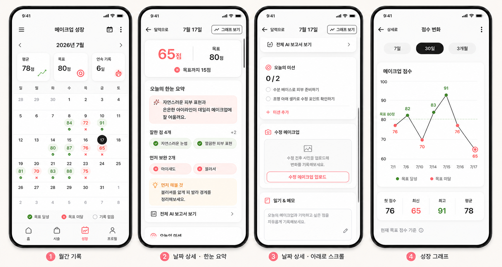

# 메이크업 성장 캘린더 구현 기획서

> 상태: 구현 기준안 · 2026-07-17
> UI 명칭: **메이크업 성장** · 내부 명칭: **MakeupJourney**
> 범위: 신규 캘린더/스크롤형 날짜 상세/성장 그래프, 기존 피드백 요약 연결, 미션·메모, 수정 피드백, 플로팅 퀵 액션 위치 이동

## 1. 한 줄 정의

사용자가 홈이나 퀵 액션에서 받은 메이크업 피드백을 날짜별 성장 기록으로 자동 축적하고, 목표 점수·AI 피드백·미션·메모·수정 피드백을 한 화면에서 이어 보는 데일리 루프를 만든다.

## 2. 확정 원칙

- 기존 홈, 피드백 촬영/업로드, 추천, AR, 프로필 화면의 디자인은 바꾸지 않는다.
- 새로 디자인·구현하는 화면은 `메이크업 성장` 월간 캘린더와 날짜 상세다.
- 캘린더만의 핑크·블러시 계열 포인트 색을 새로 만들지 않는다. 색상, 배경, 카드, 텍스트, 선택 상태는 현재 앱의 기존 테마 토큰과 실제 운영 화면을 그대로 따른다.
- 하단 바에는 프로필 바로 왼쪽에 `성장` 탭을 추가한다.
- 기존 `/feedback/jobs`로 완료된 피드백이 캘린더의 단일 원천이다. 캘린더 전용 점수 복제 테이블을 만들지 않는다.
- 하루 대표 점수는 그날의 **가장 최근 완료 피드백 점수**이며, 상세에서는 최초 점수와 최신 점수의 변화량도 보여 준다.
- 성공/실패는 `최신 점수 >= 현재 목표 점수`로 조회 시점에 계산한다. 목표 점수를 바꾸면 과거 날짜도 새 기준으로 즉시 재평가한다.
- 첫 캘린더 진입 때 개인 목표 점수(1–100)와 미션 난이도(초급/중급/고급)를 받는다. 난이도는 사용자 실력 등급이 아니라 미션 난이도다.
- 수정 메이크업은 기존 피드백 흐름을 재사용하고 원본 리포트와 같은 날짜에 연결한다. 기존 피드백 목표 문맥은 상속해 목표 입력 화면을 건너뛴다.
- 월간 셀은 점수와 상태만 표시하고, 날짜 상세의 첫 카드에는 최신 원본 리포트를 규칙 기반으로 줄인 `한눈 요약`을 표시한다.
- `한눈 요약`은 새 AI 호출이나 별도 판정을 하지 않는다. 기존 리포트의 점수·요약·강점·보완점·행동 단계를 그대로 추출해 원문과 일치시킨다.
- 날짜 상세는 한 화면에 모든 정보를 축소하지 않고 세로 스크롤 카드 구조로 만든다. 상단의 `달력으로`와 `그래프 보기`는 스크롤 위치와 무관하게 유지한다.
- 퀵 액션은 짧게 누르면 메뉴, 약 400ms 길게 누르면 드래그다. 안전 영역 안의 임의 위치를 로컬에 저장한다.

## 3. 목표와 비목표

### 목표

1. 사용자가 별도 기록 작업 없이 기존 피드백 결과를 달력에서 찾는다.
2. 점수만 보여 주지 않고 개선 포인트와 실행 가능한 미션으로 다음 행동을 만든다.
3. 수정 화장 전후를 같은 날짜 기록으로 묶어 성장 체감을 제공한다.
4. 월간 조회는 빠르고, 날짜 상세는 긴 원본 보고서를 한눈 요약과 전체 보고서 링크로 나눠 제공한다.
5. 기능 실패가 기존 피드백 생성이나 홈 사용을 막지 않는다.

### 비목표

- 기존 화면의 정보 구조·스타일 전면 개편
- 캘린더에서 새로운 AI 채점 엔진 구현
- 소셜 랭킹, 친구 비교, 공개 일기
- 푸시 알림과 연속 기록 보상 시스템(후속 실험)
- 사용자가 설정한 원본 목표 점수의 날짜별 스냅샷 저장(현재 기준으로 전체 재평가)

## 4. 레퍼런스 해석과 신규 목업

운동 앱 레퍼런스에서 가져오는 것은 넓은 월간 격자, 날짜별 상태를 한눈에 구분하는 방식, 선택 날짜의 상세 진입 구조다. 영양소·생리 주기·체중 대시보드 등 앱과 무관한 정보는 가져오지 않는다. 캘린더 셀은 점수와 성공/실패만 담고, 긴 피드백과 미션은 날짜 상세로 분리한다.



> **색상 주의:** 목업에 보이는 핑크 계열은 레이아웃과 정보 위계를 구분하기 위한 예시일 뿐 실제 앱 색상안이 아니다. 구현 시 목업의 색상 값을 추출하거나 복사하지 말고, 현재 앱에서 사용 중인 배경·카드·텍스트·선택·성공·실패 테마 토큰을 그대로 적용한다.

목업은 화면 구조와 정보 우선순위를 설명하는 방향성 자료다. 실제 구현은 현재 운영 화면의 색감, 기존 테마 토큰, 하단 바 높이, Safe Area, 접근성 글자 크기를 우선하며 새 기능 전용 브랜드 색이나 새 UI·아이콘 라이브러리를 추가하지 않는다.

## 5. 핵심 사용자 흐름

### 5.1 최초 진입

1. 하단 `성장` 탭을 누른다.
2. `GET /makeup-journey/settings` 결과가 없으면 설정 바텀시트를 연다.
3. 사용자가 목표 점수(1–100)와 미션 난이도를 선택한다.
4. 저장 성공 후 현재 월을 로드한다. 저장 실패 시 입력값을 유지하고 재시도한다.

### 5.2 기존 피드백의 자동 기록

1. 사용자는 기존 홈/퀵 액션에서 평소처럼 피드백을 시작한다.
2. `/feedback/jobs` 생성 시 기기 로컬 날짜 `entryDate`와 일반 피드백 종류 `initial`을 함께 보낸다.
3. 작업이 완료되면 `makeup_feedback_reports`의 점수와 결과 payload가 그대로 캘린더 데이터가 된다.
4. 사용자가 나중에 성장 탭을 열면 별도 저장 버튼 없이 해당 날짜가 표시된다.
5. 미완료·실패·점수 없는 리포트는 캘린더 대표 점수에서 제외한다.

### 5.3 날짜 확인과 수정 피드백

1. 점수가 있는 날짜를 누르면 날짜 상세를 연다.
2. 최초·최신 점수, 변화량과 최신 리포트의 `한눈 요약`을 먼저 읽는다.
3. 더 자세한 근거가 필요하면 `전체 AI 보고서 보기`, 기간별 변화를 보려면 `그래프 보기`를 누른다.
4. 아래로 스크롤해 미션, 수정 메이크업, 일기 & 메모를 확인한다.
5. `수정 메이크업 업로드`를 누르면 기존 카메라/앨범 선택 흐름으로 이동한다.
6. 선택한 날짜와 최초 리포트 ID, 상속할 피드백 목표 문맥을 네비게이션 컨텍스트에 넣는다.
7. 목표 입력 화면을 생략하고 기존 분석·폴링·결과 화면을 사용한다.
8. 완료된 수정 리포트는 같은 `entryDate`에 `feedbackKind=correction`으로 저장되고 상세·그래프가 갱신된다.

### 5.4 기록이 없는 날짜

- 미래 날짜는 조회만 허용하고 피드백 생성 CTA를 숨긴다.
- 오늘 또는 과거의 빈 날짜는 `아직 피드백 기록이 없어요`와 `피드백 받기` CTA를 보여 준다.
- 메모와 사용자 미션은 기록이 없는 과거/오늘에도 저장할 수 있다.

## 6. 화면 명세

### 6.1 월간 캘린더 `MakeupJourneyTab`

| 영역 | 내용 | 동작 |
|---|---|---|
| 헤더 | 메이크업 성장, 이전/다음 월 | 월 변경 시 월 API 재조회 |
| 요약 | 월 평균, 현재 목표, 연속 기록 | 완료된 대표 점수만 집계 |
| 요일/격자 | 일–토, 6주 고정 격자 | 월 바깥 날짜는 흐리게 표시 |
| 날짜 셀 | 날짜, 최신 점수, 성공/실패 | 탭 시 날짜 상세 |
| 범례 | 목표 달성, 목표 미달, 기록 없음 | 색 외에 체크/실패 표식 병행 |
| 설정 | 목표 점수·미션 난이도 수정 | 저장 후 전체 월 재평가/갱신 |

상태 규칙:

- `success`: 최신 점수가 현재 목표 이상
- `failure`: 최신 점수가 현재 목표 미만
- `empty`: 완료 점수 없음
- `selected`: 테두리/배경으로 선택 표시하되 성공 색을 가리지 않음
- 월 평균은 날짜별 최신 점수의 산술평균을 반올림한다.
- 연속 기록은 오늘부터 역방향으로 `entryDate`가 연속된 날짜 수다. 오늘 기록이 없으면 어제부터 계산한다.
- 접근성 라벨 예: `7월 17일, 84점, 목표 달성, 피드백 2개`.

### 6.2 날짜 상세 `MakeupJourneyDayDetail`

화면은 고정 헤더와 하나의 세로 `ScrollView`로 구성한다. 고정 헤더는 왼쪽 `달력으로`, 가운데 날짜, 오른쪽 `그래프 보기`다. 뒤로 갈 스택이 있으면 `goBack()`, 딥링크 등으로 스택이 없으면 해당 월의 `MakeupJourneyTab`으로 이동한다.

스크롤 노출 순서:

1. 날짜, 성공/실패, 목표 점수
2. 최초 → 최신 점수와 변화량
3. 최신 AI 피드백 `오늘의 한눈 요약`
4. 오늘의 미션
5. 수정 메이크업
6. 일기 & 메모

첫 화면에는 1–3만 온전히 보이고 다음 카드 상단이 살짝 보이게 한다. 미션·수정 업로드·메모를 한 뷰포트에 맞추려고 카드나 글자를 줄이지 않는다.

`오늘의 한눈 요약` 표시 순서:

1. `score`와 현재 목표 기준 달성/미달
2. `summary.strengthSummary` 한 줄 총평, 없으면 `scoreReason`
3. `strengths`의 제목 최대 2개와 전체 개수
4. `points`의 제목 최대 2개와 전체 개수
5. 첫 보완점의 `actionSteps[0]`, 없으면 `description`을 `먼저 해볼 것`으로 표시
6. `전체 AI 보고서 보기`로 기존 `MakeupFeedbackResult(reportId)` 이동

요약은 **최신 완료 리포트**를 기준으로 서버가 읽기 시점에 만든다. 새 모델 호출, 새 점수 산정, 요약문 DB 복제는 하지 않는다. 과거 리포트에 일부 필드가 없으면 존재하는 항목만 렌더링한다.

세부 규칙:

- 리포트가 하나면 `최초 84 · 최신 84`, 변화량은 숨긴다.
- 리포트가 둘 이상이면 `최초 76 → 최신 84 (+8)`을 표시한다.
- 월간 셀에는 긴 글을 넣지 않는다. 점수·성공/실패만 표시하고 정리된 글은 날짜 상세에서 제공한다.
- `전체 AI 보고서 보기`는 기존 `MakeupFeedbackResult`로 최신 `reportId`를 전달한다.
- 수정 CTA는 최신 완료 리포트를 부모로 사용하되 모든 수정은 같은 최초 기록 체인에 묶는다.
- 메모는 2,000자 제한, 자동 저장이 아닌 명시적 저장 방식으로 중복 요청을 줄인다.
- 미션 완료 체크는 낙관적으로 반영하고 실패 시 원복과 토스트를 표시한다.
- 상세 고정 헤더는 스크롤 콘텐츠 바깥에 두고, 스크롤 복귀 시 이전 offset을 세션 동안 보존한다.

### 6.3 성장 그래프 `MakeupJourneyTrend`

- 상세 상단의 `그래프 보기`로 진입하고 `상세로`로 선택 날짜 상세에 돌아간다.
- 범위는 `7일`, `30일`, `3개월`이며 기본은 30일이다.
- 날짜별 최신 완료 점수를 선으로 연결하고, 현재 목표 점수를 수평 점선으로 표시한다.
- 목표 이상 점은 성공 색, 미만 점은 실패 색을 사용하되 각 점수 숫자와 접근성 라벨을 함께 제공한다.
- 하단에는 첫 점수, 최신 점수, 최고 점수, 평균 점수를 보여 준다.
- 목표 변경 시 그래프의 점수 값은 유지하고 상태 색과 목표선만 새 기준으로 바뀐다.
- 별도 차트 의존성을 추가하지 않고 기존 `react-native-svg`의 `Path`, `Line`, `Circle`, `Text`로 구현한다.
- 기록 0개는 빈 상태, 1개는 단일 점, 2개 이상은 선 그래프로 렌더링한다.

### 6.4 설정 바텀시트

- 목표 점수: 숫자 입력 + 1점 단위 스테퍼, 허용 범위 1–100
- 미션 난이도: 초급/중급/고급 단일 선택
- 변경 안내: `목표 점수를 바꾸면 지난 기록의 성공 여부도 새 기준으로 바뀌어요.`
- 닫기: 최초 설정 전에는 저장 완료 전 닫아도 빈 캘린더를 읽기 전용으로 볼 수 있게 하되 상단에 설정 CTA 유지

## 7. 모바일 구조

### 7.1 파일 경계

```text
apps/mobile/src/features/makeup-journey/
├── components/
│   ├── JourneyCalendarGrid.tsx
│   ├── JourneyDayCell.tsx
│   ├── JourneyMonthSummary.tsx
│   ├── JourneyFeedbackDigestCard.tsx
│   ├── JourneyScoreChart.tsx
│   ├── JourneyMissionCard.tsx
│   └── JourneySettingsSheet.tsx
├── screens/
│   ├── MakeupJourneyScreen.tsx
│   ├── MakeupJourneyDayDetailScreen.tsx
│   └── MakeupJourneyTrendScreen.tsx
├── services/makeupJourneyService.ts
├── hooks/useMakeupJourneyMonth.ts
├── types.ts
└── *.test.ts(x)
```

- `MainTabParamList`에 `MakeupJourneyTab`을 추가한다.
- `FooterTabKey`와 `APP_FOOTER_TAB_ORDER`는 `home → consulting → journey → profile` 순서로 확장한다.
- 날짜 상세는 루트 스택 `MakeupJourneyDayDetail: {entryDate: string}`로 둔다.
- 그래프는 루트 스택 `MakeupJourneyTrend: {entryDate: string; range?: '7d'|'30d'|'90d'}`로 둔다.
- 수정 피드백 컨텍스트는 기존 flow state에 `entryDate`, `feedbackKind`, `parentFeedbackReportId`, `inheritedGoalContext`를 추가하고 완료/취소 시 반드시 초기화한다.
- API 호출은 `requestBackendJson`; 사진 업로드는 기존 `uploadFaceCaptureImage`와 `mediaKind: 'makeup_feedback'`을 재사용한다.
- 서버 상태는 화면 로컬 캐시 + 포커스 재검증으로 시작한다. 새 데이터 라이브러리는 추가하지 않는다.

### 7.2 캘린더 계산 책임

- 달력 주차/날짜 배열 생성과 표시 로케일은 모바일 담당이다.
- 점수 대표값, 성공/실패, 월 평균, 연속 기록은 서버가 계산해 모든 클라이언트에 같은 결과를 준다.
- 날짜 문자열은 API 경계에서 `YYYY-MM-DD`, 월은 `YYYY-MM`만 허용한다.
- 서버의 `date`를 JS `Date`로 자정 파싱하지 않고 문자열 키로 유지해 시간대 하루 밀림을 막는다.

## 8. 플로팅 퀵 액션 UX

캘린더 목업 범위에는 포함하지 않지만 기존 요구 범위로 구현한다. 기존 메뉴 항목/화면 디자인은 유지하고 버튼의 제스처와 위치 저장만 바꾼다.

- 기본 메뉴는 `메이크업 추천`, `피드백`, `AR 필터` 최대 3개이며 기존 설정 화면에서 교체한다.
- 터치 종료가 400ms 미만이고 이동 8pt 미만이면 메뉴를 토글한다.
- 400ms 이상 누르면 드래그 모드로 전환하고 메뉴가 열려 있었다면 닫는다.
- 위치는 `{xRatio, yRatio}`(0–1 정규화)로 `AsyncStorage` 키 `aura.floatingActionAnchor.v1`에 저장한다.
- 실제 좌표는 상단 Safe Area, 화면 가장자리, 하단 바, 확장 메뉴 크기를 고려해 clamp한다.
- 회전/화면 크기 변경 후 정규화 좌표를 재계산하고 다시 clamp한다.
- 임의 위치를 허용하므로 강제 좌우 스냅은 하지 않는다.
- 메뉴는 버튼이 위치한 사분면의 반대 방향으로 펼쳐 화면 밖으로 나가지 않게 한다.
- 저장 실패 시 세션 메모리 위치는 유지하고 앱 재시작 때 기본 우하단으로 폴백한다.
- 접근성 모드에서는 `빠른 실행 위치 이동` 액션과 상/하/좌/우 이동 단계를 제공한다.

## 9. 백엔드 데이터 모델

### 9.1 기존 리포트 확장

`makeup_feedback_reports`에 다음 컬럼을 추가한다.

| 컬럼 | 타입 | 규칙 |
|---|---|---|
| `entry_date` | `date` | 사용자가 기록으로 인식하는 로컬 날짜 |
| `feedback_kind` | `text` | `initial` 또는 `correction`, 기본 `initial` |
| `parent_feedback_report_id` | `uuid` | 수정 피드백의 부모 리포트, self FK |

제약/인덱스:

- `check (feedback_kind in ('initial', 'correction'))`
- `check (parent_feedback_report_id is null or parent_feedback_report_id <> id)`
- `initial`은 부모가 없어야 하고 `correction`은 부모가 있어야 함을 API와 DB 체크로 검증
- 인덱스 `(user_id, entry_date, status, completed_at, id)`
- 부모 리포트는 같은 사용자 소유이고 완료 상태여야 하며, 수정 리포트는 부모의 `entry_date`를 강제로 사용
- 기존 행은 `COALESCE(completed_at, created_at) AT TIME ZONE 'Asia/Seoul'`의 날짜로 backfill한 뒤 `entry_date not null`로 전환

### 9.2 신규 테이블

`makeup_journey_settings`

- `user_id uuid primary key references users(id) on delete cascade`
- `goal_score smallint not null check (goal_score between 1 and 100)`
- `mission_level text not null check (mission_level in ('beginner','intermediate','advanced'))`
- `timezone_name text not null default 'Asia/Seoul'`
- `created_at`, `updated_at`

`makeup_journey_day_notes`

- `id uuid primary key`, `user_id` FK, `entry_date date`, `content text`
- `check (char_length(content) <= 2000)`
- `unique (user_id, entry_date)`, `created_at`, `updated_at`

`makeup_journey_missions`

- `id uuid primary key`, `user_id` FK, `entry_date date`
- `source text check (source in ('curated','ai','user'))`
- `difficulty text check (difficulty in ('beginner','intermediate','advanced'))`
- `title text`, `is_completed boolean default false`, `completed_at timestamptz`
- `sort_order smallint default 0`, `generation_payload jsonb default '{}'`, `created_at`, `updated_at`
- 제목 1–120자, `is_completed=false`이면 `completed_at is null`
- 인덱스 `(user_id, entry_date, sort_order)` 및 대소문자 무시 일별 중복 방지 인덱스

스키마 변경 시 `docs/backend/schema.sql`, `docs/backend/aws-postgresql-schema.dbml`, `app/db/init_db.py`, `app/db/check_schema.py`를 한 커밋 단위로 함께 갱신한다.

## 10. API 계약

모든 응답은 기존 `success()` envelope와 camelCase 직렬화를 따른다. 쓰기는 인증과 DB 연결이 필수다.

### 설정

```http
GET /makeup-journey/settings
```

```json
{"settings": null, "requiresOnboarding": true}
```

```http
PUT /makeup-journey/settings
Content-Type: application/json

{"goalScore": 80, "missionLevel": "beginner", "timezoneName": "Asia/Seoul"}
```

### 월간 조회

```http
GET /makeup-journey/calendar?month=2026-07
```

```json
{
  "month": "2026-07",
  "goalScore": 80,
  "summary": {"averageScore": 82, "recordedDays": 10, "currentStreak": 6},
  "days": [
    {
      "date": "2026-07-17",
      "status": "success",
      "firstScore": 76,
      "latestScore": 84,
      "scoreDelta": 8,
      "reportCount": 2,
      "hasNote": true,
      "missionSummary": {"completed": 1, "total": 2}
    }
  ]
}
```

### 날짜 상세

```http
GET /makeup-journey/days/2026-07-17
```

응답은 `date`, `status`, `goalScore`, `firstScore`, `latestScore`, `scoreDelta`, `feedbackDigest`, 시간순 최소 정보 `reports`, `missions`, `note`를 포함한다. 다른 사용자 리포트 ID나 날짜는 404로 숨긴다.

```json
{
  "date": "2026-07-17",
  "goalScore": 80,
  "latestScore": 65,
  "status": "failure",
  "feedbackDigest": {
    "reportId": "uuid",
    "headline": "자연스러운 피부 표현과 은은한 아이라인이 데일리 메이크업에 잘 어울려요.",
    "strengthCount": 4,
    "strengths": ["자연스러운 눈썹", "깔끔한 피부 표현"],
    "improvementCount": 2,
    "improvements": ["아이섀도", "블러셔"],
    "nextAction": "블러셔를 얇게 펴 발라 경계를 정리해보세요."
  }
}
```

`feedbackDigest`는 `feedback_payload.result`에서 allow-list 필드만 읽어 조립한다. 전체 리포트 payload와 이미지 URL을 월간 응답에 싣지 않는다.

### 성장 그래프

```http
GET /makeup-journey/trends?range=30d&endDate=2026-07-17
```

```json
{
  "range": "30d",
  "goalScore": 80,
  "points": [
    {"date": "2026-07-01", "score": 76, "status": "failure"},
    {"date": "2026-07-17", "score": 65, "status": "failure"}
  ],
  "summary": {"firstScore": 76, "latestScore": 65, "highestScore": 91, "averageScore": 78}
}
```

- 범위는 `7d|30d|90d`, `endDate` 기본값은 설정 시간대의 오늘이다.
- 각 날짜의 최신 완료 점수만 포함하며 빈 날짜를 0점으로 채우지 않는다.

### 메모와 미션

```http
PUT    /makeup-journey/days/{date}/note
POST   /makeup-journey/days/{date}/missions/generate
POST   /makeup-journey/days/{date}/missions
PATCH  /makeup-journey/missions/{missionId}
DELETE /makeup-journey/missions/{missionId}
```

- note body: `{"content":"..."}`; 빈 문자열은 메모 삭제와 동일하게 처리한다.
- generate body: `{"count":2}`; 최대 3개, 같은 날짜 중복 제목 제외.
- mission create body: `{"title":"아이라인 꼬리 2mm 짧게 연습하기"}`.
- mission patch body: `{"isCompleted":true}` 또는 제목 수정. AI/기본 미션 제목 수정은 새 사용자 미션으로 복제하지 않고 해당 행을 수정한다.

### 기존 피드백 생성 확장

```json
{
  "entryDate": "2026-07-17",
  "feedbackKind": "correction",
  "parentFeedbackReportId": "uuid",
  "photoCaptureId": "uuid",
  "uploadedMediaId": "uuid",
  "requestPayload": {"feedbackContext": {}},
  "runImmediately": true,
  "source": "camera"
}
```

- 일반 피드백은 `feedbackKind=initial`, 부모 `null`.
- 수정 피드백은 서버가 부모 리포트의 날짜와 목표 문맥을 신뢰 가능한 값으로 덮어쓴다.
- 클라이언트 날짜가 서버 기준 오늘과 크게 어긋나면(기본 ±1일 초과) 422로 거절한다. 날짜 상세에서 시작한 과거 수정 피드백은 부모 날짜 상속이므로 예외다.

## 11. 미션 생성 정책

하이브리드 방식을 사용한다.

1. **기본 풀:** 난이도별 검수된 미션을 DB 또는 버전 관리된 상수로 제공한다.
2. **AI 개인화:** 최근 완료 피드백의 약점 주제, 최신 점수, 이미 완료한 미션을 짧은 구조화 입력으로 전달한다.
3. **사용자 추가:** 사용자가 개인 미션을 자유롭게 만든다.

우선순위는 `사용자 미션 → AI 미션 → 기본 미션`이 아니라 화면에서 생성 시점을 보존한 `sortOrder`를 따른다. AI 호출이 실패하거나 최근 피드백이 없으면 같은 난이도의 기본 풀로 즉시 폴백하고 캘린더/상세 로딩을 막지 않는다. 원본 얼굴 사진 URL과 메모 내용은 미션 생성 프롬프트에 보내지 않는다.

## 12. 오류·동시성·보안

- 월간 GET은 캘린더 데이터가 없어도 200과 빈 `days`를 반환한다. DB 자체가 없을 때의 폴백은 기존 환경 정책을 따르되 인증 오류는 숨기지 않는다.
- 메모 upsert와 미션 patch는 서버 `updatedAt`을 반환한다. MVP에서는 마지막 쓰기 우선으로 하고 UI는 저장 완료 시간을 표시하지 않는다.
- 월간 쿼리는 N+1 없이 리포트·미션·메모를 월 범위 집계한다.
- 모든 report/mission/note 조회와 쓰기는 `user_id` 소유권을 조건에 포함한다.
- AI 미션 payload에는 최소한의 텍스트 요약만 보관하고 원본 이미지·presigned URL은 저장하지 않는다.
- 계정 삭제 cascade와 미디어 삭제 서비스가 self FK 때문에 막히지 않는지 테스트한다.

## 13. 우선순위별 마일스톤

| 순서 | 우선순위 | 마일스톤 | 선행 | 완료 조건 |
|---:|---|---|---|---|
| M0 | P0 | 계약·마이그레이션 고정 | 없음 | OpenAPI 모델, SQL/DBML, backfill, schema check가 일치 |
| M1 | P0 | 기존 피드백 날짜 연결 | M0 | 홈/퀵 액션의 새 완료 리포트가 올바른 `entryDate`로 저장 |
| M2 | P0 | 설정·월간·상세·그래프 API | M0 | 대표 점수/요약/변화량/재평가/소유권 테스트 통과 |
| M3 | P0 | 성장 탭·월간·그래프 UI | M2 | 온보딩, 월 이동, 범위 전환, 로딩/빈/오류 구현 |
| M4 | P0 | 스크롤형 날짜 상세·수정 피드백 루프 | M1–M3 | 한눈 요약/복귀/그래프 진입, 부모 연결, 결과 후 갱신 |
| M5 | P1 | 메모·하이브리드 미션 | M2 | CRUD, AI 폴백, 중복 방지, 완료 체크 구현 |
| M6 | P1 | 퀵 액션 자유 배치 | M3와 병렬 가능 | 탭/롱프레스 구분, clamp, 로컬 복원, 접근성 동작 |
| M7 | P0 | 통합 QA·점진 배포 | M1–M6 | 실제 기기 회귀, 성능·분석 이벤트·롤백 준비 |

### M0 — 데이터 계약과 마이그레이션

- nullable 컬럼 추가 → 기존 데이터 backfill → 제약/인덱스 추가의 순서로 배포한다.
- KST 경계(23:59/00:00), 같은 시각 ID tie-break, 실패 리포트 제외를 SQL 테스트로 고정한다.
- 롤백은 새 API/탭 feature flag 비활성화를 우선하고 기존 컬럼은 즉시 삭제하지 않는다.

### M1–M2 — 백엔드 핵심

- `FeedbackJobCreate`와 INSERT/정규화 응답에 새 필드를 추가한다.
- 월간 집계는 `row_number()` 또는 `distinct on`으로 날짜별 최초/최신을 결정한다.
- 한눈 요약 빌더는 기존 리포트의 allow-list 필드만 읽고 항목 수/길이를 제한한다. 새 AI 호출은 금지한다.
- 그래프 API는 월간 집계와 같은 날짜별 최신 점수 CTE를 재사용한다.
- 목표 변경 전후 동일 월을 조회해 상태만 재평가되고 점수는 변하지 않는지 검증한다.
- 날짜 상세의 latest report payload가 기존 결과 화면 매퍼와 호환되는지 계약 테스트를 둔다.

### M3–M4 — 모바일 핵심

- 네비게이션/하단 바를 먼저 연결하되 API 실패가 다른 탭 렌더링을 막지 않게 한다.
- 월 캐시는 `YYYY-MM` 키로 분리하고 설정 변경·피드백 완료·미션/메모 저장 뒤 관련 월/일을 무효화한다.
- 상세는 고정 헤더 + 단일 `ScrollView`로 만들고 카드별 최소 높이·여백을 지켜 한 화면 압축을 금지한다.
- `달력으로`와 그래프의 `상세로`는 일반 진입과 딥링크 진입 모두에서 안전한 fallback route를 가진다.
- 수정 피드백을 취소하거나 실패했을 때 컨텍스트가 다음 일반 피드백에 남지 않는지 테스트한다.
- 이미지의 핑크 색감은 구현 대상이 아니다. 현재 앱 화면에서 실제 사용 중인 테마 토큰만 사용하고 하드코딩 색이나 캘린더 전용 accent를 만들지 않는다.

### M5–M6 — 유지 사용성

- AI 미션은 응답 스키마 검증 후 저장하며 생성 중에도 기존 미션을 보여 준다.
- 퀵 액션은 기존 메뉴 내용과 설정 화면을 보존하고 좌/우 enum 저장값을 새 정규화 좌표로 1회 마이그레이션한다.
- 드래그 중 스크롤/탭 오작동, 작은 화면, 큰 글자, VoiceOver를 실제 기기에서 확인한다.

### M7 — 배포

- 서버 스키마/API를 먼저 배포하고, 구버전 앱 요청은 기본 `initial`과 서버 날짜로 계속 수용한다.
- 모바일 탭은 원격 플래그 또는 빌드 플래그로 단계적으로 노출한다.
- 치명 지표: 월간 API 5xx, 캘린더 진입 실패, 수정 리포트 부모 불일치, 피드백 생성 성공률 하락.

## 14. 테스트 매트릭스

### 백엔드

- 설정 1/100 경계와 잘못된 난이도 422
- 월 초/말, 윤년, KST 날짜 경계
- 하루 1개/여러 개/동점/실패 포함 리포트의 최초·최신 계산
- 현재/과거 리포트 payload의 한눈 요약 매핑과 누락 필드 폴백
- 그래프 0/1/복수 점, 7d/30d/90d 경계와 목표 변경 상태 색
- 목표 변경 시 전체 과거 성공/실패 재평가
- 다른 사용자 report/mission/note 접근 차단
- 수정 리포트의 부모 소유권, 날짜·목표 문맥 상속
- 메모 upsert/삭제, 미션 중복/완료 일관성, AI 폴백

### 모바일

- 탭 순서와 접근성 라벨, 선택 상태
- 첫 진입 설정, 빈 월, 기록 월, API 오류와 재시도
- 월 변경 중 늦게 도착한 응답이 현재 월을 덮지 않음
- 날짜 상세 단일/복수 리포트 렌더링
- 날짜 상세 스크롤, 고정 헤더, 달력 복귀, 전체 보고서/그래프 이동 및 복귀
- 큰 글자에서도 한눈 요약 카드가 잘리지 않고 세로로 확장됨
- 수정 흐름 성공/실패/취소 후 컨텍스트 정리
- 퀵 액션 짧은 탭, 400ms 롱프레스, 가장자리 clamp, 재실행 위치 복원

### 실제 기기

- iOS Simulator/에뮬레이터를 사용하지 않고 WiFi 연결 물리 iPhone에서 확인한다.
- 작은 화면·큰 글자·VoiceOver·다크 모드 지원 범위를 현재 앱 정책에 맞춰 확인한다.
- 하단 Safe Area와 성장 탭/퀵 액션이 겹치지 않는지 세로 화면에서 검증한다.

## 15. 분석 이벤트와 성공 지표

개인 식별 정보나 메모 본문 없이 다음 이벤트만 전송한다.

- `makeup_journey_opened` — month, hasRecords
- `makeup_journey_day_opened` — hasReport, reportCount, status
- `makeup_journey_settings_saved` — goalScore, missionLevel
- `makeup_journey_mission_completed` — source, difficulty
- `makeup_journey_correction_started/completed` — scoreDelta(완료 시)
- `floating_action_repositioned` — normalized quadrant만 전송

초기 성공 지표는 캘린더 주간 재방문율, 사용자당 기록 일수, 수정 피드백 완료율, 미션 완료율이다. 점수 상승 자체는 모델 변동의 영향을 받으므로 단독 KPI로 사용하지 않는다.

## 16. 완료 정의

- 기존 홈/피드백 UI의 시각 회귀가 없다.
- 기존과 신규 피드백이 별도 저장 조작 없이 올바른 날짜에 나타난다.
- 현재 목표 점수로 과거 상태가 일관되게 재평가된다.
- 날짜 상세에서 원본과 일치하는 한눈 요약을 읽고 전체 보고서로 이동할 수 있다.
- 스크롤형 날짜 상세에서 점수·수정 리포트·미션·메모를 조회/변경하고 그래프로 기간 변화를 볼 수 있다.
- 수정 피드백은 같은 날짜와 부모 리포트에 연결되고 기존 목표 문맥을 상속한다.
- API/DB/mobile 계약 테스트와 모바일 typecheck가 통과한다.
- 물리 iPhone에서 월 이동, 상세 진입, 수정 업로드, 퀵 액션 이동까지 한 번의 시나리오로 검증한다.
