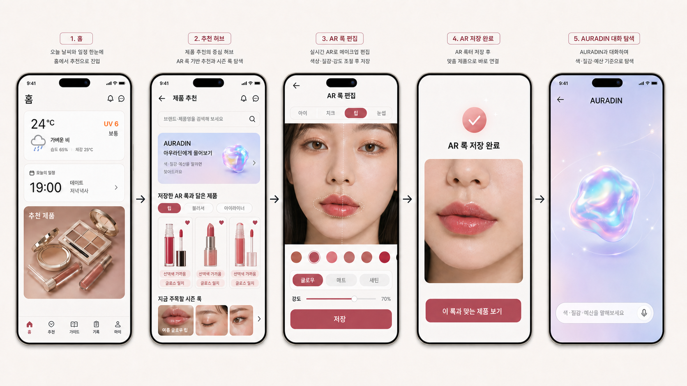
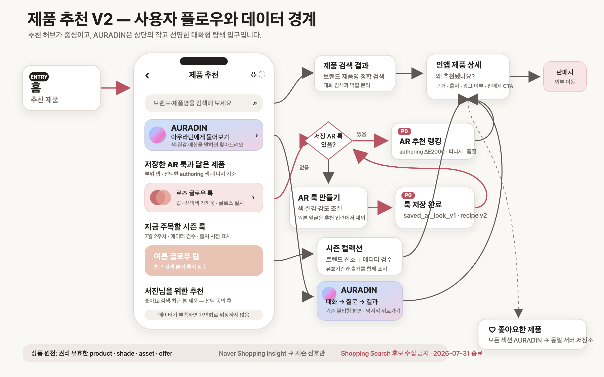

# 02. UX와 앱 플로우

## UX 목표

사용자는 3초 안에 다음 세 가지를 구분할 수 있어야 한다.

1. 정확한 제품명을 찾는 검색
2. 저장한 AR 룩과 닮은 제품을 보는 추천
3. 말로 취향을 탐색하는 AURADIN

추천 허브는 결과만 나열하는 쇼핑몰 홈이 아니라 `내가 만든 룩 → 근거 있는 제품 → 필요하면 대화형 탐색`으로 이어지는 뷰티 가이드여야 한다.

## 홈 진입 기준

현재 홈은 hero 영역 아래 8개 기능 카테고리 grid를 가진다. 이 중 `추천 제품` 카테고리를 누르면 바로 AURADIN fullscreen hero가 아니라 `ProductRecommendation` 제품 추천 허브로 이동한다.

가져갈 기존 화면 자산:

- 상단 route chrome과 홈에서 쓰는 알림/채팅 icon action
- 기준 보고서 chip/list
- 추천 기준 이미지 또는 룩 summary card
- 제품 카테고리 tab과 정렬 메뉴
- 2열 제품 카드 grid/list, 색상 팔레트, 구매 링크, 좋아요 버튼
- 기존 loading/empty/retry 흐름

새로 추가할 것:

- 제품 검색 영역
- 제품 허브 위 AURADIN edge-snapped jelly orb
- 저장한 AR 룩과 닮은 제품 section
- 시즌 추천 상품 section
- 이후 개인화/코호트 section

따라서 AURADIN 디자인 이미지는 별도 route의 참고이고, 홈의 `추천 제품` 도착 화면을 대체하는 기준 시안이 아니다.

## 정보 구조

```text
상단바
  뒤로가기 | 제품 추천 | 알림 | 채팅

제품 검색
  브랜드·제품명 exact search

AURADIN 카드
  색·질감·예산을 말로 탐색하는 별도 경험

저장한 AR 룩과 닮은 제품 (P0)
  최근 저장 룩 / 룩 변경 / 제품 가로 rail

지금 주목할 시즌 룩 (P0)
  기간·출처·검수 시점 / 컬렉션 카드

서진님을 위한 추천 (P1)
  동의한 좋아요·검색·클릭 기반

비슷한 컬러 취향이 좋아해요 (P2)
  충분한 익명 집계 표본이 있을 때만
```

이 순서는 AR와 시즌을 1차 목표로 삼되 AURADIN 진입을 찾기 어렵게 만들지 않는 절충안이다.

## 기존 콘셉트 이미지 (보관용)



이 이미지는 초기 compact-card 콘셉트를 기록한 보관용 자산이다. 최종 배치와 구현은 아래 명세가 아니라 `00-product-recommendation-implementation-plan.md`의 edge-snapped jelly orb를 따른다.

초기 이미지가 표현한 장면은 다음과 같다.

1. 홈의 추천 제품 진입
2. 추천 허브
3. 실제 카메라 위 AR 룩 편집: 부위·색·피니시·강도
4. 저장 완료 후 `이 룩과 맞는 제품 보기`
5. AURADIN 대화형 탐색

이미지 생성은 내장 이미지 생성 모드를 사용했다. 첨부된 화이트보드 2장, 기존 앱 콘셉트 자산, 기존 AURADIN hero 자산을 시각 참고로 삼았다. 이미지 안의 작은 글자는 디자인 분위기 참고용이며 아래 정확한 명세가 구현 기준이다.

### 이미지 생성 프롬프트 기록

> 아래 프롬프트와 이미지는 초기 compact-card 콘셉트 기록이다. 최종 구현 기준은 이 문서의 edge-snapped jelly orb 명세와 `00-product-recommendation-implementation-plan.md`다.

> Edit a premium Korean beauty-tech five-screen iPhone UX presentation while preserving the off-white, black, blush/lilac art direction. Screen 1 is Home with its bottom tab. Screen 2 is the Product Recommendation detail hub with 제품 추천 header, search, compact AURADIN card, AR products and seasonal products; its AR rail must show region chips 립(selected)/블러셔/아이라이너 and only lip tint, lipstick and lip gloss products for the selected rail; remove bottom tabs from screens 2–5. Screen 3 must be a true AR makeup editor with a live face preview, selected 립 region, color swatches, 글로우/매트/새틴 choices, 강도 slider and 저장 button—no product cards. Screen 4 is AR 룩 저장 완료 with 이 룩과 맞는 제품 보기. Screen 5 is AURADIN conversational discovery with explicit back and prompt 색·질감·예산을 말해보세요. Keep Korean copy legible. Do not add real brands, celebrities, fake match percentages, cyberpunk styling, floating assistant buttons or extra screens.

## 정확한 사용자·데이터 플로우



편집 가능한 원본은 [product-recommendation-system-flow.svg](assets/product-recommendation-system-flow.svg)다.

## AURADIN 배치 검토

| 대안 | 장점 | 문제 | 판단 |
| --- | --- | --- | --- |
| 검색 아래 compact card | 첫 화면에서 발견 가능, 검색과 역할 비교가 쉬움 | 세로 공간을 사용하고 허브와 별도 대화 도구가 카드처럼 보임 | 보조안 |
| 우하단 edge-snapped jelly orb | 어느 위치에서도 발견 가능, 홈의 기존 floating action과 패턴 연결 | 자유 이동이면 카드·좋아요를 가릴 수 있음 | **조건부 채택** |
| 하단 탭 | 재방문은 쉬움 | 앱 전체 IA 변경, 추천의 보조 기능 이상으로 과대 표현 | 제외 |
| 시즌 섹션 아래 banner | 구현 쉬움 | 발견 시점이 늦고 기존 문제를 반복 | 제외 |
| 검색창 안 아이콘 | 공간 절약 | exact search와 대화 탐색의 경계가 모호 | 제외 |

### 권고 AURADIN 젤리 orb

- 기본 위치: 오른쪽 하단, 하단 네비게이션과 safe area 위 52pt
- 탭: `AuradinSearch` 대화 탐색 열기
- 길게 누르기 300ms 후 드래그: 좌·우 가장자리 및 상·하단 안전 영역으로만 이동
- 손을 떼면 가까운 가장자리로 스냅하고 위치는 기기 로컬에 저장
- 스크롤 중 36pt로 축소하고, 빠른 스크롤 중에는 숨긴 뒤 정지 시 복귀
- 첫 노출 1회: `길게 눌러 위치를 옮길 수 있어요`
- 전체 버튼 hit target은 최소 44×44pt, VoiceOver action은 `아우라딘 열기`와 `아우라딘 위치 이동`으로 분리
- 애니메이션은 짧은 등장 효과만 사용하고 loop는 금지한다. reduced-motion에서는 정지한다.

기존 `PersistentOrb`는 “앱 전체에 정확히 하나”라는 전제를 가진 full-screen GL 요소다. 제품 추천 리스트 안에 그대로 mount하지 않고, 동일한 브랜드 자산에서 파생한 저비용 정적/저프레임 orb를 사용한다. orb는 제품 카드의 하트·가격·구매 버튼을 가리지 않는 안전 영역에서만 움직인다.

## 화면별 명세

### A. 추천 허브

상단바:

- 뒤로가기: 홈으로
- 제목: `제품 추천`
- 알림, 채팅: 기존 icon/token 재사용
- 상단 아이콘 터치 영역: 최소 44×44pt

검색:

- placeholder: `브랜드·제품명을 검색해 보세요`
- 제출 후 in-app 검색 결과로 이동
- 결과가 없을 때 AURADIN으로 자동 전환하지 않고 별도 CTA 제공

기존 추천 block:

- 기존 `ProductRecommendationScreen`의 기준 보고서 선택과 추천 기준 룩 summary를 유지한다.
- `GET /api/products/recommendations` 응답의 `makeupLook`, `makeupLookOptions`, `tabs`, `products`, `sets` mapping을 P0에서 계속 사용한다.
- 현재 화면의 `% 매치` 표시는 calibration 전까지 reason chip으로 바꾸되, 카드 layout과 좋아요/구매 흐름은 유지한다.
- `sets` 응답 필드는 API에 남아 있으므로 UI 복원 여부를 P1에서 결정한다.

AR section ready:

- 제목: `저장한 AR 룩과 닮은 제품`
- 설명: `최근 저장한 룩의 부위별 색상·피니시 기준`
- 활성 룩의 비얼굴 swatch mosaic/name, `룩 변경`
- 부위 chip: `립`, `블러셔`, `아이`; 기본은 활성 `lip`, 없으면 지원되는 첫 부위
- 제품 rail: 2.2개가 보이는 수평 카드 또는 한 줄 list
- 카드 reason: `색상이 가까워요`, `글로우 피니시`, `립 영역 기준`
- `전체 보기`

한 rail에 서로 다른 부위 상품을 섞지 않는다. 서버가 region group을 반환하고 사용자가 chip을 바꾸면 해당 group의 rail이 바뀐다. `전체 보기`는 선택된 region cursor를 이어서 조회한다.

AR section empty:

- 제목: 동일
- 문구: `저장한 AR 룩이 아직 없어요`
- 보조: `색과 질감을 조정해 룩을 저장하면 비슷한 제품을 찾아드려요.`
- CTA: `AR 룩 만들기`
- 제품 placeholder나 허위 추천은 노출하지 않음

AR section unavailable:

- 문구: `지금은 AR 추천을 불러올 수 없어요`
- CTA: `다시 시도`
- 시즌 section과 검색/AURADIN은 정상 사용 가능

시즌 section:

- 제목: `지금 주목할 시즌 룩`
- 메타: `7월 2주차 · 7월 15일 검수`
- 컬렉션명: `여름 글로우 립`, `장마철 세미매트 베이스` 같은 일반 테마
- 근거: `최근 검색 클릭 추이 상승 · 에디터 검수`
- 출처 상세는 info 또는 컬렉션 상세에서 제공
- 연예인 이름·사진은 권리 확인 없이는 사용하지 않음

개인화 section:

- 동의와 충분한 이벤트가 있을 때: `서진님을 위한 추천`
- 데이터 부족: rail 자체를 숨기거나 `좋아요한 제품이 쌓이면 취향 추천이 정교해져요` 설명
- 사용자 이름이 길면 `나를 위한 추천`으로 fallback
- 개인화가 꺼져도 AR/시즌 추천은 유지

### B. AR 저장 완료

현재 저장 성공 행동 뒤에 다음 CTA를 추가한다.

- Primary: `이 룩과 맞는 제품 보기`
- Secondary: `저장한 룩 보기`
- Primary route: `ProductRecommendation({ arStyleId })`

추천 허브는 전달받은 style ID를 우선 선택하고, 없으면 최근 저장 완료 룩을 사용한다. navigation payload에 전체 recipe를 담지 않는다.

콘셉트 이미지의 저장 직후 얼굴 preview는 같은 on-device 세션 메모리에서 잠시 보여주는 예시다. 서버에 저장되는 기본 thumbnail은 부위별 색·피니시를 합친 비얼굴 swatch mosaic다. 얼굴 preview를 계정에 저장하는 기능은 별도 선택 동의, private media, 보존·삭제 계약을 갖출 때만 제공한다.

### C. AURADIN

기존 검색→결과→상세→조정 로직은 보존하되 다음을 보완한다.

- 명시적인 뒤로가기 또는 닫기
- 허브로 돌아갈 때 검색/스크롤 상태 보존
- AURADIN에서 좋아요하면 서버의 동일 `user_product_likes` 사용
- 질문 예시: `뮤트 로즈 립, 2만원대`, `끈적임 적은 글로우 립`
- 제품 출처·추천 근거·광고/제휴 여부를 상세에 표시
- 대화가 실패해도 검색/시즌/AR 허브가 함께 실패하지 않음

### D. 제품 상세

외부 판매처로 바로 보내기 전에 인앱 상세를 제공한다.

- 상품·shade명
- 검증된 shade swatch와 source/evidence
- 왜 추천됐는지
- 가격 갱신 시점과 판매 상태
- 광고·제휴 여부
- 좋아요
- `판매처에서 보기`

### E. 좋아요한 제품 접근

- 기존 마이페이지의 `좋아요한 제품` → `LikedProductList` 진입을 유지한다.
- 좋아요 성공 toast에 `보기` action을 제공해 같은 route로 이동한다.
- 상단바는 사용자가 요청한 뒤로가기·알림·채팅을 유지하므로 별도 heart icon을 억지로 추가하지 않는다.
- heart는 제품 family 단위다. AR 카드의 추천 shade는 상세 문맥이며 같은 제품의 다른 shade 카드도 동일 heart 상태를 공유한다.

## 제품 카드 원칙

- 이미지 비율과 카드 높이를 rail 안에서 통일
- 브랜드, 제품명, shade, 가격 순으로 읽힘
- heart는 시각 크기와 별개로 44×44pt hit area
- 좋아요 낙관적 업데이트 후 실패 시 원복+짧은 안내
- 재고/가격 미확인 시 `가격 확인 필요`; 임의 숫자 표시 금지
- 외부 링크는 새 도메인 이동임을 CTA 문구에서 명확히 함
- 추천 근거는 최대 2개; 점수보다 사람이 이해하는 이유

## 콘텐츠 문구 가이드

| 피해야 할 문구 | 권고 문구 | 이유 |
| --- | --- | --- |
| `98% 매치` | `색상이 가까워요` | calibration 없는 정밀도 오해 방지 |
| `나와 얼굴이 비슷한 사람` | `비슷한 컬러 취향이 좋아해요` | 얼굴 유사성/민감 추론 오해 축소 |
| `가장 많이 팔린` | `최근 검색 클릭 추이가 오른` | Insight 신호 의미에 맞춤 |
| `완벽하게 같은 색` | `저장한 룩과 가까운 색` | 화면/발색 오차 반영 |
| `AI가 보장하는 제품` | `추천 근거 보기` | 과도한 신뢰 방지 |
| `청하 메이크업` | `골든 웜 글로우 룩` | 초상·성명/광고 오인 위험 축소 |

## 로딩·빈 상태·오류·새로고침

- 화면 최초 로딩: header/search/AURADIN은 즉시, 각 section별 skeleton
- 부분 실패: 실패한 section만 retry; 전체 화면을 막지 않음
- pull-to-refresh: 시즌·가격·availability 갱신, 사용자가 보고 있는 룩 선택은 유지
- offline: 마지막 public 시즌 캐시만 stale 시점 표시; 개인화/AR은 민감 캐시 정책에 따라 no-store 또는 암호화 캐시
- pagination: section별 cursor; horizontal rail의 무한 스크롤은 P1
- keyboard: 검색 결과 진입 시 dismiss, AURADIN 입력은 safe-area/keyboard aware
- 삭제된 AR 룩: `이 룩은 삭제됐어요` + 다른 룩 선택
- 지원하지 않는 recipe version: 마이그레이션 가능 시 변환, 아니면 다시 저장 안내

## 접근성

- 최소 target 44×44pt, 인접 target 간 여백 확보
- Dynamic Type 허용; 핵심 텍스트에 `allowFontScaling={false}` 사용 금지
- 텍스트 최대 확대에서 card height가 늘어나도록 고정 높이 최소화
- swatch 색만으로 의미 전달하지 않고 색상명/피니시 텍스트 병기
- 스크린리더 순서: section 제목 → 근거/시점 → 제품 카드 → 전체 보기
- heart 상태: `좋아요, 선택됨/선택 안 됨`
- loading announcement, 오류와 재시도 label
- reduce motion에서 전환/젤리 효과 제거
- 명암은 실제 token 조합으로 WCAG AA 검증

## 402×874 기준 레이아웃 토큰

새 값을 하드코딩하지 않고 기존 Tamagui theme token에 매핑한다. 아래는 디자인 의도다.

- 화면 좌우 여백: 기존 16–20pt 계열 token
- section gap: 28–36pt 계열
- card radius: 기존 medium/large radius
- 표면: off-white/white/black 중심, AURADIN에만 restrained lilac/blush gradient
- 그림자: 기존 subtle shadow
- 제품 이미지: 정사각형 또는 4:5 중 기존 asset 품질에 맞춰 하나로 고정

## 기존 header와의 구현 경계

- 새 screen-owned `RecommendationHeader`를 만들지 않는다.
- 기존 `DetailRouteChrome`을 유지하고 `routeChrome.ProductRecommendation.title`을 `제품 추천`으로 통일한다.
- 이미 지원되는 `headerRightSlot`에 기존 알림·톡 action을 연결한다.
- 현재 action은 consulting 예약 데이터의 unread를 읽으므로 실제 의미를 `상담 알림`, `상담 톡`으로 명확히 하고 해당 route로 이동한다. 향후 전역 알림함이 생기기 전까지 generic notification으로 위장하지 않는다.
- AURADIN만 immersive fullscreen을 유지하되 자체 back을 추가한다.

## 원본 와이어프레임 해석

원본은 다음 의도를 담고 있다.

- AR 추천을 화면 첫 주요 기능으로 둠
- 시즌 상품을 그 다음에 둠
- 사용자 행동 개인화와 유사 사용자 추천을 후속으로 둠
- AR 저장 후 제품 추천으로 이어지는 데모 흐름
- AURADIN과 제품 추천의 연결이 필요함

원본 이미지는 추적성을 위해 `assets/source/`에 복사해 보관했다.
