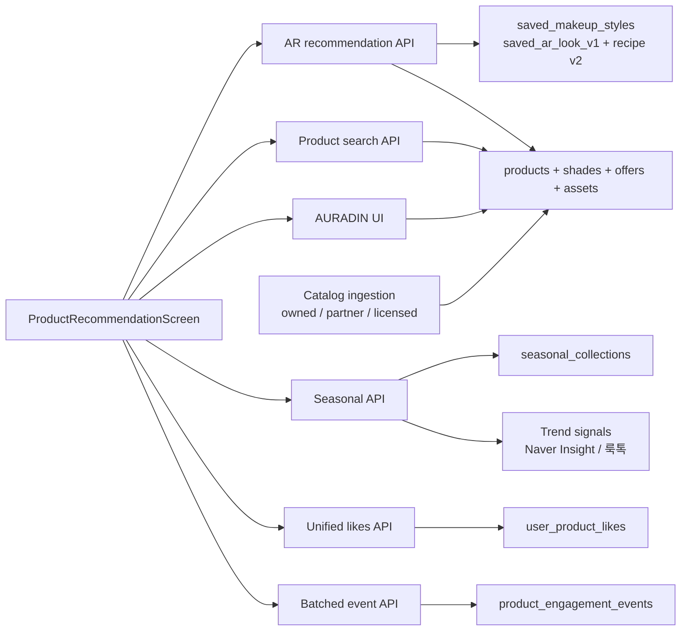

# 04. API·데이터 아키텍처

## 목표 구조



추천 허브는 section별 요청을 병렬로 호출한다. 하나가 실패해도 다른 section을 보여줄 수 있고, public 시즌과 private AR/개인화의 cache 정책을 분리할 수 있다.

## API V2 제안

모든 raw HTTP 응답은 기존 `success()`의 `{data, meta, error}` envelope와 camelCase 직렬화를 따른다. 아래 JSON 예시는 raw HTTP envelope다. 모바일의 `requestBackendJson<T>`는 `data`만 unwrap해 `T`로 반환하므로 service DTO에는 `meta`/`error`를 섞지 않는다. write는 auth+DB를 요구하고, 개인 데이터 read도 소유권을 확인한다.

### 0. 저장 AR 룩 수명주기

기존 `/api/makeup-styles`에 다음 계약을 완성한다.

- `GET /api/makeup-styles`
- `GET /api/makeup-styles/{styleId}`
- `POST /api/makeup-styles`
- `PATCH /api/makeup-styles/{styleId}` — title/archive 같은 허용 필드만
- `DELETE /api/makeup-styles/{styleId}` — 추천에서 즉시 제외하고 hard-delete/backup 정책 실행

생성 body 핵심:

```json
{
  "clientRequestId": "uuid",
  "styleType": "look",
  "title": "로즈 글로스 룩",
  "stylePayload": {
    "schemaVersion": "saved_ar_look_v1",
    "recipeContract": "FullFaceMakeupRecipe",
    "recipe": {"version": 2, "layers": []}
  }
}
```

- unique `(user_id, client_request_id)`로 retry 시 같은 style을 반환한다.
- 다른 사용자의 style은 404처럼 처리한다.
- 서버는 recipe v2를 검증하고 `sourceFrameMetadata`, 얼굴 frame/landmark를 제거한 뒤 recommendation projection을 재계산한다.
- archive는 되돌릴 수 있지만 추천 source에서는 즉시 제외한다.
- delete는 style과 파생 추천 source를 즉시 비활성화하고, 전용 thumbnail media와 cache/queue/run 연결을 cleanup한다. backup 삭제 목표는 승인된 보존정책을 따른다.
- 기본 thumbnail은 비얼굴 swatch mosaic다. 얼굴 preview media는 별도 opt-in과 private media lifecycle이 있을 때만 `thumbnailMediaId`로 허용한다.

### 1. AR 추천

허브 최초 rail:

`GET /api/products/recommendations/ar?styleId={uuid}&regions=lip,cheek,liner&perRegionLimit=6`

선택 부위 전체보기:

`GET /api/products/recommendations/ar?styleId={uuid}&regions=lip&cursor=&perRegionLimit=12`

`styleId` 생략 시 사용자의 최근 저장 완료 AR 룩을 선택할 수 있지만, 응답에 선택된 ID를 반드시 반환한다.

```json
{
  "data": {
    "status": "ready",
    "runId": "uuid",
    "basedOn": {
      "styleId": "uuid",
      "styleTitle": "로즈 글로우 룩",
      "envelopeVersion": "saved_ar_look_v1",
      "recipeVersion": 2,
      "colorSemantics": "authoring_color"
    },
    "groups": [
      {
        "region": "lip",
        "label": "립",
        "status": "ready",
        "items": [
          {
            "productId": "uuid",
            "shadeId": "uuid",
            "brandName": "브랜드",
            "productName": "제품",
            "shadeName": "로즈",
            "imageUrl": "https://approved-cdn.example/...",
            "price": {"amount": 22000, "currency": "KRW", "updatedAt": "..."},
            "viewerState": {"liked": false},
            "reasonCodes": ["CLOSE_AUTHORING_COLOR", "MATCHING_FINISH"],
            "reasonLabels": ["선택한 AR 색과 가까워요", "글로스 피니시가 같아요"],
            "exposureToken": "short-lived-signed-token"
          }
        ],
        "nextCursor": null
      }
    ]
  },
  "meta": {"source": "catalog", "generatedAt": "...", "algorithmVersion": "ar_v1"},
  "error": null
}
```

상태 enum:

- `ready`
- `noArStyle`
- `unsupportedRecipe`
- `noEligibleProducts`
- `unavailable`

`noArStyle`은 200 응답과 빈 `groups`로 처리해 UI가 명확한 CTA를 보여주게 한다. 지원되는 region이 일부뿐이면 global status는 `ready`, 해당 group만 `noEligibleProducts`로 반환한다. UI 기본 chip은 활성 `lip`, 없으면 응답 순서의 첫 ready group이다. 존재하지만 다른 사용자의 style ID는 404처럼 처리해 존재 여부를 누설하지 않는다.

### 2. 시즌 추천

`GET /api/products/recommendations/seasonal?locale=ko-KR&cursor=&limit=12`

```json
{
  "data": {
    "status": "ready",
    "collection": {
      "id": "uuid",
      "slug": "2026-summer-glow-lip-w28",
      "title": "여름 글로우 립",
      "summary": "최근 검색 클릭 추이가 오른 가벼운 광택 립",
      "validFrom": "...",
      "validUntil": "...",
      "reviewedAt": "...",
      "sourceLabels": ["Naver Shopping Insight", "룩톡 집계"]
    },
    "items": [],
    "nextCursor": null
  },
  "meta": {"source": "editorial-seasonal-v1", "generatedAt": "..."},
  "error": null
}
```

public 데이터만 담고 사용자 이름/프로필을 포함하지 않는다. 짧은 `max-age`+ETag를 쓸 수 있다. expiry가 지난 collection은 반환하지 않는다.

### 3. 개인화와 코호트

- `GET /api/products/recommendations/personalized`
- `GET /api/products/recommendations/cohort`

P1/P2에서 추가한다. 동의가 없으면 `status: personalizationOff`를 반환하고 동의를 강제하는 blocker로 만들지 않는다.

### 4. 제품 검색·상세

- `GET /api/products/search?q={text}&category=&cursor=&limit=`
- `GET /api/products/{productId}`

검색은 exact/lexical catalog search가 기본이다. AURADIN은 자연어를 `category`, `color family`, `finish`, `price` 등의 허용 filter로 변환한 뒤 같은 catalog service를 호출한다.

검색 query 규칙:

- 길이·문자 범위 제한
- 로그에는 필요 최소한만 저장하고 raw query 보존기간 분리
- SQL parameter binding
- 외부 provider 호출 시 timeout/circuit breaker
- LLM이 만든 filter는 schema validation

### 5. 좋아요

기존 경로를 호환 유지한다.

- `GET /api/products/liked`
- `POST /api/products/{productId}/like`
- `DELETE /api/products/{productId}/like`

V2 규칙:

- `productId`는 서버 내부 UUID만 허용
- heart는 product family 단위이며 같은 제품의 모든 추천 shade가 동일 상태를 공유
- request body에는 상품 metadata를 받지 않음; 선택적으로 검증할 `sourceShadeId` UUID만 허용
- 신규 like는 product가 `published+active`이고 현재 모바일 표시 권리가 유효할 때만 허용; `sourceShadeId`도 같은 product 소속·활성·권리 유효성을 검증
- 같은 요청은 idempotent
- 서버 catalog가 inactive/만료돼도 기존 좋아요 삭제는 가능
- liked list는 raw table join을 그대로 노출하지 않음. 판매만 종료되고 표시 권리가 남으면 `판매 종료`+outbound 없음, 표시 권리까지 만료/blocked면 이름·이미지·URL 없는 sanitized tombstone+`canUnlike: true`를 반환
- AURADIN과 추천 허브는 동일 service 함수 사용

외부 provider의 아직 등록되지 않은 결과가 있다면 서버가 검증 후 짧은 TTL 서명 reference를 발급하고, like endpoint가 그 reference를 catalog ingestion queue로 넘기는 별도 설계를 한다. 클라이언트 payload는 신뢰하지 않는다.

### 6. 인게이지먼트 batch

`POST /api/products/events`

```json
{
  "events": [
    {
      "eventId": "client-uuid",
      "eventType": "impression",
      "occurredAt": "2026-07-12T12:34:56.000Z",
      "runId": "uuid",
      "section": "ar",
      "productId": "uuid",
      "shadeId": "uuid",
      "position": 0,
      "exposureToken": "short-lived-signed-token"
    }
  ]
}
```

서버 검증:

- batch 크기 제한
- `(user_id, event_id)` unique idempotency
- 허용 event/section/context key만
- product/run 소유·존재 검증
- server received timestamp 별도 기록
- 클라이언트 occurredAt 허용 skew 제한
- rate limit과 비정상 반복 제거
- raw user-agent/IP는 추천 feature에 불필요하면 저장하지 않음

이벤트별 required field를 같은 optional JSON 구조에 맡기지 않는다.

| event | 생성 주체 | 필수 source | product 필수 | 비고 |
| --- | --- | --- | --- | --- |
| `impression` | client batch | AR/personalized=`runId+exposureToken`; season=`collectionId+version`; search=`searchRequestId` | 예 | viewport 기준, dedupe |
| `product_open` | client batch | 위와 동일 | 예 | accidental tap 규칙 |
| `search_result_open` | client batch | `searchRequestId` | 예 | raw query 재전송 금지 |
| `hide` | client batch | source ID/token | 예 | 강한 음성 신호 |
| `search_submit` | search endpoint server | `searchRequestId` | 아니오 | 동의 계정만 서버가 최소 query/feature 기록 |
| `like`/`unlike` | like transaction server | request trace | 예 | client analytics event를 신뢰하지 않음 |
| `seller_outbound` | outbound endpoint server | `offerId` | 예 | 실제 구매로 해석 금지 |

public cache인 seasonal item은 사용자별 run을 넣지 않는다. 서버는 active collection membership/version을 검증하고 rate limit·eventId dedupe를 적용한다. 필요하면 collection/product/position/expiry만 담은 cache-safe HMAC token을 제공한다. AR/personalized token은 사용자와 run에 묶는다.

### 7. 판매처 이동

권고: 상세 API가 `product_offers`의 검증된 seller offer를 반환하고 앱이 확인 CTA를 제공한다. `POST /api/products/{productId}/offers/{offerId}/outbound`가 product/offer/권리·재고·도메인을 재검증하고 server-side event를 남긴 뒤 짧게 유효한 URL을 반환한다. 앱은 임의 URL을 body로 보내지 않는다.

SSRF/피싱 방지:

- ingestion 시 HTTPS와 provider 도메인 allowlist
- redirect chain 검증
- private/link-local IP 차단
- 앱에서 임의 `purchaseUrl` request body 수신 금지
- affiliate parameter와 disclosure metadata를 서버가 관리

## Mobile 구조 제안

P0 구현은 기존 `ProductRecommendationScreen.tsx`를 버리고 새 화면을 만드는 방식이 아니다. 현재 화면을 기준으로 최소 침습 리팩터링한다. 먼저 기존 보고서 선택, 룩 summary, 카테고리 탭, 정렬, 제품 카드, 좋아요, 구매 링크를 유지한 채 `homeRoutes.tsx`의 진입만 `ProductRecommendation`으로 복원한다. 그 다음 section 단위로 컴포넌트를 추출하고 AURADIN/AR/시즌 section을 추가한다.

```text
apps/mobile/src/features/recommendation/
  components/
    ProductSearchBar.tsx
    AuradinGatewayCard.tsx
    ArRecommendationSection.tsx
    SeasonalRecommendationSection.tsx
    PersonalizedRecommendationSection.tsx
    ProductRail.tsx
    RecommendationProductCard.tsx
    RecommendationSectionState.tsx
  hooks/
    useProductRecommendationHub.ts
    useProductLike.ts
    useProductImpression.ts
  screens/
    ProductRecommendationScreen.tsx
    ProductSearchResultScreen.tsx
    ProductDetailScreen.tsx
  services/
    productRecommendationService.ts
    productEventService.ts
  types/
    productRecommendation.ts
```

- 현 1,500줄 안팎 screen을 한 번에 재작성하지 말고 section부터 추출한다.
- 기존 `getProductRecommendations({reportId, lookIndex})`와 `/products/recommendations` 계약은 P0 baseline으로 유지한다.
- 새 section endpoint는 AR/시즌이 실제 데이터 요구사항을 갖출 때 additive로 붙인다. 기존 추천 API를 끊고 나서 새 허브를 붙이지 않는다.
- 기존 `CategoryTabs`, `ReportSelector`, `LookSummaryCard`, `LookPickerModal`, `ProductCard` 역할은 보존하거나 같은 props 의미를 가진 shared component로 이동한다.
- 화면은 세로 `FlatList` 또는 section model을 사용해 nested virtualized list 경고를 피한다.
- rail은 horizontal `FlatList`; 안정적인 key와 `getItemLayout`은 카드 폭 고정 시 적용한다.
- `requestBackendJson`을 사용한다.
- prod API 실패 시 mock 상품으로 성공한 것처럼 보이지 않는다. mock은 `__DEV__`/Storybook/fixture에서만 명시적으로 주입한다.
- section query 취소, stale response 무시, refresh race를 처리한다.
- 기존 theme/icon 외 새 UI 라이브러리를 추가하지 않는다.
- header는 route-owned `DetailRouteChrome`을 유지한다. 새 screen header를 만들지 않고 기존 `headerRightSlot`에 상담 알림·톡 action을 연결한다.

## Navigation 변경

```ts
type RootStackParamList = {
  ProductRecommendation: {
    reportId?: string;
    arStyleId?: string;
    initialSection?: 'ar' | 'seasonal' | 'personalized';
  } | undefined;
  AuradinSearch: { /* existing params */ } | undefined;
  ProductSearchResult: {query: string};
  ProductDetail: {productId: string; shadeId?: string};
};
```

- `homeRoutes.tsx`의 추천 제품 액션 → `ProductRecommendation`
- `routeChrome.ProductRecommendation.title`을 `제품 추천`으로 통일
- AR 저장 완료 → `ProductRecommendation({arStyleId})`
- AURADIN route wrapper가 navigation을 받아 명시적 뒤로가기 제공
- deep link에는 내부 UUID만 사용하고 recipe/개인정보를 query에 넣지 않음
- hub 복귀 시 route state 또는 screen state로 검색/스크롤 위치 복원

## DB 변경 제안

### 기존 `saved_makeup_styles`

별도 AR recommendation source table을 중복 생성하지 않는다.

- `client_request_id uuid not null`과 unique `(user_id, client_request_id)` 추가
- `style_payload.schemaVersion = saved_ar_look_v1`, 내부 `recipe.version = 2` 검증
- 서버 저장 전 `sourceFrameMetadata`와 얼굴/landmark field 제거
- 가능하면 DB check는 JSON 깊은 구조보다 API validation에 두되, `jsonb_typeof(style_payload) = 'object'` 수준 확인
- 소유자+최근 저장 index는 기존 것을 재사용
- 삭제/archived style은 신규 recommendation source에서 제외하고 run/cache/전용 thumbnail cleanup

### `products` 확장

권고 column:

- `source_provider`
- `source_license_type`
- `source_reference`
- `license_status`
- `license_valid_from`, `license_valid_until`
- `allowed_uses text[]`
- `catalog_status` (`draft`, `reviewed`, `published`, `blocked`)

provider별 가변 데이터만 `product_payload`에 두고, 보안/필터/표시에 중요한 필드는 typed column으로 승격한다.

### 새 `product_shades`

핵심 column:

- `id`, `product_id`, `external_shade_key`, `shade_name`
- `srgb_hex`, `lab_l`, `lab_a`, `lab_b`
- `finish`, `coverage`, `opacity`
- `evidence_type`, `evidence_reference`, `evidence_confidence`
- `license_status`, `license_valid_from`, `license_valid_until`, `allowed_uses`
- `measured_at`, `reviewed_at`, `is_active`

제약:

- unique `(product_id, external_shade_key)`
- hex 형식 check
- Lab 범위 check: L 0–100, a/b 합리적 범위
- confidence 0–1
- product FK cascade 또는 정책에 맞는 restrict
- active/category/Lab 후보 index

### 새 `product_assets`

packshot과 shade swatch의 권리는 product row 하나로 대표할 수 없다.

- `id`, `product_id`, optional `shade_id`, `asset_type`
- `media_id` 또는 검증된 CDN URL
- `source_provider`, `source_reference`
- `license_type`, `license_status`, `allowed_uses`
- `valid_from`, `valid_until`, `reviewed_at`
- unique/source checksum, active index

후보/응답 query는 `mobile_display`와 필요한 `recommendation` use가 허용되고 현재 시각에 유효한 asset만 선택한다.

### 새 `product_offers`

- `id`, `product_id`, optional `shade_id`, `seller_name`, `seller_domain`
- 서버 관리 `purchase_url`, `currency`, `price_amount`
- `availability_status`, `availability_checked_at`, `price_updated_at`
- `affiliate_type`, `disclosure_label`
- `source_provider`, `license_status`, `allowed_uses`, `valid_until`

product family 1개에 여러 shade와 여러 seller offer가 연결된다. AR item은 shade 1개와 현재 사용할 offer 요약을 반환한다.

### 기존 `user_product_likes`

- PK `(user_id, product_id)`를 유지해 제품 family 좋아요로 고정
- optional `source_shade_id`는 좋아요 당시 추천 문맥일 뿐 식별자가 아님
- FK로 shade가 해당 product 소속인지 API에서 검증
- shade 즐겨찾기가 필요해지면 별도 관계를 추가

### 새 `product_seasonal_collections`

- `id`, `slug unique`, `title`, `summary`, `locale`
- `valid_from`, `valid_until`, `reviewed_at`, `published_at`
- `status` (`draft`, `in_review`, `published`, `suspended`, `expired`), `revision`
- `source_payload`, `created_by`, `reviewed_by`, `published_by`
- `previous_revision_id`, `suspension_reason`
- `valid_until > valid_from` check
- production publish는 `created_by/reviewed_by` 분리와 상태 전이 제약

### 새 `product_seasonal_collection_items`

- `collection_id`, `product_id`, optional `shade_id`
- `position`, `reason_code`, `sponsorship_type`
- PK/unique로 중복·순서 충돌 방지

### 새 `product_engagement_events`

- `id`, `event_id`, `user_id`, optional `run_id`
- optional `collection_id`, `search_request_id`
- `product_id`, optional `shade_id`
- `event_type`, `section`, `position`
- `occurred_at`, `received_at`, `context`
- unique `(user_id, event_id)`
- event type별 required-field API validation과 가능한 DB check
- 보존/집계 삭제를 위한 `(occurred_at)`, `(user_id, occurred_at)` index

### 기존 `product_recommendation_runs`

현재 쓰기 경로가 사실상 비어 있으므로 V2에서 실제 provenance에 사용한다.

- `source_style_id`
- `strategy` (`ar_v1`, `seasonal_v1`, `personalized_v1`)
- `algorithm_version`
- `consent_snapshot`
- `candidate_product_ids` 또는 최소 result IDs
- 개인화 원문 대신 비민감 feature/version 정보
- run 보존기간 후 삭제/익명 집계

무제한 payload dump는 금지한다. 원본 report text, 얼굴 데이터, raw query를 넣지 않는다.

모든 AR/시즌 후보 query는 product, shade, asset, offer 각각에 대해 `published/active`, 허용 use, `valid_from <= now < valid_until`, 판매 가능 상태를 강제한다. 하나라도 충족하지 못하면 UI에 전달하지 않는다.

## 시즌 운영 쓰기 경계

consumer mobile router에 publish write를 노출하지 않는다.

1. trend collector service role이 후보와 source snapshot을 draft로 생성
2. `seasonal_editor` RBAC가 제목·설명·제품을 편집하고 review 요청
3. 다른 `seasonal_publisher`가 source/license/광고/유효기간을 확인해 publish
4. published revision은 수정하지 않고 새 revision을 생성
5. 안전 문제가 있으면 publisher/security role이 즉시 `suspended`
6. 모든 상태 전이에 actor, timestamp, reason, before/after hash를 `audit_logs`에 기록

초기에는 admin UI 대신 서명된 JSON manifest+내부 CLI를 써도 되지만 같은 RBAC·2인 승인·audit 조건을 지킨다. 내부 데모의 1인 seed는 production publish 권한과 분리한다.

## 기존 상품 migration

V2 cardinality는 다음으로 고정한다.

```text
Product family 1
  ├─ ProductShade N
  ├─ ProductAsset N
  └─ ProductOffer N
```

기존 `products.shade_name`, `price_krw`, `palette`, `product_payload.purchaseUrl`은 legacy compatibility field다.

1. source/license가 확인된 row만 migration candidate로 선택
2. `shade_name`과 공식 evidence가 있으면 shade row를 만들되, Lab 근거가 없으면 `unverified`로 두고 AR 후보에서 제외
3. `palette`에서 Lab을 backfill하지 않음
4. allowlist와 권리가 확인된 purchase URL만 offer로 이동; 나머지는 quarantine
5. 이미지도 product_assets로 이동하며 asset별 권리를 기록
6. legacy endpoint는 transitional adapter로 dual-read, V2 endpoint는 normalized tables만 read
7. 관측 후 legacy write를 막고 field를 단계적으로 폐기

이 migration 전에 기존 client-payload upsert로 오염됐을 가능성이 있는 URL/metadata integrity audit를 수행한다.

기존 `saved_makeup_styles`에 idempotency를 추가할 때는 column을 nullable로 추가하고, 기존 row에 고유 UUID를 backfill한 뒤 unique index와 `not null`을 순서대로 적용한다. 한 번에 `not null`을 추가해 기존 설치 DB migration을 실패시키지 않는다.

## 마이그레이션 동기화

DB 변경 시 네 곳을 함께 수정한다.

1. `docs/backend/schema.sql`
2. `docs/backend/aws-postgresql-schema.dbml`
3. `services/backend/app/db/init_db.py`의 post-schema migration/version
4. `services/backend/app/db/check_schema.py` expected tables/columns

추가로 mapper, seed/fixture, cleanup/deletion service, tests를 함께 갱신한다. `create table if not exists`만 추가하고 기존 설치 DB migration을 빼먹으면 개발환경과 신규환경이 달라진다.

## Provider 경계

```python
class CatalogProvider(Protocol):
  async def sync_products(self, cursor: str | None) -> CatalogPage: ...

class TrendSignalProvider(Protocol):
  async def get_keyword_trends(self, request: TrendRequest) -> TrendSeries: ...
```

- product catalog provider와 trend provider를 분리한다.
- Naver Shopping Insight adapter는 `TrendSignalProvider`만 구현한다.
- provider raw response는 제한된 staging/감사 저장소에서 약관·보존정책에 따라 처리한다.
- normalized catalog는 source/license provenance를 잃지 않는다.
- timeout, retry with jitter, circuit breaker, quota metrics를 provider별 적용한다.

## 캐시

| 데이터 | 권고 |
| --- | --- |
| 시즌 public collection | 짧은 public cache + ETag, expiry 이하 |
| 제품 public detail | source가 허용한 범위의 짧은 cache |
| 사용자 AR 추천 | `private, no-store` 기본; 필요 시 계정 범위 암호화 캐시 |
| 개인화 추천 | `private, no-store` |
| AURADIN 대화 state | 기존 TTL 유지, likes와 분리 |
| 외부 provider raw response | 약관/계약이 허용할 때만 최소 기간 |

## 호환 전략

- 기존 `GET /products/recommendations`는 화면 전환 동안 유지하고 deprecated meta/로그로 호출자를 파악한다.
- 새 hub는 V2 section endpoint를 사용한다.
- 기존 `sets` 필드는 신규 rail에 억지로 다시 연결하지 않는다. 필요하면 별도 `세트 추천` 실험으로 정의한다.
- old Naver 경로는 feature flag로 비활성화 가능해야 한다.
- API response에 `algorithmVersion`과 `generatedAt`을 두어 회귀 분석 가능하게 한다.
