# 추천제품 구현 브리핑

> **보관 문서 — v1 운영 절차 사용 금지 (2026-07-16)**
> 이 문서의 MCP/curated 기반 시즌 수집 구조는 초기 구현 기록일 뿐 현재 운영 정본이 아니다. 운영 게시 경로는
> [`12-trend-now-product-automation-plan.md`](12-trend-now-product-automation-plan.md)의
> 네이버·기상청·앱 집계 기반 **“요즘 트렌드 제품” 자동 갱신 v2**가 대체한다.
> 아래 MCP URL·secret·curated fallback·수동 게시 절차를 신규 운영 환경에 적용하지 않는다.
> 기존 API 호환과 화면 개선 설명만 역사적 구현 배경으로 참고한다.

작성일: 2026-07-16
구현 브랜치: `feature/sj-product-recommend`
기준 커밋: `b0259504` (`feat: 제품 추천 시즌 트렌드 파이프라인 개선`)
대상: Expo React Native 모바일 앱 + FastAPI 백엔드 + PostgreSQL

## 1. 문서 목적

이 문서는 제품 추천 페이지 개선과 시즌 트렌드 수집 파이프라인 구현 결과를 한 번에 이해할 수 있도록 정리한 기술 브리핑이다.

주요 구현 범위는 다음과 같다.

1. 제품 추천 페이지 초기 로딩 경로 단축
2. 더보기 화면의 카테고리 탭과 상품 카드 겹침 수정
3. `얼굴 분석 기준 전체 추천` 레거시 섹션 제거
4. 개인화 데이터·개인정보 설정 화면 제거 및 가입 약관 기반 최초 동의 이력 생성
5. MCP 기반 시즌 트렌드 수집·정규화·상품 매칭·DB 게시 파이프라인 구현
6. MCP/외부 API/DB 장애 시에도 상품을 표시하는 다단계 fallback 구현
7. 기존 좋아요, 사용자 페이지 좋아요 목록, 개인화, 코호트, AR, AURADIN 기능 계약 보존

> 아래 다이어그램과 코드 설명은 v1 당시 구현 기록이다. 현재 구조·운영·검증의 정본은 문서 12와 현재 앱 코드를 기준으로 한다.


---

## 2. 한눈에 보는 변경 전·후

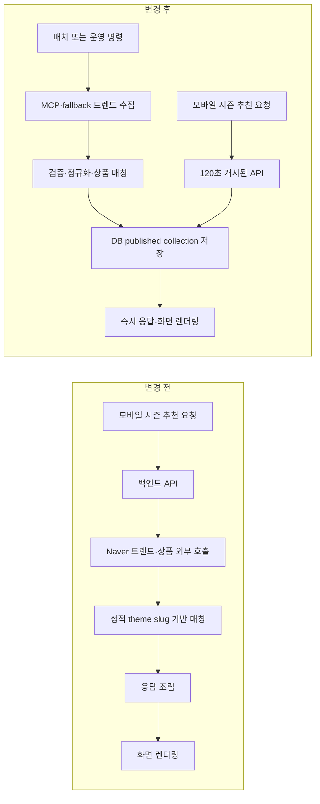

| 항목 | 변경 전 | 변경 후 |
| --- | --- | --- |
| 외부 트렌드 조회 | 모바일 API 요청 중 실행 가능 | 배치·운영 작업에서만 실행 |
| 시즌 테마 | 3개 theme slug 중심 | MCP/Naver/curated signal의 동적 키워드 중심 |
| API 지연 | 외부 timeout이 사용자 요청에 포함 | DB/패키지 카탈로그만 읽음 |
| 캐시 | 진입 횟수 query로 URL이 계속 변경 | 모바일·백엔드·HTTP 3단 캐시 |
| 초기 모바일 요청 | AR·시즌·개인화·코호트 동시 실행 | AR·시즌 우선, 나머지는 interaction 이후 |
| 더보기 목록 | 넓은 상품 목록 렌더링 비용 | `FlatList` 윈도잉·배치 렌더링 |
| 레거시 얼굴 분석 추천 | 리포트와 전체 추천을 별도로 조회 | UI와 관련 요청·상태를 모두 제거 |
| 장애 시 결과 | 외부 공급자 상태에 영향 | DB 인기 → 검증 snapshot → 패키지 catalog fallback |

---

## 3. 로딩 지연 원인과 개선 방식

### 3.1 요청 시점의 외부 네트워크 제거

기존에는 published 시즌 컬렉션이 없을 때 공개 시즌 API가 `product_live_seasonal.py`의 Naver Shopping Insight·Shopping Search 흐름을 호출할 수 있었다. 외부 응답이 늦거나 timeout이 발생하면 그 시간이 그대로 추천 화면 로딩에 포함됐다.

현재 공개 API의 [`get_seasonal_recommendations`](../../services/backend/app/services/product_recommendations.py)은 다음 데이터만 읽는다.

- 현재 유효한 PostgreSQL `published` 시즌 컬렉션
- 권리와 판매 가능성이 검증된 DB 상품
- 서버에 패키지된 Auradin 상품 카탈로그

MCP, Naver 등 외부 트렌드 공급자는 모바일 요청 경로에서 호출하지 않는다.

### 3.2 모바일 요청 우선순위 조정

[`ProductRecommendationHubContent.tsx`](../../apps/mobile/src/features/recommendation/components/ProductRecommendationHubContent.tsx)는 첫 화면에서 AR과 시즌 상품을 먼저 요청한다.

개인화와 코호트 추천은 React Native의 `InteractionManager.runAfterInteractions()` 이후에 요청한다. 화면 전환과 첫 렌더링이 완료된 다음 부가 섹션을 로딩하므로 초기 인터랙션과 시즌 상품 노출이 우선된다.

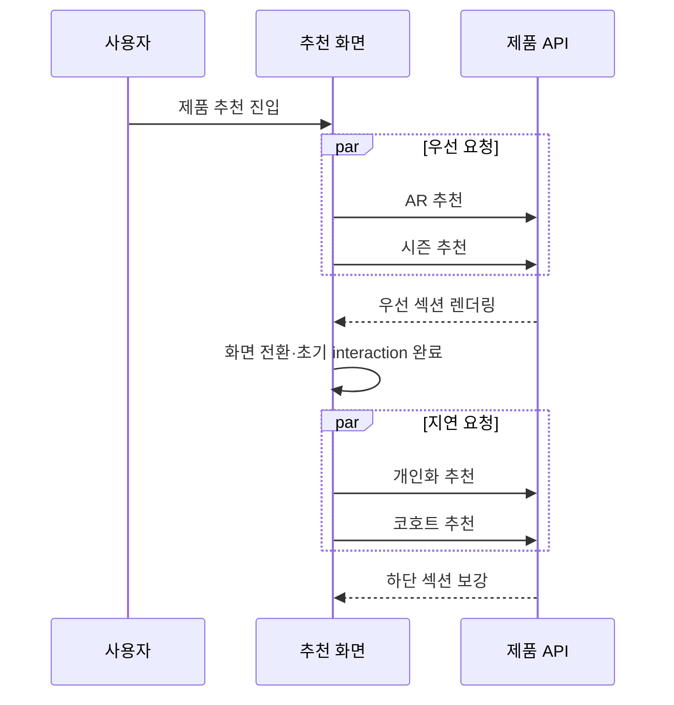

각 섹션은 request ID를 사용한다. 이전 요청이 늦게 도착해도 최신 상태를 덮어쓰지 못하며, 이미 표시 중인 데이터가 있으면 background refresh 중에 빈 로딩 화면으로 되돌리지 않는다.

### 3.3 모바일 120초 캐시와 진행 중 요청 합치기

[`productHubService.ts`](../../apps/mobile/src/features/recommendation/services/productHubService.ts)의 시즌 요청 URL에서 화면 진입 횟수용 `entry` query를 제거했다.

같은 `locale`, `limit`, `category` 요청은 같은 URL을 사용하며 다음 규칙을 적용한다.

- 완료 응답: 120초 메모리 캐시
- 진행 중 요청: 같은 Promise를 재사용하여 HTTP 요청 중복 방지
- 최대 20개 URL cache entry 유지 후 정리
- 상품이 존재하면 비정상 status라도 화면 표시가 가능하도록 `ready`로 정규화

### 3.4 백엔드와 HTTP 캐시

백엔드는 DB 상태·locale·limit·category·feature flag·freshness 설정을 포함한 key로 시즌 응답을 120초 캐시한다. 캐시 객체는 `deepcopy`해 후속 UI 보강 로직이 원본을 오염시키지 않도록 했다.

시즌 API는 다음 HTTP 캐시 계약도 제공한다.

```http
ETag: "<response-sha256>"
Cache-Control: public, max-age=120, stale-if-error=300
```

클라이언트가 같은 ETag를 보내면 `304 Not Modified`를 반환할 수 있다. 새 시즌 컬렉션을 저장하면 백엔드 메모리 캐시는 즉시 초기화된다.

### 3.5 레거시 화면 제거에 따른 요청 감소

기존 `ProductRecommendationScreen.tsx`는 약 1,759줄이며 얼굴 분석 리포트, 추천 룩, 카테고리, 정렬, 전체 추천 데이터를 직접 관리했다.

현재 [`ProductRecommendationScreen.tsx`](../../apps/mobile/src/features/recommendation/screens/ProductRecommendationScreen.tsx)는 약 200줄로 축소됐으며 다음만 담당한다.

- 제품 추천 허브 조립
- 좋아요 상태 동기화
- 내부 상품 상세·외부 판매처 이동
- 더보기 화면 이동
- AURADIN orb
- 초기 섹션 스크롤

`얼굴 분석 기준 전체 추천`은 화면만 숨긴 것이 아니라 리포트와 레거시 상품 조회 코드까지 함께 제거했다.

---

## 4. MCP 시즌 트렌드 수집 아키텍처

### 4.1 전체 파이프라인

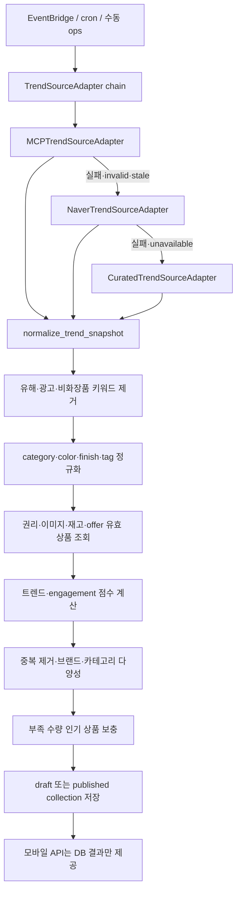

핵심 원칙은 MCP가 추천 알고리즘이 아니라는 점이다.

- MCP 역할: 외부 트렌드 도구 연결과 구조화된 signal 수집
- 백엔드 역할: 신뢰 검증, 상품 자격 검사, 점수화, 다양성, fallback, 게시
- 모바일 역할: 게시된 결과를 빠르게 표시하고 좋아요·상세 흐름 제공

### 4.2 Adapter 계약

[`product_trend_sources.py`](../../services/backend/app/services/product_trend_sources.py)의 adapter는 아래 공통 인터페이스를 따른다.

```python
class TrendSourceAdapter(Protocol):
    name: str

    async def collect(
        self,
        *,
        locale: str,
        now: datetime,
    ) -> dict[str, Any] | None:
        ...
```

기본 adapter 순서는 다음과 같다.

1. `MCPTrendSourceAdapter`
2. `NaverTrendSourceAdapter`
3. `CuratedTrendSourceAdapter`

### 4.3 MCP Streamable HTTP 처리

MCP adapter는 JSON-RPC 기반으로 다음 lifecycle을 수행한다.

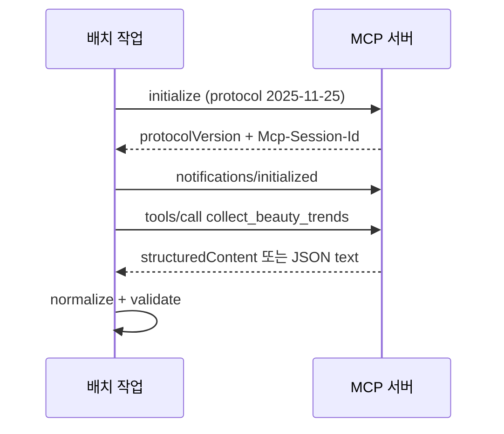

MCP tool에는 다음 입력을 전달한다.

```json
{
  "locale": "ko-KR",
  "category": "beauty/makeup",
  "trendWindowDays": 28,
  "asOf": "2026-07-16T12:00:00+00:00",
  "maxSignals": 12
}
```

환경 변수는 다음과 같다.

```dotenv
PRODUCT_TREND_MCP_URL=
PRODUCT_TREND_MCP_TOOL=collect_beauty_trends
PRODUCT_TREND_MCP_BEARER_TOKEN=
PRODUCT_TREND_MCP_ALLOWED_HOSTS=
PRODUCT_TREND_MCP_TIMEOUT_SECONDS=8
```

보안 규칙:

- 운영 환경은 HTTPS만 허용
- `PRODUCT_TREND_MCP_ALLOWED_HOSTS`에 등록된 host만 허용
- localhost HTTP는 local/test에서만 허용
- bearer token 선택 지원
- timeout은 1~30초 범위
- 원천 metadata는 `provider`, `metric`, `requestId`, `tool`만 보존

---

## 5. 트렌드 정규화와 신뢰 경계

MCP와 외부 공급자의 응답은 신뢰하지 않는다. [`normalize_trend_snapshot`](../../services/backend/app/services/product_trend_sources.py)에서 다음을 다시 검증한다.

### 5.1 형식 제한

- 최대 24개 signal 검사
- keyword 최대 48자
- title 최대 80자
- summary 최대 240자
- reason code 최대 40자
- confidence를 `0~1`로 제한
- 중복 keyword 제거
- 허용 category: `base`, `shadow`, `brow`, `cheek`, `lip`, `liner`

### 5.2 키워드 안전성

다음 키워드는 제외한다.

- 성인·19금
- 도박·담배·주류·대출
- 광고·협찬·공동구매
- 비화장품 키워드
- 토큰화할 수 없는 문자열
- 지나치게 짧거나 긴 문자열

명시된 속성이 없으면 한국어 별칭을 이용해 추론한다.

| 입력 예시 | 추론 결과 |
| --- | --- |
| 글로우 립 | `category=lip`, `finish=glossy` |
| 장마철 워터프루프 | `category=liner` 또는 `brow` |
| 아이돌 물광 피부 | `category=base`, `finish=glossy` |
| 갈웜 메이크업 | `colorFamily=warm` |
| 소프트 블러 메이크업 | `finish=velvet` 또는 `matte` |

### 5.3 freshness 처리

- `sourceUpdatedAt`이 없으면 invalid
- 현재보다 5분 이상 미래이면 invalid
- 기본 30일보다 오래되면 stale
- invalid/stale source는 다음 adapter로 이동
- 이미 게시된 컬렉션을 읽을 때 stale이면 모바일에 `isStale=true` 표시

---

## 6. 트렌드와 상품의 매칭 방식

상품 점수화는 [`product_seasonal_pipeline.py`](../../services/backend/app/services/product_seasonal_pipeline.py)에서 수행한다.

### 6.1 후보 상품 자격

최대 500개 후보를 조회하며 다음 조건을 만족해야 한다.

- 상품 active 및 published
- 상품 license valid
- `mobile_display`, `recommendation` 권한 보유
- 상품·shade·asset license 기간 유효
- 유효한 packshot 이미지 존재
- `in_stock` 또는 `limited` offer 존재
- offer license와 판매 URL 유효
- 가격·재고 정보가 `PRODUCT_OFFER_MAX_AGE_HOURS` 이내

최근 90일 engagement도 함께 집계한다.

- 좋아요 수
- 상품 상세/open 수
- 판매처 outbound 수

### 6.2 점수식

| 근거 | 가중치 |
| --- | ---: |
| 카테고리 일치 | `+4.0` |
| keyword token 일치 | token당 `+1.25`, 최대 `+3.0` |
| finish 일치 | `+1.8` |
| color family 일치 | `+1.4` |
| tag 일치 | `+1.2` |

트렌드 속성 점수에는 confidence를 적용한다.

```text
trendAttributeScore × (0.55 + confidenceScore × 0.45)
```

engagement 점수는 로그 스케일을 사용한다.

```text
log(1 + likes) × 0.55
+ log(1 + opens) × 0.20
+ log(1 + outbounds) × 0.40
```

최종적으로 다음 근거 코드가 상품에 저장된다.

- `TREND_CATEGORY_MATCH`
- `TREND_KEYWORD_MATCH`
- `TREND_FINISH_MATCH`
- `TREND_COLOR_MATCH`
- `TREND_TAG_MATCH`
- `POPULAR_FALLBACK`

### 6.3 다양성 규칙

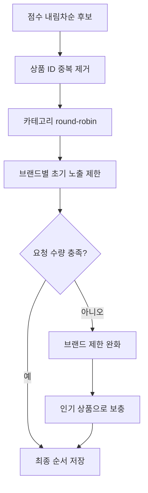

브랜드 초기 제한은 다음 값을 사용한다.

```text
max(2, ceil(limit / min(availableBrandCount, 6)))
```

따라서 특정 브랜드 또는 카테고리만 반복되는 현상을 줄이면서도, 카탈로그가 작을 때는 제한을 완화해 상품 수를 우선 확보한다.

---

## 7. 시즌 컬렉션 데이터 모델

### 7.1 Collection

`product_seasonal_collections`는 다음 핵심 필드를 저장한다.

| 필드 | 용도 |
| --- | --- |
| `slug` | locale 기반 컬렉션 시리즈 식별자 |
| `title`, `summary` | 앱 노출 문구 |
| `trend_window` | 신호 기준 기간 |
| `locale` | 기본 `ko-KR` |
| `source_name` | MCP/Naver/curated 원천 이름 |
| `source_updated_at` | 원천 데이터 갱신 시각 |
| `trend_keywords` | 정규화된 트렌드 keyword 배열 |
| `reason_codes` | 컬렉션 수준 근거 코드 |
| `confidence_score` | `0~1` 신뢰도 |
| `source_payload` | 제한된 원천·collector metadata |
| `status` | draft/in_review/published/suspended/expired |
| `revision` | 같은 slug의 버전 |
| `created_by`, `reviewed_by`, `published_by` | 게시 책임 분리 |

### 7.2 Collection item

`product_seasonal_collection_items`는 다음을 저장한다.

- `product_id`
- `shade_id`
- `position`
- 대표 `reason_code`
- 전체 `reason_codes[]`
- `match_score`
- `sponsorship_type`

DB 정의는 다음 두 문서에 함께 반영했다.

- [`schema.sql`](../backend/schema.sql)
- [`aws-postgresql-schema.dbml`](../backend/aws-postgresql-schema.dbml)

### 7.3 게시 트랜잭션

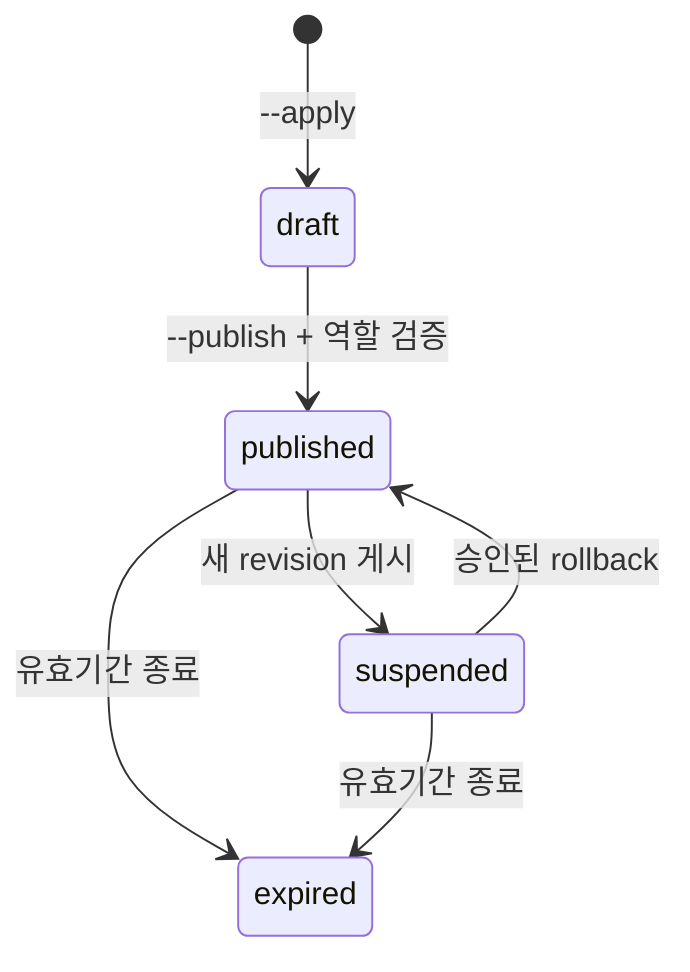

즉시 게시하려면 다음 운영 역할이 필요하다.

- creator: `seasonal_editor`
- reviewer: `seasonal_reviewer`
- publisher: `seasonal_publisher`

publisher는 creator 또는 reviewer와 같을 수 없다. 새 revision을 게시하면 이전 published revision은 `suspended` 처리되며 사유를 `superseded_by_trend_refresh`로 기록한다.

---

## 8. 장애와 fallback 설계

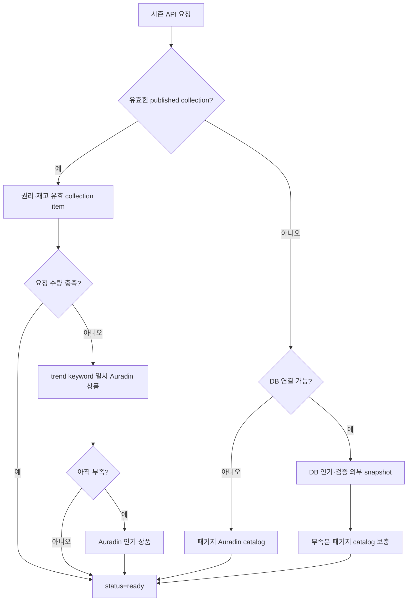

| 장애 상황 | 동작 |
| --- | --- |
| MCP URL 미설정 | Naver adapter, 이후 curated adapter 사용 |
| MCP timeout/invalid | 다음 adapter로 이동 |
| Naver unavailable | curated adapter 사용 |
| stale source | 게시 후보에서 제외하고 다음 adapter 사용 |
| published collection 없음 | DB 인기 또는 패키지 catalog 반환 |
| collection item 부족 | 동적 keyword 매칭 Auradin 상품으로 보충 |
| DB 연결 없음 | 외부 호출 없이 패키지 catalog 반환 |
| 외부 상품 | 기존 external like·판매처 링크 계약 유지 |

로컬 DB 미연결 검증에서는 시즌 API가 HTTP 200, `status=ready`, 상품 12개와 `POPULAR_FALLBACK` 근거를 반환했다.

---

## 9. 시즌 API 계약

기존 URL과 camelCase 응답을 유지한다.

```http
GET /products/recommendations/seasonal?locale=ko-KR&limit=12
GET /products/recommendations/seasonal?locale=ko-KR&limit=60&category=lip
```

응답 예시:

```json
{
  "success": true,
  "data": {
    "status": "ready",
    "collection": {
      "id": "collection-uuid",
      "slug": "seasonal-trends-ko-kr",
      "title": "이번 주 글로우 립과 롱웨어 베이스",
      "summary": "최근 뷰티 트렌드와 판매 가능한 상품을 함께 반영했어요.",
      "trendWindow": "최근 28일",
      "sourceName": "MCP:collect_beauty_trends",
      "sourceUpdatedAt": "2026-07-16T00:00:00Z",
      "trendKeywords": ["글로우 립", "여름 지속력 베이스"],
      "reasonCodes": ["SOCIAL_TREND_RISE"],
      "confidenceScore": 0.82,
      "status": "published",
      "isStale": false
    },
    "items": [],
    "nextCursor": null
  },
  "meta": {
    "source": "cached-trend-collection",
    "trendSource": "MCP:collect_beauty_trends",
    "productSource": "licensed-catalog"
  }
}
```

상품은 기존 `CatalogProduct` shape을 유지하며 다음 설명 필드를 확장한다.

- `reasonCodes`
- `reasonLabels`
- `matchScore`
- `sponsorshipType`

---

## 10. 모바일 UI 변경

### 10.1 메인 추천 화면

메인 화면은 다음 네 개의 목적별 shelf를 유지한다.

1. AR 필터 기반 추천제품
2. 개인화 추천제품
3. 시즌 상품
4. 비슷한 컬러 취향 추천

시즌 섹션에는 컬렉션 제목·요약과 다음 출처 정보를 표시한다.

```text
최근 28일 · MCP:collect_beauty_trends · 신뢰도 82%
```

stale collection에는 다음 안내를 표시한다.

```text
마지막 검수 콘텐츠예요. 원천 데이터 갱신이 지연되고 있어요.
```

### 10.2 더보기 화면 겹침 수정

[`ProductRecommendationShelfScreen.tsx`](../../apps/mobile/src/features/recommendation/screens/ProductRecommendationShelfScreen.tsx)에서 다음을 적용했다.

- 카테고리 탭 영역에 불투명 배경
- 탭 영역 `zIndex: 1`
- 제품 목록 상단 padding
- root/list `minHeight: 0`, `flex: 1`
- 탭과 제품 grid의 레이아웃 경계 분리

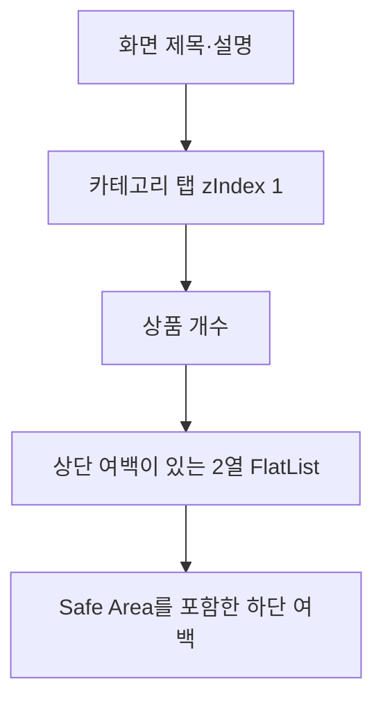

### 10.3 상품 레이지 렌더링

더보기 상품 grid는 다음 설정을 사용한다.

```tsx
initialNumToRender={6}
maxToRenderPerBatch={6}
updateCellsBatchingPeriod={40}
windowSize={5}
```

처음부터 최대 60개 상품 카드를 모두 mount하지 않고 현재 viewport 주변 상품만 렌더링한다.

### 10.4 제거한 UI

- 얼굴 분석 기준 전체 추천
- 분석 리포트 선택
- 추천 룩·카테고리·정렬을 포함한 레거시 전체 추천
- 제품 추천 하단의 `개인화 데이터와 개인정보 설정`
- 개인화 설정 screen/route/deep link/header/type/export

---

## 11. 개인정보 동의 처리

[`LoginScreen.tsx`](../../apps/mobile/src/features/auth/screens/LoginScreen.tsx)에 다음 내용을 포함했다.

> 가입 시 이용약관, 개인정보 수집·이용 및 처리방침, 제품 추천 개인화를 위한 좋아요·검색·클릭 데이터 활용과 익명 컬러 취향 추천에 동의하게 됩니다.

백엔드 [`ensure_user`](../../services/backend/app/services/users.py)는 사용자 upsert와 동일한 SQL CTE에서 최초 동의 이력을 생성한다.

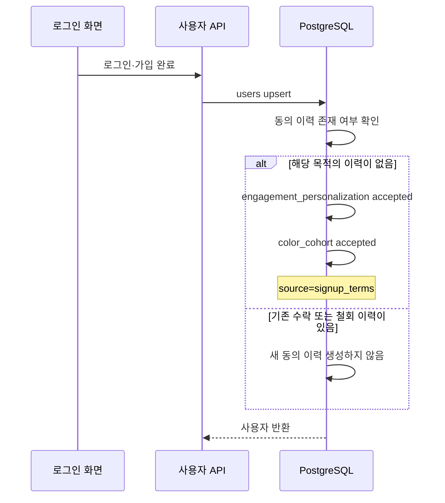

안전 조건:

- 동의 유형별 이력이 전혀 없을 때만 최초 동의 생성
- 기존 철회 이력이 있으면 재로그인 시 자동 재동의하지 않음
- 기존 동의 조회·철회·개인화 데이터 삭제 백엔드 기능 유지
- 개인정보 설정 UI만 제거하고 서버의 개인정보 통제 경로는 보존

출시 전 가입 약관 문구와 자동 동의 정책은 서비스 운영·법무 담당자의 최종 검토가 필요하다.

---

## 12. 좋아요·상세·AURADIN 호환

추천 알고리즘과 상품 원천이 달라져도 사용자 기능은 같은 product identity 계약을 사용한다.

| 상품 종류 | 좋아요 | 열기 동작 |
| --- | --- | --- |
| 내부 catalog | `likeProduct(productId, shadeId)` | 앱 내부 상품 상세 |
| 외부 catalog | `likeExternalProduct(productId, externalSource)` | 검증된 판매처 URL |

공통 동작:

- optimistic like update
- 실패 시 이전 상태 rollback
- 화면 focus 시 `getLikedProducts()`로 서버 상태 재동기화
- 사용자 페이지 좋아요 목록과 동일 저장소 사용
- 내부 시즌 상품 event에는 `collectionId` 기록
- 외부 보충 상품은 검증된 external event 계약 사용
- AURADIN orb와 검색·상세·판매처 이동 유지

---

## 13. 보관된 v1 운영 명령과 배포 — 실행 금지

> 이 절은 재현·감사용 역사 기록이다. 현재 환경에서는 아래 명령 대신 문서 12의
> `refresh_trend_now_products`와 EventBridge/ECS 절차를 사용한다.

운영 명령은 [`refresh_product_seasonal_trends.py`](../../services/backend/app/ops/refresh_product_seasonal_trends.py)에 있다.

### 13.1 Dry-run

외부 트렌드를 수집하고 상품을 매칭하지만 DB에는 쓰지 않는다.

```bash
cd services/backend
python -m app.ops.refresh_product_seasonal_trends
```

### 13.2 Draft 저장

```bash
python -m app.ops.refresh_product_seasonal_trends --apply
```

### 13.3 즉시 게시

```bash
python -m app.ops.refresh_product_seasonal_trends \
  --apply \
  --publish \
  --created-by <EDITOR_UUID> \
  --reviewed-by <REVIEWER_UUID> \
  --published-by <PUBLISHER_UUID>
```

### 13.4 권장 운영 순서

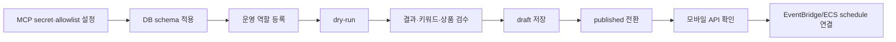

위 문장은 v1 구현 당시의 상태 기록이다. v2에는 EventBridge/ECS 프로비저닝 스크립트와 별도 운영 검증 절차가 추가됐다.

---

## 14. 테스트와 검증 결과

### 14.1 백엔드 단위 테스트

[`test_product_seasonal_pipeline.py`](../../services/backend/tests/test_product_seasonal_pipeline.py)에 다음 검증을 추가했다.

- 유해·광고·비화장품 keyword 제거
- category·finish 자동 추론
- confidence 범위 제한
- MCP `structuredContent` 처리
- MCP 실패 fallback
- stale source fallback
- trend keyword와 상품 속성 매칭
- 브랜드·카테고리 다양성
- 상품 부족 시 인기 상품 보충

### 14.2 API·서비스 테스트

- 모바일 요청 경로에서 live provider 미호출
- published collection 미존재 fallback
- DB 미연결 packaged catalog fallback
- sparse collection 보충
- category별 최대 60개 조회
- external product like identity 보존
- 기존 AR·개인화·코호트 fallback 보존
- stale/source metadata 응답

### 14.3 모바일 계약 테스트

- 얼굴 분석 전체 추천 제거
- 개인정보 설정 route 제거
- 로그인 동의 문구
- 내부·외부 좋아요 유지
- 시즌 URL 안정화와 중복 요청 제거
- 더보기 category 서버 요청
- 2열 grid와 lazy rendering
- 탭과 상품 겹침 방지 style
- AURADIN orb 유지

### 14.4 실행 결과

| 검증 | 결과 |
| --- | --- |
| 백엔드 제품 추천 테스트 | `129 passed, 1 skipped` |
| 모바일 TypeScript | 통과 |
| 제품 추천 contract test | 통과 |
| DB 없는 로컬 시즌 API | HTTP 200, 상품 12개 |
| iOS 실기기 build/install | 성공 |
| 실기기 추천 화면 | 사용자 확인 완료 |
| diff whitespace 검사 | `git diff --check` 통과 |

---

## 15. 이번에 구현하지 않은 2차 후보

`AR 필터 기반 추천제품`을 `메이크업 추천 리포트 기반 추천제품`으로 바꾸는 작업은 이번 범위에서 구현하지 않았다. 메이크업 추천 리포트의 구조화 데이터 계약과 품질 기준이 아직 확정되지 않았기 때문이다.

추후 목표 구조:

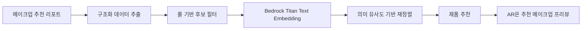

2차 구현 전까지 AR section과 API는 기존 호환성을 유지한다.

---

## 16. 주요 변경 파일 지도

### Backend

| 파일 | 역할 |
| --- | --- |
| [`product_trend_sources.py`](../../services/backend/app/services/product_trend_sources.py) | MCP/Naver/curated adapter와 정규화 |
| [`product_seasonal_pipeline.py`](../../services/backend/app/services/product_seasonal_pipeline.py) | 후보 조회, 점수화, 다양성, 저장 |
| [`product_recommendations.py`](../../services/backend/app/services/product_recommendations.py) | 캐시된 시즌 API 데이터 조립과 fallback |
| [`product_seasonal.py`](../../services/backend/app/services/product_seasonal.py) | 수동 manifest의 새 metadata·점수 필드 지원 |
| [`product_external_catalog.py`](../../services/backend/app/services/product_external_catalog.py) | 동적 trend keyword 기반 외부 catalog 매칭 |
| [`products.py`](../../services/backend/app/api/products.py) | ETag, Cache-Control, source metadata |
| [`users.py`](../../services/backend/app/services/users.py) | 가입 약관 기반 최초 제품 동의 이력 |
| [`refresh_product_seasonal_trends.py`](../../services/backend/app/ops/refresh_product_seasonal_trends.py) | dry-run/draft/publish 운영 명령 |

### Mobile

| 파일 | 역할 |
| --- | --- |
| [`ProductRecommendationScreen.tsx`](../../apps/mobile/src/features/recommendation/screens/ProductRecommendationScreen.tsx) | 간소화된 추천 허브 shell과 좋아요 |
| [`ProductRecommendationHubContent.tsx`](../../apps/mobile/src/features/recommendation/components/ProductRecommendationHubContent.tsx) | 요청 우선순위, 시즌 metadata, 설정 링크 제거 |
| [`ProductRecommendationShelfScreen.tsx`](../../apps/mobile/src/features/recommendation/screens/ProductRecommendationShelfScreen.tsx) | 더보기 탭 겹침·lazy grid 수정 |
| [`productHubService.ts`](../../apps/mobile/src/features/recommendation/services/productHubService.ts) | 모바일 시즌 캐시·요청 중복 제거 |
| [`LoginScreen.tsx`](../../apps/mobile/src/features/auth/screens/LoginScreen.tsx) | 가입 동의 안내 문구 |

### Schema·문서·테스트

| 파일 | 역할 |
| --- | --- |
| [`schema.sql`](../backend/schema.sql) | PostgreSQL 시즌 metadata·점수 컬럼 |
| [`aws-postgresql-schema.dbml`](../backend/aws-postgresql-schema.dbml) | AWS PostgreSQL ERD 정본 |
| [`08-seasonal-trend-mcp-pipeline.md`](08-seasonal-trend-mcp-pipeline.md) | MCP tool 계약과 운영 요약 |
| [`test_product_seasonal_pipeline.py`](../../services/backend/tests/test_product_seasonal_pipeline.py) | 신규 파이프라인 단위 테스트 |
| [`run-product-recommendation-contract.mjs`](../../scripts/mobile/run-product-recommendation-contract.mjs) | 모바일 회귀 계약 |

---

## 17. v1 종료 시점 상태와 당시 남은 작업 — 현재 체크리스트 아님

### 완료

- 모바일·백엔드 구현
- DB schema 문서 갱신
- MCP adapter와 fallback adapter
- 배치 운영 명령
- API cache와 fallback
- 좋아요·상세·AURADIN 회귀 보호
- 자동 테스트
- 로컬 API 검증
- iOS 실기기 화면 확인

### 당시 운영 반영 전 필요했던 항목

- [ ] 실제 MCP 서버 URL/tool 설정
- [ ] MCP allowlist와 secret 등록
- [ ] 운영 PostgreSQL migration 실행
- [ ] seasonal editor/reviewer/publisher 등록
- [ ] 실제 MCP 결과 dry-run 검수
- [ ] 최초 published collection 생성
- [ ] EventBridge/ECS schedule 연결
- [ ] 최신 백엔드 이미지 배포
- [ ] 배포 환경에서 시즌 API와 좋아요 흐름 재검증

위 체크리스트는 v1을 배포하지 않기로 한 시점의 기록이다. v2 운영 경로는 MCP endpoint를 요구하지 않으며, 고정 curated 신호를 게시 근거로 사용하지 않는다. 현재 배포 상태와 실행 명령은 문서 12에서 확인한다.
