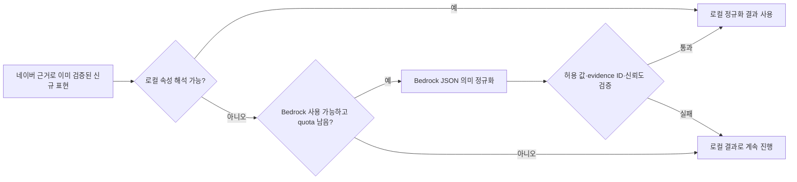
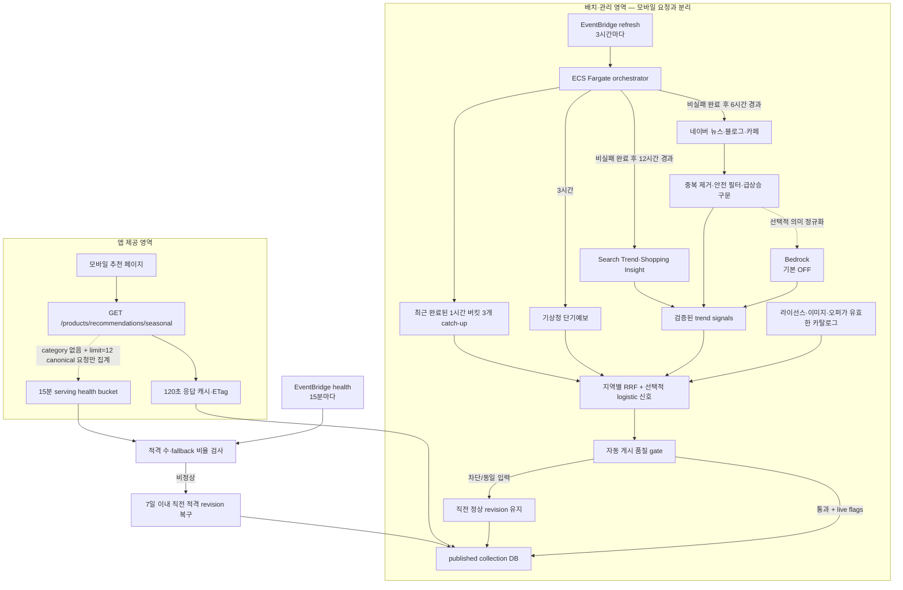
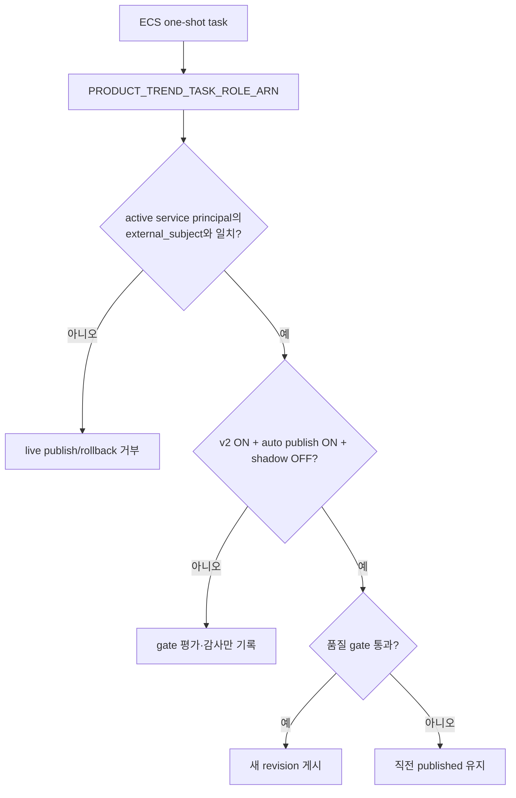
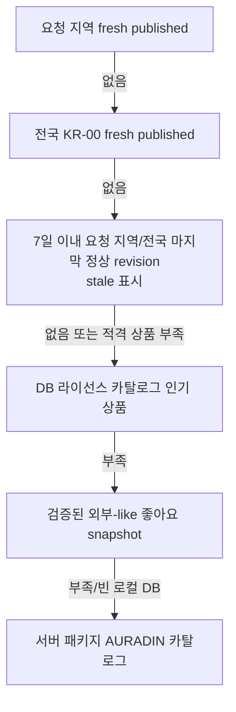
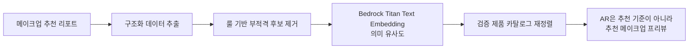

# 추천제품 구현 브리핑 — 요즘 트렌드 제품 자동화 v2

- 작성일: 2026-07-16
- 대상 브랜치: `feature/sj-product-recommend`
- 문서 기준: 현재 저장소의 v2 구현 코드와 운영 스크립트
관련 스키마: [`../backend/schema.sql`](../backend/schema.sql), [`../backend/aws-postgresql-schema.dbml`](../backend/aws-postgresql-schema.dbml)

> 이 문서는 **저장소에 구현된 구조**를 설명한다. AWS EventBridge/ECS/RDS에 실제로 배포·등록했다는 뜻은 아니다. 실제 AWS 프로비저닝, 7일 shadow 관찰, 운영 알람과 Budget 연결은 배포 담당자가 수행해야 하는 운영 후속 작업이다.

시즌/트렌드 자동화에 관한 설명은 이 문서를 기준으로 하며, [`11-product-recommendation-implementation-briefing.md`](./11-product-recommendation-implementation-briefing.md)의 이전 MCP·시즌 설명보다 우선한다.

## 1. 무엇이 바뀌었나

기존의 고정된 **“시즌 상품”**을 **“요즘 트렌드 제품”**으로 바꾸고, 네이버 콘텐츠·검색 관심도·쇼핑 클릭 관심도·기상청 날씨·앱 안의 익명 집계 신호를 사용해 컬렉션을 다시 계산하도록 구성했다.

핵심 원칙은 다음과 같다.

- 모바일 요청은 네이버, 기상청, Bedrock, MCP를 호출하지 않는다.
- 외부 수집과 순위 계산은 예약된 백엔드 작업에서만 수행한다.
- 앱 API는 PostgreSQL에 게시된 컬렉션과 서버 캐시만 빠르게 읽는다.
- 외부 수집이 실패해도 직전 정상 컬렉션과 인기 상품 fallback으로 화면을 채운다.
- 상품 좋아요, 상세, 구매 링크, 개인화·코호트·AURADIN의 기존 계약을 유지한다.
- 자동 게시에는 사람 계정 대신 ECS task role과 결합된 service principal을 사용한다.

이 자동화의 범위는 내부 section 이름이 `seasonal`인 **“요즘 트렌드 제품”**뿐이다. 수집 신호, RRF/logistic, 자동 게시, 15분 health와 rollback은 `trend-now-%` seasonal collection에만 적용한다. AR 추천, 개인화 추천, 코호트 추천, AURADIN의 후보 생성·점수·순위는 이 파이프라인으로 바꾸지 않는다.

현재 상태를 구분하면 다음과 같다.

| 구분 | 상태 | 의미 |
| --- | --- | --- |
| 백엔드 수집·매칭·게시 코드 | 저장소에 구현 | 로컬/테스트 DB에서 실행 가능한 코드 경로가 있음 |
| 모바일 지역 전환·fallback UI | 저장소에 구현 | 전국 결과를 먼저 그리고 지역 결과를 나중에 교체 |
| DB 스키마·무결성 제약 | 저장소에 반영 | 실제 환경에서는 최신 스키마 적용이 필요 |
| EventBridge/ECS 설정 스크립트 | 저장소에 구현 | 실행 전에는 AWS 리소스가 만들어진 것으로 간주하면 안 됨 |
| AWS 실제 배포·7일 shadow 결과 | 운영 후속 | 이 문서 작성 시점에는 배포 완료를 주장하지 않음 |

## 2. MCP, 네이버 API, Bedrock의 역할

### 2.1 네이버 API 호출은 MCP가 아니다

네이버 Search API와 DataLab API를 HTTP로 직접 호출하는 것은 **외부 API 연동**이다. MCP는 AI 에이전트가 여러 도구를 발견하고 공통 프로토콜로 호출하도록 만드는 연결 규격이다. API를 자동으로 예약 실행한다고 해서 MCP가 되는 것은 아니다.

이번 v2의 실제 예약 실행 경로는 다음과 같다.

```text
app.ops.refresh_trend_now_products
→ product_trend_orchestrator
→ NaverContentTrendProvider
→ NaverTrendMomentumService
→ KmaWeatherProvider
→ DB collection publish
```

이 경로에는 `MCPTrendSourceAdapter`가 없다. [`product_trend_sources.py`](../../services/backend/app/services/product_trend_sources.py)에 이전 호환용 MCP 어댑터와 `PRODUCT_TREND_MCP_*` 설정은 남아 있지만, [`refresh_trend_now_products.py`](../../services/backend/app/ops/refresh_trend_now_products.py)에서 시작하는 v2 운영 작업은 이를 선택하거나 호출하지 않는다.

따라서 v2를 운영하기 위해 `PRODUCT_TREND_MCP_URL`을 설정할 필요가 없다. 예전 명령인 `app.ops.refresh_product_seasonal_trends`도 새 EventBridge 대상이 아니다.

MCP가 유용해지는 시점은 네이버·소셜·검색·관리 도구처럼 서로 다른 도구를 에이전트가 실행 중에 발견하고 조합해야 할 때다. 지금처럼 공급자와 호출 주기, 요청 형식이 미리 정해진 배치에는 직접 API 호출이 더 단순하고 호출량·재시도·감사 추적도 명확하다.

### 2.2 Bedrock은 선택적인 의미 정규화기다

Bedrock은 다음 일을 **하지 않는다**.

- 네이버 콘텐츠 수집
- 현재 유행 여부 판정
- 상품 검색 또는 상품 순위 계산
- 모바일 요청 처리
- fallback 상품 생성

Bedrock이 맡는 일은 로컬 규칙이 해석하지 못한 **새롭고 모호한 뷰티 표현을 허용된 상품 속성으로 정규화**하는 것뿐이다. 예를 들어 “복숭아 우유빛 메이크업”이라는 표현이 실제 급상승 근거를 통과했지만 카테고리·피니시·효능을 로컬 사전만으로 정하기 어려울 때만 호출 후보가 된다.



현재 비용·안전 경계는 코드와 DB quota 원장으로 제한한다.

- 기본값은 `PRODUCT_TREND_BEDROCK_ENABLED=false`다.
- 신규이면서 로컬 속성이 모호하고 안전한 뷰티 표현이 있을 때만 후보가 된다.
- 하루 최대 1회, 월 최대 31회다. **하루 1회는 상한이지 매일 호출한다는 뜻이 아니다.** 조건을 만족하는 표현이 없으면 0회다.
- 한 orchestrator run에서도 한 번만 분류 요청을 만든다.
- 입력 설정 상한은 8,000이다. 구현은 system 문구와 prompt의 UTF-8 byte 길이를 이 수치 이하로 더 보수적으로 줄인 뒤 호출하므로 실제 입력 토큰은 그보다 작을 수 있다.
- 출력은 Bedrock `maxTokens=800`으로 제한한다.
- Bedrock이 반환한 keyword, category, benefit, finish, `evidenceIds`, confidence를 허용 목록과 원래 근거 hash에 다시 대조한다.
- quota DB를 사용할 수 없거나 timeout·AWS 오류·JSON 오류가 발생하면 호출 또는 결과 사용을 중단하고 로컬 통계 경로로 계속 간다.
- 실제 input/output token 사용량과 호출 횟수는 `seasonal_pipeline_runs`에 기록한다.

즉, Bedrock을 꺼도 수집·급상승 판정·날씨 재정렬·RRF·fallback은 작동한다. “7일마다 반드시 한 번 호출”하는 정책도 현재 구현에는 없다. 비용을 더 보수적으로 운영하려면 계속 비활성화하거나 별도의 주간 quota 정책을 추가해야 한다.

## 3. 전체 구조



외부 API 실패는 해당 단계의 실패로 기록하지만 모바일 요청까지 전파하지 않는다. 모든 공급자 호출은 [`product_trend_orchestrator.py`](../../services/backend/app/services/product_trend_orchestrator.py) 안에서 끝나고, API는 이미 저장된 결과를 읽는다.

## 4. 언제 무엇이 갱신되는가

하나의 EventBridge refresh rule이 3시간마다 orchestrator를 실행한다. orchestrator는 DB에 저장된 마지막 비실패 완료 시각을 보고 단계별 주기를 독립적으로 판단한다.

| 작업 | 실행 기준 | 구현 의미 |
| --- | --- | --- |
| 앱 행동 집계 | refresh run마다 | 최근 완료된 UTC 1시간 버킷 3개를 순서대로 재집계해 3시간 사이의 시간대를 놓치지 않음 |
| 기상청 | 마지막 비실패 완료 후 3시간 | 17개 시·도와 전국 `KR-00` snapshot 갱신 |
| 네이버 콘텐츠 | 마지막 비실패 완료 후 6시간 | 뉴스·블로그·카페에서 급상승 표현 발견 |
| Search Trend·Shopping Insight | 마지막 비실패 완료 후 12시간 | 발견된 후보의 관심도 상승을 검증 |
| logistic 학습·검증 | 마지막 완료 후 24시간 | 데이터 최소 기준을 충족할 때만 후보 모델 생성 |
| 지역 컬렉션 재평가 | refresh run마다 | 캐시된 신호로 전국+17개 지역 후보를 계산 |
| serving health 검사 | 별도 rule로 15분마다 | 적격 상품 수와 최근 fallback 비율 검사 |

“앱 행동을 매시간 집계한다”는 표현은 **1시간 단위 버킷**이라는 뜻이다. 현재 AWS 스크립트는 별도의 매시간 작업을 만들지 않고, 3시간 refresh가 직전 3개 완료 버킷을 catch-up한다. 따라서 저장 결과의 해상도는 1시간이고 실행 지연 상한은 약 3시간이다.

성공했지만 결과가 0건인 수집도 `step_results`의 완료 상태로 watermark를 전진시킨다. 반대로 실패한 run이나 설정된 최대 실행 시간을 넘긴 `running` run은 같은 idempotency slot에서 재시도할 수 있다. PostgreSQL advisory lock과 `idempotency_key`는 EventBridge 중복 전달로 같은 revision이 반복 생성되는 것을 막는다.

## 5. 트렌드를 찾고 검증하는 방법

### 5.1 고정 유행어 대신 동적 검색 시작점 사용

네이버 수집 seed는 코드에 “여름 파운데이션”, “겨울 보습” 같은 시즌 문구를 고정하지 않는다. 다음 저장 데이터를 조합한다.

- 카탈로그의 카테고리와 검증된 product tag
- 최근 qualified 트렌드 후보
- 개인정보 기준을 통과한 익명 search intent
- 최근 후보의 신뢰도와 관측 시각

콘텐츠에서는 URL·제목을 hash로 중복 제거하고 2~4단어의 안전한 뷰티 구문을 뽑는다. 성인·비화장품·광고·공동구매성 표현은 제외한다. 원문 본문이나 raw URL을 트렌드 테이블에 저장하지 않고, 집계 count와 불투명한 근거 ID를 사용한다.

최근 24시간의 서로 다른 문서 수를 7일·28일의 zero-filled 기준선과 비교한다. 기본 burst gate는 다음과 같다.

- 서로 다른 문서 5건 이상
- 뉴스·블로그·카페 중 서로 다른 source type 2개 이상
- z-score 2.5 이상

DataLab은 Search Trend와 Shopping Insight의 최근 7일을 직전 7일과 비교한다. 한 요청당 최대 5개 키워드로 나누고, 서로 다른 batch의 절대 ratio를 직접 비교하지 않는다. 콘텐츠 burst, 양수 DataLab 변화, privacy-eligible app intent는 서로 다른 신호군으로 보존한다.

### 5.2 raw 검색어를 남기지 않는 search intent

상품 검색 API는 요청을 처리하는 순간에만 검색어를 정규화한다. 서버가 최근 트렌드 후보와 보수적으로 매칭한 뒤 다음 값만 이벤트 context에 넣는다.

- `trendIntentHash`: `PRODUCT_EVENT_SIGNING_SECRET`으로 만든 domain-separated HMAC-SHA256
- `trendCandidateId`: 충분히 유사한 기존 후보가 있을 때만 넣는 UUID

raw query와 정규화된 query는 `search_intent_hourly`에 저장하지 않는다. HMAC secret이 없으면 intent hash 자체를 만들지 않는다. 집계에는 최신 `engagement_personalization` 동의가 유효한 사용자만 포함하고, 한 버킷의 서로 다른 사용자 수가 20명 이상일 때만 `is_privacy_eligible=true`가 된다.

HMAC은 검색어 암호화가 아니라 동일 intent를 연결하기 위한 불투명 식별자다. 따라서 secret은 환경 비밀로 관리하고, 앱이 만든 hash를 신뢰하지 않으며 서버가 이벤트 context를 작성한다.

### 5.3 지역 날씨와 위치 정보

모바일은 위도·경도를 기기에서 시·도 코드로 변환하고 서버에는 `regionCode`만 전달한다.

- 전국: `KR-00`
- 지역: 17개 시·도 코드
- 위치 미동의·실패·알 수 없는 주소: `KR-00`
- 지역 코드 기기 캐시: 6시간
- 서버 날씨 freshness: 4시간

추천 페이지는 `KR-00` 응답을 먼저 화면에 표시한다. 초기 interaction이 끝난 뒤에만 위치 권한과 지역 코드를 확인하고, 성공하면 시즌 섹션만 지역 결과로 갱신한다. 지역 요청이 실패해도 이미 보이던 전국 상품과 현재 카테고리를 지우지 않는다.

서버 요청·트렌드 DB에는 위도·경도 컬럼이 없다. 지역별 앱 행동 학습도 기기 좌표를 사용하지 않고 `KR-00` privacy aggregate를 사용한다.

## 6. 상품 매칭과 순위

### 6.1 점수 계산 전에 제거하는 상품

다음 조건을 통과한 상품만 자동 컬렉션 후보가 된다.

- `catalog_status=published`, 활성 상태, 라이선스 유효
- `mobile_display`, `recommendation` 사용 허용
- 유효한 packshot 이미지 존재
- 구매 링크와 offer가 유효하고 가격 freshness 충족
- 재고 있음 또는 한정 재고
- sponsored offer가 아님

날씨 적합도에는 `product_attribute_evidence`에서 `verified`이며 신뢰도 0.8 이상인 finish, texture, coverage, lightweight, hydrating, moisturizing, oil-control, waterproof, longwear 등의 속성만 사용한다. Bedrock의 트렌드 표현 해석만으로 상품 속성을 verified로 승격하지 않는다.

### 6.2 RRF가 기본이고 logistic은 조건부 보조 신호다

기본 순위는 서로 단위가 다른 값을 억지로 더하지 않고 각 신호의 독립 순위를 RRF(Reciprocal Rank Fusion)로 합친다.

- 네이버 콘텐츠 급상승 강도
- Search Trend·Shopping Insight 변화율
- 지역 날씨와 검증 상품 속성의 적합도
- 최근 24시간과 직전 24시간의 privacy-eligible 앱 반응 상승
- 상품 속성 근거·이미지·오퍼 적격 품질

경량 logistic 모델은 처음부터 켜지지 않는다. 최근 28일에 다음 조건을 모두 충족해야 shadow 후보를 학습한다.

- 노출 2,000회 이상
- 유효 행동 100회 이상
- 시간 순서로 학습/검증 구간 분리
- NDCG@12가 현재 RRF 또는 active 모델보다 3% 이상 개선

조건을 통과한 모델만 active가 되며, learned score도 독립 순위 하나로 RRF에 들어간다. 모델 버전은 collection fingerprint와 item의 `rankingModelVersion`에 남아 같은 입력을 재현할 수 있게 한다.

탐색은 active 정책을 무제한 섞지 않는다. deterministic hash가 선택한 최대 5%의 collection allocation에서만 상위 30개 적격 후보 중 하나를 마지막 슬롯에 넣고 `CONTROLLED_EXPLORATION` reason을 남긴다. 최종 결과에는 브랜드당 최대 2개, 카테고리 최소 4개, 단일 카테고리 최대 40% 규칙을 적용한다.

## 7. 자동 게시와 권한 경계

자동 게시에는 두 개의 신원이 함께 맞아야 한다.

1. DB의 `product_recommendation_service_principals` 행
2. ECS task에 주입된 `PRODUCT_TREND_TASK_ROLE_ARN`

기본 principal은 `trend-now-orchestrator`, role은 `seasonal_auto_publisher`다. DB 행의 `external_subject`가 실제 task role ARN과 정확히 일치해야 live publish와 rollback을 수행할 수 있다. DB 행에 AWS credential을 저장하지 않는다.



게시 목표는 18개이고 최소 상품 수는 12개다. 품질 gate는 다음을 함께 확인한다.

- 독립 신호군 2개 이상
- 콘텐츠 6시간, DataLab 36시간, 날씨 4시간 이내
- 평균 confidence 0.65 이상
- 상위 12개의 동일 브랜드 최대 2개
- 전체 카테고리 4개 이상, 단일 카테고리 최대 40%
- 라이선스·이미지·오퍼 적격률 100%, sponsored 0개
- 이전 revision과 다른 input fingerprint
- 상위 상품 2개 이상 또는 날씨 맥락의 의미 있는 변화

동일 fingerprint는 새 revision을 만들지 않는다. 상위 12개가 8개 넘게 급변하면 3개 이상의 독립 신호군이 없을 때 차단한다.

게시·차단·생략·rollback 결정은 `seasonal_auto_publish_audit_log`에 기록한다. 스키마 trigger는 이 감사 로그의 UPDATE, DELETE, TRUNCATE를 차단한다. 한 slug에는 published revision이 하나만 존재하도록 partial unique index도 적용한다. 기존 DB에 과거 writer가 남긴 중복 published revision이 있으면 `schema.sql`이 revision·발행 시각 순으로 가장 최신 행 하나만 남기고 이전 행을 `superseded_by_schema_repair`로 먼저 중지한 뒤 index를 만든다.

## 8. 15분 건강 점검과 자동 rollback

시즌 API는 응답을 반환한 뒤 background task로 `seasonal_serving_health_buckets`에 요청 수와 fallback 여부를 best-effort 집계한다. 단, **category가 없고 `limit=12`인 canonical seasonal 요청**만 health 표본에 포함한다. `category=base`, `category=lip`처럼 더보기 화면이 만드는 카테고리별 요청과 임의 limit 요청은 사용자 탐색·호출 방식에 따라 비율이 치우칠 수 있으므로 집계에서 제외한다. 기록 실패는 사용자 응답을 실패시키지 않는다.

별도 15분 EventBridge rule은 직전 완료 버킷을 검사한다. 현재 게시 revision의 유효 상품이 12개 미만이면 상품 적격성 장애로 판단할 수 있다. fallback ratio로 rollback하려면 다음 조건을 **모두** 만족해야 한다.

- category 없음과 `limit=12`를 모두 만족하는 canonical seasonal 요청만으로 계산한 표본
- 완료된 15분 버킷의 요청 수가 최소 20건
- 검사 대상 collection이 해당 버킷 시작보다 120초 이상 먼저 published 상태여서 API 응답 캐시까지 교체된 완전한 post-publish 구간
- fallback 비율이 10% 초과

collection이 버킷 도중 새로 게시되거나 복구된 경우, 또는 canonical 요청이 20건 미만이면 그 버킷의 fallback ratio만으로 rollback하지 않는다. 배포 직후의 혼합 트래픽이나 작은 표본이 정상 revision을 잘못 되돌리는 일을 막기 위한 조건이다.

복구 후보는 같은 `trend-now-%` slug의 suspended revision 중 7일 이내 후보이며, 복구 직전에 다음 조건을 다시 검사한다.

- 현재도 적격 상품 12개 이상
- 콘텐츠 근거가 6시간 이내
- DataLab 근거가 36시간 이내
- 날씨 근거가 4시간 이내

freshness는 `publishedAt`의 나이가 아니라 collection source payload의 `contentUpdatedAt`, `datalabUpdatedAt`, `weatherUpdatedAt`을 현재 시각과 비교해 판정한다. fallback 비율만 나쁜 경우에는 세 source SLA를 모두 만족하는 fresh 후보만 복구한다. 상품 수가 12개 미만인 가용성 장애에서는 화면 복구를 우선해 7일 이내 stale 후보도 허용하되 stale 상태를 그대로 표시한다. stale current revision에는 fallback 비율 rollback을 다시 적용하지 않고 상품 적격 수만 검사하므로 더 오래된 revision으로 연쇄 rollback하지 않는다. 현재 revision 중지와 이전 revision 복구, immutable audit 기록은 한 transaction에서 처리한다. 복구할 때 후보의 원래 `publishedAt`을 현재 시각으로 덮어쓰지 않아 최초 게시 이력을 보존하고, 실제 복구 시각과 판단 근거는 health run/audit log에 별도로 남긴다.

health task는 현재 버킷을 검사하기 전에 최근 실패 run, 최대 실행 시간을 넘긴 `running` run, 그리고 serving bucket은 있지만 대응 health run이 없는 버킷을 최대 3개까지 찾아 같은 idempotency slot으로 먼저 재처리한다. 따라서 ECS container가 DB run 생성 전 종료되거나 실행 중 실패해도 다음 15분 task가 누락 구간과 현재 구간을 함께 처리한다.

## 9. API와 모바일 fallback

기존 route와 `success()` envelope, camelCase item shape를 유지한다.

```http
GET /api/products/recommendations/seasonal?locale=ko-KR&regionCode=KR-11&category=base&limit=12
```

라우터 내부 경로는 `/products/recommendations/seasonal`이고, 로컬 앱과 배포 API prefix를 포함한 실제 요청은 `/api/products/recommendations/seasonal`이다.

collection metadata에는 `regionCode`, `regionLabel`, `weatherSummary`, `weatherUpdatedAt`, `trendUpdatedAt`, `generatedAt`, `algorithmVersion`, `freshnessStatus`, `sourceLabels`, `sourceName`, `bedrockUsed`, `nextEvaluationAt`을 camelCase로 제공한다. 이 값으로 앱이 stale/fallback임을 숨기지 않고 출처와 갱신 상태를 표시한다.

표시 순서는 다음과 같다.



모든 fallback은 외부 네트워크를 기다리지 않는다. DB가 새로 초기화됐거나 공급자가 모두 실패해도 서버 패키지 카탈로그까지 확인한다. 사용 가능한 상품이 정말 하나도 없을 때만 `items: []`가 가능하다.

인증이 없는 시즌 요청은 public cache를 사용할 수 있다. 로그인 사용자는 DB의 좋아요를 반영한 `viewerState.liked` 때문에 private cache와 사용자별 ETag를 사용한다. 내부 상품과 허용된 external-like 상품은 기존 좋아요·상세·구매 링크 계약을 유지한다.

모바일의 “더보기” 화면은 카테고리 header 아래 content inset을 유지하고, 지역 갱신 중 기존 상품을 지우거나 선택 카테고리를 초기화하지 않는다. 사용자에게 보이는 문구는 “시즌 상품” 대신 “요즘 트렌드 제품”을 사용한다.

## 10. 주요 코드와 데이터 위치

| 파일 | 역할 |
| --- | --- |
| [`product_trend_orchestrator.py`](../../services/backend/app/services/product_trend_orchestrator.py) | 3시간 run, due 판단, source 호출, 18개 지역 계산, 게시 결정 |
| [`product_trend_discovery.py`](../../services/backend/app/services/product_trend_discovery.py) | 네이버 콘텐츠 정규화, 중복 제거, 안전 구문, 24h/7d/28d burst |
| [`product_trends.py`](../../services/backend/app/services/product_trends.py) | Search Trend·Shopping Insight 변화율과 5개 batching |
| [`product_weather.py`](../../services/backend/app/services/product_weather.py) | 기상청 예보 정규화와 17개 지역+전국 snapshot |
| [`product_trend_bedrock.py`](../../services/backend/app/services/product_trend_bedrock.py) | 선택적 신규 표현 의미 정규화와 비용·근거 검증 |
| [`product_trend_learning.py`](../../services/backend/app/services/product_trend_learning.py) | 1시간 집계 catch-up, privacy gate, logistic 학습·승격 |
| [`product_seasonal_pipeline.py`](../../services/backend/app/services/product_seasonal_pipeline.py) | 카탈로그 적격성, RRF, 다양성, collection 저장 |
| [`product_trend_quality.py`](../../services/backend/app/services/product_trend_quality.py) | fingerprint, freshness·다양성·급변 자동 게시 gate |
| [`product_trend_health.py`](../../services/backend/app/services/product_trend_health.py) | 15분 serving health 집계와 transaction rollback |
| [`products.py`](../../services/backend/app/api/products.py) | 시즌 API, optional auth/liked, ETag, search intent HMAC |
| [`product_recommendations.py`](../../services/backend/app/services/product_recommendations.py) | 지역→전국→stale→popular→packaged 제공 순서 |
| [`trendRegionService.ts`](../../apps/mobile/src/features/recommendation/services/trendRegionService.ts) | 기기 위치를 17개 지역 코드로 변환·6시간 캐시 |
| [`ProductRecommendationHubContent.tsx`](../../apps/mobile/src/features/recommendation/components/ProductRecommendationHubContent.tsx) | 전국 우선 표시 후 지역 섹션 갱신 |
| [`ProductRecommendationShelfScreen.tsx`](../../apps/mobile/src/features/recommendation/screens/ProductRecommendationShelfScreen.tsx) | 더보기, 카테고리별 지역 결과, 실패 시 기존 화면 보존 |
| [`configure_trend_now_schedule.ps1`](../../scripts/aws/configure_trend_now_schedule.ps1) | digest-pinned ECS task, 3시간/15분 EventBridge rule, health 실패 log metric/CloudWatch alarm 구성 |

핵심 DB 테이블은 다음과 같다.

| 테이블 | 저장 내용 |
| --- | --- |
| `trend_keyword_candidates` | observed/qualified 후보, 정규화 속성, confidence, 만료 |
| `trend_source_observations` | source별 집계, 7일·28일 기준선, 변화율, 근거 hash |
| `weather_region_snapshots` | 지역 코드별 예보와 freshness; 좌표 없음 |
| `product_attribute_evidence` | 상품 속성 근거와 검증 상태 |
| `product_signal_hourly` | 동의 기반 상품 행동 1시간 집계 |
| `search_intent_hourly` | raw query 없는 HMAC intent 집계 |
| `seasonal_ranking_models` | shadow/active 모델과 NDCG 검증 결과 |
| `seasonal_pipeline_runs` | idempotency, 단계 결과, source quota, 모델·Bedrock 사용량 |
| `trend_external_call_quotas` | 공급자별 일·월 호출 예약 원장 |
| `product_recommendation_service_principals` | task role과 결합된 자동 게시 workload identity |
| `seasonal_auto_publish_audit_log` | 게시·차단·생략·rollback append-only 감사 |
| `seasonal_serving_health_buckets` | 15분 요청·fallback 수 |

## 11. 설정과 비용 경계

주요 기본값은 [`services/backend/.env.example`](../../services/backend/.env.example)에 있다. 비밀값 자체는 문서나 Git에 넣지 않는다.

직접 수집을 켜는 최소 설정의 형태는 다음과 같다. ID, secret, service key는 ECS Secrets Manager 참조로 주입한다.

```dotenv
NAVER_TREND_CONTENT_ENABLED=true
NAVER_SHOPPING_CLIENT_ID=<secret>
NAVER_SHOPPING_CLIENT_SECRET=<secret>
NAVER_API_HUB_CLIENT_ID=<secret-if-api-hub-is-used>
NAVER_API_HUB_CLIENT_SECRET=<secret-if-api-hub-is-used>
NAVER_SHOPPING_INSIGHT_ENABLED=true
KMA_WEATHER_ENABLED=true
KMA_WEATHER_SERVICE_KEY=<secret>
PRODUCT_EVENT_SIGNING_SECRET=<secret>

# 선택 기능: 기본은 꺼 둔다.
PRODUCT_TREND_BEDROCK_ENABLED=false
PRODUCT_TREND_BEDROCK_MODEL_ID=

# v2 운영 경로에서는 설정하지 않아도 된다.
PRODUCT_TREND_MCP_URL=
```

| 공급자/작업 | 코드 상한 또는 실행량 | 비고 |
| --- | --- | --- |
| 네이버 콘텐츠+DataLab | 월 3,000 call reservation 공유 | provider key `naver`; retry 최악 횟수까지 선예약 |
| 기상청 | 월 10,000 call reservation | 17개 지역 수집과 전국 집계 |
| Bedrock trend classifier | 하루 1회, 월 31회, 입력 UTF-8 byte 보수 상한 8,000, 출력 `maxTokens` 800 | 기본 OFF, 조건이 없으면 0회 |
| refresh Fargate | 3시간마다, 하루 최대 8회 | 실제 실행 시간에 따라 과금 |
| health Fargate | 15분마다, 하루 최대 96회 | 현재 스크립트는 같은 one-shot task를 사용하므로 비용 관찰 필요 |

이 상한은 AWS 청구 금액 자체를 제한하는 Budget이 아니다. 저장소 스크립트는 health task의 `trend_now_health_task_failed` 구조화 로그에 CloudWatch metric filter와 alarm을 만든다. `AlarmSnsTopicArn`을 넘기면 해당 alarm action도 연결한다. AWS Budget, SNS topic/구독 자체, EventBridge DLQ는 자동 생성하지 않으므로 운영 후속으로 별도 구성해야 한다.

## 12. 로컬 검증 방법

### 12.1 백엔드 테스트

`services/backend`에서 의존성이 설치된 Python 환경으로 실행한다.

```bash
python -m pytest tests/test_product_trend_automation.py tests/test_product_trend_orchestrator.py tests/test_product_trend_learning.py tests/test_product_trend_quality.py tests/test_product_trend_health.py tests/test_product_trend_regions.py tests/test_product_seasonal_pipeline.py tests/test_product_recommendation_v2_extended.py
```

DB를 사용하는 검증 환경에서는 최신 스키마를 적용하고 무결성 검사도 실행한다.

```bash
python -m app.db.init_db
python -m app.db.check_schema
```

shadow 설정에서 수동 run을 확인한다. `--auto-publish`를 주더라도 shadow/feature flag가 live 조건을 만족하지 않으면 게시하지 않는다.

```bash
python -m app.ops.refresh_trend_now_products --trigger manual --auto-publish
python -m app.ops.check_trend_now_health
```

로컬 API 확인 예시는 다음과 같다.

```bash
curl -i 'http://127.0.0.1:8000/api/products/recommendations/seasonal?locale=ko-KR&regionCode=KR-00&category=base&limit=12'
```

확인할 항목은 `success()` envelope, `items`, camelCase metadata, ETag/Cache-Control, `regionCode`, `freshnessStatus`, fallback 시 빈 화면 방지, 로그인 요청의 `viewerState.liked`다.

### 12.2 모바일 검증

`apps/mobile`에서 실행한다.

```bash
npm run typecheck
npm run test:product-recommendation
npm run test:ios-privacy
```

실기기에서는 추천 페이지 첫 진입, 전국 상품 선표시, 위치 동의 후 지역 교체, 더보기·카테고리 이동, 지역 요청 실패 시 기존 상품 유지, 좋아요와 사용자 페이지 반영을 확인한다.

## 13. AWS 배포 절차 — 아직 실행해야 하는 운영 작업

### 13.1 배포 전 준비

1. 최신 backend image와 스키마를 배포한다.
2. backend ECS service가 stable 상태인지 확인한다.
3. Naver/KMA 설정과 secret을 ECS task에 연결한다.
4. Bedrock이 필요할 때만 별도 trend classifier 설정을 켠다.
5. backend task role ARN을 service principal의 `external_subject`에 등록한다.

service principal 등록 예시는 다음과 같다. `<backend-task-role-arn>`은 실제 ECS task definition의 `taskRoleArn`으로 바꾼다.

```sql
insert into product_recommendation_service_principals (
  principal_key,
  display_name,
  roles,
  external_subject,
  status
) values (
  'trend-now-orchestrator',
  'Trend Now Orchestrator',
  array['seasonal_auto_publisher']::text[],
  '<backend-task-role-arn>',
  'active'
)
on conflict (principal_key) do update set
  display_name = excluded.display_name,
  roles = excluded.roles,
  external_subject = excluded.external_subject,
  status = 'active',
  updated_at = now();
```

### 13.2 EventBridge/ECS 구성 스크립트

저장소 root에서 PowerShell 7로 실행한다.

```powershell
pwsh -File ./scripts/aws/configure_trend_now_schedule.ps1 `
  -Profile aura-dev `
  -Region ap-northeast-2 `
  -ClusterName aura-backend-dev `
  -SourceServiceName aura-backend-api `
  -SourceContainerName aura-backend-api
```

스크립트가 수행하는 일은 다음과 같다.

- 현재 ECS service task definition과 실제 running task가 같은지 검사
- service가 다중 container이면 `SourceContainerName`을 명시하지 않은 실행을 거부
- running container의 `imageDigest`로 one-shot task image 고정
- source task/execution role, secret, 환경, network 설정 재사용
- inline AWS access key가 있으면 중단
- `PRODUCT_TREND_TASK_ROLE_ARN`에 source task role ARN 주입
- refresh command를 `python -m app.ops.refresh_trend_now_products --trigger scheduled --auto-publish`로 고정
- 3시간 refresh rule과 15분 health rule 생성·갱신
- health task 실패 구조화 로그의 CloudWatch metric filter와 alarm 생성
- `ecs:RunTask`와 `iam:PassedToService=ecs-tasks.amazonaws.com` 조건의 `iam:PassRole`만 부여
- 임시 JSON 디렉터리를 실행 성공·실패와 관계없이 정리

backend image digest나 source task definition이 바뀌면 스크립트를 다시 실행해야 한다. 출력되는 `SOURCE_TASK_DEFINITION_ARN`, `TASK_DEFINITION_ARN`, `IMAGE_URI`, `SCHEDULE`, `HEALTH_SCHEDULE`을 배포 증거로 보관한다.

두 rule과 target을 모두 확인한다.

```powershell
aws events describe-rule --name aura-trend-now-refresh-dev --region ap-northeast-2 --profile aura-dev
aws events list-targets-by-rule --rule aura-trend-now-refresh-dev --region ap-northeast-2 --profile aura-dev
aws events describe-rule --name aura-trend-now-health-dev --region ap-northeast-2 --profile aura-dev
aws events list-targets-by-rule --rule aura-trend-now-health-dev --region ap-northeast-2 --profile aura-dev
```

### 13.3 7일 shadow rollout

처음 7일은 다음과 같이 실제 게시를 막고 계산·gate·감사 결과만 관찰한다.

```dotenv
PRODUCT_TREND_SHADOW_MODE=true
PRODUCT_TREND_AUTO_PUBLISH_ENABLED=false
TREND_NOW_RECOMMENDATIONS_V2=false
```

관찰 항목은 source 성공률과 마지막 성공 시각, 지역별 적격 상품 수, gate 차단 이유, fallback 비율, Bedrock 0/1회 사용량, API warm-cache latency, 브랜드·카테고리 다양성이다.

7일 동안 기준을 충족한 뒤에도 한 번에 live로 바꾸지 않는다.

1. `TREND_NOW_RECOMMENDATIONS_V2=true`, auto publish OFF, shadow ON
2. `PRODUCT_TREND_AUTO_PUBLISH_ENABLED=true`, shadow는 계속 ON
3. 최종 승인 후 `PRODUCT_TREND_SHADOW_MODE=false`

각 단계마다 task definition을 배포하고 예약 스크립트를 다시 실행해 새 image digest를 연결한다. 실제 AWS에 이 절차를 수행하고 CloudWatch에서 성공을 확인하기 전까지 “자동 갱신 배포 완료”로 표시하면 안 된다.

## 14. 2차 후보 — AR에서 메이크업 추천 리포트로 전환

“AR 필터 기반 추천제품”을 “메이크업 추천 리포트 기반 추천제품”으로 바꾸는 작업은 **이번 v2에 포함하지 않는다**. 현재 AR 추천·저장·프리뷰 경로는 그대로 유지한다.

메이크업 추천 리포트 데이터가 안정된 뒤의 후보 구조는 다음과 같다.



이 2차 후보의 Titan Embedding은 이 문서의 “신규 트렌드 표현 정규화용 Bedrock”과 별도 기능이다. 리포트 스키마·품질·동의 경계가 확정되기 전에는 embedding 기반 상품 추천을 현재 코드에 섞지 않는다.
