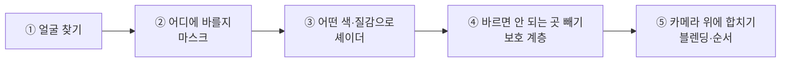

# AR 메이크업 파이프라인 — 이해를 위한 문답

> 판단하고, 감 잡고, 가설을 세우기 위한 문서입니다.
> 코드 근거와 구현 세부가 필요하면 [검증 레퍼런스](AR_MAKEUP_RENDERING_PIPELINE_REPORT_KO.md)로 가세요.

**읽는 법.** 1부(0~8장)는 카메라에 얼굴이 잡힌 순간부터 화면에 표시되기까지를 시간순으로 따라갑니다 — 원리가 쌓입니다. 2부(9~13장)는 부위별로 깊이 들어갑니다 — 립·눈썹·블러셔·파운데이션·아이라이너의 세부 포인트. 실전에서는 14장(품질 가설 지도)만 펴 놓고 역참조하면 됩니다.

**표기 약속.** 본문에는 코드 변수명을 쓰지 않습니다 — "피부 게이트"처럼 개념어로만 말하고, 실제 변수명은 부록 A 대응표에 있습니다. 예외는 이름 자체가 개념인 다섯 개뿐입니다: **Fable(ARwithFable), E3, MediaPipe, ARKit, Unity/RN**.

---

## 질문 목차

### 1부 — 파이프라인 여행

- **0장. 큰 그림** — AR 메이크업은 결국 뭘 하나 · 경로가 왜 두 개인가
- **1장. 얼굴 찾기** — 미리 vs 실시간 · MediaPipe vs ARKit · 점이 많으면 더 정밀한가 · 립은 누가 그리나
- **2장. 마스크** — 왜 흑백인가 · 미리 그린 건가 내 얼굴로 만든 건가 · 슬라이더는 뭘 바꾸나 · 채널 약속 · ⚠곱셈 구조
- **3장. 텍스처** — 마스크와 뭐가 다른가 · AI 마스크의 여행 · 왜 눈썹만 밉맵 · ⚠립만 조용히 통과 · 색 이미지 취급 금지
- **4장. 셰이더** — 왜 그냥 칠하면 안 되나 · 반투명은 왜 안 되나 · 경계가 안 보이는 원리 · 페더는 블러인가 · 반쪽 비교의 함정
- **5장. 머티리얼·블렌딩** — 공식 vs 지시서 · 블렌딩 두 층 · ⚠screen은 가짜 · 눈썹과 multiply · 검은 테두리
- **6장. 렌더러·순서** — 겹치면 뭐가 위인가 · 치아가 립 아래인 이유 · E3 최상단의 대가 · 에디터 번호는 가짜
- **7장. 보호 계층** — 손 가림 원리 · ⚠경로마다 다른 가림 · 눈썹 제거의 실체 · ⚠강도 조절 무효 · 목 인식은 AI인가
- **8장. 최종 합성** — 미끄러짐의 원인 · ⚠받는 이 없는 메시지 · 화면이 검정일 때

### 2부 — 부위별 깊이 읽기

- **9장. 립** — 링 메시가 푸는 두 문제 · 페더는 바깥만 · 광택은 빛을 더한다 · 맞춤 마스크의 한계 · 층 순서
- **10장. 눈썹** — 마스크 4칸의 의미 · 이중 눈썹의 조건 · ⚠끊긴 강도 계약 · 앞머리는 누가 처리하나 · 정적 눈썹의 꼼수
- **11장. 블러셔** — 가우시안 꼬리 · 볼만 다른 좌표를 쓰는 이유 · ⚠softness가 안 먹는 조건 · 중심과 외곽 띠
- **12장. 파운데이션과 목** — 두 경로의 전혀 다른 전략 · 실패하면 아무것도 안 그리는 이유 · 목 인식의 약점 · ⚠피부 분류는 미구현
- **13장. 아이라이너와 렌즈** — 선은 페더를 아껴야 한다 · 렌즈의 동공 구멍 · 깜박임 처리

### 3부 — 실전

- **14장. 품질 가설 지도** — 증상 → 의심 단계 → 손잡이 총정리
- **부록 A.** 개념어 → 변수명 대응표
- **부록 B.** 끊긴 손잡이 목록 — 돌려도 안 먹는 것들

---

# 1부 · 파이프라인 여행 (0~8장)

## 0. 큰 그림

AR 메이크업이 하는 일은 다섯 단계로 요약됩니다. 이 문서 전체가 이 다섯 단계를 한 칸씩 따라가는 여행입니다.



**Q. AR 메이크업은 결국 뭘 하는 건가요?**

A. 카메라 속 얼굴 위에 투명한 화장 필름을 실시간으로 올리는 일입니다. 다만 "필름을 올린다"는 비유에는 함정이 하나 있습니다 — 좋은 AR 화장은 필름을 *덮는* 게 아니라, 원래 피부의 밝고 어두움을 *비쳐 보이게* 만듭니다. 이 차이가 자연스러움의 대부분을 결정하고, 4장에서 숫자로 확인합니다.

**Q. 렌더 경로가 왜 두 개나 있나요?**

A. 처음부터 하나로 설계된 게 아니라, 다른 목적으로 만들어진 두 구현이 한 앱에 합쳐졌기 때문입니다. 결과적으로 역할이 나뉘어 있습니다.

| 경로 | 비유 | 잘하는 일 |
|---|---|---|
| **Fable** | 얼굴 경계를 따라 붓으로 직접 그리기 | 입술·아이라인처럼 **선이 중요한** 화장 |
| **E3** | 얼굴 지도 위에 스텐실을 대고 칠하기 | 파운데이션·블러셔처럼 **면이 중요한** 화장, AI 맞춤 마스크 |

지금은 전환기라서 경계가 깔끔하지 않습니다 — 립은 E3로 요청해도 Fable이 대신 그리는 우회가 진행 중입니다. "내가 만진 화장이 지금 어느 경로로 그려지고 있나"를 먼저 확인하는 습관이 모든 진단의 1번입니다.

---

## 1. 얼굴 찾기

> 이 단계가 하는 일: 카메라 영상에서 **당신 얼굴의 위치와 표면**을 매 프레임 알아냅니다.

**Q. 화장은 미리 만들어 두나요, 실시간으로 만드나요?**

A. 둘 다입니다 — 역할이 나뉘어 있습니다.

```text
실시간으로 움직이는 것 = 점의 위치 (당신 얼굴을 매 프레임 따라감)
미리 정해져 있는 것    = 점의 번호표와 지도 (몇 번 점이 입꼬리인지)
```

"이 번호 점 = 입꼬리 왼쪽"이라는 약속은 모든 사람에게 똑같습니다. 위치만 당신 얼굴을 따라 움직이죠. 이 분업 덕분에 화장 도안(마스크)은 **한 장만 미리 만들어 모든 사람에게 재사용**할 수 있습니다 — 지도 좌표가 같으니, 얼굴이 누구든 어떻게 움직이든 도안이 따라붙습니다.

**Q. MediaPipe와 ARKit은 뭐가 다른가요? 점 개수인가요?**

A. 개수도 다르지만(478개 vs 약 1,220개) 그건 부차적이고, **점이 "어디에" 찍히느냐**가 본질입니다.

| | MediaPipe (Fable 경로) | ARKit (E3 경로) |
|---|---|---|
| 방식 | ML 모델이 일반 카메라 영상을 보고 추정 | 적외선 센서로 실제 깊이를 측정 |
| 점의 의미 | **의미가 정해진 기준점** — "이 점 = 입꼬리" | **의미 없는 표면 그물** — 얼굴을 고르게 덮을 뿐 |
| 3D 정확도 | 깊이는 추정치 | 진짜 측정된 3D |

측량에 비유하면: MediaPipe는 **경계선에 정확히 박은 말뚝 40개**, ARKit은 **밭 전체에 뿌린 GPS 점 1,220개**입니다. 말뚝은 선 긋기에, GPS 점은 면 파악에 씁니다.

**Q. 점이 더 많은 ARKit이 입술도 더 정밀하지 않나요?**

A. 직관과 반대인데, 이유가 명확합니다. **입술 경계는 모양의 경계가 아니라 색의 경계**이기 때문입니다.

입술과 피부 사이에 절벽이 있나요? 없습니다 — 표면은 매끈하게 이어지고 바뀌는 건 색뿐입니다. 깊이 센서(ARKit)는 형상을 재므로 색 경계를 원리적으로 못 봅니다. 반면 MediaPipe는 사람이 "여기가 입술 라인"이라고 표시한 사진 수백만 장으로 학습돼서, 점이 **보이는 색 경계를 따라가도록** 훈련돼 있습니다.

```text
깊이 센서가 보는 입 주변:  ～～～～～～  (거의 평평 — 경계 없음)
카메라가 보는 입 주변:    피부│입술│피부 (색 경계 뚜렷)
```

해상도는 조준을 대신하지 못합니다. 점이 아무리 많아도 경계 위에 앉지 않으면 선은 못 긋습니다.

**Q. 그래서 립은 어느 쪽이 그리나요?**

A. 전환 중입니다. 원래 E3도 립을 그렸지만(지도 위 스텐실 방식), 지금은 Fable의 립 렌더러가 있으면 **E3 립 요청도 Fable로 우회**시키고 E3 립을 숨깁니다. 팀 스스로 "면 덮기 방식으로 립을 그려 보니 경계 품질이 아쉽다"고 판단한 흔적이죠. 자세한 사정은 9장(립)에서 다룹니다.

**이게 없으면? — 고정 지도가 없다면.** 점의 번호와 지도가 사람마다·프레임마다 달라진다면, 화장 도안을 재사용할 수 없어 매 프레임 "이 얼굴의 어디가 볼인지"부터 다시 풀어야 합니다. 도안이 프레임마다 조금씩 다르게 얹혀 화장이 얼굴 위에서 부글거리게 됩니다.

**품질 가설 한 줄.** 화장이 *특정 부위에서* 어긋나거나(입꼬리, 눈꼬리), *옆얼굴·빠른 회전에서* 흔들린다면 — 색·마스크가 아니라 이 단계(추적 품질, 경로 선택)를 먼저 의심하세요.

**코드 위치.** `FaceLandmarkSource.cs`(MediaPipe), `E3RegionMaskOverlay.cs`(ARKit 메시) — [레퍼런스 4장](AR_MAKEUP_RENDERING_PIPELINE_REPORT_KO.md).

---

## 2. 마스크

> 이 단계가 하는 일: "어디에, 얼마나 진하게" 바를지를 **숫자 지도**로 준비합니다.

**Q. 마스크가 왜 흑백인가요? 블러셔면 분홍이어야 하지 않나요?**

A. 마스크에는 색이 없습니다 — 픽셀 하나하나가 색이 아니라 **"여기에 몇 % 바를지"라는 농도**입니다. 색은 머티리얼(작업 지시서)이 따로 들고 있죠. 분리해 둔 덕분에 같은 볼 모양 마스크 한 장으로 분홍 블러셔도, 코랄 블러셔도 만듭니다. 색깔별로 도안을 다시 그릴 필요가 없습니다.

**Q. 마스크는 미리 그린 건가요, 내 얼굴로 만든 건가요?**

A. 세 종류가 다 있고, 부위마다 다릅니다.

| 종류 | 만드는 방법 | 쓰는 부위 |
|---|---|---|
| 미리 그린 PNG | 디자이너가 지도 위에 그려서 저장소에 넣어 둠 | 블러셔·아이섀도·립 등 다수 (모든 사용자 공용) |
| 즉석 수학 생성 | PNG가 없으면 타원 조합으로 그 자리에서 계산 | 하이라이트·컨투어 등 일부 |
| **AI 맞춤형** | 당신 얼굴 사진에서 모바일 AI가 생성해 전송 | **립·눈썹만** (당신 전용) |

즉 "위치는 항상 실시간 내 얼굴, 도안은 대부분 공용, 립·눈썹 개인화만 내 전용 도안"입니다.

**Q. 슬라이더를 움직이면 마스크가 다시 만들어지나요?**

A. 아닙니다 — 최종 농도가 곱셈이기 때문입니다.

```text
최종량 = 마스크 농도 × 슬라이더 강도 × 가림(visibility)
```

슬라이더가 바꾸는 건 곱해지는 강도이지 마스크가 아니라서, 즉시 반영되고 비용도 없습니다. 마스크 자체를 바꾸는 건 비싸서(텍스처 재생성), 부드럽기(softness)처럼 마스크를 건드리는 조절은 **5단계로 미리 만들어 캐시**해 둡니다. ⚠ 단, 미리 그린 PNG가 있는 부위는 softness가 아예 무시됩니다 — 11장에서 자세히.

**Q. "R 채널만 읽는다"는 게 무슨 말인가요?**

A. 이미지 픽셀엔 R·G·B·A 네 칸이 있는데, 흑백 농도는 한 칸이면 충분합니다. 그래서 어떤 마스크는 R 칸만 쓰고, 어떤 마스크는 네 칸에 서로 다른 정보를 넣습니다(생성 눈썹: R=지울 곳, G=새 눈썹, B=털 결). **"어느 칸을 읽는가"가 마스크와 셰이더 사이의 약속**이라, 도안을 A 칸에 그렸는데 셰이더가 R 칸을 읽으면 "화장이 얼굴 전체에 칠해지는" 버그가 됩니다.

**이게 없으면? — 곱셈 구조가 없다면.** 슬라이더·가림·마스크를 곱셈 하나로 묶지 않았다면, 각 기능이 서로를 덮어쓰며 싸웠을 겁니다(손 가림이 켜지면 슬라이더가 무시되는 식). 곱셈이라 서로 독립적으로 기여하고 — 대신 대가가 있습니다: **하나만 0이어도 결과가 0.** "색 계산은 완벽한데 화장이 안 보인다"는 버그의 대부분이 이 곱셈의 어느 항이 0인 경우입니다.

**품질 가설 한 줄.** 화장이 통째로 안 보이면 색보다 먼저 곱셈의 세 항(마스크 로드됐나 · 강도 0 아닌가 · 가림이 다 지우고 있나)을 하나씩 확인하세요.

**코드 위치.** `MaskGenerator.cs`(Fable 절차 생성), `E3RegionMaskOverlay.cs`(E3 마스크 해석) — [레퍼런스 5장](AR_MAKEUP_RENDERING_PIPELINE_REPORT_KO.md).

---

## 3. 텍스처

> 이 단계가 하는 일: 마스크(의미)를 GPU가 읽을 수 있는 **텍스처(그릇)** 에 담습니다.

**Q. 마스크와 텍스처는 같은 말 아닌가요?**

A. 가장 자주 오해하는 지점입니다. 마스크는 "어디에 바를지"라는 **의미**, 텍스처는 그 정보를 GPU 메모리에 담는 **그릇**입니다. 같은 마스크가 PNG 파일로도, 1채널 흑백 텍스처로도, 4채널 컬러 텍스처로도 담길 수 있습니다. 그릇 선택은 비용 문제이기도 합니다 — 1채널(R8)은 4채널의 1/4 메모리입니다.

**Q. AI가 만든 내 입술 마스크는 어떻게 Unity까지 오나요?**

A. 꽤 비싼 여행을 합니다.

```text
모바일 AI가 마스크 생성 (512×512, 약 1 MB)
 → 문자로 변환(Base64)해 JSON에 실음 (약 1.33 MB로 커짐)
 → RN → iOS → Unity로 전달 (단계마다 문자열 복사)
 → Unity가 다시 픽셀로 풀어 GPU 텍스처 생성
```

원본 1MB가 1.33MB로 부풀고, 중간 단계마다 복사본이 생깁니다. 그래서 이 경로는 "가끔 한 번"에는 괜찮지만 자주 호출하면 메모리와 지연이 문제가 됩니다.

**Q. 왜 눈썹 텍스처만 밉맵을 쓰나요?**

A. 밉맵은 "멀리 있을 때 쓸 축소본"을 미리 만들어 두는 기능입니다. 눈썹은 가느다란 털 결이 있어서, 축소본 없이 멀어지면 털이 지글지글 떨립니다(어느 픽셀에 걸리느냐가 프레임마다 달라져서). 립 마스크는 면이라 이 문제가 덜해 축소본을 안 만듭니다 — 메모리 33% 절약.

**Q. ⚠ 잘못된 립 마스크가 조용히 통과한다면서요?**

A. 확인된 사실입니다. 먼저 "잘못된"의 뜻부터 — 맞춤 마스크는 "가로 512 × 세로 512"라는 신고서와 실제 픽셀 데이터가 함께 오는데, Unity가 **신고한 크기 × 4칸(RGBA)만큼 데이터가 정확히 왔는지** 검산합니다. 이 검산에 실패한 것(해상도 불일치, 전송 중 잘림 등)이 잘못된 마스크입니다.

문제는 실패 후 처리입니다 — **눈썹은 전체를 거부하는데, 립은 경고만 남기고 계속 진행**합니다. 텍스처 등록만 건너뛰고 "이 마스크로 그려라"는 명령은 실행되니, 텍스처가 없거나 옛 마스크로 립이 그려질 수 있습니다. 에러는 어디에도 안 뜹니다. "맞춤 립이 이상하다"면 마스크 품질을 의심하기 전에 **등록이 실제로 됐는지(경고 로그)** 부터 확인하세요 — 제일 싼 검사입니다.

**이게 없으면? — 마스크를 수치 데이터로 취급하지 않는다면.** 이미지 파일은 보통 "사람 눈에 예쁘게" 감마 보정돼 저장됩니다. 마스크를 그 규칙으로 읽으면 농도 숫자가 전부 틀어져서, "50%만 발라라"가 "73% 발라라"로 읽힙니다 — 경계 위치가 통째로 밀리죠. 그래서 마스크는 임포트할 때부터 색 보정 없음·무압축으로 강제합니다.

**품질 가설 한 줄.** 경계 위치가 이유 없이 밀려 보이면 감마(색 이미지 취급) 사고를, 멀리서 반짝거리면 밉맵 부재를 의심하세요.

**코드 위치.** `RNBridge.cs`(수신·검증), `E3RegionMaskOverlay.cs`(텍스처 등록), `SmoothRegionMaskTextureImporter.cs`(임포트 규칙) — [레퍼런스 5장](AR_MAKEUP_RENDERING_PIPELINE_REPORT_KO.md).

---

## 4. 셰이더

> 이 단계가 하는 일: 픽셀 하나하나에 대해 **"이 자리의 최종 색"을 계산**합니다. 자연스러움이 결정되는 곳입니다.

**Q. 왜 그냥 빨간색을 입술 모양으로 칠하면 안 되나요?**

A. 진짜 립스틱은 불투명해도 입술의 굴곡 때문에 위치마다 밝기가 다릅니다. 균일한 빨강은 현실에 존재하지 않는 상태라서 뇌가 즉시 "스티커"로 판정합니다.

**Q. 그럼 반투명하게 하면 되지 않나요?**

A. 반투명은 원본의 밝기*와 색*이 둘 다 비칩니다. 살구빛 입술에 반투명 빨강을 올리면 색이 탁해지죠. 원하는 건 "**밝기만 비치고 색은 완전히 교체**"입니다. 그래서 이 앱의 셰이더는 원본 픽셀에서 밝기를 뽑아 제품 색에 입힙니다. 숫자로 한 번만 보면:

```text
윤기 나는 부분 (밝음 170) → 밝은 레드
주름 골      (밝음 100) → 어두운 레드
```

두 픽셀이 여전히 다릅니다 — 주름과 윤기가 살아 있습니다. 색의 부모는 제품, 밝기의 부모는 당신 입술입니다. 이것이 이 파이프라인의 **자연스러움 제1원리**입니다.

**Q. 파운데이션은 어떻게 경계가 안 보이나요?**

A. Fable의 얼굴 셰이더는 특이한 방식을 씁니다 — 반투명 판을 얹는 게 아니라, **화면을 먼저 찍어 두고 그 사진을 재료로 완성 픽셀을 새로 만들어 통째로 교체**합니다. 효과가 0인 곳은 원본 픽셀을 그대로 다시 쓰니, 화장 영역과 바깥의 이음새가 원리적으로 존재하지 않습니다.

**Q. 경계를 부드럽게 하는 건(페더) 그냥 블러인가요?**

A. 아닙니다, 두 가지가 다릅니다. ① 마스크를 읽을 때 주변 13곳을 함께 읽어 평균 내는 **소프트 샘플링** — 저해상도 마스크의 계단을 감춥니다. ② 경계에서 농도를 서서히 줄이는 **페더** — 부위마다 상한이 다릅니다. 얇은 아이라이너에 블러셔만큼 페더를 주면 선이 그림자처럼 번지기 때문에, 아이라이너의 기본 페더는 일부러 작게 잡혀 있습니다.

**Q. 반쪽 비교(Before/After) 모드는 왜 특별한 처리가 필요한가요?**

A. "안 그리는 쪽"을 투명(알파 0)으로 처리하면 될 것 같지만, 곱셈 블렌드에서는 알파가 무시되고 색만 곱해집니다 — 검은 픽셀을 곱하면 화면이 검게 물듭니다. 그래서 제외할 반쪽은 투명이 아니라 **픽셀 자체를 폐기(discard)** 합니다. "알파 0 = 안 보임"이 항상 참은 아니라는 좋은 예입니다.

**이게 없으면? — 밝기 보존이 없다면.** 모든 화장이 균일 색판이 됩니다. 입술 주름·볼의 입체감·피부 결이 화장 영역에서만 사라져서, 얼굴에서 화장 부위만 공중에 뜬 스티커처럼 보입니다. "색이 떠 보인다"는 평가의 물리적 실체가 바로 이것입니다.

**품질 가설 한 줄.** "색이 떠 보인다"면 밝기 보존 강도와 섞음 비율을, "경계가 번진다/딱 끊긴다"면 페더 값을 의심하세요 — 원인이 다른 두 증상입니다.

**코드 위치.** `FaceMakeup.shader`(Fable 얼굴), `Lip.shader`(Fable 립), `SmoothRegionMask.shader`(E3 전체) — [레퍼런스 7장](AR_MAKEUP_RENDERING_PIPELINE_REPORT_KO.md).

---

## 5. 머티리얼과 블렌딩

> 이 단계가 하는 일: 셰이더(공식)에 **실제 값을 채우고**, 계산된 색을 화면과 **합치는 규칙**을 정합니다.

**Q. 셰이더와 머티리얼은 뭐가 다른가요?**

A. 셰이더는 **공식**, 머티리얼은 그 공식에 **값을 채운 지시서**입니다. 같은 공식이라도 립 지시서와 눈썹 지시서는 마스크·색·강도가 다르죠. 그래서 슬라이더를 움직일 때 실제로 바뀌는 건 셰이더가 아니라 **머티리얼에 적힌 값**입니다. E3는 부위 하나당 지시서 하나를 복제해 들고, 파이프라인 진단에서 "값이 어디까지 전달됐나"를 볼 때 들여다보는 곳이 바로 이 지시서입니다.

**Q. 블렌딩이 두 층에서 일어난다는 게 무슨 말인가요?**

A. 색이 섞이는 자리가 두 번 있습니다.

```text
1층: 셰이더 안 — 원본 밝기 + 제품 색 + 마감을 섞어 "화장 색"을 완성
2층: GPU 최종 합성 — 완성된 화장 색을 이미 그려진 화면과 합침
```

증상이 나뉘는 이유가 이것입니다. 색감 자체가 이상하면 1층(셰이더 계산), 겹치는 부위·경계에서 이상하면 2층(합성 규칙)이 후보입니다.

**Q. ⚠ screen 블렌드가 가짜라면서요?**

A. 확인된 사실입니다. 합성 방식으로 `screen`(밝게 겹침)을 요청할 수 있지만, 실제 GPU 설정은 `normal`(일반 겹침)과 **완전히 동일**합니다. 이름만 보고 "밝게 합성되겠지"라고 가설을 세우면 그 가설은 검증 전에 이미 틀린 겁니다.

**Q. 눈썹은 왜 multiply로 못 그리나요?**

A. multiply(곱셈 합성)는 **어둡게만** 만들 수 있습니다. 그런데 눈썹 화장은 어두운 자연 눈썹을 밝은 피부색으로 먼저 덮어야 하죠 — 곱셈으로는 원리적으로 불가능합니다. 그래서 눈썹은 multiply를 요청해도 강제로 일반 합성이 됩니다. 파운데이션도 같은 이유로 강제됩니다(어두운 잡티를 밝게 덮는 게 일이니까).

**Q. 화장 경계에 검은 테두리가 생기는 건 왜인가요?**

A. 알파(투명도)를 색에 미리 곱해 두는 방식과 안 곱하는 방식이 있는데, **만드는 쪽과 합치는 쪽의 약속이 어긋나면** 알파가 두 번 곱해지거나 안 곱해집니다. 두 번 곱해지면 경계가 어둡거나 검은 테두리, 안 곱해지면 경계가 과하게 밝아집니다. 경계 색만 이상하면 이 약속부터 확인하세요.

**이게 없으면? — 두 층이 분리돼 있지 않다면.** 셰이더가 최종 합성까지 다 하려면 "이미 그려진 화면"을 매번 읽어야 해서 비싸고, 층 순서(6장)와 얽혀 복잡도가 폭발합니다. 1층은 색 완성, 2층은 규칙 있는 합침 — 이 분업이 부위별 독립성을 만듭니다.

**품질 가설 한 줄.** 색감 이상 → 1층(셰이더 값), 경계·겹침 이상 → 2층(합성 규칙·알파 약속). 층부터 가르면 절반은 좁혀집니다.

**코드 위치.** 지시서 값 채우기·합성 규칙: `E3RegionMaskOverlay.cs`, Fable 분배: `MakeupController.cs` — [레퍼런스 6·8장](AR_MAKEUP_RENDERING_PIPELINE_REPORT_KO.md).

---

## 6. 렌더러와 순서

> 이 단계가 하는 일: 준비된 것들을 **정해진 순서로** 실제 화면에 그립니다.

**Q. 화장 부위가 겹치면 뭐가 위에 보이나요?**

A. 코드가 실행되는 순서가 아니라, 부위마다 붙은 **순번(렌더 큐)** 이 정합니다. 낮은 번호부터 그려 높은 번호가 위에 옵니다.

```text
아래 ── 3000 얼굴 바탕 (파운데이션·블러셔)
        3010 눈 계열 (홍채, 아이라이너…)
        3020 치아 → 3021 립 → 3023 립 라이너
        3400 조명 보정
위 ──── 4000 안내선
```

**Q. 치아 미백이 왜 립 아래층인가요? 입 안이니까 위여야 하지 않나요?**

A. 반대입니다. 치아를 립 위에 그리면 치아 영역의 경계가 립 라인을 뭉갭니다. 치아를 먼저 깔고 립을 나중에 그려야 **립의 경계선이 치아 존 위에서 또렷하게** 삽니다. 립 라이너가 립보다 위인 것도 같은 논리 — 라이너는 경계 강조가 존재 이유니까요. 조명 보정이 모든 화장 위인 것도 마찬가지입니다: 화장까지 끝난 화면 전체를 보정해야 얼굴만 색감이 따로 놀지 않습니다.

**Q. E3 화장은 왜 무조건 최상단인가요? 대가는요?**

A. E3는 순번 5000(전체 층 위)에 더해 **깊이 검사까지 끕니다** — 3D 앞뒤 관계를 무시하고 무조건 위에 그린다는 뜻입니다. 편리하지만 대가가 큽니다: 손이 얼굴 앞에 와도 "손이 더 가깝다"는 정보로는 화장이 안 가려집니다. 그래서 7장의 손 가림 장치가 **별도로** 필요해진 겁니다. "손 위에 화장이 뜬다"는 증상의 뿌리가 여기 있습니다.

**Q. 에디터에서 본 순서 번호가 실제와 다르다면서요?**

A. 네. E3 머티리얼 파일에 저장된 번호는 3000이지만 **런타임에 5000으로 덮어씁니다.** 에디터에서 파일만 보고 "이 순서로 그려지겠네"라고 판단하면 틀립니다.

**이게 없으면? — 층 순서가 고정돼 있지 않다면.** 그리는 순서가 코드 실행 타이밍에 따라 달라져서, 어떤 프레임엔 라이너가 립 위, 어떤 프레임엔 아래 — 겹치는 부위가 프레임마다 깜박이며 뒤바뀝니다.

**품질 가설 한 줄.** "어떤 화장이 다른 화장을 이상하게 덮는다"는 색·마스크가 아니라 **순번 충돌**부터 의심하세요.

**코드 위치.** `MakeupQueues.cs`(Fable 순번표), E3 렌더러 설정: `E3RegionMaskOverlay.cs` — [레퍼런스 9장](AR_MAKEUP_RENDERING_PIPELINE_REPORT_KO.md).

---

## 7. 보호 계층 — 손·눈썹·목

> 이 단계가 하는 일: **화장이 그려지면 안 되는 픽셀**을 찾아 지웁니다. 색을 만드는 기능이 아니라 지키는 기능입니다.

**Q. 손이 얼굴을 가리면 화장은 어떻게 지워지나요?**

A. 6장에서 본 대로 E3는 깊이를 포기했으니, 손을 **따로 찾아야** 합니다. 순서는: 카메라 프레임을 떼어 Apple Vision에 보냄 → 손 관절 21개 검출 → 관절들을 캡슐로 이어 손 모양 마스크 생성 → 그 마스크가 1인 픽셀의 화장 가시성을 0으로. 2장의 곱셈 구조에서 "가림" 항이 바로 이것입니다.

**Q. ⚠ 손 가림이 경로마다 다르다면서요?**

A. 네, 이걸 모르면 오진합니다. E3는 위의 **손 관절 방식**, Fable 립·눈썹은 전혀 다른 **세그멘테이션 게이트**(픽셀별 "얼굴 피부일 확률"이 낮으면 제외)를 씁니다. 손 관절 마스크는 Fable 셰이더에 연결돼 있지 않습니다 — 그러나 "Fable엔 가림이 없다"고 하면 틀립니다. **방식이 다를 뿐입니다.** 실패 조건도 달라서, 증상이 같아도 봐야 할 로그가 다릅니다.

**Q. 손 가림이 잘 안 될 때 후보는 뭔가요?**

A. 이 장치는 조건 다발을 **전부** 통과해야 켜집니다 — 한 손만 인식, 관절 신뢰도 기준, 손이 입 근처에 충분히 겹칠 것, 결과가 0.5초 이내일 것. 하나만 실패해도 통째로 꺼지고, **양손이 보이면 한 손은 보호되지 않습니다.** 게다가 카메라 좌표 방향을 8가지 후보 중 점수로 추정하는 휴리스틱이라, 추정이 틀리면 손은 검출됐는데 마스크가 엉뚱한 위치에 갑니다.

**Q. 자연 눈썹 "제거"는 진짜 지우는 건가요?**

A. 아니요 — 지우개가 아니라 **덧칠**입니다. 눈썹 위쪽 이마에서 피부색을 샘플해서 그 색으로 자연 눈썹을 먼저 덮고, 그 위에 새 눈썹을 그립니다. 그래서 이마 피부색을 못 읽으면(피부 게이트 꺼짐) 덮기가 통째로 무효가 되고, 새 눈썹만 그려져 **이중 눈썹**이 됩니다. 자세한 조건은 10장에서.

**Q. 목 인식은 AI인가요?**

A. 아닙니다 — "목"을 찾는 검출기는 없습니다. ① 턱선 아래에 **후보 영역을 기하학적으로** 만들고, ② 그 픽셀이 볼·턱 피부색과 비슷한지 검사해 남깁니다. 형상이 "어디를 볼지", 색 비교가 "피부인지"를 답하는 분업이죠. 약점도 그대로 따라옵니다: 목의 강한 그림자, 피부색과 비슷한 옷, 얼굴과 목의 색온도 차이에 취약합니다. 12장에서 더 다룹니다.

**이게 없으면? — 보호 계층이 전부 꺼진다면.** 화장이 손 위에, 앞머리 위에, 옷깃 위에 그려집니다. 색 계산이 아무리 정확해도 "얼굴 아닌 곳의 화장" 한 번이면 전체가 가짜로 보입니다. 이 계층의 품질이 사실상 몰입감의 하한선입니다.

**품질 가설 한 줄.** 화장이 이유 없이 *부분적으로* 사라지면 보호 계층의 오작동(과잉 가림)을, 손·머리카락 위에 *떠 있으면* 보호 계층의 미작동을 의심하세요 — 같은 장치의 양방향 고장입니다.

**코드 위치.** `E7HandOcclusionRuntime.cs`(손), `SmoothRegionMask.shader`(눈썹 덮기·피부 게이트), `FoundationMaskRuntime.cs`(목) — [레퍼런스 13장](AR_MAKEUP_RENDERING_PIPELINE_REPORT_KO.md).

---

## 8. 최종 합성

> 이 단계가 하는 일: 완성된 Unity 화면을 **앱(RN) 화면 안에** 표시합니다.

**Q. 고개를 빨리 돌리면 왜 화장이 미끄러지나요?**

A. 배경 영상과 얼굴 점이 **다른 순간의 것**일 때 생깁니다. 얼굴 점 계산은 시간이 걸려서 한 박자 늦는데, 배경은 최신 프레임을 쓰면 — 얼굴은 이미 왼쪽인데 립스틱은 아직 오른쪽입니다. Fable은 이를 막으려고 **배경조차 "점 계산에 쓴 바로 그 프레임"으로** 표시합니다. 배경이 반 박자 늦는 대신 화장과 얼굴이 항상 같은 순간을 살죠. **E3에는 이 장치가 없습니다** — E3에서 빠른 움직임에 미끄러짐이 보인다면 색·마스크가 아니라 타이밍이 원인일 가능성이 큽니다.

**Q. ⚠ 일반 AR 화면의 Fable 화장이 사실 꺼져 있다면서요?**

A. 정적 분석으로 확정된 사실입니다. 일반 AR 화면이 보내는 화장 적용 메시지는 Fable 쪽 수신자가 **구독 해제된 상태**라 아무도 받지 않습니다(켜 주는 스위치는 튜토리얼 화면 경로에만 있음). 그런데도 화면이 멀쩡해 보이는 건 E3가 대신 그리고 있기 때문입니다. "Fable 쪽 값을 바꿨는데 반응이 없다"면 코드가 아니라 **이 경로 자체가 죽어 있는지**부터 확인하세요.

**Q. Unity는 그리는데 앱 화면이 검정이면요?**

A. 셰이더 문제가 아닐 수 있습니다. Unity 화면은 iOS의 컨테이너 뷰로 옮겨져 RN 화면에 끼워지는데, 이 **끼워 넣기(마운트)가 풀려 있으면** Unity가 아무리 잘 그려도 앱에는 검정만 보입니다. 진단 순서의 마지막 단계가 항상 "네이티브 뷰가 붙어 있나"인 이유입니다.

**품질 가설 한 줄.** 움직임에서만 이상하면 타이밍(시간 동기), 아예 안 보이면 경로 활성화와 뷰 마운트 — 렌더링 바깥의 원인을 먼저 배제하세요.

**코드 위치.** `FramePresenter.cs`(시간 동기), `UnityMakeupBridge.m`(뷰 마운트) — [레퍼런스 10장](AR_MAKEUP_RENDERING_PIPELINE_REPORT_KO.md).

---

# 2부 · 부위별 깊이 읽기 (9~13장)

## 9. 립

**Q. 링 메시가 정확히 뭘 푸는 건가요?**

A. 미리 만든 립 마스크의 문제는 사실 **두 개**였습니다.

```text
① 모양 문제: 공용 마스크는 "평균 입술" — 얇거나 두꺼운 입술엔 안 맞음
② 배치 문제: 마스크를 얹는 ARKit 그물이 색 경계를 몰라 살짝 어긋남
```

AI 맞춤 마스크는 ①만 풉니다 — 당신 사진으로 만들었으니 모양은 맞지만, 얹는 건 여전히 색을 못 보는 그물입니다. 맞춤 양복을 지었는데 입혀 주는 사람이 어깨선을 못 잡는 격이죠. 링 메시는 **매 프레임 당신 입술 경계점을 직접 이어** 그 자체가 경계가 되므로 ①②를 한 방에 풉니다. 립이 Fable로 우회 중인 이유입니다.

**Q. 페더(경계 부드럽기)는 왜 바깥쪽에만 있나요?**

A. 입술의 바깥 경계는 피부로 서서히 이어지니 부드러워야 자연스럽지만, **안쪽 경계는 입안(치아·혀)과 만나는 곳**이라 부드럽게 하면 립스틱이 치아로 번져 보입니다. 그래서 바깥만 페더, 안쪽은 칼같이 자릅니다. 입안 영역 자체도 링 모양에서 제외됩니다.

**Q. 립글로스의 광택은 어떻게 만드나요?**

A. 광택은 색이 아니라 **빛**입니다. 일반 합성으로는 "밝은 색을 칠하는" 것밖에 안 되니, 광택만은 **두 번째 그리기 패스에서 빛을 더하는 방식**(가산 합성)으로 처리합니다. 립을 한 번 그리고, 그 위에 하이라이트를 한 번 더 얹는 2단 구조 — 립에 광택이 켜지면 그리기 비용이 두 배가 되는 이유이기도 합니다.

**Q. 립에서 어긋남을 봤다면 후보는요?**

A. 셋입니다. ① 마스크 모양 자체(생성 품질 — 마스크 이미지를 직접 열어 확인), ② ARKit 배치 오차(맞춤 마스크로 해결 불가, 링 메시로만 해결), ③ ⚠ **등록 실패 후 조용한 통과**(립만 크기 오류를 안 막음 — 로그 확인). ③이 제일 싸게 확인되니 거기부터.

**층 순서 메모.** 치아 미백(아래) → 립(중간) → 립 라이너(위). 라이너가 위인 건 경계 강조가 목적이라서입니다.

**코드 위치.** `LipRenderer.cs`, `Lip.shader` — [레퍼런스 7장](AR_MAKEUP_RENDERING_PIPELINE_REPORT_KO.md).

---

## 10. 눈썹

**Q. 생성 눈썹 마스크의 네 칸(R·G·B·A)은 각각 뭔가요?**

A. 한 장의 이미지에 서로 다른 지시 세 개가 실려 옵니다.

| 칸 | 내용 |
|---|---|
| R | **지울 곳** — 자연 눈썹을 피부색으로 덮을 범위 |
| G | **그릴 곳** — 새 눈썹의 몸통 |
| B | **털 결** — 가느다란 스트로크 디테일 |
| A | ⚠ 기록은 되지만 **아무도 읽지 않음** (죽은 칸) |

A 칸에 뭔가를 넣어 효과를 기대하는 가설은 세우기 전에 이미 틀린 겁니다.

**Q. "이중 눈썹"은 언제 생기나요?**

A. 눈썹 제거는 이마 피부색을 실시간으로 읽어야 작동합니다(7장). 그 전제 조건 — 카메라 프레임이 0.5초 이내로 신선할 것, 볼·턱의 피부 기준점이 하나 이상 유효할 것 — 이 깨지면 피부 게이트가 꺼지고, **덮기 단계만 정확히 무효**가 됩니다. 새 눈썹은 그려지니 자연 눈썹과 겹쳐 이중으로 보이죠. 이중 눈썹 = "피부 게이트가 꺼졌다"는 신호로 읽으면 됩니다.

**Q. ⚠ 눈썹 제거 강도를 조절해도 안 변한다면서요?**

A. 확인된 사실입니다. 모바일이 계산해 보내는 강도 값 2개는 셰이더까지 배달은 되는데, **셰이더가 읽지 않습니다.** 실제 덮기 강도는 코드에 박힌 고정값(0.92)입니다. 강도를 바꾸는 실험은 이 계약을 먼저 수리해야 의미가 있습니다 — 부록 B의 대표 사례.

**Q. 앞머리가 눈썹을 덮으면 어떻게 되나요?**

A. 두 갈래인데 한쪽은 죽어 있습니다. 모바일이 "앞머리가 덮었으니 약하게"라고 보내는 신호는 위 문제로 소멸합니다. 실제로 작동하는 건 **셰이더가 카메라 픽셀을 직접 보고** "여기 머리카락 같다" 싶으면 눈썹 화장의 투명도를 낮춰 실제 머리카락이 비치게 하는 장치입니다. 앞머리 대응을 튜닝하려면 모바일 쪽이 아니라 셰이더 쪽 장치를 만져야 합니다.

**Q. AI 마스크가 없는 정적 눈썹도 자연 눈썹을 지우나요?**

A. 네, 꼼수로요. 정적 눈썹엔 "지울 곳"(R 칸) 정보가 없어서, **새 눈썹의 모양 자체를 지울 영역으로 재사용**합니다. 새 눈썹과 자연 눈썹이 많이 어긋난 사람일수록 이 가정이 깨져서, 정적 눈썹의 제거 품질은 생성 눈썹보다 원리적으로 불리합니다.

**코드 위치.** `browGenerateCore.ts`(모바일 생성), `SmoothRegionMask.shader`(덮기·게이트) — [레퍼런스 13장](AR_MAKEUP_RENDERING_PIPELINE_REPORT_KO.md).

---

## 11. 블러셔

**Q. 블러셔 경계는 어떻게 그렇게 멀리까지 부드럽나요?**

A. 일반적인 "부드러운 원"은 경계 근처에서만 흐려지고 끝이 있습니다. 블러셔는 **가우시안 꼬리** — 중심에서 멀어질수록 지수적으로 옅어지며 사실상 끝이 없는 감쇠 — 를 씁니다. 진짜 블러셔가 피부 위에서 퍼지는 방식과 같아서, "여기서 블러셔가 끝난다"는 선이 보이지 않습니다.

**Q. 볼 마스크만 다른 좌표를 쓴다는 게 무슨 말인가요?**

A. E3의 다른 부위는 얼굴 지도(UV) 좌표에 마스크를 얹는데, 일부 볼 마스크는 **얼굴을 상자로 보고 "가로 몇 %, 세로 몇 %" 비율 좌표**를 새로 만들어 씁니다. 얼굴 지도의 볼 영역은 사람마다 늘어난 정도가 달라 양볼 대칭을 맞추기 어렵기 때문입니다. 볼 위치가 이상할 때는 "지도 좌표 문제"가 아니라 "비율 좌표 계산 문제"를 봐야 한다는 뜻입니다.

**Q. ⚠ softness 슬라이더가 안 먹는 조건이 뭔가요?**

A. softness는 마스크를 **수학으로 즉석 생성할 때만** 반영됩니다(5단계 캐시). 그런데 미리 그려 둔 PNG가 있으면 그걸 우선 쓰고, PNG는 다시 구울 수 없으니 softness가 통째로 무시됩니다. 현재 클래식 블러셔·립은 PNG가 존재해서 **슬라이더가 UI에 있어도 무효**입니다. PNG가 없는 변형 블러셔·하이라이트·컨투어에서만 작동합니다.

**Q. 중심과 외곽 띠는 뭔가요?**

A. E3 볼 처리는 단색 도장이 아니라 **중심부(진하게)와 외곽 띠(옅게)를 따로** 계산해 겹칩니다. 실제 블러셔 발림 — 중심이 진하고 가장자리로 갈수록 퍼지는 — 을 흉내 내는 장치로, 입체감 튜닝 여지가 두 겹이라는 뜻이기도 합니다.

**코드 위치.** `MaskGenerator.cs`(가우시안 꼬리·캐시), `E3RegionMaskOverlay.cs`(볼 좌표·띠) — [레퍼런스 5장](AR_MAKEUP_RENDERING_PIPELINE_REPORT_KO.md).

---

## 12. 파운데이션과 목

**Q. 두 경로의 파운데이션은 전략이 아예 다르다면서요?**

A. 네, 같은 이름의 다른 물건 수준입니다.

| | Fable | E3 (현재 기본) |
|---|---|---|
| 전략 | 화면을 찍어 두고 **완성 픽셀을 재구성해 교체** | 화면 공간에서 카메라 픽셀을 **직접 보정** |
| 경계 | 원리적으로 이음새 없음 | 마스크·게이트 품질에 의존 |
| 실패 시 | — | **아무것도 안 그림** (의도된 설계) |

E3 기본 설정은 "준비가 안 되면 어설프게 그리지 말고 아무것도 보여주지 말 것"입니다 — 잘못 그린 파운데이션이 안 그린 것보다 나쁘다는 판단이죠. "파운데이션이 아예 안 나온다"는 증상은 버그가 아니라 **이 안전장치가 발동한 것**일 수 있습니다.

**Q. 목까지 파운데이션이 발리는 원리는요?**

A. 7장의 분업 그대로입니다 — 턱선 아래로 좁아지는 후보 영역을 기하학적으로 만들고, 볼·턱 피부색과 비슷한 픽셀만 남깁니다. 후보 영역 생성엔 실패 조건이 여럿이라(턱선 점 부족, 얼굴이 너무 작음 등) 목만 안 나오는 증상이 종종 "후보 영역 생성 실패"입니다.

**Q. 목 파운데이션이 약한 상황은요?**

A. 색 비교 휴리스틱의 한계가 그대로 증상이 됩니다 — ① 목의 강한 그림자(피부인데 어둡다고 제외), ② 피부색과 비슷한 옷·배경(옷인데 피부라고 포함), ③ 얼굴과 목의 색온도 차이(조명이 다르면 기준색 비교가 어긋남).

**Q. ⚠ "피부 분류 AI"가 사실 없다면서요?**

A. 확인된 사실이고, 흔한 오해와 다릅니다. 정교한 의미 분할(픽셀별 피부/머리카락/옷 분류) 경로가 코드에 *있긴 하지만*, 켜는 스위치 문제가 아니라 **분류 제공자가 피부 클래스를 아예 제공하지 않습니다** — 미구현입니다. 현재 피부 판별은 전부 색 비교 휴리스틱이고, 의미 분할이 없다는 이유로 파운데이션 불투명도에 감점(약 절반)까지 걸려 있습니다. "세그멘테이션을 켜면 좋아지겠지"라는 가설은 현재 코드에선 성립하지 않습니다.

**코드 위치.** `FaceMakeup.shader`(Fable), `ScreenSpaceFoundation.shader`·`FoundationMaskRuntime.cs`(E3·목) — [레퍼런스 12·13장](AR_MAKEUP_RENDERING_PIPELINE_REPORT_KO.md).

---

## 13. 아이라이너와 렌즈

**Q. 아이라이너는 왜 페더를 아껴야 하나요?**

A. 페더는 경계에서 농도를 줄이는 폭인데, 아이라이너는 **선 자체가 그 폭보다 얇습니다.** 블러셔 수준의 페더를 주면 선 전체가 감쇠 구간에 들어가 그림자처럼 번집니다. 그래서 아이라이너의 기본 페더는 부위 중 가장 작게 잡혀 있고, 선의 형태(눈꼬리 윙 포함)는 마스크보다 랜드마크 기반 띠 지오메트리가 담당합니다. 선명한 선 = 작은 페더 + 정확한 지오메트리라는 조합입니다.

**Q. 컬러 렌즈는 눈동자를 어떻게 바꾸나요?**

A. 렌즈는 미리 그린 마스크가 아니라 **눈 영역에 맞춰 런타임에 생성하는 방사형(중심-테두리) 마스크**를 씁니다. 세 가지 장치가 자연스러움을 만듭니다 — ① **동공 구멍**: 눈동자 한가운데는 색을 빼서 진짜 동공이 보이게, ② **홍채 테두리**: 실제 렌즈처럼 가장자리를 진하게, ③ 원본 홍채의 밝기·무늬를 살린 채 색만 얹기(4장의 원리). 그리고 렌즈는 반투명 겹침이 아니라 스텐실 안에서 **계산된 눈동자 픽셀로 교체**하는 방식이라, 눈 흰자로 색이 새지 않습니다.

**Q. 눈을 깜박이면요?**

A. 눈꺼풀이 내려오면 렌즈가 보이면 안 되죠. 깜박임 정도에 따라 렌즈 가시성을 조절하는 장치가 있어서, 눈을 감는 중간 상태에서 렌즈가 눈꺼풀 위에 뜨는 것을 막습니다. "깜박일 때 렌즈가 이상하다"면 이 가시성 장치와 눈 추적 품질의 접점을 보면 됩니다.

**코드 위치.** 아이라이너·렌즈 렌더러(Fable), `SmoothRegionMask.shader`의 렌즈 분기(E3) — [레퍼런스 12장](AR_MAKEUP_RENDERING_PIPELINE_REPORT_KO.md).

---

# 3부 · 실전 (14장·부록)

## 14. 품질 가설 지도

증상에서 출발해 의심 단계와 손잡이로 가는 총정리표입니다. 위에서부터 싼 확인 순서로 정렬했습니다.

### 안 보이는 계열

| 증상 | 1순위 의심 | 확인 방법 |
|---|---|---|
| 화장이 통째로 안 보임 | 곱셈 항 중 0 (마스크·강도·가림) | 곱셈 세 항을 하나씩 (2장) |
| 파운데이션만 안 나옴 | E3 안전장치 발동 (준비 안 되면 안 그림) | 준비 상태 진단값 (12장) |
| 목만 안 나옴 | 목 후보 영역 생성 실패 | 턱선 점·얼굴 크기 (12장) |
| Fable 값을 바꿔도 무반응 | ⚠ 경로 자체가 꺼져 있음 (수신자 없음) | 어느 경로가 그리는지 먼저 (8장) |
| Unity는 그리는데 화면 검정 | 네이티브 뷰 마운트 해제 | 뷰 계층 (8장) |

### 위치·경계 계열

| 증상 | 1순위 의심 | 확인 방법 |
|---|---|---|
| 특정 부위(입꼬리 등)에서 어긋남 | 추적 품질·경로 선택 | 어느 경로인지 → 랜드마크 확인 (1장) |
| 맞춤 립 마스크가 어긋남 | ⚠ 등록 실패 조용한 통과 → 배치 오차 → 생성 품질 | 로그 → 마스크 이미지 열기 (9장) |
| 볼 위치가 이상함 | 볼 전용 비율 좌표 계산 | 볼만 다른 좌표계 (11장) |
| 경계가 딱 끊기거나 번짐 | 페더 값 (부위별 상한 다름) | 아이라이너는 작게가 정상 (4·13장) |
| 경계 위치가 통째로 밀림 | 마스크 감마(색 이미지 취급) 사고 | 임포트 설정 (3장) |
| 경계에 검은 테두리 | 알파 약속(사전 곱셈) 불일치 | 만드는 쪽·합치는 쪽 대조 (5장) |

### 색·질감 계열

| 증상 | 1순위 의심 | 확인 방법 |
|---|---|---|
| 색이 스티커처럼 떠 보임 | 밝기 보존 강도·섞음 비율 | 원본 밝기가 비치는지 (4장) |
| 색이 탁함 | 반투명 겹침(색까지 비침) 또는 알파 이중 곱 | 4·5장 |
| screen 블렌드가 효과 없음 | ⚠ 가짜 (normal과 동일) | 가설 폐기 (5장) |
| 눈썹 제거 강도가 안 변함 | ⚠ 끊긴 계약 (고정값 0.92) | 부록 B |
| softness가 안 먹음 | ⚠ PNG 존재 부위는 무시 | 부위 확인 (11장) |

### 움직임·시간 계열

| 증상 | 1순위 의심 | 확인 방법 |
|---|---|---|
| 빠른 움직임에 화장이 미끄러짐 | 시간 동기 부재 (E3엔 없음) | 어느 경로인지 (8장) |
| 옆얼굴에서 흔들림 | MediaPipe 깊이 추정 한계 | 1장 |
| 멀어지면 반짝거림 | 밉맵 부재 | 눈썹 외 부위인지 (3장) |
| 이중 눈썹 | 피부 게이트 꺼짐 (신선도·기준점) | 게이트 조건 (10장) |
| 손 위에 화장이 뜸 | 손 가림 조건 실패·양손·방향 추정 오류 | 경로별 메커니즘 먼저 (7장) |

### 겹침·순서 계열

| 증상 | 1순위 의심 | 확인 방법 |
|---|---|---|
| 화장끼리 이상하게 덮음 | 순번(큐) 충돌 | 6장 — 에디터 번호는 가짜 |
| 비교 모드에서 반쪽이 검게 물듦 | 폐기(discard) 대신 알파 0 처리 | 4장 |

---

## 부록 A. 개념어 → 변수명 대응표

코드를 열 때만 쓰는 다리입니다. 본문 개념어 → 실제 이름.

| 개념어 | 실제 이름 | 파일 |
|---|---|---|
| 피부 게이트 스위치 | `_SkinGateEnabled` | `SmoothRegionMask.shader` |
| 눈썹 덮기 강도(고정 0.92) | `_BrowInpaintStrength` | `E3RegionMaskOverlay.cs` → 셰이더 |
| ⚠ 끊긴 눈썹 강도 2종 | `_BrowCleanupStrength`, `_BrowNeutralizeStrength` | 선언만, 미사용 |
| 앞머리 비침 장치 | `hairKeep` (`_BrowHairKeepStrength`) | `SmoothRegionMask.shader` |
| 손 가림 마스크 | `_HandOcclusionMaskTex` | `SmoothRegionMask.shader` 외 |
| Fable 세그멘테이션 게이트 | `OccludeGate()` | `Occlusion.cginc` |
| 경계 부드럽기(페더) | `_Feather` | `SmoothRegionMask.shader` |
| 부드럽기 임계값 | `_Threshold` | `SmoothRegionMask.shader` |
| 합성 규칙(블렌드) | `_SrcBlend` / `_DstBlend` | E3 머티리얼 |
| 렌더 순번표 | `MakeupQueues.cs` | Fable |
| 시간 동기 배경 | `FramePresenter` | Fable |
| 손 관절 검출 런타임 | `E7HandOcclusionRuntime` | E3 |
| 목 후보 영역 준비 여부 | `NeckExtensionReady` | `FoundationMaskRuntime.cs` |
| 생성 마스크 전송 필드 | `maskRawRgbaBase64` | RN → `RNBridge.cs` |
| Fable 화장 메시지 | `applyFilter` → `NativeBridge` | RN → Unity |
| E3 레시피 메시지 | `ApplyRecipeJson` → `RNBridge` | RN → Unity |

## 부록 B. 끊긴 손잡이 목록 — 돌려도 안 먹는 것들

가설을 세우기 전에 확인하세요. 여기 있는 건 **수리 전에는 실험 무의미**입니다.

| # | 손잡이 | 실태 |
|---|---|---|
| 1 | 눈썹 제거 강도 2종 (모바일 → 셰이더) | 배달은 되나 셰이더가 안 읽음. 실제론 고정 0.92 |
| 2 | `screen` 블렌드 모드 | 이름만. GPU 설정은 normal과 동일 |
| 3 | softness 슬라이더 (클래식 블러셔·립) | 미리 그린 PNG가 있어 무시됨 |
| 4 | 일반 AR 화면의 Fable `applyFilter` | 수신자 구독 해제 상태 — E3가 대신 그려 티가 안 남 |
| 5 | 립 맞춤 마스크 크기 검증 | 실패해도 경고만, 레이어는 그대로 적용 (눈썹은 거부) |
| 6 | 생성 눈썹 마스크의 A 채널 | 기록되지만 아무도 안 읽음 |
| 7 | "의미 분할 켜기" | 켜는 문제가 아니라 피부 클래스 자체가 미구현 |

수리 여부 결정이 필요한 목록이기도 합니다 — 연결하거나, 제거해서 오해를 없애거나. 상세 근거는 [레퍼런스 2장](AR_MAKEUP_RENDERING_PIPELINE_REPORT_KO.md).
