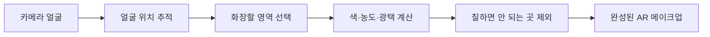
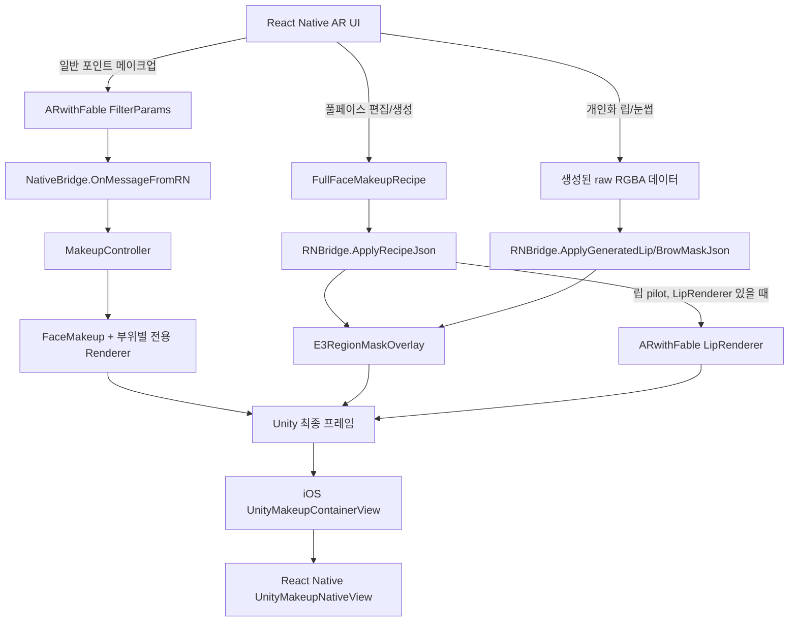
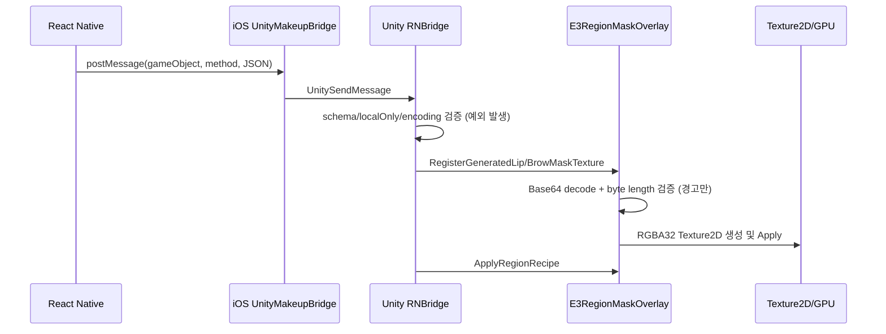
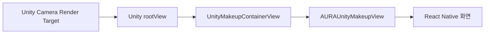
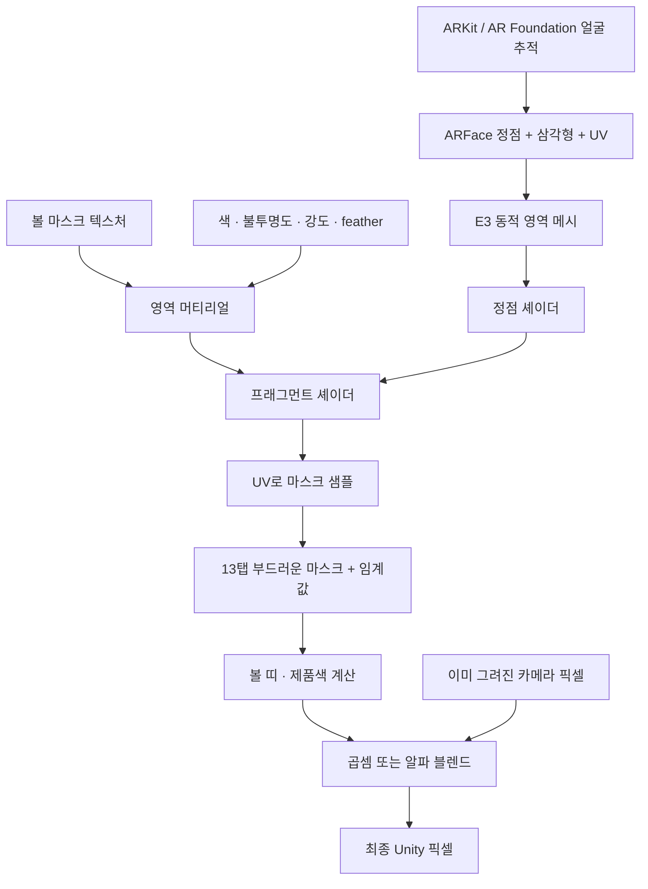
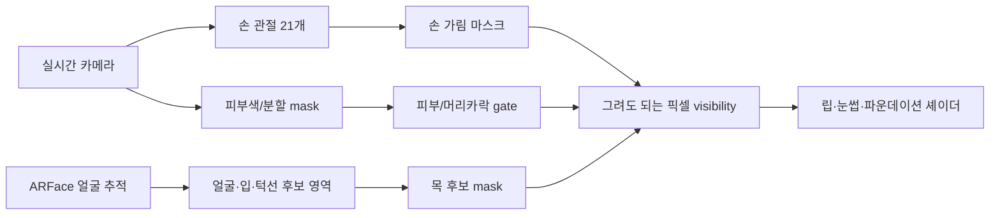

# AR 메이크업 렌더링 파이프라인 분석 보고서

> 카메라 얼굴 위에 화장 위치를 정하고, 색을 만들고, 화면에 합치는 전체 과정

## 이 문서 사용법

처음부터 끝까지 읽을 필요는 없습니다. 목적에 따라 갈 곳이 다릅니다.

| 이런 분은 | 여기로 |
|---|---|
| 원리를 이해하고 품질 개선 가설을 세우고 싶다 | 이 문서 말고 [문답 문서](AR_MAKEUP_PIPELINE_QA_KO.md)를 먼저 읽으세요. 이 문서는 그 가설을 코드로 확인할 때 쓰는 레퍼런스입니다. |
| AR 메이크업이 처음이다 | **1장**만 읽으세요. 5분이면 전체 그림이 잡힙니다. |
| 이 코드를 고치러 왔다 | **2장**부터 보세요. 지금 문제가 있는 곳만 모아 놨습니다. |
| 화장이 이상하게 나온다 | **15장**에서 증상을 찾고, 거기서 안내하는 장으로 가세요. |
| 구조를 판단해야 한다 | 2장 → 3장 → 16장 |
| 특정 부위만 알고 싶다 | 12장(부위별 차이) → 13장(보호 계층) |

4~11장은 사전처럼 찾아보는 기술 상세입니다. 통독용이 아닙니다.

### 목차

#### 먼저 볼 곳

| 장 | 내용 |
|---|---|
| [0. 검증 기준](#0-검증-기준) | 어느 코드를 어떻게 확인했나 |
| [1. 30초 요약](#1-30초-요약) | AR 메이크업이 하는 일 · 용어 |
| [2. 지금 이 코드의 문제 8건](#2-지금-이-코드의-문제-8건) | **의도대로 동작하지 않는 곳** |
| [3. 렌더 경로가 두 개인 이유](#3-렌더-경로가-두-개인-이유) | 전체 배선도 |

#### 기술 상세 — 찾아보는 곳

| 장 | 내용 |
|---|---|
| [4. UV — 얼굴 지도](#4-uv--얼굴-지도) | 얼굴이 움직여도 화장이 따라붙는 원리 |
| [5. 마스크가 GPU에 올라가기까지](#5-마스크가-gpu에-올라가기까지) | PNG·절차 생성·개인화 마스크 |
| [6. 셰이더와 머티리얼은 어떻게 다른가](#6-셰이더와-머티리얼은-어떻게-다른가) | 공식과 지시서의 차이 |
| [7. 셰이더가 픽셀을 만드는 방식](#7-셰이더가-픽셀을-만드는-방식) | 부위별 계산 |
| [8. 블렌딩은 두 층에서 일어난다](#8-블렌딩은-두-층에서-일어난다) | 셰이더 안 · GPU 합성 |
| [9. 렌더러 — 무엇을 어떤 순서로 그리나](#9-렌더러--무엇을-어떤-순서로-그리나) | 렌더 큐 |
| [10. 카메라 영상과 최종 합성](#10-카메라-영상과-최종-합성) | RN 화면까지 |
| [11. 한 픽셀이 만들어지는 전 과정](#11-한-픽셀이-만들어지는-전-과정) | 앞의 내용을 하나로 |
| [12. 부위별 구현 차이](#12-부위별-구현-차이) | 립·블러셔·눈썹·렌즈 |
| [13. 보호 계층 셋 — 손·눈썹·목](#13-보호-계층-셋--손눈썹목) | 칠하면 안 되는 곳 거르기 |

#### 판단할 때 볼 곳

| 장 | 내용 |
|---|---|
| [14. 성능은 어디서 갈리나](#14-성능은-어디서-갈리나) | 잘한 선택 · 비싼 지점 |
| [15. 증상별 진단 순서](#15-증상별-진단-순서) | 안 보일 때 볼 순서 |
| [16. 설계 평가](#16-설계-평가) | 강점 · 위험 · 권장 방향 |
| [부록 A. 코드 지도](#부록-a-핵심-코드-지도) · [B. 검증 상태](#부록-b-검증-상태) · [C. 개정 이력](#부록-c-개정-이력) | |

---

## 0. 검증 기준

| 항목 | 내용 |
|---|---|
| 대상 저장소 | `302-group5-final-project` |
| 기준 브랜치 | `WEI/DEV/0716` |
| 기준 커밋 | `9f966650` (AR 코드 기준) |
| 현재 HEAD | `47a4f2be` — **AR 코드는 `9f966650`과 동일**하여 본문 인용이 그대로 유효 |
| 작성일 | 2026-07-16 (2026-07-16 전면 검증·개정) |
| 분석 방식 | CodeGraph 인덱스와 작업 트리의 TypeScript, Objective-C, C#, ShaderLab/HLSL 정적 분석 |
| 확인 상태 | 코드 구조와 정적 호출 경로는 `CONFIRMED` — 개별 항목은 부록 B 참조 |
| 미확인 범위 | 실제 iPhone 프레임, GPU 캡처, FPS, 메모리 피크, 육안 품질은 실행하지 않았으므로 `UNVERIFIED` |

**인용 방식.** 근거는 `파일 · 심볼명 (줄번호)` 형태로 답니다. 줄 번호는 코드가 한 줄만 바뀌어도 틀려지므로 **심볼명이 우선이고 줄 번호는 힌트**입니다. 파일의 전체 경로는 부록 A에 있습니다.

**용어 표기 규칙.** 두 가지를 구분합니다.

- **개념어는 한글로** 씁니다 — 마스크, 셰이더, 머티리얼, 텍스처, 렌더러, 메시, 블렌딩. 한 문장 안에서 문자가 바뀌면 읽기 힘들기 때문입니다. 원어는 [1.2 용어 대응표](#12-용어-대응표)에 함께 적어 뒀습니다.
- **코드에 실제로 있는 이름은 영문 그대로** 둡니다 — `_MaskTex`, `LipRenderer`, `SmoothRegionMask.shader`. 검색해서 찾아갈 이름이기 때문입니다.

---

## 1. 30초 요약

### 1.1 AR 메이크업이 하는 일

카메라 속 얼굴 위에 투명한 화장 필름을 올린다고 생각하면 쉽습니다.

```text
1. 얼굴이 어디에 있는지 찾는다.
2. 입술·눈썹·볼처럼 화장할 위치를 정한다.
3. 그 위치 안에서만 제품색을 만든다.
4. 손·머리카락처럼 칠하면 안 되는 곳을 뺀다.
5. 카메라 얼굴과 자연스럽게 섞는다. 얼굴이 움직이면 화장도 같이 움직인다.
```



이 다섯 단계만 이해하면, 이 문서의 나머지는 전부 **"각 단계가 코드에서 정확히 어떻게 구현됐는가"** 입니다.

### 1.2 용어 대응표

코드와 다른 문서에서는 영어로 나오므로, 원어를 함께 적어 둡니다.

| 용어 | 원어 | 쉬운 의미 | 하는 일 |
|---|---|---|---|
| 얼굴 메시 | face mesh | 얼굴 모양의 입체 마네킹 | 추적된 얼굴의 위치와 표면을 알려 줍니다 |
| UV | UV | 마네킹을 평면으로 펼친 지도 좌표 | 얼굴이 움직여도 같은 화장 위치를 찾아 줍니다 |
| 마스크 | mask | 화장할 곳만 뚫어 놓은 스텐실 도안 | 어느 픽셀에 얼마나 바를지 정합니다 |
| 텍스처 | texture | GPU가 읽는 이미지·데이터 판 | 마스크·그림·광택 지도를 GPU 메모리에 담습니다 |
| 셰이더 | shader | 픽셀 하나를 칠하는 계산 공식 | 원본색·제품색·마스크·마감을 계산합니다 |
| 머티리얼 | material | 셰이더에 값을 채운 작업 지시서 | 같은 셰이더라도 립과 블러셔의 색·강도를 다르게 만듭니다 |
| 블렌딩 | blending | 투명 필름을 겹치는 규칙 | 원래 카메라색과 새 화장색을 합칩니다 |
| 렌더러 | renderer | 실제로 그리는 실행자 | 무엇을·어떤 순서로 그릴지 관리합니다 |

**가장 자주 오해하는 지점: 마스크와 텍스처는 같은 말이 아닙니다.** 마스크는 "어디에 적용할지"라는 *의미*이고, 텍스처는 그 정보를 GPU에 담는 *그릇*입니다. 하나의 마스크는 PNG `Texture2D`, 런타임 생성 `R8 Texture2D`, RGBA32 다채널 `Texture2D` 중 무엇으로도 구현될 수 있습니다.

---

## 2. 지금 이 코드의 문제 8건

이 장은 **정적 검증으로 확인된 현재 코드의 문제**를 모아 놓은 곳입니다. 나머지 장은 "코드가 이렇게 생겼다"를 설명하지만, 이 장은 **"이건 지금 의도대로 동작하지 않는다"** 를 다룹니다.

| # | 발견 | 영향 | 상세 |
|---|---|---|---|
| F1 | 눈썹 강도 컨트롤 2개가 셰이더에서 전혀 읽히지 않음 | 앱의 눈썹 제거 강도 조절이 **무효** | [2.1](#21-f1-눈썹-강도-컨트롤이-셰이더에-도달하지-않는다) |
| F2 | ~~`screen` 블렌드~~ ✅ 수리됨(2026-07-17, b9f9a023) — 계약 제거+레거시 별칭 |  | [2.2](#22-f2-screen-블렌드는-screen이-아니다) |
| F3 | 손 가림이 렌더 경로별로 **다른 메커니즘** | "손 가림이 없다"고 오진하기 쉬움 | [2.3](#23-f3-손-가림은-경로마다-메커니즘이-다르다) |
| F4 | 일반 AR 화면에서 `applyFilter`를 받을 구독자가 없음 | ARwithFable 레인이 **확정적으로** 죽음 (E3가 가림) | [2.4](#24-f4-일반-ar-화면에서-applyfilter는-아무도-받지-않는다) |
| F5 | ~~립 마스크 등록 실패 무시~~ ✅ 수리됨(2026-07-17, b9f9a023) — 거부+RN 재시도 중단 |  | [2.5](#25-f5-립-마스크-등록-실패가-무시된다) |
| F6 | 칠해진 PNG가 있으면 softness 슬라이더가 무시됨 | MediaPipe에서 블러셔·립 softness **작동 안 함** | [2.6](#26-f6-softness-슬라이더가-일부-부위에서-무효다) |
| F7 | 진짜 semantic skin class가 저장소에 없음 | "비활성"이 아니라 **미구현** | [2.7](#27-f7-semantic-skin-class는-비활성이-아니라-미구현이다) |
| F8 | 죽은 코드·죽은 채널·낡은 주석 | 코드를 읽는 사람을 오도함 | [2.8](#28-f8-죽은-코드와-낡은-주석) |

### 2.1 F1: 눈썹 강도 컨트롤이 셰이더에 도달하지 않는다

모바일 앱은 앞머리가 눈썹을 덮은 정도에 따라 `neutralizeStrength`를 최대 0.85까지 계산해서 보냅니다. 이 값은 다음 경로로 흐릅니다.

```text
browGenerateCore.ts  neutralizeStrength (최대 0.85)
      ↓
RNBridge             GlossBoost 필드에 실어 보냄 (piggyback — 스키마 유지용)
      ↓
E3RegionMaskOverlay  (2026-07-17 수리: 세터 제거 — 여기서 명시적으로 끊김)
      ✕
SmoothRegionMask.shader   선언도 제거됨 (원래부터 읽은 적 없음)
```

> 2026-07-17: 죽은 유니폼 선언과 세터를 제거해 계약 단절을 명시화했다
> (b9f9a023). 강도 조절 기능 자체는 여전히 없으며, 구현하려면 셰이더부터
> 소비를 만들어야 한다.

`_BrowCleanupStrength`와 `_BrowNeutralizeStrength` 두 셰이더 변수은 셰이더에 **선언만 되어 있고 프래그먼트 계산에서 단 한 번도 읽히지 않습니다.** 실제 눈썹 덮기 불투명도는 E3가 넣는 **하드코딩 `0.92`** 가 결정합니다.

즉 **모바일의 앞머리 감쇠 계산은 전 구간이 죽은 코드**입니다. 눈썹 제거 자체는 고정 강도로 동작하지만, 강도를 조절하는 계약은 끊겨 있습니다.

> 실제 앞머리 대응은 별개로 존재합니다 — 셰이더 안의 `hairKeep`이 카메라 픽셀을 직접 보고 판단합니다. 모바일이 보낸 신호와는 무관합니다.

- 근거(선언만 존재): `SmoothRegionMask.shader` — 프로퍼티 59–60, 셰이더 변수 197–198. 셰이더 전체에서 이 4곳이 유일한 등장.
- 근거(하드코딩): `E3RegionMaskOverlay.ApplyRecipeAppearance` — `_BrowInpaintStrength = 0.92f` (4550–4553), 소비는 셰이더 1152 / 1333.
- 근거(모바일 계산): `browGenerateCore.ts` — `BROW_NEUTRALIZE_STRENGTH = 0.85` (166), `resolveBrowNeutralizeStrength` (694–718), `cleanupStrength: 0` (328, 423).
- 근거(운반): `RNBridge` — `GradientAmount`/`GlossBoost` piggyback (1938, 1944) → `E3RegionMaskOverlay` (4580–4588).
- 근거(실제 앞머리 대응): `SmoothRegionMask.shader` — `hairKeep` (431–449), 적용 1178 / 1349.

**부수 문제:** `browGenerateCore.ts` 584–586의 코드 주석은 R 채널이 *"`_BrowNeutralizeStrength`로 게이트된다"* 고 적어 놓았습니다. 그런 게이트는 존재하지 않습니다.

### 2.2 F2: `screen` 블렌드는 screen이 아니다

레시피가 `blendMode: 'screen'`을 보내면 GPU 블렌드는 `SrcAlpha / OneMinusSrcAlpha`가 됩니다. 이건 `normal`과 **완전히 같은 값**입니다.

| 레시피 `blendMode` | `_SrcBlend` | `_DstBlend` | 실제 효과 |
|---|---|---|---|
| `normal` | `SrcAlpha` | `OneMinusSrcAlpha` | 일반 alpha-over (기본값) |
| `multiply` | `DstColor` | `Zero` | 필터색 × 대상색 |
| `screen` | `SrcAlpha` | `OneMinusSrcAlpha` | **normal과 동일** |

코드는 `screen` case에서 기본값과 똑같은 값을 명시적으로 다시 대입합니다. Photoshop식 `1-(1-A)(1-B)` 합성을 기대하면 안 됩니다.

- 근거: `E3RegionMaskOverlay.ApplyMaterialBlendMode` (5221–5269), `screen` case는 5246–5249. `normal`은 case가 없는 기본 fall-through.
- 근거: `fullFaceMakeupRecipe.ts` (1080–1162).

**연관 사실:** 파운데이션은 `multiply`를 요청해도 일반 알파 블렌드를 유지합니다(`if (!foundationRegion)` 가드, 5239). 눈썹도 강제로 `SrcAlpha/OneMinusSrcAlpha`가 됩니다 — 어두운 자연 눈썹을 밝은 피부색으로 덮어야 하는데 multiply로는 불가능하기 때문입니다(4515–4543).

### 2.3 F3: 손 가림은 경로마다 메커니즘이 다르다

**"손 가림이 ARwithFable 립에 적용되지 않는다"는 서술은 오해를 부릅니다.** 정확히는 다음과 같습니다.

| 렌더 경로 | 가림 메커니즘 | 입력 |
|---|---|---|
| E3 립·파운데이션 | `E7HandOcclusionRuntime` | Apple Vision 손 관절 21개 |
| ARwithFable 립·눈썹 | `Occlusion.cginc`의 `OccludeGate()` | SelfieMulticlass 세그멘테이션의 face-skin 확률 |

즉 ARwithFable 경로에 **가림이 없는 게 아니라 방식이 다릅니다.** E7 손 관절 마스크는 ARwithFable 셰이더에 배선되어 있지 않지만, 대신 세그멘테이션 기반 게이트가 손·머리카락·옷을 걸러냅니다.

이 구분이 중요한 이유: 두 방식은 **실패 조건이 다릅니다.** E7은 confidence·ROI 겹침·500ms 신선도에서 실패하고, `OccludeGate`는 `_SegOn=0`이면 게이트를 1(=효과 없음)로 되돌립니다. 증상이 같아도 봐야 할 로그가 다릅니다.

- 근거(E7 미배선): `MediaPipeGraft` 트리 전체에 `HandOcclusion` 문자열 0건. `Lip.shader`/`Brow.shader`에 `_HandOcclusion*` 셰이더 변수 없음.
- 근거(대체 게이트): `Lip.shader` 84·226, `Brow.shader` 40·94가 `Occlusion.cginc`를 include하고 `OccludeGate(i.grabPos)`를 알파에 곱함. `Occlusion.cginc` (66–71).
- 근거(실패 시 무효): `SegmentationSource.cs` (37, 97) — 실패 경로에서 게이트=1.

### 2.4 F4: 일반 AR 화면에서 `applyFilter`는 아무도 받지 않는다

`ARFilterScreen`과 `unityMakeupBridge.ts`는 일반 포인트 메이크업의 live engine이 ARwithFable이라고 명시하고 `NativeBridge`에 `applyFilter`를 보냅니다. **그런데 받는 쪽이 꺼져 있습니다.**

```text
AuraStencilHost.Initialize()
  └─ ApplyActive(false)          ← 그래프 생성 직후 곧바로 비활성화
       └─ MakeupController.enabled = false
            └─ OnDisable() { NativeBridge.MessageReceived -= OnMessage; }
                                 ← 구독 해제됨

RN → applyFilter → NativeBridge.OnMessageFromRN (살아 있음)
                      └─ MessageReceived?.Invoke(msg) → 구독자 0명 → 소멸
```

**핵심은 `MakeupController`가 `Awake`가 아니라 `OnEnable`에서 구독한다는 점입니다.** 따라서 비활성화는 `Update()`만 멈추는 게 아니라 **핸들러 자체를 떼어냅니다.** `NativeBridge`는 `controlled` 목록에 없어 계속 살아 있으므로, 메시지는 정상 도착한 뒤 **구독자 0명에게 발사되고 사라집니다.**

**재활성화 경로가 없습니다.** 다음을 모두 확인했습니다.

| 후보 | 결과 |
|---|---|
| `SetStencilActive(true)` 발신처 | 저장소 전체에서 **`StencilUnityViewAdapter.tsx:80` 단 하나** (네이티브·C#·씬 포함 전수 검색) |
| `ARFilterScreen`이 그 어댑터를 쓰는가 | **아니오.** `ARFilterScreen` → `ARFilterCameraPreview.tsx:90` → `UnityMakeupNativeView` 직접. 어댑터는 `StencilARApp`만 사용 |
| 두 화면이 공존하는가 | **아니오.** `arRoutes.tsx:118-123`에서 상호 배타 분기 |
| 다른 메시지 입구 | 없음. `SetStencilActive`가 `AuraStencilHost`의 유일한 public 진입점 |
| `Awake`/`Start` 기본 활성 | 없음. `Initialize()`의 `ApplyActive(false)`가 유일한 초기 상태 |
| 씬 직렬화 상태 | **불가능.** 그래프 전체가 `[RuntimeInitializeOnLoadMethod]`에서 `new GameObject`/`AddComponent`로 런타임 생성됨 |

**그럼에도 화면이 멀쩡해 보일 수 있습니다.** E3(`E3RegionMaskOverlay`, `RNBridge`)는 `controlled` 목록 **밖**이라 계속 렌더링합니다. 즉 ARwithFable `applyFilter` 레인만 죽어 있고 E3가 그림을 그리므로, **기기에서는 이 결함이 가려질 수 있습니다.**

**정적 판정 —** `applyFilter`가 `ARFilterScreen`에서 버려지는 것은 코드상 확정입니다(`CONFIRMED`). 다만 E3가 대신 그림을 그리므로, 실제 기기에서 어떻게 보이는지는 확인하지 못했습니다(`UNVERIFIED`).

- 근거(비활성화): `AuraMediaPipeGraftBootstrap.cs` — `AuraStencilHost` 클래스 (202–261), `ApplyActive(false)` (219), `ApplyActive` 구현 (234–252), `MakeupController` 편입 (155).
- 근거(구독 수명): `MakeupController.cs` — `OnEnable`/`OnDisable` (416–424).
- 근거(발신처 유일): `StencilUnityViewAdapter.tsx` (71, 80) · public 진입점 (223).
- 근거(화면 분기): `arRoutes.tsx` (118–123) · `ARFilterCameraPreview.tsx` (90).
- 근거(전송): `unityMakeupBridge.ts` — `postUnityFilterParams` (481–485), target `NativeBridge`/`OnMessageFromRN`.
- 근거(메시지 소멸): `NativeBridge.cs` — `OnMessageFromRN` (45), `MessageReceived?.Invoke` (61).

### 2.5 F5: 립 마스크 등록 실패가 무시된다

생성 마스크의 byte 수 검증(`width × height × 4`)은 존재하지만, **립과 눈썹의 실패 처리가 비대칭**입니다.

| 경로 | 등록 실패 시 | 결과 |
|---|---|---|
| 눈썹 | 반환값을 확인하고 예외를 던짐 | 거부됨 ✅ |
| 립 | **반환값을 버림** | 텍스처 없이 레이어가 그대로 적용됨 ⚠️ |

크기가 틀린 립 마스크는 경고만 남기고 텍스처 등록을 건너뛴 뒤, 레이어 구성과 적용은 그대로 진행됩니다.

- 근거(검증 위치): `E3RegionMaskOverlay` — 립 478–487, 눈썹 536–545. 예외가 아니라 `Debug.LogWarning` + `return false`인 **약한** 검사.
- 근거(비대칭): `RNBridge` — 립 858은 반환값 미사용, 눈썹 982–990은 `throw new InvalidOperationException`.

### 2.6 F6: softness 슬라이더가 일부 부위에서 무효다

`MaskGenerator`는 칠해진 PNG가 있으면 그것을 쓰고, 없을 때만 절차적으로 마스크를 만듭니다. 그런데 **softness는 절차 생성에만 적용됩니다.**

`Assets/Resources/Masks/`에는 `blush.png`, `eyeshadow.png`, `lips.png`가 실제로 존재합니다. 따라서 MediaPipe 경로에서 **클래식 블러셔와 립의 softness 슬라이더는 아무 효과가 없습니다.** 절차 경로에 도달하는 건 PNG가 없는 `blush_igari`, `blush_drape`, highlight, contour뿐입니다.

- 근거: `MaskGenerator.LoadOrGenerate` (200–206) — `softnessScale`은 `Generate`에만 전달됨. 코드 주석 198–199가 이 동작을 의도로 명시.

### 2.7 F7: semantic skin class는 "비활성"이 아니라 "미구현"이다

목·파운데이션의 정교한 시맨틱 세그멘테이션 경로는 코드에 존재하지만 현재 동작하지 않습니다. 그런데 **이유가 흔히 알려진 것과 다릅니다.**

| 흔한 오해 | 실제 |
|---|---|
| "compile define을 켜야 한다" | **이미 켜져 있음** — `ProjectSettings.asset:689`에 `AURA_ENABLE_VISION_FACE_PARSING` 존재 |
| "provider가 비활성이라 그렇다" | 더 근본적 — provider가 **skin class를 애초에 제공하지 않음** |

`VisionFaceParsingProvider`는 `HasSkinClass = false`를 **무조건** 설정합니다. 즉 flicker guard를 풀어도 진짜 semantic skin 분류는 나오지 않고, 셰이더는 계속 `FallbackSkinGate`(크로마 휴리스틱) 분기를 탑니다.

죽어 있는 진짜 이유는 `#if` **안쪽**의 flicker guard입니다.

- 근거(define 켜짐): `ProjectSettings.asset:689` — `iPhone: ...;AURA_ENABLE_VISION_FACE_PARSING`.
- 근거(flicker guard): `VisionFaceParsingProvider.Update` — `ScreenCaptureFlickerGuardDisablesCapture = true` (154), 즉시 return (159–163).
- 근거(skin class 없음): `VisionFaceParsingProvider` (113) — `HasSkinClass = false` 무조건, 주석이 이유를 설명.
- 근거(셰이더 fallback): `FoundationSemanticComposite.shader` (361–371).
- 근거(주입 입구 미사용): `RNBridge.ApplyFoundationParsingFrameJson` (741) — 저장소 전체에 호출자 0건.
- 근거(간접 증거): `ScreenSpaceFoundationController` (597–598) — `opacityScale = semanticProviderActive ? 1.0f : 0.55f`.

### 2.8 F8: 죽은 코드와 낡은 주석

| 항목 | 상태 | 근거 |
|---|---|---|
| `ScreenSpaceFoundationController.UpdateHandOcclusion` | 정의만 있고 **호출자 0건** — 무조건 `SetRuntimeRequested(true)`를 하지만 실행되지 않음 | 806–817 |
| 생성 눈썹 마스크의 **A 채널** | ⚠ 정정(2026-07-17): 셰이더는 안 읽지만 **CPU 삼각형 컬링이 G/A를 샘플**(`generated_brow_green_alpha`) — 죽은 채널 아님, 계속 기록 필요 | `E3RegionMaskOverlay.ResolveMaskCoverageSampleChannel` |
| 렌더 큐 **3002·3003** | 어떤 상수에도 배정되지 않은 빈 번호 | `MakeupQueues.cs` |
| `E3RegionMaskOverlay` 4521 주석 | *"레시피가 눈썹를 multiply로 보낸다"* — **낡음**. 계약은 이미 `normal`을 보냄 | vs `fullFaceMakeupRecipe.ts:1089` |

---

## 3. 렌더 경로가 두 개인 이유

### 3.1 왜 두 개인가

현재 앱에는 서로 다른 목적으로 만들어진 두 화장 방식이 함께 들어 있습니다.

| 경로 | 쉬운 비유 | 잘하는 일 |
|---|---|---|
| **ARwithFable** | 얼굴 경계를 따라 붓으로 직접 그리기 | 입술·아이라인처럼 경계가 정밀한 포인트 메이크업 |
| **E3** | 얼굴 지도 위에 스텐실을 올려 칠하기 | 파운데이션·블러셔·AI 생성 눈썹처럼 넓거나 개인화된 메이크업 |

둘 중 하나가 무조건 낫지는 않습니다. 입술처럼 모양이 중요하면 실제 얼굴 점을 따라 그리는 게 유리하고, 파운데이션처럼 넓은 영역은 얼굴 지도와 마스크가 편합니다.

**두 경로가 나뉜 진짜 이유는 설계가 아니라 역사입니다.** 처음부터 하나로 설계된 엔진이 아니라, 서로 다른 기능을 위해 개발된 구현이 나중에 한 앱 안에서 합쳐졌습니다. 현재는 전환기라 **일부 립은 E3 요청을 받고도 ARwithFable 렌더러로 그려집니다.**

### 3.2 전체 배선도



### 3.3 경로 A: 일반 포인트 메이크업

- `ARFilterScreen`이 사용자의 영역·색·강도 선택을 `FilterParams`로 바꿉니다.
- `postUnityFilterParams()`가 `NativeBridge / OnMessageFromRN`으로 JSON을 보냅니다.
- Unity `NativeBridge`가 JSON을 `RNToUnityMessage`로 파싱해 이벤트를 발생시킵니다.
- `MakeupController.OnMessage()`가 `applyFilter`를 받아 `ApplyTo()`로 머티리얼 셰이더 변수과 부위별 렌더러 값을 갱신합니다.
- 얼굴의 넓은 영역은 `FaceMakeup.shader`, 립·눈·눈썹 등은 전용 메시와 전용 셰이더로 그립니다.

근거: `ARFilterScreen.tsx` (409–423) · `unityMakeupBridge.ts` (474–486) · `NativeBridge.cs` (44–62) · `MakeupController.OnMessage` (416–449) · `MakeupController.ApplyTo` (878–1140).

### 3.4 경로 B: 풀페이스 레시피와 개인화 UV 마스크

- `FullFaceMakeupRecipe`는 레이어마다 `region` 구분자와 함께 `color`, `opacity`, `texture`, `blendMode`, `maskTextureId`, `feather`, `finish`를 보냅니다.
- `RNBridge.ApplyRecipeJson()`이 레이어를 파싱하고 각 레이어를 격리해서 적용합니다.
- 대부분의 레이어는 `E3RegionMaskOverlay.ApplyRegionRecipe()`로 갑니다.
- 개인화 립/눈썹는 별도 메시지로 raw RGBA 마스크를 등록한 뒤 같은 E3 overlay에서 렌더합니다.
- **pilot 예외:** 레시피의 립은 `LipRenderer.Instance`가 존재하면 ARwithFable 립 렌더러로 우회하고 E3 립 overlay를 숨깁니다.

근거: `fullFaceMakeupRecipe.ts` — `FullFaceMakeupRecipeLayer` (65–157) · `unityMakeupBridge.ts` (1819–1909) · `RNBridge.ApplyRecipeJson` (576–720, 립 우회는 663–685) · `RNBridge.ApplyRegionLayer` (3046–3088) · `RNBridge` 생성 마스크 수신 (793–1050).

### 3.5 두 경로 비교

| 비교 항목 | ARwithFable | E3 |
|---|---|---|
| 얼굴 기준 | MediaPipe 478 랜드마크 (얼굴 468 + 홍채 10) | AR Foundation `ARFace` 정점/indices/uvs |
| 넓은 영역 | `FaceMakeup.shader`가 GrabPass로 카메라를 읽고 자체 합성 | `SmoothRegionMask.shader`가 투명/곱셈 필터 출력 |
| 립 | 실제 립 외곽·내곽 랜드마크로 만든 ring 메시 | 정적/생성 UV 마스크 메시 (단, 레시피는 pilot로 ARwithFable 우회 가능) |
| 마스크 생성 | Resources PNG 우선, 없으면 256×256 R8 절차 생성 | Resources PNG 또는 raw RGBA32 런타임 등록 |
| 렌더러 구성 | canonical face + 부위별 전용 렌더러 다수 | 얼굴별·부위별 `E3 Region` dynamic 메시 렌더러 |
| 최종 합성 | 전용 큐 3000~4000, 여러 셰이더 | runtime 큐 5000, sorting order 120 |
| 가림 방식 | 세그멘테이션 `OccludeGate` | E7 손 관절 마스크 + 피부 게이트 |

---

## 4. UV — 얼굴 지도

### 4.1 UV의 의미

3D 얼굴 메시의 각 정점에는 `(x, y, z)` 위치뿐 아니라 `(u, v)` 좌표가 있습니다. UV는 보통 `0..1` 범위의 2D 좌표입니다.

- `u=0`은 텍스처 왼쪽, `u=1`은 오른쪽입니다.
- `v=0`과 `v=1`의 상하 방향은 소스와 업로드 방식에 따라 뒤집힐 수 있어 **코드 계약이 중요합니다.**
- 얼굴이 회전하거나 표정이 변해도 같은 정점의 UV는 같은 얼굴 부위를 가리킵니다.

즉 "입술은 화면의 이 픽셀"이라고 저장하지 않고 **"얼굴 지도에서 이 영역"** 이라고 저장합니다. 그래서 고개를 돌려도 화장이 얼굴에 붙어 움직입니다.

### 4.2 ARwithFable의 canonical UV

`FaceLandmarkSource`는 MediaPipe 478개 랜드마크를 다루며, 얼굴 메시는 468개, 나머지 10개는 양쪽 홍채 점입니다. `CanonicalFaceMesh`는 고정 topology와 UV를 읽고 매 프레임 랜드마크 위치만 새로 반영합니다.

- topology/UV: 고정
- 정점의 화면/월드 위치: 매 프레임 변경
- 결과: **같은 UV 마스크 한 장을 여러 얼굴과 표정에 재사용**

근거: `FaceLandmarkSource.cs` (16–44) · `CanonicalFaceMesh.cs` (254–385, 392–470).

### 4.3 E3의 ARFace UV

E3는 `ARFace`가 제공하는 `vertices`, `indices`, `uvs`를 사용합니다. `TryUpdateFullFaceUvMesh()`는 다음을 수행합니다.

1. UV와 텍스처가 사용 가능한지 검사
2. 추적 노이즈를 줄이기 위해 정점별 motion-adaptive EMA 적용
3. 필요하면 마스크가 없는 triangle을 미리 제거
4. `face.uvs`를 새 dynamic 메시의 UV0에 복사
5. 완성한 메시를 해당 얼굴 transform의 자식 렌더러로 그림

**블러셔 일부는 예외입니다.** 특정 볼 마스크는 ARFace UV 대신 얼굴 local `x/y`를 정규화한 좌표를 새로 만들어 양볼 배치를 맞춥니다.

근거: `E3RegionMaskOverlay.TryUpdateFullFaceUvMesh` (1731–2003) · 볼 예외 (3528–3572).

### 4.4 마스크는 항상 단일 흑백 채널이 아니다

채널 해석은 렌더러마다 다릅니다.

| 마스크 유형 | 채널 의미 |
|---|---|
| ARwithFable 절차 마스크 | R = 적용 강도. R8로 생성 |
| E3 일반 립 atlas | R = 전체/기본 커버리지, G = overline 계열, B = gradient·내부 density |
| E3 생성 눈썹 | R = 자연 눈썹 neutralize footprint, G = 그릴 눈썹 body, B = 털 strand detail, **A = 미사용(F8)** |
| E3 볼 PNG | RGB luminance를 반전한 strength + 별도 blur와 중심/외곽 band |
| E3 렌즈 | Unity가 눈 영역에 맞춰 런타임 생성한 radial profile (pupil/rim 의미) |

**"PNG니까 알파를 읽겠지"라고 가정하면 안 됩니다.** 실제 셰이더가 어떤 채널을 읽는지가 계약의 진실입니다.

---

## 5. 마스크가 GPU에 올라가기까지

### 5.1 ARwithFable: Resources PNG 또는 절차 생성

`MaskGenerator`의 조회 순서는 **3단계**입니다.

```text
1. 플랫폼 폴더    Masks/ios/ 또는 Masks/android/  (MEDIAPIPE에서는 Masks/)
2. 루트 폴더      Masks/                          (플랫폼 폴더와 다를 때만)
3. 절차 생성      256×256 R8 ellipse 조합
```

칠해진 PNG가 절차 생성보다 **항상 우선**합니다 — `Generate`는 두 로드가 모두 null일 때만 실행됩니다.

절차 마스크는 `TextureFormat.R8`, `Clamp`, `Bilinear`이며, 픽셀값은 여러 ellipse 중 **가장 큰** 커버리지를 선택합니다. 블러셔는 Gaussian tail을 사용해 경계가 멀리까지 부드럽게 감소합니다. Softness는 **5개 버킷**으로 양자화하고 버킷별로 캐시하므로 슬라이더가 움직일 때 매 프레임 새 텍스처를 만들지 않습니다.

> ⚠️ **F6 참조:** softness는 절차 생성에만 적용됩니다. `blush.png`·`lips.png`가 존재하므로 해당 부위 슬라이더는 무효입니다.

근거: `MaskGenerator` — `PlatformFolder` (129–135), `LoadOrGenerate` (200–206), `Generate` (210–214), MAX 커버리지 (247), Gaussian tail (233–240), `SoftnessBuckets = 5` (141), 버킷 캐시 (187–193).

대략적인 메모리 크기(검증됨):

- 256×256 R8 = 65,536 bytes = **64 KiB** (mipmap 없음 → 33% 추가 없음)
- 같은 크기 RGBA32 = 262,144 bytes = **256 KiB**

### 5.2 E3: 정적 Resources 마스크

정적 마스크는 `Assets/Resources/SmoothRegionMasks/`에 있습니다(PNG 46장). `ResolveMask()`가 `maskTextureId`를 resource path로 바꾸는데, 경로는 **3분기**입니다.

```text
generatedLipMask   →  GeneratedLipMasks/{id}    (메모리 딕셔너리, Resources 아님)
generatedBrowMask  →  GeneratedBrowMasks/{id}   (메모리 딕셔너리, Resources 아님)
그 외              →  SmoothRegionMasks/{id}    (Resources.Load)
```

Importer는 마스크를 **색 이미지가 아니라 수치 데이터**로 유지합니다.

| 설정 | 이유 |
|---|---|
| `sRGBTexture = false` | 감마 변환으로 threshold가 틀어지는 것 방지 |
| `isReadable = true` | CPU 진단과 triangle culling에서 픽셀 읽기 |
| mipmap off | authored 채널값 유지 |
| wrap clamp | 경계 밖 반복으로 반대편 얼굴에 번지는 것 방지 |
| bilinear filter | 확대 시 계단 완화 |
| compression off | 채널과 soft edge 손실 방지 |
| `textureType = Default` | 색 이미지 해석 방지 |
| `alphaSource = FromInput` | 입력 알파 보존 |

이 importer는 `Assets/Resources/SmoothRegionMasks/`와 `Assets/SourceMasks/` **두 곳**에 적용됩니다.

근거: `SmoothRegionMaskTextureImporter` (5–6, 18–25, 28–33) · `E3RegionMaskOverlay.ResolveMask` (3432, 3447–3451) · `GetMaskTexture` (3598, 3653, 캐시 3648/3665).

### 5.3 E3: 개인화 raw RGBA 마스크

개인화 립/눈썹 생성 결과는 PNG 경로가 아니라 JSON 안의 `maskRawRgbaBase64`로 전달될 수 있습니다.



**검증은 두 곳으로 나뉘어 있고 강도가 다릅니다.**

`RNBridge`에서 — 실패 시 **예외**:
- schema version 확인
- `localOnly = true`
- `offDeviceUpload = false`
- `longTermRawFrameStored = false`
- provider가 `vision` 또는 `mediapipe`
- `expressionMode`가 `uvOnly` 또는 `blendshapeAssist`
- raw 데이터가 **있을 때만** encoding이 `raw_rgba_base64`인지 (조건부)

`E3RegionMaskOverlay`에서 — 실패 시 **경고 + `return false`**:
- byte 수가 정확히 `width × height × 4`

> ⚠️ **F5 참조:** 립은 이 `false`를 무시합니다.

텍스처 등록 방식도 부위마다 다릅니다.

| 부위 | mipmap | filter | 업로드 | 이유 |
|---|---|---|---|---|
| 립 | 없음 | Bilinear | `LoadRawTextureData` | — |
| 눈썹 | 있음 | Trilinear | `SetPixelData` + `Apply(true,…)` | 미세한 털 결이 원거리에서 떨리지 않게 |

근거: `RNBridge` — 립 793–920 (검증 811–845), 눈썹 922–1050 (거부 982–990) · `E3RegionMaskOverlay` — byte 검증 478–487/536–545, 립 등록 489–494, 눈썹 등록 555–562.

512×512 RGBA32 마스크 한 장의 데이터 크기(검증됨):

- raw: 1,048,576 bytes = **1.00 MiB**
- Base64 본문: 약 **1.33 MiB**
- 눈썹 mip chain: 이론상 원본의 4/3 = 약 **1.33 MiB**
- JSON, JavaScript string, NSString, C# string, decode buffer 복사까지 고려하면 **순간 메모리는 이보다 훨씬 큽니다.**

이 수치는 코드에서 계산 가능한 데이터 크기이며 실제 프로세스 메모리 피크 측정값이 아닙니다.

---

## 6. 셰이더와 머티리얼은 어떻게 다른가

### 6.1 셰이더와 머티리얼은 다르다

- **셰이더**는 GPU가 실행할 프로그램입니다.
- **머티리얼**은 그 셰이더를 선택하고 `_MaskTex`, `_RegionColor`, `_Opacity` 같은 실제 값을 채운 인스턴스입니다.

같은 `SmoothRegionMask.shader`를 써도 립 머티리얼과 눈썹 머티리얼의 마스크·색·threshold·블렌드 state는 서로 다를 수 있습니다.

### 6.2 ARwithFable 머티리얼 구성

`MakeupController.CreateMaterial()`이 `FaceMakeup` 셰이더 머티리얼을 만들고 초기 마스크들을 연결합니다. `ApplyTo()`는 UI에서 넘어온 `FilterParams`를 이렇게 분배합니다.

| 대상 | 담당 |
|---|---|
| `FaceMakeup` 머티리얼 | 피부 보정, 밝기, 파운데이션, 블러셔, 하이라이트, 컨투어, 오버레이 |
| `LipRenderer` | lip color, intensity, finish, gradient, base lip, 광택 |
| `BrowRenderer`, `PencilRenderer`, `StyleRenderer` | 눈썹 제품 스택 |
| `IrisRenderer` | 렌즈, 아이섀도, 아이라이너 |
| `LowerLidRenderer`, `AegyoRenderer`, `LashRenderer` | 눈 아래와 속눈썹 |
| `FaceWarpField` | 눈 확대, 턱·광대 등 얼굴형 warp |

**하나의 `FilterParams`가 하나의 거대한 셰이더에 전부 들어가는 게 아닙니다.** 넓은 얼굴 surface와 정밀 랜드마크 부위로 책임이 분산됩니다.

근거: `MakeupController.CreateMaterial` (185–215) · `ApplyTo` (878–1140).

### 6.3 E3 머티리얼 구성

E3는 얼굴별·부위별 `RegionOverlayView`를 만들고 `SmoothRegionMaskMaterial` 템플릿을 복제합니다. 템플릿이 없으면 `MakeupAR/SmoothRegionMask` 셰이더로 머티리얼을 직접 만듭니다.

`ApplyRecipeAppearance()`의 핵심 작업:

1. `_MaskTex`와 선택적 `_GlossMaskTex` 연결
2. `blendMode`를 GPU 블렌드 factor로 변환
3. `_RegionColor`, `_SecondaryColor`, `_Opacity` 설정
4. `_Threshold`, `_Feather`, UV offset/spread 설정
5. 커버리지, roughness, specular, 광택, detail 설정
6. 파운데이션·볼·아이라이너·눈썹·렌즈 모드 플래그 설정
7. 손 가림, 피부 게이트, half-face flag 설정

근거: `E3RegionMaskOverlay.ApplyRecipeAppearance` (4284–4793) · 머티리얼 생성 (5088–5270).

---

## 7. 셰이더가 픽셀을 만드는 방식

### 7.1 공통 수학

가장 단순한 alpha-over 합성:

```text
output.rgb = source.rgb × sourceAlpha + destination.rgb × (1 - sourceAlpha)
```

- `source`: 지금 그리는 메이크업
- `destination`: 이미 그려진 카메라 또는 이전 레이어
- `sourceAlpha`: 마스크 × opacity × visibility 등으로 계산된 최종 투명도

Multiply는 보통 이런 감각입니다:

```text
output.rgb ≈ destination.rgb × pigmentFilter.rgb
```

`pigmentFilter`가 흰색이면 원본 유지, 색이 진해질수록 원본이 어두운 제품색 방향으로 이동합니다. 실제 코드에는 부위별 보정과 강도 제한이 더 들어갑니다.

### 7.2 ARwithFable `FaceMakeup.shader`

이 셰이더는 일반 투명 색판과 **다르게** 동작합니다.

1. `GrabPass { "_CameraFeed" }`로 메이크업 전 카메라색을 읽습니다.
2. 얼굴 메시의 각 프래그먼트에서 원본 카메라 픽셀을 샘플합니다.
3. edge-preserving smoothing과 brightening을 적용합니다.
4. 파운데이션, 블러셔, 하이라이트, 컨투어, 컨실러, 파우더를 셰이더 내부에서 순차 합성합니다.
5. 최종 RGB를 알파 1로 출력합니다.

그래서 effect가 0인 곳은 원본 카메라색을 그대로 다시 쓰며 메시 경계가 보이지 않습니다. GPU 블렌드 state로 반투명 판을 얹는 게 아니라, **셰이더 내부에서 완성 픽셀을 재구성한 뒤 그 픽셀로 교체**하는 방식입니다.

블러셔 예시는 `tex2D(_BlushMask, buv).r × _BlushIntensity`를 커버리지로 쓰고 `TintFinish()`가 원본 luma와 마감값을 반영합니다.

근거: `FaceMakeup.shader` (1–10, 155–170, 423–560).

### 7.3 ARwithFable 립 셰이더

립은 정적 UV 타원 마스크보다 **실제 외곽·내곽 랜드마크로 만든 ring 메시가 주 경계**입니다.

- 바깥 경계에서만 feather를 적용합니다.
- 카메라의 실제 입술 luma를 읽어 제품색의 명암을 보존합니다.
- base lip, tint, finish, 광택, particle을 순서대로 내부 합성합니다.
- 최종 출력은 **premultiplied** color입니다.
- 블렌드 state는 `Blend One OneMinusSrcAlpha`입니다.

이 방식은 평평한 단색 스티커보다 실제 입술 주름과 빛을 더 잘 보존하고, 글로스가 알파를 키우지 않아도 빛을 더할 수 있습니다.

근거: `LipRenderer.cs` (9–27, 220–276) · `Lip.shader` (69–88, 149–227).

### 7.4 E3 `SmoothRegionMask.shader`

**첫 패스** — 이름은 `PigmentMultiplyOrAlphaFallback`, `ZWrite Off` / `ZTest Always` / `Cull Off`:

1. half-face 모드면 반대쪽 UV 프래그먼트를 `discard`합니다.
2. 기본은 face UV, 특별한 경우 clip position으로 screen UV를 만듭니다.
3. spread와 offset으로 마스크 UV를 보정합니다.
4. `_MaskTex`를 샘플합니다.
5. **13개 탭**(중심 1 + 축 4 + 대각 4 + 먼 축 4)으로 soft 마스크를 만듭니다.
6. `smoothstep` 기반 soft/core 커버리지를 계산합니다.
7. 영역 모드에 따라 파운데이션·볼·아이라이너·렌즈·생성 눈썹·일반 색소 분기로 갑니다.
8. 손 가림, tracking visibility, 피부 게이트를 곱합니다.
9. 머티리얼의 블렌드 state에 맞는 RGB/알파를 출력합니다.

> 13 탭은 `SampleMaskSoft` 기준입니다. 셰이더에는 같은 배치의 `GradientDensityBlur`(13 탭)와 `CheekSourceGrayBlur`(9 탭)도 있습니다.

**두 번째 패스** — 이름은 `GlossAdditiveHighlight`, 립 광택 전용 가산 패스, `Blend One One`. 조건이 안 맞으면 0을 반환합니다. `_LipStyleMode` 기본값이 `-1`이고 립 계열 마스크에만 실제 모드가 설정되므로, 립이 아닌 모든 region은 zero early-out으로 빠집니다.

근거: `SmoothRegionMask.shader` — pass1 이름 136, state 139–142, `SampleMaskSoft` 525–548, half-face discard 730–742, pass2 1359–1367, zero early-out 1553–1556.

### 7.5 half-face에서 `discard`를 쓰는 이유

알파 0을 반환하는 것으로는 부족합니다. **multiply 블렌드에서는 알파가 무시되므로 RGB가 검정이면 destination을 검게 만듭니다.** 셰이더 주석이 이걸 명시합니다:

> *"discard skips the pixel entirely so the excluded half shows the bare camera face under ANY 블렌드 mode. An alpha-0 return still paints BLACK where the region uses a multiply/opaque 블렌드 (lip, 볼), which is the bug."*

광택 패스는 이유가 하나 더 있습니다 — `Blend One One`으로 **빛을 더하고** 알파 0을 반환하도록 설계돼 있어서, 알파를 곱해도 억제가 안 됩니다. 반드시 early-out해야 합니다.

또한 이 게이트는 `_MaskSpreadX`/`_MaskOffset` remap **이전의 raw 메시 UV**를 읽습니다 — 중심선이 x=0.5에 오려면 이게 필수입니다.

근거: `SmoothRegionMask.shader` (725–742, 1530–1546).

### 7.6 feather가 단순 blur 슬라이더가 아닌 이유

E3의 feather는 텍스처 좌표의 선형 blur 한 번이 아닙니다.

- 텍스처 texel 크기를 써서 해상도에 맞는 샘플 반경을 만듭니다.
- `_Feather`가 커지면 near/far 탭 거리가 증가합니다.
- soft threshold와 core threshold를 따로 계산합니다.
- 립·아이라이너·렌즈·볼·생성 눈썹마다 기본 feather 상한이 다릅니다.

예를 들어 얇은 아이라이너에 볼와 같은 feather를 쓰면 선이 그림자처럼 퍼집니다. 코드가 아이라이너 기본값을 더 작게 유지하는 이유입니다.

---

## 8. 블렌딩은 두 층에서 일어난다

### 8.1 셰이더 내부 색 혼합

`lerp`, luma-preserving tint, soft clip, HSV/chroma 보정, matte/광택 계산이 여기 속합니다. framebuffer 블렌드 **전에** source 색을 만드는 과정입니다.

### 8.2 GPU framebuffer 블렌드

완성된 source를 이미 그려진 destination과 어떻게 합칠지 정합니다.

**ARwithFable 주요 블렌드 state**

| 셰이더 | 블렌드 방식 | 의미 |
|---|---|---|
| `FaceMakeup` | 명시적 블렌드 없음, RGB/알파 1 출력 | GrabPass 원본과 효과를 셰이더 내부에서 완성해 얼굴 영역을 교체 |
| `Lip` | `One, OneMinusSrcAlpha` | premultiplied alpha-over, 투명 광택의 가산광 보존 |
| `Brow` | `SrcAlpha, OneMinusSrcAlpha` | 일반 straight-alpha overlay |
| `Eyeliner` | `SrcAlpha, OneMinusSrcAlpha` | 일반 straight-alpha overlay |
| `RegionDecal` | `SrcAlpha, OneMinusSrcAlpha` | 그림/스타일 decal overlay |
| `Iris` | `Blend Off` | stencil 안에서 계산된 iris 픽셀로 교체 |
| `SplitMask` | `SrcAlpha, OneMinusSrcAlpha` | 비교 반쪽에 원본 `_CameraFeed` 복원 |
| `LightingSim` | 최종 RGB/알파 1 출력 | 메이크업까지 합성한 `_SceneGrab`을 전체 화면 grade 결과로 교체 |

**E3 주요 블렌드 state** — [F2](#22-f2-screen-블렌드는-screen이-아니다) 참조.

### 8.3 스트레이트 알파와 프리멀티플라이드 알파를 혼동하면

- 스트레이트 알파 색에 `Blend One ...`을 쓰면 경계가 과하게 밝아질 수 있습니다.
- Premultiplied 색에 `Blend SrcAlpha ...`를 쓰면 알파를 두 번 곱해 검은 테두리나 약한 색이 생깁니다.
- Multiply 경로에서 알파 0만 반환해도 RGB가 검정이면 destination을 검게 만듭니다 → [7.5](#75-half-face에서-discard를-쓰는-이유).

현재 셰이더 주석과 블렌드 state가 이 차이를 명시적으로 다룹니다.

---

## 9. 렌더러 — 무엇을 어떤 순서로 그리나

### 9.1 ARwithFable 렌더러 그래프

`AuraMediaPipeGraftBootstrap`은 두 가지 일을 합니다 — **생성**과 **탐색·편입**입니다. 이 구분이 중요합니다.

**런타임에 생성하는 것** (`new GameObject` / `AddComponent`):

`FramePresenter` · `FaceLandmarkSource` · `FaceWarpField` · `CanonicalFaceMesh` · `IrisRenderer` · `LipRenderer` · `LipStyleRenderer` · `BlushStyleRenderer` · `BrowRenderer` · `PencilRenderer` · `StyleRenderer` · `EyelinerStyleRenderer` · `LowerLidRenderer` · `LashRenderer` · `MakeupController` · `ARKitDepthSource` / `ARKitBlendshapeSource`

> `FramePresenter`, `FaceLandmarkSource`, `MakeupController`는 find-or-create입니다.

**이미 씬에 있을 때만 찾아서 편입하는 것** (`FindAnyObjectByType`, null이면 아무것도 하지 않음):

`StencilGuideRenderer` · `SplitMaskRenderer` · `LightingSimRenderer` · `TeethRenderer` · `DoubleLidRenderer` · `SymmetryGuideRenderer`

**즉 split/lighting/stencil 렌더러는 생성되지 않습니다.** 씬에 없으면 존재하지 않습니다. 편입된 객체는 `AuraStencilHost`의 `controlled` 목록에 들어가 함께 켜지고 꺼집니다 — [F4](#24-f4-일반-ar-화면에서-applyfilter는-아무도-받지-않는다) 참조.

`CanonicalFaceMesh`가 넓은 얼굴 surface를 그리고, 작은 정밀 부위는 각자의 랜드마크 메시를 따로 만듭니다. **하나의 UV atlas로 모든 문제를 풀려 하지 않고 부위별 최적 지오메트리를 쓰는 설계**입니다.

근거: `AuraMediaPipeGraftBootstrap.cs` — 생성 (60–137, `LipStyleRenderer` 98–101, `MakeupController` 149–155), 탐색·편입 (163–168), `AddControlled` null no-op (188–194). `NativeBridge`가 호스팅하는 `PhotoCapture`/`VideoRecorder`/`UVTemplateExporter`/`MediaEditController`/`LookExtractController` (157–161)는 별도입니다.

### 9.2 ARwithFable render 큐

렌더 순서는 코드 호출 순서가 아니라 **머티리얼의 render 큐로 고정**됩니다.

```text
3000  FaceMakeup base canvas
3001  Blush decal
      (3002·3003 — 배정 없음, 빈 번호)
3004  Eye stencil
3005  Eyeshadow
3006  Double lid
3007  Lower lid
3008  Aegyo
3009  Lower lash
3010  Iris
3011  Eyeliner
3012  Eyeliner style
3013  Mascara
3014~3019  Brow stack (conceal/lightener/powder/mascara/pencil/style)
3020  Teeth
3021  Lip
3022  Lip decal
3023  Lip liner
3100  Split mask
3400  Lighting grade
4000  Stencil guide
```

이 순서가 겹치는 영역에서 무엇이 위에 보일지 결정합니다.

| 관계 | 이유 |
|---|---|
| Teeth(3020) < Lip(3021) | 치아가 립 링 아래라 립·라이너 엣지가 또렷 |
| Lip liner(3023) > Lip(3021) | 외곽 라이너가 위에서 또렷 |
| Split 마스크(3100) < Lighting(3400) | **복원된 맨얼굴 반쪽도 같은 lighting grade를 받게** |
| Lighting(3400) < Stencil guide(4000) | 안내선이 grade에 물들지 않게 |

근거: `MakeupQueues.cs` (27–71).

### 9.3 E3 렌더러 그래프

E3는 추적된 얼굴마다 이 구조를 동적으로 만듭니다.

```text
ARFace Transform
└── E3 Region lip / blush / brow / eyeliner / lens ...
    ├── MeshFilter
    │   └── Dynamic Mesh(vertices, UVs, triangles)
    └── MeshRenderer
        └── Cloned SmoothRegionMaskMaterial
```

렌더러 설정: shadow cast off · receive shadow off · dynamic 가림 off · `sortingOrder = 120` · 머티리얼 `renderQueue = 5000` · 셰이더 `ZWrite Off`, `ZTest Always`, `Cull Off`.

따라서 E3 overlay는 일반 투명 object보다 **매우 늦게, depth test 없이** 그려집니다. 손·머리카락 가림은 depth buffer가 아니라 손 가림 / 피부 게이트 / 세그멘테이션 마스크 / tracking visibility 로직에 의존합니다.

**주의:** `SmoothRegionMaskMaterial.mat`의 직렬화된 큐는 **3000**이지만 런타임에 **5000**으로 덮어써집니다. Editor에서 asset만 보고 순서를 판단하면 틀립니다. (다만 3000은 셰이더의 `"Queue"="Transparent"` 태그 기본값이라 의도적 설정이라기보다 no-op 기본값입니다.)

근거: `E3RegionMaskOverlay.ConfigureRenderer` (7177–7183, 호출 1719) · `renderQueue = 5000` (7242, 5268) · `SmoothRegionMask.shader` (140–142, 1365–1367) · `SmoothRegionMaskMaterial.mat` (19).

---

## 10. 카메라 영상과 최종 합성

### 10.1 기본 AR Foundation 배경

Unity scene에는 `ARCameraBackground`, `ARCameraManager`, `ARFaceManager`, `XROrigin`이 있습니다. 기본 경로에서는 `ARCameraBackground`가 카메라 영상을 먼저 그리고 그 위에 face 렌더러들이 그려집니다.

근거: `MakeupARFaceValidation.unity` (366–403, 569–602).

### 10.2 시간 동기 `FramePresenter`

ARwithFable stencil graph가 활성화되면 `AuraStencilHost`는 `ARCameraBackground`를 끄고 `FramePresenter`를 켭니다. `FramePresenter`는 **랜드마크 추론에 사용한 바로 그 RGBA 프레임**을 `Texture2D`로 표시합니다.

장점은 배경과 랜드마크가 같은 시점의 프레임이라는 점입니다. 최신 camera background와 약간 오래된 랜드마크를 섞을 때 생기는 **"화장이 얼굴에서 미끄러지는 느낌"** 을 줄입니다.

`FramePresenter`는 화면 비율·회전·mirror를 반영하고 `ImageToViewport()`를 렌더러들과 공유하므로 배경과 makeup 지오메트리가 같은 좌표 변환을 씁니다.

근거: `FramePresenter.cs` (85–99, 193–256, 258–338) · `AuraMediaPipeGraftBootstrap.cs` (202–246).

### 10.3 메이크업 이후 화면 효과

- `SplitMaskRenderer`: makeup 이전 `_CameraFeed`를 한쪽에 다시 그려 Before/After 비교를 만듭니다.
- `LightingSimRenderer`: makeup까지 완성된 화면을 `_SceneGrab`으로 읽고 white balance, exposure, contrast, saturation grade를 적용합니다.
- `StencilGuideRenderer`: 가장 마지막에 순색 가이드 라인을 그립니다.

이 순서 덕분에 비교 화면도 같은 lighting grade를 받고, 안내선은 grade에 물들지 않습니다.

### 10.4 Unity 프레임을 React Native에 표시

React Native의 `UnityMakeupNativeView`가 iOS native component `AURAUnityMakeupView`를 요청합니다. Objective-C `UnityMakeupContainerView`가 singleton Unity 루트 뷰를 자신의 subview로 옮기고 bounds에 맞춥니다.



화면이 사라지면 container는 Unity 뷰를 분리하고 숨깁니다. **Unity player는 preload를 위해 살아 있을 수 있으므로, "렌더러는 정상인데 RN 화면은 검정"인 문제는 셰이더가 아니라 네이티브 뷰 마운트 상태에서도 발생합니다.**

근거: `UnityMakeupNativeView.tsx` (12–50) · `UnityMakeupBridge.m` — `UnityMakeupContainerView` (685), `RCT_EXPORT_MODULE(AURAUnityMakeupView)` (769), 뷰 생성 (778).

---

## 11. 한 픽셀이 만들어지는 전 과정

풀페이스 E3 블러셔 픽셀을 예로 들면:



수식 개념으로 줄이면:

```text
maskStrength = SoftMask(maskTexture[faceUV], threshold, feather)
visibility   = tracking × handOcclusion × skinGate
amount       = maskStrength × opacity × intensity × visibility
sourceColor  = ProductModel(cameraColor, productColor, finish, amount)
finalColor   = FramebufferBlend(sourceColor, cameraColor, blendMode)
```

실제 셰이더는 부위별로 더 많은 보정이 있지만 **모든 단계는 이 다섯 값으로 이해할 수 있습니다.**

---

## 12. 부위별 구현 차이

| 부위 | 경계를 만드는 것 | 색 계산 | 품질 보호 장치 |
|---|---|---|---|
| 파운데이션 | 표준 얼굴 메시 + 선택적 화면 공간·세그멘테이션 경로 | 원본 밝기를 유지하며 색조와 커버리지 반영 | 눈·눈썹·입 제외, 턱선 기반 목 확장, 크로마 게이트 |
| 립 | 일반 경로는 랜드마크 링 메시, E3 생성 경로는 RGBA UV 마스크 | 밝기를 살린 색소 + 베이스·틴트·마감·광택 스택 | 외곽 페더, 입 안쪽 링 제외, 입꼬리·경계 보정, 가산 광택 |
| 블러셔 | 표준 UV·절차 생성 R8 또는 E3 볼 마스크 | 밝기를 살린 틴트 또는 곱셈 필터 | 가우시안 꼬리, 중심·외곽 띠, UV 이동·확산 |
| 눈썹 | 랜드마크 띠와 전용 렌더러 또는 E3 다채널 마스크 | 피부로 덮은 뒤 눈썹 색을 알파 오버 | 자연 눈썹 덮기, 털 결 B 채널, 밉맵·트라이리니어, 끝단 페이드 |
| 아이라이너 | 랜드마크 기반 띠·선 또는 얇은 E3 마스크 | 알파 색소 + 마감 | 작은 페더, 눈매·윙 지오메트리, 전용 큐 |
| 렌즈 | 홍채 지오메트리 또는 런타임 방사형 마스크 | 실제 홍채를 살린 색 덧입힘·교체 | 동공 구멍, 홍채 테두리, 깜박임 처리, 스텐실 |

**핵심 통찰: 정밀한 경계는 텍스처보다 지오메트리가 낫습니다.** 립과 아이라인은 랜드마크 메시가 실제 경계를 만들고 셰이더는 그 안의 색과 마감을 담당합니다. 반면 블러셔·컨투어처럼 넓고 부드러운 영역은 UV 마스크가 더 효율적입니다.

---

## 13. 보호 계층 셋 — 손·눈썹·목

이 세 기능은 모두 "인식"이라고 부르기 쉽지만, **실제 구현 원리가 서로 다릅니다.**

| 기능 | 실제로 인식/계산하는 것 | 목적 |
|---|---|---|
| 손 가림 | Apple Vision이 찾은 손 관절 21개와 얼굴 영역의 겹침 | 손 위에 립·파운데이션이 안 그려지게 |
| 자연 눈썹 제거 | 눈썹 위쪽 실시간 카메라 피부색과 눈썹 마스크 | 기존 눈썹을 피부색으로 덮은 뒤 새 눈썹을 그림 |
| 목 영역 처리 | ARFace 턱선 아래 후보 메시와 피부색 유사도 | 실제 목 피부만 파운데이션 영역으로 |

정확한 이해는 이렇습니다.

- 손은 **관절 검출 기반 가림 마스크**입니다.
- 눈썹 제거는 지우개가 아니라 **주변 피부를 복사해 덮는 inpainting**입니다.
- 목은 독립적 "목 객체 검출기"가 아니라 **턱선 기반 후보 영역 + 피부 판별 게이트**입니다.

### 13.1 세 기능의 공통 위치

이들은 메이크업 색을 만드는 주 기능이 아니라, **메이크업이 그려져도 되는 픽셀을 결정하는 보호 계층**입니다.



개념적으로 최종 메이크업 양은 이렇게 제한됩니다.

```text
visibleMakeup
  = baseMakeup
  × (1 - handMask)
  × skinOrRegionGate
  × trackingVisibility
```

**하나라도 0이면 색 계산이 정상이어도 화면에 안 나타납니다.** 반대로 보호 마스크가 1로 고정되면 손·머리카락·옷 위에도 메이크업이 그려집니다.

### 13.2 손 가림

#### 무엇을 하려는 기능인가

사용자가 손으로 얼굴을 가리면 실제로는 손이 얼굴보다 카메라에 가깝습니다. 그러나 E3 overlay는 `ZTest Always`로 늦게 그려지므로, 별도 처리가 없으면 립이나 파운데이션이 **손 위에 떠 보입니다.**

이 문제를 푸는 객체가 `E7HandOcclusionRuntime`입니다.

> ⚠️ **[F3](#23-f3-손-가림은-경로마다-메커니즘이-다르다) 참조:** 이건 E3 경로 전용입니다. ARwithFable 립/눈썹는 세그멘테이션 기반 `OccludeGate`를 씁니다.

#### 처리 순서

1. E3에 립 또는 파운데이션 레시피가 활성화되면 hand runtime을 요청합니다.
2. `ARCameraManager.TryAcquireLatestCpuImage()`로 카메라 CPU 프레임을 가져옵니다.
3. 긴 변이 **정확히 288px**가 되도록 스케일하고 RGBA32 + `MirrorY`로 변환합니다.
4. iOS native의 `VNDetectHumanHandPoseRequest`가 **최대 한 손**과 21개 관절을 찾습니다.
5. Unity가 손 관절 좌표를 화면 좌표로 바꿉니다.
6. 손 사각형이 입/얼굴 ROI와 충분히 겹칠 때만 가림을 활성화합니다.
7. 관절 사이를 capsule로, 관절을 circle로 이어 **폭 256px**의 부드러운 손 모양 `RenderTexture`를 만듭니다. (높이는 종횡비에서 유도, 128~768로 clamp)
8. 메이크업 셰이더가 손 마스크가 1인 픽셀의 visibility를 0으로 만듭니다.

손 마스크의 핵심 수식:

```text
handVisibility = 1 - handMask
makeupAlpha    = originalMakeupAlpha × handVisibility
```

**이 값을 소비하는 셰이더는 3개입니다** — `SmoothRegionMask.shader`(립·파운데이션), `ScreenSpaceFoundation.shader`, `FoundationSemanticComposite.shader`. 마지막 것은 `1-mask`가 아니라 occluder 마스크 자체를 `max` 합집합으로 씁니다.

근거: `E3RegionMaskOverlay` (772–793, 1623–1672, 7091–7146) · `E7HandOcclusionRuntime` (78–87, 153–214, 240–340) · `E7VisionLipBoundary.mm` (507–508, 525, 535, 관절 이름 96–118) · `HandOcclusionMask.shader` (62–95) · `SmoothRegionMask.shader` (497–518) · `ScreenSpaceFoundation.shader` (252–271) · `FoundationSemanticComposite.shader` (282–296, 384).

#### 활성화 조건

모두 통과해야 합니다.

| 조건 | 기준 |
|---|---|
| 실행 환경 | iOS 실기기. Editor·비-iOS는 native가 `unsupported_platform` 반환 |
| 활성 레시피 | E3에 립 또는 파운데이션 레시피 필요 |
| 카메라 입력 | `ARCameraManager`와 최신 `XRCpuImage` 필요 |
| native 검출 | 최소 5개 관절 **그리고** native 평균 confidence ≥ 0.22 |
| Unity 검증 | 평균 confidence ≥ 0.45 (관절 수도 재확인) |
| 얼굴과의 관계 | 손 영역이 **×1.55 확대한** 입 ROI와 겹침 ≥ 12%, **또는** (ROI 안 점 ≥ 2개 **그리고** score ≥ 0.18) |
| 시간 | 결과가 500ms보다 오래되면 stale로 폐기 |

> 겹침 12%는 `max(교집합/입ROI면적, 교집합/손면적)`입니다.

**좌표 방향이 계약으로 고정되어 있지 않다는 점이 중요합니다.** Unity는 8가지 변환(`raw`, flip-x, flip-y, flip-xy, rot-cw, rot-ccw, rot-cw-flip-x, rot-ccw-flip-x)을 시험한 뒤 **점수가 가장 높은 것**을 고릅니다. 점수는 단순 겹침이 아닙니다:

```text
score = overlap + (중심이 ROI 안이면 0.14) + (ROI 안 점 개수/4를 clamp × 0.18)
```

이 휴리스틱이 잘못된 후보를 고르면 **손은 검출됐어도 마스크 위치가 틀어집니다.**

근거: `E7HandOcclusionRuntime` (79 `MaxConvertedDimension=288`, 81 `HandMaskBaseWidth=256`, 82 `MinimumHandConfidence=0.45`, 83 `MinimumOverlapRatio=0.12`, 84 `StaleResultMs=500`, 85 ROI 확대, 8모드 480–490, 점수 509–520, ROI 판정 525–526) · `E7VisionLipBoundary.mm` (557).

#### 손 가림이 안 걸릴 수 있는 정적 원인

- 파운데이션이나 E3 lip 레시피가 없으면 `SetRuntimeRequested(false)`가 호출됩니다.
- CPU image 획득 실패, 낮은 confidence, ROI 미겹침, 500ms stale 중 하나만 발생해도 셰이더의 손 가림이 꺼집니다.
- **한 손만 요청합니다.** 양손이 동시에 보이면 다른 손은 보호되지 않습니다.
- 좌표 변환을 얼굴 겹침 점수로 추정하므로 mirror/rotation 상태 변화에 민감합니다.
- rect fallback은 있지만, 실제로는 **마스크 셰이더/RT 할당 실패 시에만** 발동합니다. pose 데이터가 부실해서 발동하는 게 아닙니다.

**정적 판정 —** E3 립·파운데이션의 손 가림은 구현되어 있고 배선도 정상입니다. ARwithFable 경로는 세그멘테이션이라는 다른 가림 장치를 씁니다. 실제로 무엇이 실패하는지는 실기기 로그가 있어야 알 수 있습니다(`UNVERIFIED`).

### 13.3 자연 눈썹 제거와 새 눈썹 합성

#### "지우기"의 실제 의미

현재 구현은 자연 눈썹 픽셀을 **삭제하지 않습니다.** 눈썹 바로 위 이마에서 피부색을 여러 번 샘플링하고, 그 피부색으로 자연 눈썹 영역을 먼저 덮은 뒤 새 눈썹 pigment를 그립니다.

```text
1층: 주변 이마 피부색으로 기존 눈썹 덮기
2층: 정리된 피부 위에 새 눈썹 색과 털 결 그리기
```

이 때문에 **multiply 블렌드로는 구현할 수 없습니다.** 어두운 자연 눈썹을 밝은 피부색으로 덮어야 하므로, E3는 눈썹 머티리얼을 강제로 `SrcAlpha / OneMinusSrcAlpha`로 바꿉니다.

근거: `E3RegionMaskOverlay` (4515–4543).

#### 생성 눈썹 마스크의 채널 역할

512×512 RGBA 마스크의 의미:

| 채널 | 의미 | 셰이더가 읽는가 |
|---|---|---|
| R | 자연 눈썹을 덮을 neutralize footprint | ✅ (`redFootprint`) |
| G | 새로 그릴 눈썹 body | ✅ (`desiredSoft`/`desiredCore`) |
| B | 눈썹 털 strand detail | ✅ (`strandDetail`) |
| A | 생성기가 `desiredAlpha`를 기록 | ❌ **읽지 않음** — [F8](#28-f8-죽은-코드와-낡은-주석) |

E3가 `_BrowGeneratedMode = 1`로 셰이더 분기를 선택합니다.

근거: `browGenerateCore.ts` (584–594) · `RNBridge` (1881–1955) · `E3RegionMaskOverlay` (4485–4513, 분기 4496–4499) · `SmoothRegionMask.shader` (1064–1068, 1145).

#### 피부색은 어디에서 가져오는가

1. `ARCameraManager.frameReceived`에서 Y/CbCr 또는 RGB 카메라 텍스처와 display transform을 받습니다.
2. **ARFace 정점 바운딩 박스의 정규화 위치**(왼볼 `0.30,0.52`, 오른볼 `0.70,0.52`, 턱 중심 `0.50,0.16`)를 화면에 투영해 피부 reference 색을 만듭니다. — 이름 붙은 랜드마크 정점가 아니라 박스 비율 지점입니다.
3. 눈썹 픽셀에서 화면 위쪽으로 **5개 지점**을 샘플합니다.
4. reference보다 너무 어둡거나 색차가 큰 샘플은 눈썹·앞머리로 보고 **가중치를 낮춥니다** (완전 배제가 아니라 soft-weighted).
5. 남은 이마 피부색을 가중 평균하여 자연 눈썹을 덮습니다.
6. 그 위에 G/B 채널의 새 눈썹 pigment와 털 결을 합성합니다.

> 모든 샘플이 거부되면 포기하지 않고 볼·턱 reference 색으로 대체합니다.

카메라 텍스처는 **0.5초 이내**의 최신 프레임이어야 하고, 피부 reference anchor가 최소 하나 유효해야 합니다. 조건을 못 맞추면 `_SkinGateEnabled = 0`이 되며 — **셰이더의 자연 눈썹 inpaint는 정확히 no-op이 됩니다.** 새 눈썹만 그려지므로 기존 눈썹과 겹쳐 **"이중 눈썹"** 처럼 보입니다.

근거: `E3RegionMaskOverlay` (1097–1123, anchor 5916–5918, 신선도 5842–5848, anchor 판정 5851–5857, `ProjectSkinGateAnchor` 5924–5947) · `SmoothRegionMask.shader` — `SampleBrowInpaintSkin` (361–464), 게이트가 꺼짐 조기 반환 (365–368), 합성 (1150–1178, 1331–1349).

#### 정적 눈썹과 생성 눈썹의 차이

- 생성 눈썹은 **R 채널**을 제거 footprint로 씁니다.
- 정적/default 눈썹은 전용 R footprint가 없으므로 **새 눈썹의 커버리지 자체를 제거 영역으로 재사용**합니다.
- 둘 다 이마 피부로 덮은 뒤 눈썹을 알파 오버로 그립니다.
- 앞머리가 눈썹을 덮은 것으로 판단되면 오버레이 알파를 낮춰 실제 카메라 머리카락이 다시 보이게 합니다(`hairKeep`). **이건 셰이더가 카메라 픽셀을 직접 보고 판단하며, 모바일이 보낸 앞머리 신호와는 무관합니다** — [F1](#21-f1-눈썹-강도-컨트롤이-셰이더에-도달하지-않는다).

근거: `SmoothRegionMask.shader` (1122–1179, 1301–1350, footprint 1327–1330) · `E3RegionMaskOverlay` `_BrowStaticEraseMode` (4501–4513), `_BrowHairKeepStrength = 1.15f` (4574–4577).

**정적 판정 —** E3 눈썹의 피부 덮기는 구현되어 있지만, 실시간 카메라 피부 게이트에 크게 의존합니다. 강도 컨트롤 두 개는 셰이더에서 쓰이지 않고([F1](#21-f1-눈썹-강도-컨트롤이-셰이더에-도달하지-않는다)), Vision 눈썹 보정도 자동으로 돌지 않습니다([F7](#27-f7-semantic-skin-class는-비활성이-아니라-미구현이다)).

### 13.4 목 영역 인식과 파운데이션 확장

#### 먼저 바로잡아야 할 개념

**"목"이라는 물체를 찾아 polygon을 반환하는 detector는 기본 경로에 없습니다.** 두 단계로 목처럼 보이는 피부 영역을 얻습니다.

1. ARFace 턱선 아래에 **목일 가능성이 있는 후보 영역**을 만듭니다.
2. 카메라의 실제 픽셀이 볼·턱 피부색과 비슷한지 검사해 **실제 피부로 보이는 픽셀만 남깁니다.**

즉 지오메트리가 "어디를 검사할지"를 정하고, 크로마 게이트가 "그 픽셀이 피부인지"를 판단합니다.

> 예외 각주: native `E7VisionFaceParsing.mm` (218–231)은 Vision face box 아래에 4점 사다리꼴을 만듭니다. 그러나 이것도 **검출이 아니라 기하학적 후보**이며(코드 주석이 "soft candidate"라 명시), 해당 provider는 현재 비활성입니다.

#### 현재 기본값: screen-space 파운데이션

모바일 기본값은 파운데이션 `mode='screenSpace'`, `fallbackMode='off'`입니다. 화면 위 카메라 pixel을 직접 보정하는 경로이며, **메시 파운데이션으로 자동 후퇴하지 않습니다.** 코드 주석이 의도를 명시합니다 — *"semantic 마스크가 준비되지 않으면 메시 painting으로 후퇴하지 말고 아무것도 보여주지 말 것."*

> 주의: 전송 시점 코드에는 `fallbackMode ?? 'uvMask'`가 있습니다. 기본 control 객체는 `'off'`를 명시하므로 도달하지 않지만, `fallbackMode`를 생략한 caller는 `'uvMask'`를 받습니다.

근거: `personalizedMakeupGenerateService.ts` — `fallbackMode: 'off'` (152), `mode: 'screenSpace'` (162), 전송 기본값 (423) · `E3RegionMaskOverlay` (1001).

#### screen-space 목 처리 순서

1. `FoundationMaskRuntime`이 ARFace 메시를 화면 좌표로 투영합니다.
2. 투영된 정점의 convex hull에서 턱선 band를 찾습니다 (`NeckJawBandFraction = 0.30`).
3. 얼굴의 회전·기울기에 맞는 아래 방향을 계산합니다.
4. 턱선 아래로 좁아지는 neck extension 메시를 만듭니다 (`NeckBottomWidthFactor = 0.84`).
5. 이 메시를 폭 **256px**(높이 192~512 clamp) screen-space 마스크에 그립니다.
6. 셰이더가 neck 후보 pixel과 볼·턱 reference를 비교합니다.
7. 피부와 다른 머리카락·옷·배경을 마스크에서 제거합니다.

**비교 방식은 hue(색상)가 아닙니다.** 셰이더는 **r/b 크로마 비율**을 luma로 정규화해 거리를 재고, 별도로 **휘도 비율** 게이트를 겁니다.

```text
neckCandidate  = projectedJawExtension
refChroma      = skinRef.rb / refLum
camChroma      = cameraColor.rb / camLum
skinGate       = 1 - smoothstep(tol, tol×2.4, |camChroma - refChroma|)
lumGate        = smoothstep(0.30, 0.62, lumRatio) × (1 - smoothstep(1.65, 2.40, lumRatio))
finalNeckMask  = neckCandidate × skinGate × lumGate × handVisibility
```

이 방식은 별도 AI 모델 없이 빠르지만 다음에 약합니다.

- 목에 강한 그림자가 생긴 경우
- 얼굴과 목의 화이트밸런스가 다르게 보이는 경우
- 피부색과 비슷한 옷이나 배경이 턱 아래에 있는 경우
- 턱선 projection, display matrix, 전면 카메라 mirror가 어긋난 경우

근거: `FoundationMaskRuntime` — 투영 (909–995), hull (1197), band (1283–1291), `NeckJawBandFraction=0.30` (204), 아래 방향 (1399), 좁아짐 (1388–1390), `NeckBottomWidthFactor=0.84` (202), `MaskBaseWidth=256` (68), 마스크 텍스처 (685–715), 래스터화 (1104) · `FoundationMeshMask.shader` (116–124) · `ScreenSpaceFoundation.shader` (744–793, 크로마 수식 778–786).

#### `NeckExtensionReady = false`가 되는 5가지 원인

문서가 흔히 "턱 점 부족"만 꼽지만 실제로는 5곳에서 실패합니다.

| 원인 | 위치 |
|---|---|
| hull이 너무 작음 (`< NeckMinJawPoints = 3`) | 1258 |
| 투영된 얼굴 span이 너무 작음 (`< 0.02`) | 1278 |
| **턱 점 부족** (`< 3`) | 1293 |
| 턱 band가 가로로 너무 좁음 (`< 0.01`) | 1310 |
| `baseSurfaceHullReady == false` | 1150–1198 |

여기에 더해 메시 마스크 실패(예: `projected_triangle_count_low`)도 `NeckExtensionReady`를 false로 만듭니다(534).

**임계값은 3입니다** — legacy 경로의 `FoundationNeckMinColumns = 8`과 혼동하면 안 됩니다.

#### legacy `uvMask` fallback의 목 skirt

screen-space가 아니라 E3 메시 파운데이션을 쓸 때는 별도 3D neck strip을 만듭니다.

| 항목 | 값 | 상수 |
|---|---|---|
| 가로 column 수 | 32 | `FoundationNeckColumns` |
| 턱선 탐색 범위 | 얼굴 아래 45% | (5449) |
| 최소 column 수 | 8 | `FoundationNeckMinColumns` |
| 아래 연장 길이 | 얼굴 높이 × 0.38 | `FoundationNeckLengthFaceHeightFactor` |
| 아래쪽 폭 | 0.88배 | `FoundationNeckTaper` |
| 뒤로 밀기 | 0.02m — **아래 모서리만** | `FoundationNeckBackOffsetMeters` |
| gradient 마스크 | 64×64 | (7043–7061) |

**두 가지 흔한 오해:**

- **"face 뒤로 0.02m 넣는다"** → 위쪽 행은 턱의 `z`를 그대로 유지하고 **아래 모서리만** 0.02m 뒤로 갑니다. 균일한 depth offset이 아니라 **갈퀴처럼 기울어진** 형태입니다.
- **"턱에서 진하고(=1.0) 아래로 갈수록 투명"** → 턱(v=0.98)에서 가중치는 **약 0.87**입니다. 얼굴 메시와의 작은 겹침이 **턱선에 진한 줄무늬로 누적되는 것을 막으려는 의도**입니다. 가로 방향 edge fade도 있습니다.

추가로 column은 중앙 폭 `0.06 < normalizedX < 0.94`로 제한되고, 턱 곡선에 이웃 평균 smoothing이 2회 적용됩니다. 목에도 같은 live 피부 게이트를 적용하지만 **설정은 다릅니다** (`_SkinGateCenterWeight`가 목은 1.0, 얼굴은 0.30).

근거: `E3RegionMaskOverlay` — 상수 (348–352), column 선택 (5449–5459), 최소 검사 (5486), smoothing (5493–5500), 길이 (5502), taper/offset (5513–5517), gradient (7043–7061), 피부 게이트 (5351, 5861).

**현재 기본 설정은 fallback이 `off`이므로 screen-space가 실패해도 이 legacy neck skirt로 자동 전환되지 않습니다.**

#### 시맨틱 세그멘테이션 경로의 현재 상태

`FoundationSemanticMaskCompositor`의 **주석**은 이 수식을 목표로 적어 놓았습니다.

```text
finalMask = (ARFace + neck prior) × skinMask × confidence
            × (1 - hair/lip/eye/brow/occlusion) × (1 - handMask)
```

**그러나 실제 셰이더는 다릅니다.**

| 주석의 서술 | 실제 구현 |
|---|---|
| 손 가림이 별도 `(1 - handMask)` 곱셈항 | occluder에 `max`로 **합집합**된 뒤 한 번만 차감 |
| 하나의 finalMask | **face와 neck을 따로 합성한 뒤 `MAX`로 결합** — 턱 겹침이 U자 띠로 어두워지지 않게 |
| — | `accessory`(안경테·반사)와 `priorExclusion` 항이 **추가로** 존재 |
| — | temporal smoothing (rise 0.38 / fall 0.62) |

목은 얼굴과 **제외 대상이 다릅니다** — 입술·눈·눈썹과 `priorExclusion`을 무시합니다.

> ⚠️ **[F7](#27-f7-semantic-skin-class는-비활성이-아니라-미구현이다) 참조:** 이 경로 전체가 현재 동작하지 않으며, 이유는 흔히 알려진 것과 다릅니다.

근거: `FoundationSemanticMaskCompositor` (6–21, 87–139, 220–250, temporal 236–237) · `FoundationSemanticComposite.shader` (5–10 주석, 실제 384–406).

#### 목 파운데이션이 안 보일 수 있는 정적 원인

| 지점 | 실패하면 보이는 현상 |
|---|---|
| ARFace tracking 또는 projected triangle 부족 | 얼굴/턱선 prior 자체가 안 만들어짐 |
| neck 실패 5원인 중 하나 | `NeckExtensionReady=false` → 목 후보 사라짐 |
| camera 텍스처 없음 | **quad가 아예 숨겨짐** (`SetQuadVisible(false)`) |
| display matrix·mirror·rotation 불일치 | 턱 아래 마스크가 목과 다른 위치에 붙음 |
| 볼/chin 피부 reference 부정확 | 목 피부가 잘리거나 옷/배경이 남음 |
| semantic provider 비활성 | 머리카락·옷·배경 분리가 chroma 휴리스틱에만 의존 + opacity 0.55배 페널티 |
| `fallbackMode='off'` | screen-space 실패해도 legacy neck 메시가 안 나타남 |

> 셰이더의 `_CameraTextureMode < 0.5` 조기 반환(853–856)은 **방어용 죽은 분기**입니다. 카메라 텍스처가 없으면 그 전에 quad 자체가 숨겨지므로(563–571) 셰이더가 실행되지 않습니다. 진짜 원인을 여기서 찾으면 안 됩니다.

**정적 판정 —** 목 확장 코드는 있지만, 현재 기본 경로는 제대로 된 목 분할이 아닙니다. 진짜 피부 분류가 저장소에 아예 없으므로([F7](#27-f7-semantic-skin-class는-비활성이-아니라-미구현이다)), 결과는 얼굴 형상과 피부색 어림짐작의 정확도에 달려 있습니다. 실기기에서 어느 관문이 실패하는지는 런타임 로그나 GPU 마스크를 봐야 알 수 있습니다(`UNVERIFIED`).

### 13.5 세 기능 점검 순서

1. 현재 화면이 ARwithFable인지 E3/screen-space인지 **먼저** 확인합니다. (가림 메커니즘이 다릅니다 — F3)
2. 손은 `[E7] hand_occlusion_runtime`, `[E7] hand_occlusion_state`, `hand_occlusion_capture_failed` 로그를 확인합니다.
3. 눈썹은 생성 마스크의 R/G/B 채널과 `_SkinGateEnabled`를 각각 확인합니다. (강도 셰이더 변수은 봐야 소용없습니다 — F1)
4. 목은 파운데이션 진단의 `neckExtensionReady`, 마스크 orientation, camera 텍스처 mode를 확인합니다.
5. `FoundationSegmentationRegistry.ActiveProviderName`이 실제 provider를 가리키는지 확인합니다.
6. debug 마스크 화면에서 지오메트리 prior와 최종 skin-gated 마스크를 따로 비교합니다.

세 기능 모두 최종 색상보다 **렌더러 경로 → 입력 프레임 → 좌표 변환 → 보호 마스크 → 셰이더 셰이더 변수** 순서로 확인해야 원인이 빨리 분리됩니다.

---

## 14. 성능은 어디서 갈리나

### 14.1 좋은 선택

- ARwithFable 절차 마스크는 R8로 생성해 메모리를 절약합니다 (64 KiB vs 256 KiB).
- Softness를 버킷 캐시해 슬라이더 변화마다 텍스처를 재생성하지 않습니다.
- E3 static 마스크를 캐시하고 wrap/filter를 한 번만 설정합니다.
- 생성 눈썹은 밉맵·트라이리니어로 원거리 반짝임을 줄입니다.
- `SmoothRegionMask`에서 예전 per-region GrabPass를 제거해 full-screen copy 중복과 flicker 위험을 줄였습니다.
- ARwithFable 셰이더들이 같은 이름 `_CameraFeed`를 공유해 Built-in pipeline의 named GrabPass 재사용을 의도합니다.
- 렌더러 큐를 중앙 상수로 관리해 큐 충돌을 줄였습니다.

### 14.2 비용이 큰 지점

- 512×512 RGBA 마스크를 Base64 JSON으로 보내면 payload와 임시 복사 비용이 큽니다 (raw 1.0 MiB → Base64 1.33 MiB → 여러 단계 복사).
- `SmoothRegionMask`의 기본 soft 마스크는 프래그먼트당 마스크 텍스처를 **13회** 샘플하고, region 분기에 따라 추가 sample을 수행합니다.
- Lip 광택가 활성화되면 동일 메시가 additive 두 번째 패스를 한 번 더 그립니다.
- E3는 얼굴×활성 부위별 dynamic 메시와 머티리얼 instance를 유지합니다.
- `ZTest Always`와 높은 큐는 early depth rejection 이점을 거의 못 씁니다.
- Screen-space 세그멘테이션/파운데이션은 전체 화면 프래그먼트 cost를 추가합니다.
- ARwithFable의 camera `GrabPass`는 편리하지만 Built-in pipeline에서 bandwidth 비용이 있어 실제 Metal GPU capture로 확인이 필요합니다.

### 14.3 반드시 실기기에서 측정해야 할 항목

- 전면 카메라 60/30 FPS 유지 여부
- 마스크 1개와 5개 활성화 시 GPU 프레임 time 차이
- 광택, 세그멘테이션, lighting grade 각각의 추가 비용
- generated RGBA payload 적용 시 순간 메모리 피크와 GC hitch
- iPhone 발열 후 sustained FPS
- 얼굴 빠른 회전, 입 모양 변화, 앞머리/손 가림 시 시각적 안정성

---

## 15. 증상별 진단 순서

### 15.1 증상별 원인

| 증상 | 우선 의심할 원인 |
|---|---|
| 화장이 얼굴 전체에 칠해짐 | 셰이더가 R을 읽는데 authored shape가 알파에만 있음, sRGB/채널 계약 오류 |
| 위치가 눈·입에서 어긋남 | 다른 topology용 UV 마스크, V flip, mirror/rotation 불일치 |
| 경계가 검거나 탁함 | straight/프리멀티플라이드 알파와 블렌드 state 불일치 |
| 고개를 돌리면 길게 늘어남 | canonical UV와 실제 랜드마크 경계 차이, profile triangle/normal 처리 부족 |
| 떨림 | face 정점 tracking noise, 마스크 mipmap 부족, 배경과 랜드마크 프레임 시점 불일치 |
| 손이 얼굴 앞을 지나도 화장이 위에 보임 | 경로 확인 먼저(F3) → E3면 hand/세그멘테이션 가림 비활성 또는 stale |
| **눈썹이 이중으로 보임** | `_SkinGateEnabled = 0` → inpaint가 no-op |
| **눈썹 제거 강도를 바꿔도 그대로** | F1 — control이 셰이더에 연결 안 됨 |
| **softness 슬라이더가 안 먹음** | F6 — 칠해진 PNG가 있으면 무시됨 |
| 레시피는 전송됐지만 아무것도 안 보임 | Unity runtime 준비 전 메시지, 렌더러 disabled, face tracking 없음, 마스크 텍스처 누락 |
| Unity에서는 그리는데 RN 화면이 검정 | Unity 루트 뷰가 container에서 분리됨, 네이티브 뷰 마운트/visibility 문제 |

### 15.2 권장 진단 순서

1. RN이 **올바른 렌더러 경로**에 메시지를 보냈는지 확인합니다. (F3·F4 때문에 이게 1번입니다)
2. Unity bridge가 method와 payload를 실제 invoke했는지 확인합니다.
3. face tracking과 UV 수가 유효한지 확인합니다.
4. 마스크 텍스처가 등록/로드되었고 예상 채널에 값이 있는지 확인합니다.
5. 셰이더 debug 마스크 mode로 raw/processed 마스크를 직접 봅니다.
6. 머티리얼의 color, opacity, threshold, feather, 블렌드 factor를 확인합니다.
7. 렌더러 enabled, 메시 triangle 수, render 큐를 확인합니다.
8. hand/skin/세그멘테이션 게이트가 결과를 0으로 만드는지 확인합니다.
9. 마지막으로 native Unity 뷰가 RN container에 mount되었는지 확인합니다.

이 순서는 "색이 이상하다"는 문제를 곧바로 셰이더 수정으로 몰고 가지 않고 **데이터 → 지오메트리 → 머티리얼 → 렌더러 → 뷰** 계층을 차례로 분리합니다.

---

## 16. 설계 평가

### 16.1 강점

- UV 마스크, product parameter, 셰이더, 렌더러 책임이 코드상 분리되어 있습니다.
- 정밀 경계는 랜드마크 지오메트리, 넓은 soft region은 UV 텍스처로 처리하는 hybrid 선택이 합리적입니다.
- 색을 평평하게 덮지 않고 실제 camera luma를 보존하는 경로가 다수 존재합니다.
- 마스크를 linear/uncompressed data로 import하여 threshold 계약을 지킵니다.
- 블렌드 mode, 큐, 가림, 텍스처 캐시가 명시적입니다.
- 생성 마스크는 schema·local-only·byte count를 검증합니다 (다만 립은 F5).
- tracking noise, mip shimmer, 프레임 synchronization 등 실기기 AR 문제를 코드에서 직접 다룹니다.
- 셰이더 주석이 **왜 그렇게 했는지**(discard 이유, 턱 줄무늬 방지 등)를 남겨 놓았습니다.

### 16.2 복잡성과 위험

- 두 render graph와 hybrid lip routing 때문에 **한 UI 조작이 어느 렌더러에 도달하는지 추적 비용이 큽니다.**
- 이름이 같은 `texture`, `mask`, `rendererMode`가 경로마다 다른 의미를 가집니다.
- E3 `SmoothRegionMask.shader` 하나가 파운데이션·립·볼·눈썹·아이라이너·렌즈를 모두 분기 처리하여 셰이더 배리언트가 아니라 **runtime branch 복잡도**가 높습니다.
- 큐 5000 + `ZTest Always`는 결과를 강제로 위에 보이게 하지만 실제 3D 가림 책임을 별도 마스크에 넘깁니다.
- Base64 텍스처 transport는 구현은 단순하지만 메모리·지연 면에서 확장성이 낮습니다.
- **끊어진 계약이 여럿 있습니다** (F1·F5·F8). 코드는 값을 운반하지만 소비자가 없습니다.
- **주석이 코드보다 먼저 썩었습니다** (F8). 낡은 주석은 없는 주석보다 위험합니다.

### 16.3 권장 방향

단기적으로는 새 셰이더를 추가하기보다 **렌더러 ownership 표준화와 끊어진 계약 정리**가 우선입니다.

1. 화면 모드별 활성 렌더러를 하나의 route-level controller가 명시적으로 켜고 끕니다.
2. `point`, `fullFace`, `generatedValidation`, `stencil` 모드별 bridge target을 표로 고정합니다.
3. 같은 부위가 두 graph에서 동시에 렌더되지 않도록 단일 authority를 둡니다.
4. ~~F1 결정~~ ✅ 처리됨(2026-07-17): 죽은 선언·세터를 제거해 명시적으로 무효화. 강도 기능을 원하면 셰이더 소비 구현이 선행 과제.
5. ~~F2 결정~~ ✅ 처리됨(2026-07-17): 계약에서 제거 + 레거시 별칭. 진짜 screen(하이라이터용)은 백로그.
6. ~~F5 수정~~ ✅ 처리됨(2026-07-17): 립도 거부 + RN 터미널 처리로 재시도 중단.
7. **F8/F9 정리:** `UpdateHandOcclusion`은 삭제 대신 결함 추적(F9 — SSF 손 가림 미배선의 유일한 배선 후보). 마스크 A 채널은 CPU 컬링이 사용하므로 유지(정정). 낡은 주석은 정정 완료.
8. Generated 텍스처 transport는 장기적으로 파일/공유 buffer/네이티브 텍스처 경로를 검토합니다.
9. GPU capture에서 패스 수, GrabPass, overdraw, 텍스처 bandwidth를 측정한 뒤 셰이더 분리를 결정합니다.

---

## 부록 A. 핵심 코드 지도

| 계층 | 파일 | 핵심 책임 |
|---|---|---|
| RN 화면 | `apps/mobile/src/features/ar/screens/ARFilterScreen.tsx` | point/fullFace 모드에 따라 Unity 메시지 선택 |
| RN bridge | `apps/mobile/src/features/ar/services/unityMakeupBridge.ts` | FilterParams, 레시피, generated 마스크 직렬화·전송 |
| RN 레시피 contract | `apps/mobile/src/shared/contracts/fullFaceMakeupRecipe.ts` | region layer, maskTextureId, 블렌드/finish 파라미터 정의 |
| RN 네이티브 뷰 | `apps/mobile/src/features/ar/components/UnityMakeupNativeView.tsx` | iOS native component 요청 |
| iOS bridge/뷰 | `apps/mobile/ios/AURA/UnityMakeupBridge.m` | UnityFramework 수명주기, UnitySendMessage, 네이티브 뷰 마운트 |
| ARwithFable message hub | `apps/unity/MakeupAR/Assets/Scripts/MediaPipeGraft/ARwithFable/Bridge/NativeBridge.cs` | JSON parse와 event dispatch |
| ARwithFable controller | `apps/unity/MakeupAR/Assets/Scripts/MediaPipeGraft/ARwithFable/Face/MakeupController.cs` | FilterParams를 머티리얼/렌더러에 분배 |
| 얼굴 랜드마크 | `.../ARwithFable/Face/FaceLandmarkSource.cs` | MediaPipe 478 랜드마크와 프레임 공급 |
| canonical 메시 | `.../ARwithFable/Face/CanonicalFaceMesh.cs` | 468 face 메시 topology, UV, 매 프레임 정점 갱신 |
| 마스크 생성 | `.../ARwithFable/Face/MaskGenerator.cs` | Resources 마스크 조회, 256 R8 절차 마스크와 캐시 |
| 기본 셰이더 | `apps/unity/MakeupAR/Assets/Resources/FaceMakeup.shader` | 카메라 기반 피부/베이스/블러셔/컨투어 합성 |
| 립 렌더러/셰이더 | `.../ARwithFable/Face/LipRenderer.cs`, `Assets/Resources/Lip.shader` | 랜드마크 ring 메시와 premultiplied lip 합성 |
| **Fable 가림 게이트** | `apps/unity/MakeupAR/Assets/Resources/Occlusion.cginc` | **세그멘테이션 기반 `OccludeGate` (F3)** |
| render order | `.../ARwithFable/Face/MakeupQueues.cs` | 부위별 큐 계약 |
| camera presenter | `.../ARwithFable/Face/FramePresenter.cs` | 랜드마크와 같은 프레임 표시, mirror/rotation/aspect 매핑 |
| graft activation | `apps/unity/MakeupAR/Assets/Scripts/MediaPipeGraft/AuraMediaPipeGraftBootstrap.cs` | ARwithFable graph 생성과 route-level 활성화 |
| full-face Unity bridge | `apps/unity/MakeupAR/Assets/Scripts/RNBridge.cs` | 레시피/generated 마스크 parse와 E3 dispatch |
| E3 overlay | `apps/unity/MakeupAR/Assets/Scripts/E3RegionMaskOverlay.cs` | Texture2D 등록, ARFace UV 메시, 머티리얼, visibility |
| E3 셰이더 | `apps/unity/MakeupAR/Assets/Shaders/SmoothRegionMask.shader` | 다채널 마스크, feather, region branch, 알파/multiply/광택 |
| 손 관절 runtime | `apps/unity/MakeupAR/Assets/Scripts/E7HandOcclusionRuntime.cs` | AR camera CPU 프레임, Vision hand pose, ROI 판정, 손 마스크 수명주기 |
| 손 마스크 셰이더 | `apps/unity/MakeupAR/Assets/Resources/HandOcclusionMask.shader` | 21개 관절을 circle/capsule로 연결한 screen-space 마스크 |
| iOS Vision hand bridge | `apps/unity/MakeupAR/Assets/Plugins/iOS/E7VisionLipBoundary.mm` | `VNDetectHumanHandPoseRequest` 실행과 관절 JSON 반환 |
| 생성 눈썹 만들기 | `apps/mobile/src/features/ar/services/browGenerateCore.ts` | R neutralize, G body, B strand RGBA 마스크와 payload 생성 |
| screen-space 파운데이션 | `apps/unity/MakeupAR/Assets/Scripts/ScreenSpaceFoundationController.cs` | 파운데이션 mode, projected 마스크, hand/세그멘테이션 셰이더 변수 |
| 파운데이션 마스크 runtime | `apps/unity/MakeupAR/Assets/Scripts/FoundationMaskRuntime.cs` | ARFace 투영, feature exclusion, 턱선 기반 neck extension 마스크 |
| 파운데이션 셰이더 | `apps/unity/MakeupAR/Assets/Resources/ScreenSpaceFoundation.shader` | 피부색 게이트, 목 게이트, 손·머리카락·눈썹 제외와 색 보정 |
| semantic compositor | `apps/unity/MakeupAR/Assets/Scripts/FoundationSemanticMaskCompositor.cs` | 지오메트리 prior와 skin/hair/feature/hand 마스크 합성 |
| semantic 셰이더 | `apps/unity/MakeupAR/Assets/Resources/FoundationSemanticComposite.shader` | face/neck 분리 합성 후 MAX 결합, 손 가림 3번째 소비처 |
| Vision parsing provider | `apps/unity/MakeupAR/Assets/Scripts/VisionFaceParsingProvider.cs` | face parsing 마스크 공급 경로와 현재 capture guard |
| bridge parsing provider | `apps/unity/MakeupAR/Assets/Scripts/BridgeFaceParsingProvider.cs` | 외부 R8 class 마스크를 세그멘테이션 registry에 등록 |
| 마스크 importer | `apps/unity/MakeupAR/Assets/Editor/SmoothRegionMaskTextureImporter.cs` | linear/readable/uncompressed 마스크 import 계약 |
| 정적 마스크 자산 | `apps/unity/MakeupAR/Assets/Resources/SmoothRegionMasks/` | E3 정적 마스크 PNG 46장 |
| E3 머티리얼 템플릿 | `apps/unity/MakeupAR/Assets/Resources/SmoothRegionMaskMaterial.mat` | 직렬화 큐 3000 (런타임 5000으로 덮어씀) |

## 부록 B. 검증 상태

### B.1 정적 코드 검증 (2026-07-16)

| 항목 | 상태 |
|---|---|
| CodeGraph 최신 인덱스 | CONFIRMED |
| RN → Objective-C → Unity 메시지 경로 | CONFIRMED |
| UV/마스크/텍스처/머티리얼/셰이더/렌더러 정적 연결 | CONFIRMED |
| 두 render graph와 hybrid lip dispatch | CONFIRMED |
| 렌더 큐 20개 값 전부 | CONFIRMED |
| 마스크 import 계약 8개 설정 | CONFIRMED |
| 메모리 산술 (64 KiB / 256 KiB / 1.0 MiB / 1.33 MiB) | CONFIRMED |
| E3 손 관절 검출 → hand 마스크 → 셰이더 visibility 경로 | CONFIRMED |
| ARwithFable 립/눈썹의 세그멘테이션 `OccludeGate` (F3) | CONFIRMED |
| E3 자연 눈썹 skin inpaint 경로 | CONFIRMED |
| 피부 게이트가 꺼지면 눈썹 덮기가 정확히 무효가 됨 (F1 연관) | CONFIRMED |
| 눈썹 강도 컨트롤 2개가 셰이더에서 안 읽힘 (F1) | 정적 불일치 CONFIRMED |
| `screen` blendMode가 normal과 동일 (F2) | CONFIRMED |
| 립 마스크 등록 실패 무시 (F5) | 정적 불일치 CONFIRMED |
| 칠해진 PNG 존재 시 softness 무시 (F6) | CONFIRMED |
| `AURA_ENABLE_VISION_FACE_PARSING` define 활성 상태 | CONFIRMED |
| Vision face-parsing 자동 capture 비활성 (flicker guard) | CONFIRMED |
| `HasSkinClass = false` 무조건 설정 (F7) | CONFIRMED |
| mobile → `ApplyFoundationParsingFrameJson` sender 부재 | 저장소 검색 기준 CONFIRMED |
| screen-space 턱선 → neck candidate → 크로마 게이트 경로 | CONFIRMED |
| `ScreenSpaceFoundationController.UpdateHandOcclusion` 미호출 (F8) | CONFIRMED |
| 생성 눈썹 마스크 A 채널 — 셰이더 미사용이나 CPU 컬링 사용 (F8 정정) | 2026-07-17 재검증 CONFIRMED |
| `applyFilter`가 `ARFilterScreen`에서 구독자 없이 버려짐 (F4) | 정적 불일치 CONFIRMED, runtime UNVERIFIED |
| `SetStencilActive(true)` 발신처가 `StencilUnityViewAdapter` 단 하나 | 저장소 전수 검색 기준 CONFIRMED |
| ARwithFable 8개 셰이더의 블렌드 state 전부 | CONFIRMED |
| MediaPipe 478 = 얼굴 468 + 홍채 10 | CONFIRMED |

### B.2 실기기 미확인 (`UNVERIFIED`)

| 항목 | 상태 |
|---|---|
| 손·눈썹 제거·목 처리의 실기기 증상 | UNVERIFIED |
| iPhone 실제 렌더 결과 | UNVERIFIED |
| FPS/GPU time/memory/thermal | UNVERIFIED |
| 색 정확도와 경계 품질 | UNVERIFIED |

---

## 부록 C. 개정 이력

### 2026-07-16 전면 검증·개정

이 문서의 모든 검증 가능한 주장(약 50건)을 실제 코드와 대조했습니다. **핵심 주장은 대부분 사실로 확인**되었고, 아래 항목을 수정했습니다.

#### 사실 오류 수정

| 위치 | 수정 전 | 수정 후 |
|---|---|---|
| 목 세그멘테이션 | "native parsing 코드는 compile define까지 필요하다" | **define은 이미 켜져 있음.** 죽은 이유는 `#if` 안쪽의 flicker guard |
| 목 크로마 게이트 | "색상(hue)·밝기를 비교" | **hue 아님** — r/b 크로마 비율 + 휘도 비율 |
| legacy neck skirt | "face 뒤로 0.02m 넣는다" | **아래 모서리만** 뒤로 감 (갈퀴 형태) |
| legacy neck skirt | "jaw에서는 진하고" (=1.0) | 턱에서 **약 0.87** — 줄무늬 방지용 의도적 감쇠 |
| `NeckExtensionReady` | "턱 점 부족 시 false" | **원인 5가지**, 임계값은 8이 아니라 **3** |
| 생성 마스크 검증 | byte 수 검사를 `RNBridge` 검증 목록에 포함 | 실제로는 `E3RegionMaskOverlay`에 있고 **예외가 아니라 경고** |
| semantic 수식 | 주석의 수식을 구현으로 서술 | **실제 셰이더는 다름** — 손 가림은 max 합집합, face/neck은 MAX 결합 |
| 생성 눈썹 A 채널 | "새 눈썹 body 알파" | 생성기만 기록, **셰이더는 읽지 않음** |
| 손 좌표 8모드 선택 | "겹침이 가장 많은 변환" | 겹침 + 중심 보너스 0.14 + 점 보너스 ≤0.18 |
| 손 마스크 소비 셰이더 | 2개 | **3개** (`FoundationSemanticComposite.shader` 누락) |
| 손 마스크 RenderTexture | "256px" | 폭만 256 고정, **높이는 유도 후 128~768 clamp** |
| `_CameraTextureMode=0` | "셰이더가 투명 결과 반환" | 방어용 **죽은 분기** — 그 전에 quad가 숨겨짐 |
| ARwithFable 렌더러 목록 | "split/lighting/stencil 렌더러를 **만든다**" | **만들지 않음** — 씬에 이미 있을 때만 `FindAnyObjectByType`으로 편입 |
| ARwithFable 렌더러 목록 | `LipStyleRenderer` 누락 | 생성 목록에 추가 |

#### 서술 정정 (오해 유발)

| 위치 | 문제 | 정정 |
|---|---|---|
| 손 가림 (F3) | "ARwithFable에 손 가림이 적용되지 않는다" | 가림이 **없는 게 아니라 방식이 다름** — 세그멘테이션 `OccludeGate` |
| semantic 경로 (F7) | "비활성" | 더 근본적 — skin class가 **미구현** |
| 목 detector | "목 polygon detector가 없다" | native에 기하학적 사다리꼴 후보는 있음(비활성) — 각주 추가 |
| ARwithFable 활성화 (F4) | "`applyFilter` subscriber와 렌더러가 꺼져 있을 **가능성이 있다**" | **확정적으로 버려짐.** `MakeupController`가 `OnEnable`에서 구독하므로 비활성화 = 구독 해제. 문서가 과소 서술했음 |

> F4의 **판정 보정은 원문이 옳았습니다.** "정적 불일치 CONFIRMED / 기기 증상 UNVERIFIED"는 정확합니다 — E3가 `controlled` 밖에서 계속 렌더링하므로 기기에서는 결함이 가려질 수 있습니다. 이 표현은 그대로 유지했습니다.

#### 신규 발견 추가

- **F5** 립 마스크 등록 실패 무시 (`RNBridge` 858)
- **F6** 칠해진 PNG 존재 시 softness 슬라이더 무효
- **F8** 죽은 코드(`UpdateHandOcclusion`), 빈 큐 번호(3002·3003), 낡은 주석(`E3RegionMaskOverlay` 4521)

#### 구조 개편

- **2장 "지금 이 코드의 문제 8건" 신설** — §7.2, §12.2, §12.3, §15에 흩어져 있던 발견을 한곳에 모음
- 중복 제거 — 옛 §17(최종 결론)이 §15·§1을 3번째로 반복하여 삭제, 옛 §1과 도입부의 용어표 병합
- 인용 방식 전환 — `파일:줄번호` → `파일 · 심볼명 (줄번호)`. 검증 중 다수의 줄 번호 드리프트가 확인되어, 심볼명을 1차 앵커로 삼음
- 기준 커밋 갱신 — HEAD가 `47a4f2be`로 이동했으나 **AR 코드는 `9f966650`과 동일**함을 확인해 명시

#### 코드 쪽 확인 필요 (문서 범위 밖)

이 검증에서 드러난, 문서가 아니라 **코드에 대한** 질문입니다.

1. **립 마스크 등록 실패를 눈썹처럼 거부할 것인가?** (`RNBridge` 858)
2. **눈썹 강도 계약을 연결할 것인가, 제거할 것인가?** (F1 — 지금은 운반만 하고 소비자가 없음)
3. **`screen` blendMode를 구현할 것인가, 계약에서 뺄 것인가?** (F2)
4. **칠해진 PNG의 softness 무시가 의도인가?** (F6 — 슬라이더가 UI에 남아 있음)
5. **`UpdateHandOcclusion`을 배선할 것인가, 삭제할 것인가?** (F8)
